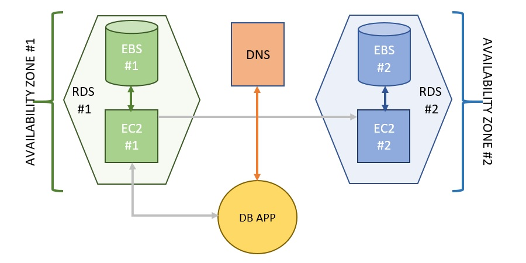

# Reading note for Amazon RDS Under the Hood: Multi-AZ

[Amazon RDS Under the Hood: Multi-AZ](https://aws.amazon.com/cn/blogs/database/amazon-rds-under-the-hood-multi-az/)

## Note: 
1. This post describes Amazon RDS Multi-AZ configurations for MySQL, MariaDB, PostgreSQL, and Oracle database instances. Amazon RDS for SQL Server and Amazon RDS for Amazon Aurora use a different technology stack to provide Multi-AZ capabilities.

## Basic design

1. There are two active Amazon EC2 instances with the replication layer installed. Each instance manages one EBS volume with a full copy of the data.
2. The standby instance that synchronously writes all data that it receives from the primary: (1) write operations result in the data being written to both volumes before a successful response is sent back to the calling application. (2) read operations are always performed through the primary EBS volume.
3. After failover, the previous primary, if it’s still up and running, is demoted to the standby role.
4. The relevant records in the results from client DNS queries have very low time-to-live values.
5. The replication layer incapable of making some of the more strategic decisions. For example, it doesn’t know about such things as user connectivity issues, local or regional outages, or the state of its EC2 peer that may have unexpectedly gone silent. For this reason, the two instances are monitored and managed by an external observer that has access to more critical information and periodically queries the instances for status.
6. Assessment shows Multi-AZ increases in database commit latencies of between 2 ms and 5 ms. However, the actual impact on real-world use cases is highly workflow-dependent.

## Connectivity issues and synchronization
The primary and standby instances are not connected to each other
   
1. When connectivity is lost or deliberately discontinued, the instances momentarily pause, waiting for a decision to be made by the observer. When the observer detects this condition, it directs an available instance to assume the primary role and to proceed on its own without replication. There is now only one current copy of the data, and the other copy is becoming increasingly out of date.

2. When connectivity is restored, the volumes must be resynchronized before returning to the normal, ongoing replication state. The primary keeps track of blocks that are modified while the two instances are disconnected. When resynchronizing occurs, only those modifications need to be sent from the primary instance to the standby instance, which speeds up the process.

## Fault tolerance in a dynamic environment
A volume experiences a failure, it is replaced with a new one. 

1. The process of replacement begins with securing a snapshot of the surviving volume.
2. The instance is then connected to the new volume and the volume is hydrated from the snapshot. Upon completion, the volumes are resynchronized and replication is restored.
3. A substantial or prolonged increase in latency or reduction in bandwidth can indicate an issue with the location of the path to the resource. Replacement is expected to be a permanent solution in such situations.
4. Note that a replacement can impact performance, so it is only performed when necessary.
5. The observer uses Region availability information to pause unnecessary automated recovery actions while the underlying issue gets resolved.