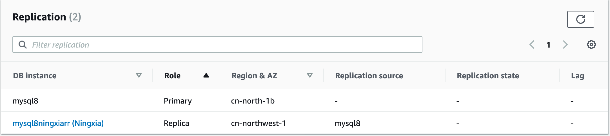
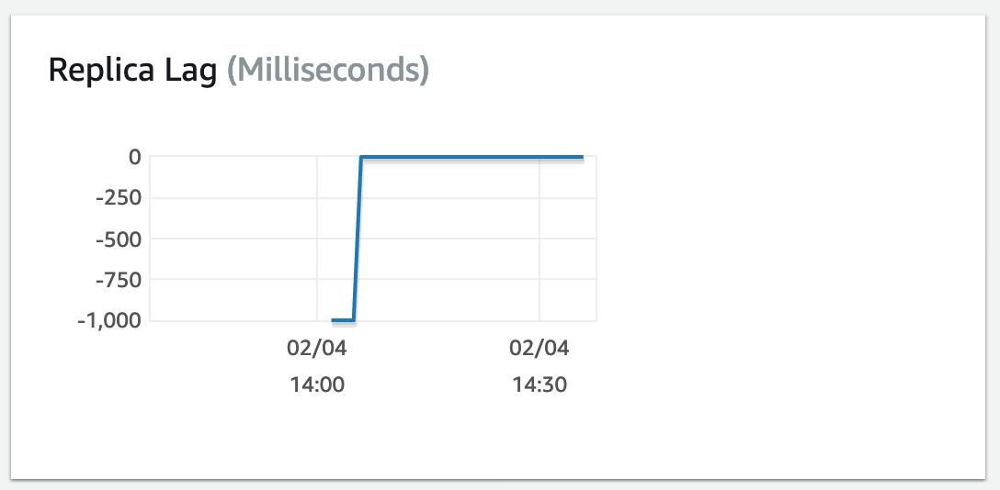
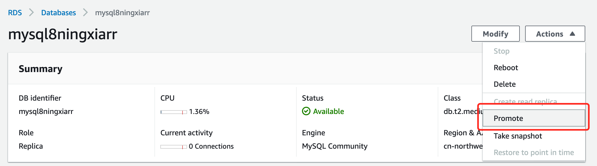
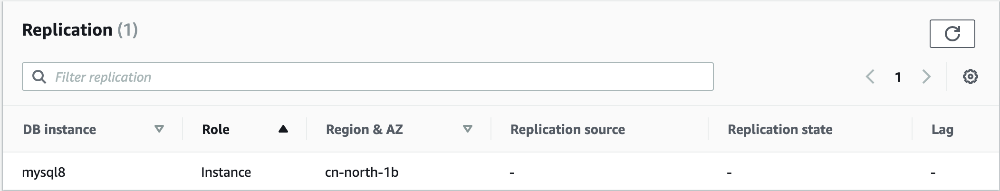

# Cross-Region Read Replicas for Amazon RDS for MySQL

1. Requirement: 
Migrate the RDS MySQL 7.2.26 from AWS Beijing region to AWS Ningxia region.

2. Solution:
- Create the Cross-Region Read Replica in Ningxia region, the source the RDS MySQL in Beijing region. 
- Monitor the replication lag to 0
- Promote the Ningxia replica as primary instance.

3. Hands on:
- Same region
```bash
aws rds create-db-instance-read-replica \
    --db-instance-identifier mysql8nxrr \
    --source-db-instance-identifier mysql8 \
```

- Cross regioin
```bash
aws rds create-db-instance-read-replica \
    --db-instance-identifier mysql8ningxiarr \
    --source-db-instance-identifier arn:aws-cn:rds:cn-north-1:account-id:db:mysql8 \
    --db-subnet-group-name ray-demo-db-sngp \
    --vpc-security-group-ids sg-041b990f4d35eaa67 \
    --source-region cn-north-1 \
    --region cn-northwest-1
```

4. Check the Primary and Replica


5. Replica Lg


6. Promote Replica to as Priary





## Reference
[Cross-Region Read Replicas for Amazon RDS for MySQL](https://aws.amazon.com/blogs/aws/cross-region-read-replicas-for-amazon-rds-for-mysql/)

[Working with MySQL read replicas](https://docs.aws.amazon.com/AmazonRDS/latest/UserGuide/USER_MySQL.Replication.ReadReplicas.html)

[create-db-instance-read-replica CLI](https://docs.aws.amazon.com/cli/latest/reference/rds/create-db-instance-read-replica.html)