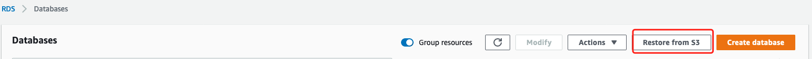
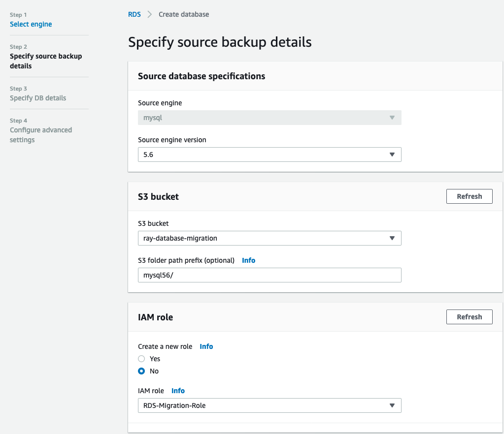
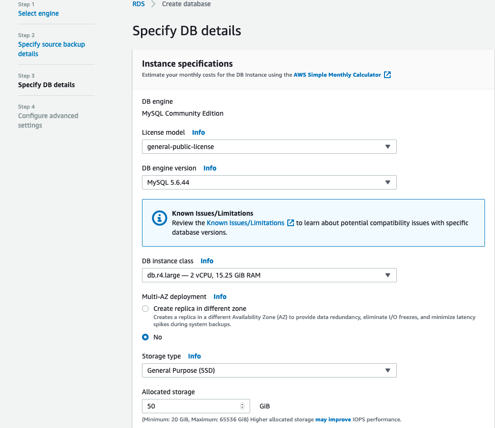
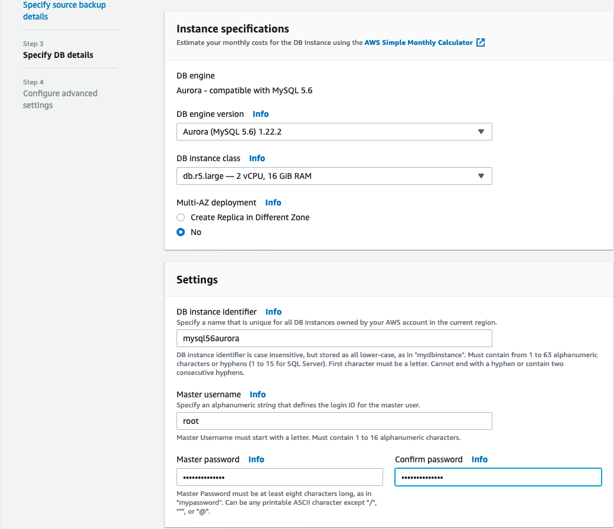
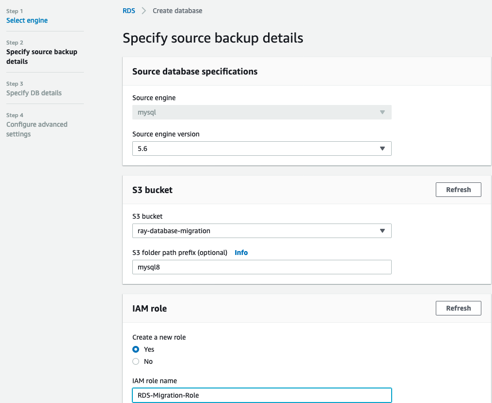
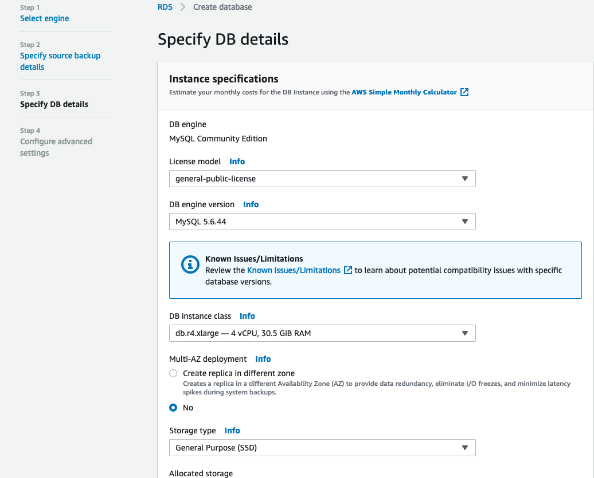
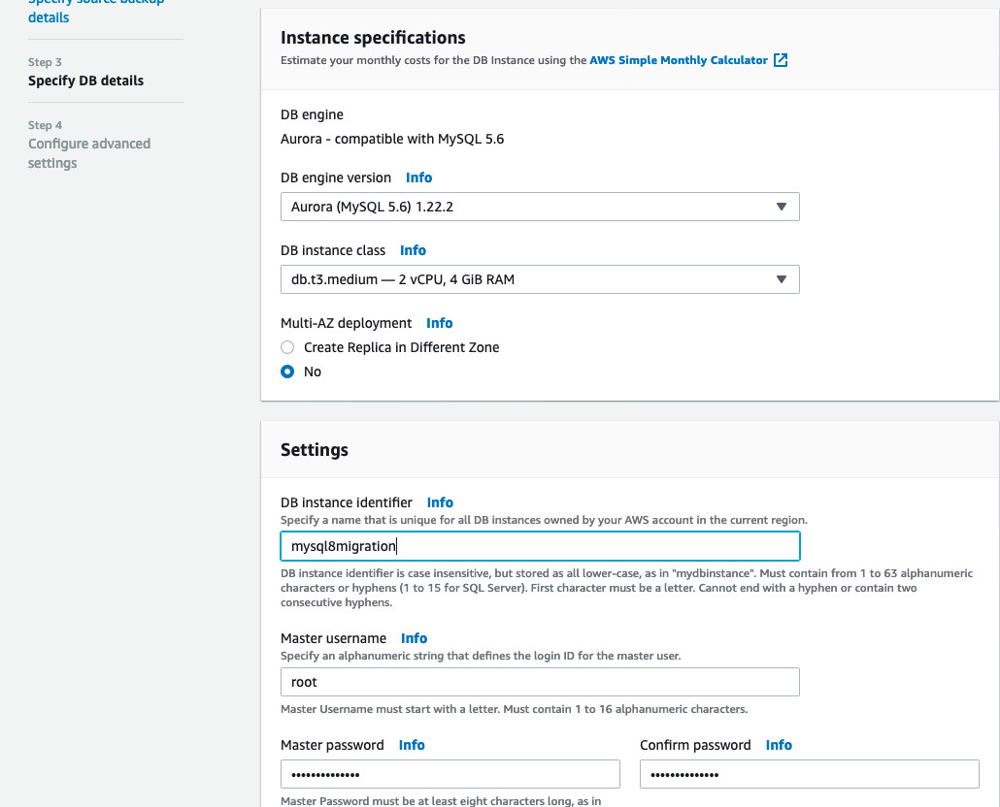

# Migrate a self-built MySQL database to Amazon Aurora with sufficient downtime


## Case 1: Source database is MySQL 5.6

### Install the MySQL5.6 on EC2 Amazon Linux2

```bash
# Install MySQL 5.6 on Amazon Linux 2
## Option 1
wget http://repo.mysql.com/mysql-community-release-el6-5.noarch.rpm
sudo rpm -ivh mysql-community-release-el6-5.noarch.rpm
ls /etc/yum.repos.d
amzn2-core.repo  amzn2-extras.repo  mysql-community.repo  mysql-community-source.repo
sudo yum install mysql-community-server

# Option 2
wget https://downloads.mysql.com/archives/get/p/23/file/MySQL-5.6.44-1.el7.x86_64.rpm-bundle.tar
tar -xvf MySQL-5.6.44-1.el7.x86_64.rpm-bundle.tar
sudo rpm -ivh *.rpm (common、libs、libs-compat、client、server)

sudo systemctl status mysql
sudo systemctl enable mysql  or sudo chkconfig mysql on
sudo systemctl start mysql

# Start and Configure MySQL 56 on Amazon Linux 2
sudo cat /root/.mysql_secret
# The random password set for the root user at Mon Aug 31 07:59:19 2020 (local time): HqxI_ZwuMNBqDP_A
sudo mysql_secure_installation

# Create sample testdb database and load the data
mysql -h 127.0.0.1 -uroot -p 
>source mysqlsampledatabase.sql;
>show tables;
+-------------------------+
| Tables_in_classicmodels |
+-------------------------+
| customers               |
| employees               |
| offices                 |
| orderdetails            |
| orders                  |
| payments                |
| productlines            |
| products                |
+-------------------------+
8 rows in set (0.00 sec)
>SELECT count(1) FROM orderdetails;
+----------+
| count(1) |
+----------+
|     2996 |
+----------+
1 row in set (0.02 sec)
```

### Use the XtraBackup to backup the data

1. Donwload the Percona XtraBackup from website，here we can use the

```bash
# version 2.4（https://www.percona.com/downloads/Percona-XtraBackup-2.4/LATEST/） for MySQL 5.1, 5.5, 5.6 and 5.7 servers
wget https://www.percona.com/downloads/Percona-XtraBackup-2.4/Percona-XtraBackup-2.4.1/binary/tarball/percona-xtrabackup-2.4.1-Linux-x86_64.tar.gz
tar -xzvf percona-xtrabackup-2.4.1-Linux-x86_64.tar.gz
cd percona-xtrabackup-2.4.1-Linux-x86_64/bin

```

2. Execute Percona XtraBackup command to create the backup

- Permissions and Privileges

```bash
mysql> GRANT RELOAD, LOCK TABLES, PROCESS, REPLICATION CLIENT ON *.* TO 'root'@'%';
mysql> FLUSH PRIVILEGES;
```

- Backup

```bash
sudo su
# XtraBackup 2.4
#./innobackupex --host=127.0.0.1 --user=root --password=youpassword --database=classicmodels --stream=tar /tmp/s3-restore/backup2 | split -d –bytes=512000000 – /tmp/s3-restore/backup.tar
./innobackupex --host=127.0.0.1 --user=root --password=youpassword --database=classicmodels --stream=tar /tmp/s3-restore/backup2 | gzip > /tmp/s3-restore/backup56.tar.gz

ls /tmp/s3-restore
backup2  backup56.tar.gz
```

3. Copy the database backup to S3 bucket（In this sample, it is backup.tar such as backup.tar00 and backup.tar01. The tar package include the database backup files generated by xtrabackup)

```bash
cd /tmp/s3-restore
aws s3 cp backup56.tar.gz s3://ray-database-migration/mysql56/ --region cn-north-1
```

4. Restore the backup from S3 bucket to Amazon RDS MySQL or Amazon Aurora MySQL database

- Select Restore from S3

  

- Set the S3 bucket which contain the backup files

  

- Amazon RDS MySQL setting

RDS MySQL now support 5.6.44 import

  


- Amazon Aurora MySQL setting

  


5. Once the Aurora database restore finished, run the database and business verification
```bash
mysql> show databases;
+--------------------+
| Database           |
+--------------------+
| information_schema |
| classicmodels      |
| mysql              |
| performance_schema |
+--------------------+
4 rows in set (0.00 sec)

mysql> use classicmodels;
mysql> show tables;
+-------------------------+
| Tables_in_classicmodels |
+-------------------------+
| customers               |
| employees               |
| offices                 |
| orderdetails            |
| orders                  |
| payments                |
| productlines            |
| products                |
+-------------------------+
8 rows in set (0.02 sec)

mysql> SELECT count(1) FROM orderdetails;
+----------+
| count(1) |
+----------+
|     2996 |
+----------+
1 row in set (0.01 sec)
```

## Case 2: Source database is MySQL 8

According to document https://docs.aws.amazon.com/AmazonRDS/latest/AuroraUserGuide/AuroraMySQL.Migrating.ExtMySQL.html

You can copy the full and incremental backup files from your source MySQL version 5.5, 5.6, or 5.7 database to an Amazon S3 bucket, and then restore an Amazon Aurora MySQL DB cluster from those files. MySQL 8 is not supported.

Let's verify it

### Install the MySQL8.0 on EC2 Amazon Linux2

```bash
# Install MySQL 8 on Amazon Linux 2
## Option 1
wget https://dev.mysql.com/get/mysql80-community-release-el7-1.noarch.rpm
sudo rpm -ivh mysql80-community-release-el7-1.noarch.rpm
ls /etc/yum.repos.d
amzn2-core.repo  amzn2-extras.repo  mysql-community.repo  mysql-community-source.repo
sudo yum install mysql-community-server

# Option 2
wget https://downloads.mysql.com/archives/get/p/23/file/mysql-8.0.11-1.el7.x86_64.rpm-bundle.tar
tar -xvf mysql-8.0.11-1.el7.x86_64.rpm-bundle.tar
sudo rpm -ivh *.rpm (common、libs、libs-compat、client、server)

sudo systemctl status mysqld
sudo systemctl enable mysqld.service
sudo systemctl start mysqld.service

# Start and Configure MySQL 8 on Amazon Linux 2
sudo grep 'temporary password' /var/log/mysqld.log
##2020-08-25T08:30:24.428566Z 5 [Note] [MY-010454] [Server] A temporary password is generated for root@localhost: strNpkt)k8tO

sudo mysql_secure_installation -p'strNpkt)k8tO'
mysql -uroot -p
>use mysql;
# Enable the remote login and alter password
>ALTER user 'root'@'localhost' IDENTIFIED by 'youpassword';
>ALTER USER 'root'@'localhost' IDENTIFIED WITH mysql_native_password BY 'youpassword';
>update user set host = '%' where user = 'root';
# refresh privileges table
>flush privileges;

# Create sample testdb database and load the data
mysql -uroot -p
>source mysqlsampledatabase.sql;
>show tables;
+-------------------------+
| Tables_in_classicmodels |
+-------------------------+
| customers               |
| employees               |
| offices                 |
| orderdetails            |
| orders                  |
| payments                |
| productlines            |
| products                |
+-------------------------+
8 rows in set (0.00 sec)
>SELECT count(1) FROM orderdetails;
+----------+
| count(1) |
+----------+
|     2996 |
+----------+
1 row in set (0.02 sec)
```

### Use the XtraBackup to backup the data

1. Donwload the Percona XtraBackup from website，here we can use the

```bash
# version 8.0, up to version 8.0.11, is not compatible with MySQL version 8.0.20 or higher
sudo yum install https://repo.percona.com/yum/percona-release-latest.noarch.rpm
percona-release enable-only tools release
sudo yum install percona-xtrabackup-80
```

2. Execute Percona XtraBackup command to create the backup

- Permissions and Privileges

```bash
mysql> GRANT BACKUP_ADMIN, PROCESS, RELOAD, LOCK TABLES, REPLICATION CLIENT ON *.* TO 'root'@'%';
mysql> GRANT SELECT ON performance_schema.log_status TO 'root'@'%';
mysql> FLUSH PRIVILEGES;
```

- Backup

```bash
sudo su
# XtraBackup 8.0
#xtrabackup --backup --user=root --password=youpassword --databases=classicmodels --target-dir=/tmp/mysqlbackups/
xtrabackup --backup --user=root --password=youpassword --databases=classicmodels --stream=xbstream --target-dir=/tmp/s3-restore/backup2 --extra-lsndir=/tmp | split -d --bytes=512MB - /tmp/s3-restore/backup.tar
.....
xtrabackup: Transaction log of lsn (19753609) to (19753609) was copied.
200825 09:57:23 completed OK!

ls /tmp/s3-restore
backup2  backup.tar00
```

3. Copy the database backup to S3 bucket（In this sample, it is backup.tar such as backup.tar00 and backup.tar01. The tar package include the database backup files generated by xtrabackup)

```bash
aws s3 cp backup.tar00 s3://ray-database-migration/mysql8/ --region cn-north-1
```

4. Restore the backup from S3 bucket to Amazon RDS MySQL or Amazon Aurora MySQL database

- Select Restore from S3
  

- Set the S3 bucket which contain the backup files
  

- Amazon RDS MySQL setting

  

Failed with `Database instance put into incompatible-restore. Unable to extract the backup files of type TAR. Please verify that your backup files in ray-database-migration/mysql8 are in a valid format`

- Amazon Aurora MySQL setting

  

Failed with `DB instance put into incompatible-restore state. RDS recommends that you initiate a point-in-time-restore.`

## Clean up

```
# Delete the Aurora instance and RDS MySQL instance

# Uninstall MySQL
sudo service mysqld stop
sudo yum remove mysql mysql-server mysql-client mysql-common mysql-devel
sudo rm -rf /var/lib/mysql
sudo rf /etc/mysql /etc/mysql_old_backup

# Terminate EC2 for mysql56 and mysql8.0
```


## Case gh-ost

### gh-ost 完整详解
#### 一、基础定义
**gh-ost**（读音 Ghost，全称 GitHub’s Online Schema Transmogrifier）是 **GitHub 开源、Go 语言开发**的 MySQL 在线无锁 DDL 工具，专门解决**千万/亿级大表直接 ALTER 锁表阻塞业务**的痛点。
核心定位：**无触发器、基于 Binlog 解析**的在线表结构变更工具，是互联网大厂 MySQL 大表改表首选方案之一。

#### 前置依赖硬性要求
1. MySQL binlog 格式必须为 **ROW**（行级复制）；
2. 迁移表**必须有主键/唯一索引**；
3. 支持 MySQL 5.6 / 5.7 / 8.0、MariaDB；
4. 推荐有从库（默认从从库拉取 binlog，降低主库压力）。

#### 二、核心优势（对比 pt-osc 最大亮点）
1. 无触发器，主库写性能损耗极低
pt-online-schema-change（pt-osc）会在原表创建 `INSERT/UPDATE/DELETE` 触发器，每条业务写都会额外执行触发器，高并发场景 CPU、锁冲突明显；
gh-ost **不修改原表任何触发器**，伪装成 MySQL 从库拉取 binlog，异步同步增量数据，业务写入链路无额外开销。

2. 完整可控：暂停/恢复/动态调速
- 运行中可通过信号（`SIGUSR1`）**真正暂停**数据拷贝与增量同步，完全停止主库写入压力；
- 实时动态调整批次大小、负载阈值，无需重启任务；
- 内置心跳表记录迁移进度，中断后可续跑，不用从头迁移。

3. 安全测试机制
`--test-on-replica` 参数可**仅在从库完整模拟迁移**，不影响主库，对比原表与影子表数据一致性，确认无误再上生产。

4. 毫秒级切换（cut-over）
同步完成后短暂持有元数据锁，两步原子 RENAME 切换表名；检测长事务自动重试，避免长时间阻塞业务。

#### 三、完整工作流程
1. **创建两张临时表**
   - `_原表名_gho`：影子表，先执行目标 DDL（加字段/索引/改字段）；
   - `_原表名_ghc`：变更日志表，记录心跳、同步位点、迁移状态。
2. **双线程并行**
   - 线程1：分批次小批量拷贝原表存量数据到 `gho`；
   - 线程2：监听 binlog，实时回放原表新增/更新/删除到影子表。
3. **追平增量**：存量拷贝完成后，持续消费 binlog，直到影子表与原表数据完全一致。
4. **切换（cut-over）**：短暂锁表，原子重命名：
   `原表 → _原表_old`、`_gho → 原表`，业务无缝切到新结构表。
5. **清理**：自动删除旧表、ghc 日志表（可配置保留）。

#### 四、三种运行模式
1. **推荐模式（默认：连从库、改主库）**
   工具连接从库拉取 binlog、检查表行数结构，仅写操作落在主库，主库压力最小，生产首选。
2. **单主库模式（无从库时）**
   添加参数 `--allow-on-master`，直接在主库消费 binlog，负载略高，适合单机 MySQL。
3. **从库测试模式（--test-on-replica）**
   所有变更仅在从库执行，主库零影响，用于预验证 DDL 正确性。

#### 五、最简使用示例
1. 安装
直接下载官方二进制（Linux/macOS）：https://github.com/github/gh-ost/releases
无需依赖，解压即可运行。

2. 生产执行命令（添加字段）
```bash
gh-ost \
--host=127.0.0.1 \
--user=root \
--password=xxx \
--database=test_db \
--table=t_order \
--alter="ADD COLUMN remark VARCHAR(500) COMMENT '备注'" \
# 负载保护：运行线程超过25自动降速，超过1000暂停
--max-load=Threads_running=25 \
--critical-load=Threads_running=1000 \
--chunk-size=2000 \
--execute
```
- 去掉 `--execute`：仅预检查，不执行迁移；
- `--test-on-replica`：从库测试，不上线切换。

#### 六、gh-ost vs pt-online-schema-change 对比
| 特性 | gh-ost | pt-osc |
|------|--------|--------|
| 增量同步方式 | 解析 ROW binlog，无触发器 | 原表创建触发器同步 |
| 主库写入开销 | 极低，不侵入业务SQL | 高，每条写触发额外SQL |
| 暂停能力 | 完全暂停，停止所有写入 | 仅暂停拷贝，触发器持续运行 |
| 断点续跑 | 支持，心跳记录位点 | 中断需重新全量拷贝 |
| 切换阻塞风险 | 低，自动避让长事务 | 高，锁表时易阻塞业务 |
| 环境依赖 | binlog=ROW，推荐有从库 | 无binlog强制要求 |
| 外键支持 | 原生不友好 | 完善支持外键 |

##### 选型建议
- **高写入、千万级大表、线上核心业务** → 优先 gh-ost；
- **有大量外键、无ROW binlog、中小表** → 选 pt-osc。

#### 七、常见注意事项与坑
1. **禁止无主键表**：gh-ost 无法同步无主键表；
2. binlog 必须 ROW，STATEMENT/MIXED 会报错；
3. 高峰期调低 `chunk-size`，调高 `max-load` 阈值，避免打满数据库 CPU；
4. 切换阶段会短暂持有 MDL 锁，避开大事务、慢查询高峰期；
5. MGR/多主集群需使用 `--allow-on-master` 单主模式；
6. 不支持直接删除主键、修改主键（需分阶段灰度变更）。

#### 八、适用与不适用场景
##### 适用
- 千万/亿级 MySQL 业务大表加字段、加索引、修改字段长度；
- 高并发读写核心表，不能长时间锁表；
- 有主从架构、可从从库消费 binlog。

##### 不适用
- 表无主键/唯一索引；
- 必须依赖外键约束变更；
- MySQL 不支持开启 ROW binlog。