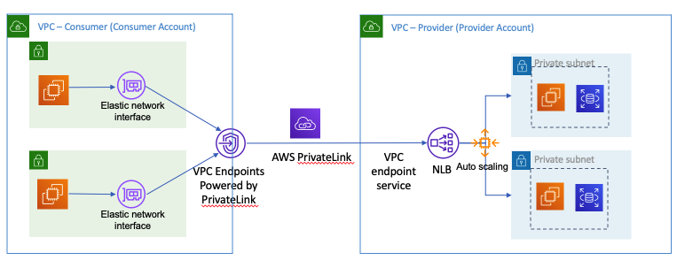
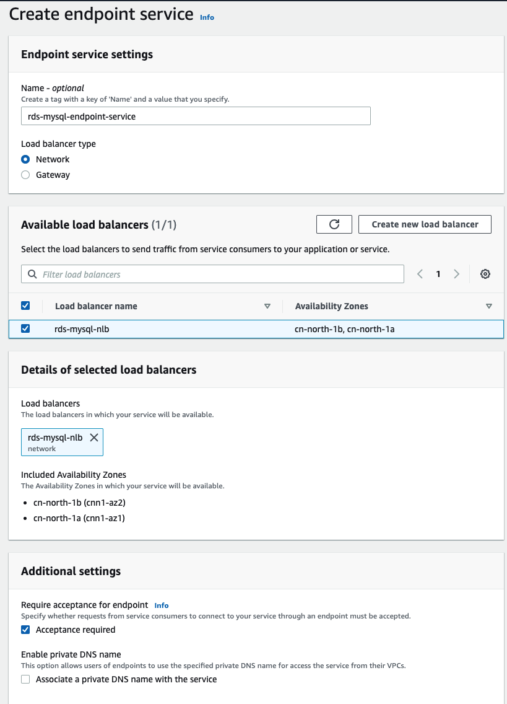
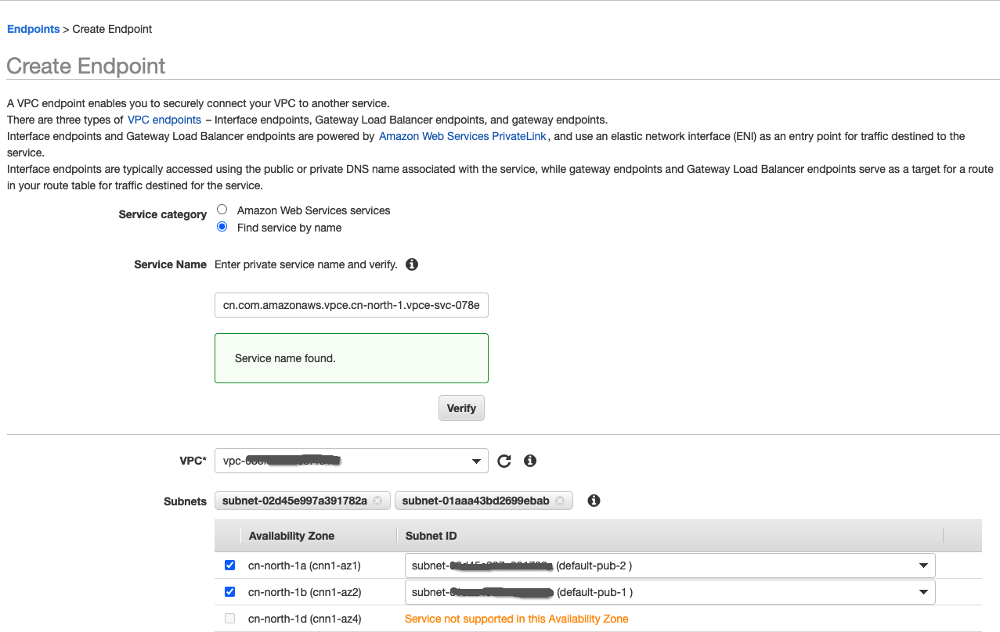

# Leverage AWS PrivateLink to Securely connect Amazon RDS from Other VPC or On-Premise

If you want to connec the Amazon RDS instance from other VPC or other account, there are two options
 - VPC peering or Amazon Transit Gateway internect the Client VPC and RDS VPC
 - AWS PrivateLink

 By using AWS PrivateLink you can also connec the Amazon RDS instance from On-Premise

 ## Basic understanding the 
AWS PrivateLink provides secure, private connectivity enable you to connec to Amazon VPCs, AWS services, servcies hosted by other AWS accounts. More details can be found: https://docs.aws.amazon.com/whitepapers/latest/aws-vpc-connectivity-options/aws-privatelink.html



## Using PrivateLink to support cross VPC access RDS
1. Creating Amazon RDS MySQL database instance in VPC-Provider
2. Create the EC2 with mysql client in VPC-Consumer and verify the connectivity to RDS MySQL instance
```bash
nc -w 5 <rds-endpoint> 3306
Ncat: Connection timed out.
```
2. Create a Internal Network Load balancer with target group pointing to RDS MySQL database instance and make sure RDS security group allows local routes of VPC-Provider and VPC-Consumer CIDR on port 3306.
- Get the RDS IP address, for Multi-AZ instance, you should check both primary and standby instance IP address
```bash
host <rds-endpoint>
<rds-endpoint> has address 10.0.xx.xx
```
- Creating a target group point to RDS IP addresses and port 3306
- Creation of internal NLB
- Check the Security group allows local routes of VPCVPC-Provider on port 3306
- The setting is complete after a while, the `healthy`　should look.

3. Set of `max_connect_errors` parameters. Due to NLB health check would be determined to be illegal connection, adjust this parameter to avoid issue. 
`Host '10.0.4.190' is blocked because of many connection errors; unblock with 'mysqladmin flush-hosts'`

- Amazon RDS> parameter group and select the group of parameters
- Change the value of the `max_connect_errors to 9223372036854775807`.
```bash
# list all of the available parameter group families
aws rds describe-db-engine-versions --query "DBEngineVersions[].DBParameterGroupFamily" --region cn-north-1

# Create custom parameter group
aws rds create-db-parameter-group \
    --db-parameter-group-name mysql80-dbparametergroup \
    --db-parameter-group-family mysql8.0 \
    --description "My new parameter group for mysql8.0" --region cn-north-1

# Viewing parameter values for a DB parameter group
aws rds describe-db-parameters --db-parameter-group-name mysql80-dbparametergroup --region cn-north-1

# Modifying parameters in a DB parameter group
aws rds modify-db-parameter-group \
    --db-parameter-group-name mysql80-dbparametergroup \
    --parameters "ParameterName=max_connect_errors,ParameterValue=9223372036854775807,ApplyMethod=immediate" --region cn-north-1

# Associating a DB parameter group with a DB instance
aws rds modify-db-instance \
    --db-instance-identifier mysql8 \
    --db-parameter-group-name mysql80-dbparametergroup \
    --apply-immediately --region cn-north-1
```
- Check the NLB access with EC2 on VPC-Provider
```bash
nc -w 5 <rds-mysql-nlb-endpoint> 3306

PROMPT> mysql -h <rds-mysql-nlb-endpoint> -P 3306 -u <mymasteruser> -p
```

4. Create a VPC Endpoint Service in VPC-Provider, with an associated Network Load Balancer that points to the RDS instance
- Go to VPC Endpoint Services, click ‘Create Endpoint Service’
- Select the NLB which we created in last step and make sure both subnets are selected
- Click ‘Create Service’


5. Create VPC Interface Endpoint in VPC-Consumer to access the services of VPC-Provider 
- Go to Endpoints in VPC service, click ‘Create Endpoint’
- Select ‘Find service by name’ and in the text box enter the endpoint service name copied from previous step 
- Click verify.


- Select the Security Group allow the port `3306` and allow only VPC-Consumer CIDR and VPC-Provider CIDR.
- Once an endpoint is created, it will be in `Pending` status since it requires an acceptance from service provider in this case it is VPC Endpoint service in VPC-Provider. 

- Your Endpoint should now be in `Available` status 

## Verification
- Login EC2 in VPC-Consumer
- Using below run below command
```bash

nc -w 5 <rds-privatelink-endpoint> 3306

PROMPT> mysql -h <rds-privatelink-endpoint> -P 3306 -u <mymasteruser> -p


mysql> show databases;
+--------------------+
| Database           |
+--------------------+
| classicmodels      |
| information_schema |
| mysql              |
| performance_schema |
| sys                |
| testdb             |
+--------------------+
6 rows in set (0.01 sec)
```


