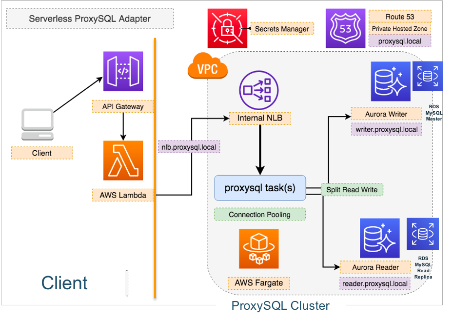

# Serverless connection pooling adapter with proxysql on AWS Fargate and help AWS Lambda better connects to RDS for MySQL or Aurora databases

Leverage the reference archiecture project https://github.com/aws-samples/serverless-refarch-for-proxysql.git




## Deploy by CDK
1. Clone and install dependency 
```bash
git clone https://github.com/aws-samples/serverless-refarch-for-proxysql.git

npm install -g aws-cdk
cdk --version

cd serverless-refarch-for-proxysql
npm install -g aws-cdk
npm install
```

2. Deploy project
```bash
# Check default vpc and existed vpc deployed resource difference
# To check deploying in the default VPC
npx cdk diff -c use_default_vpc=1
# To check deploying in existing VPC
npx cdk diff -c use_vpc_id=vpc-123456

# deploy in vpc-123456
npx cdk deploy -c use_vpc_id=vpc-123456 --profile china-ningxia
# deploy in the default VPC
npx cdk deploy -c use_default_vpc-1 --profile china-ningxia
```

### Notice
1. Bootstrap issue
```bash
npx cdk deploy -c use_vpc_id=vpc-00d48xxxxxx

Do you wish to deploy these changes (y/n)? y
ProxysqlFargateStack: deploying...

 ❌  ProxysqlFargateStack failed: Error: This stack uses assets, so the toolkit stack must be deployed to the environment (Run "cdk bootstrap aws://account-id/cn-northwest-1")
This stack uses assets, so the toolkit stack must be deployed to the environment (Run "cdk bootstrap aws://account-id/cn-northwest-1")

# Fix:
cdk bootstrap --profile china-ningxia
```

2. Private subnet

Right now, if I use the existed VPC, I need make sure all private subnets in this VPC must in different AZs. If I my private subnet more than AZ number: e.g 6 subnets cross 3 AZs, it will cause deployment failure.
```bash
A load balancer cannot be attached to multiple subnets in the same Availability Zone
```

# MySQL connect to the ProxySQL admin interface
1. How to get the ProxySQL admin interface IP?

Appoarch 1: by ECS Fargate console:

- Clusters -> ProxysqlFargateStack-ProxySQLCluster -> Task
- Get the task private IP

Apporach 2: by CLI

Copy the ProxySQLECSClusterName and ProxySQLECSServiceName from the AWS CDK output, replacing CLUSTER_NAME and ECS_SERVICE_NAME behow

```bash
CLUSTER_NAME='ProxysqlFargateStack-ProxySQLCluster942E58CA-T1Yqy82p5Vny'
ECS_SERVICE_NAME='ProxysqlFargateStack-ProxySQLNLBServiceF6E561D2-S3MRJ8BZK2YR'

TASK_ARN=$(aws ecs list-tasks --cluster ${CLUSTER_NAME} --service-name ${ECS_SERVICE_NAME} \
--query 'taskArns[0]' --output text)

TASK_IP=$(aws ecs describe-tasks --cluster ${CLUSTER_NAME} \
--tasks ${TASK_ARN} \
--output text \
--query 'tasks[0].containers[0].networkInterfaces[0].privateIpv4Address')

echo ${TASK_IP}
```

2. Telnet the ProxySQL admin interface 6032 port make sure connection from Same VPC bastion server or peering VPC bastion server

The password can be found in AWS Secrets Manager `ProxysqlFargateStack-radmin_pwd `secret value 

```bash
## mysql connect to the proxysql admin interface on Fargate tcp 6032
mysql -uradmin -p -h  ${TASK_IP} -P 6032 --prompt 'ADMIN>'

# Let's check the mysql_server_ping_log
ADMIN> SELECT * from monitor.mysql_server_ping_log;

You should see a lot of Access denied errors as proxysql can't connect to the backend because the monitor user does not exists in the backend Aurora.
```

# Connect to the backend Aurora and create a monitor user

Check the DBClusterclusterIdentifier value from the AWS CDK output and replace the value of DB_IDENTIFIER below.

Go to AWS Secrets Manager find the secret `ProxysqlFargateStack-auroraMasterSecret` value. Replace the `DBMasterSecret` below.

```bash
DB_IDENTIFIER='proxysqlfargatestack-dbclusterdatabased78b6f28-uytcrl1vqsu3'
aws rds modify-db-cluster \
--db-cluster-identifier ${DB_IDENTIFIER} \
--apply-immediately \
--master-user-password <DBMasterSecret>
```

After 20 seconds, let's connect the Aurora writer instance with the updated the master password as above
```bash
mysql -u admin -p -h writer.proxysql.local --prompt 'WRITER>'

WRITER>CREATE USER monitor@'%' IDENTIFIED BY 'monitor';
```

Now, switch back to the ADMIN> terminal.  Make sure the monitor is working

The error message should be NULL now, which indicates the ProxySQL is able to monitor our backend Aurora instances now.
```bash
ADMIN>SELECT * from monitor.mysql_server_ping_log;
ADMIN>SELECT * from monitor.mysql_server_connect_log;
```
(you should see some NULL in the )

# Test the mysql read/write through the Proxysql Fargate cluster NLB
1. Connect the Aurora by Proxysql Fargate cluster NLB

- Go to AWS Secrets Manager find the secret `ProxysqlFargateStack-auroraMasterSecret` value as password
- Create a demo database and tasks table in it.

```bash
mysql -u admin -p -h nlb.proxysql.local --prompt 'ProxysqlNLB>'

ProxysqlNLB> show databases;
ProxysqlNLB> CREATE DATABASE demo;
ProxysqlNLB> USE demo;
ProxysqlNLB> CREATE TABLE IF NOT EXISTS tasks (
    task_id INT AUTO_INCREMENT PRIMARY KEY,
    title VARCHAR(255) NOT NULL,
    created_at TIMESTAMP DEFAULT CURRENT_TIMESTAMP);
ProxysqlNLB> INSERT INTO `tasks` (`title`) VALUES ('foo');
ProxysqlNLB> SELECT * FROM tasks;
```

2. Now get back to the Aurora writer instance
```bash
mysql -u admin -p -h writer.proxysql.local --prompt 'WRITER>'
WRITER> use demo;
WRITER> SELECT * FROM tasks;
WRITER> INSERT INTO `tasks` (`title`) VALUES ('bar');
WRITER> SELECT * FROM tasks;
```

3. Now get back to the ProxysqlNLB> terminal
```bash
mysql -u admin -p -h nlb.proxysql.local --prompt 'ProxysqlNLB>'
ProxysqlNLB> SELECT * FROM demo.tasks;
```
   The content should be all in sync.

4. Connect to the Aurora reader instance
```bash
mysql -u admin -p -h reader.proxysql.local --prompt 'READER>'
READER> show tables;
READER> SELECT * FROM demo.tasks;
```
   The content from the reader should be exactly the same with writer and proxy nlb.

# Project Code analysis
1. serverless-refarch-for-proxysql/dockerAssets.d/proxysql/proxysql.cnf.template

- admin_variables define admin interface
- mysql_variables define mysql connection and monitor configuration info
- mysql_servers define mysql write and read endpoint
- mysql_query_rules define how to do read/write split
- mysql_users define master user


2. /serverless-refarch-for-proxysql/dockerAssets.d/proxysql/update.sh

Replace the Placeholder in proxysql.cnf.template with real value and generate the /serverless-refarch-for-proxysql/dockerAssets.d/proxysql/proxysql.cnf

3. /serverless-refarch-for-proxysql/dockerAssets.d/proxysql/entrypoint.sh

Start the proxysql

4. /serverless-refarch-for-proxysql/dockerAssets.d/proxysql/Dockerfile

The docker file for Fargate container

# Connect the proxy from lambda

Follow up the guide [Lambda function to access Amazon RDS](https://docs.aws.amazon.com/lambda/latest/dg/services-rds-tutorial.html)

1. Build the lambda function deployment package
```bash
mkdir package && cd package
pip install pymysql -t ./
pip install boto3 -t ./
chmod -R 755 .
zip -r9 ../function.zip .

cd .. && zip -g function.zip rds_proxysql.py
```

2. Create lambda function

- SubnetIds: The same subnet groups with Aurora
- SecurityGroupIds: The same security group with Aurora

```bash
db_sg_id=$(aws cloudformation describe-stack-resources --stack-name ProxysqlFargateStack | jq -r '.[][] | select(.ResourceType=="AWS::EC2::SecurityGroup" and (.LogicalResourceId | startswith("DBClusterDatabaseSecurityGroup"))).PhysicalResourceId')

db_subnet_group=$(aws cloudformation describe-stack-resources --stack-name ProxysqlFargateStack | jq -r '.[][] | select(.ResourceType=="AWS::RDS::DBSubnetGroup").PhysicalResourceId')

db_subnet_ids=$(aws rds describe-db-subnet-groups --db-subnet-group-name $db_subnet_group | jq -r '.DBSubnetGroups[].Subnets[].SubnetIdentifier' | awk 'NR > 1 { printf(",") } {printf "%s",$0}')

aws lambda create-function --function-name  CreateTableAddRecordsAndRead --runtime python3.7 \
--zip-file fileb://function.zip --handler rds_proxysql.lambda_handler \
--role arn:aws-cn:iam::<account-id>:role/lambda_basic_execution \
--vpc-config SubnetIds=$db_subnet_ids,subnet-061d15db051dbd091,SecurityGroupIds=$db_sg_id

aws lambda invoke --function-name CreateTableAddRecordsAndRead out --log-type Tail \
--query 'LogResult' --output text |  base64 -d

# Expected output:
# SUCCESS: Connection to RDS MySQL instance succeeded
# [INFO]  2020-05-28T07:22:15.342Z        d89a2cc8-319c-4366-b06a-12e1e9ece843    (1, 'Joe')
# [INFO]  2020-05-28T07:22:15.343Z        d89a2cc8-319c-4366-b06a-12e1e9ece843    (2, 'Bob')
# [INFO]  2020-05-28T07:22:15.343Z        d89a2cc8-319c-4366-b06a-12e1e9ece843    (3, 'Mary')

aws lambda update-function-code --function-name CreateTableAddRecordsAndRead \
--zip-file fileb://function.zip
```

# Use the existed RDS MySQL
1. Create the RDS MySQL master and read replica
```bash
# create rds mysql
aws rds create-db-instance --db-name demo --engine MySQL \
--db-instance-identifier MySQLForLambdaTest --backup-retention-period 1 \
--db-instance-class db.t2.micro --allocated-storage 5 --no-publicly-accessible \
--master-username admin --master-user-password password \
--vpc-security-group-ids $db_sg_id --db-subnet-group-name kops-rds-subnet-group

# create rds mysql read-replica
aws rds create-db-instance-read-replica --db-instance-identifier MySQLForLambdaTestRead \
--source-db-instance-identifier MySQLForLambdaTest --db-instance-class db.t2.micro \
--no-publicly-accessible \
--vpc-security-group-ids $db_sg_id
```

2. Specify the custom MySQL

/serverless-refarch-for-proxysql/bin/index.ts

- writer.mysql.url: `MySQLForLambdaTest` host
- reader.mysql.host: `MySQLForLambdaTestRead` host

```javascript
// new ProxysqlFargate(stack, 'ProxySQL', {
//   env,
//   vpc: infra.vpc,
//   rdscluster
// })

// custom backend
new ProxysqlFargate(stack, 'ProxySQL', {
  env,
  vpc: infra.vpc,
  customBackend: {
    writerHost: 'writer.mysql.host',
    readerHost: 'reader.mysql.host',
    writerPort: '3306',
    readerPort: '3306',
    masterUsername: 'admin'
  }
})
```

3. follow up the guide `MySQL connect to the ProxySQL admin interface` and `Connect to the backend Aurora and create a monitor user`
```
mysql -u admin -p -h writer.proxysql.local --prompt 'WRITER>'

WRITER>CREATE USER monitor@'%' IDENTIFIED BY 'monitor';
```

4. verfy file you can connect to RDS MySQL
```bash
# MySQL Master
mysql -u admin -p -h write.proxysql.local --prompt 'MySQLMaster>'
MySQLMaster> show databases;
MySQLMaster> CREATE DATABASE demo;
MySQLMaster> USE demo;
MySQLMaster> CREATE TABLE IF NOT EXISTS tasks (
    task_id INT AUTO_INCREMENT PRIMARY KEY,
    title VARCHAR(255) NOT NULL,
    created_at TIMESTAMP DEFAULT CURRENT_TIMESTAMP);
MySQLMaster> INSERT INTO `tasks` (`title`) VALUES ('foo');
MySQLMaster> SELECT * FROM tasks;

# MySQL Read replica
mysql -u admin -p -h reader.proxysql.local --prompt 'MySQLReader>'
MySQLReader>use demo;
MySQLReader>show tables;
MySQLReader>SELECT * FROM tasks;

# By ProxyServer NLB
# Note, before https://github.com/aws-samples/serverless-refarch-for-proxysql/issues/14 implemented, you need modify the ProxysqlFargateStack-auroraMasterSecret to existed mysql password and re-create the fargate task

mysql -u admin -p -h nlb.proxysql.local --prompt 'ProxysqlNLB>'
ProxysqlNLB> SELECT * FROM demo.tasks;
ProxysqlNLB> INSERT INTO `tasks` (`title`) VALUES ('bar');

```

5. Verify the lambda code can work
```bash
aws lambda invoke --function-name CreateTableAddRecordsAndRead out --log-type Tail \
--query 'LogResult' --output text |  base64 -d
```

# cleanup
```bash
# lambda
aws lambda delete-function --function-name CreateTableAddRecordsAndRead
# mysql
aws rds delete-db-instance --db-instance-identifier MySQLForLambdaTestRead \
--skip-final-snapshot --delete-automated-backups
aws rds delete-db-instance --db-instance-identifier MySQLForLambdaTest \
--skip-final-snapshot --delete-automated-backups
aws rds wait db-instance-deleted --db-instance-identifier MySQLForLambdaTestRead
aws rds wait db-instance-deleted --db-instance-identifier MySQLForLambdaTest

# cleanup any Route53 record under proxy.local hosted zone

# proxysql
npx cdk destroy
```

# Other reference doc
[如何结合使用 ProxySQL 和开源平台来拆分 Amazon Aurora 集群上的 SQL 读写操作](https://aws.amazon.com/cn/blogs/china/how-to-use-proxysql-with-open-source-platforms-to-split-sql-reads-and-writes-on-amazon-aurora-clusters/)