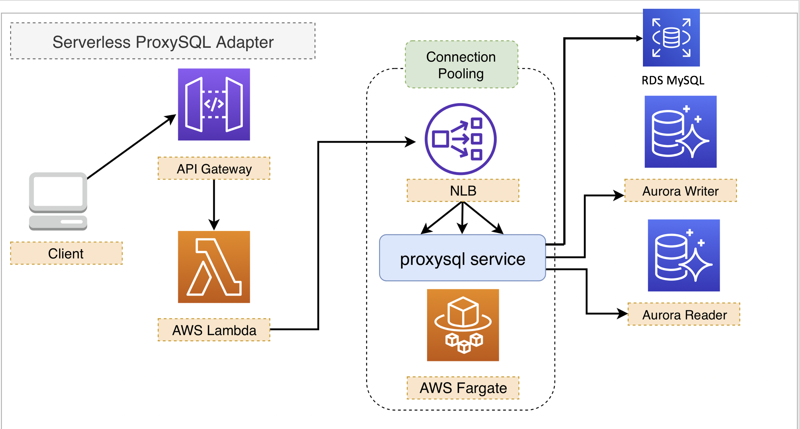

# Serverless connection pooling adapter with proxysql on AWS Fargate and help AWS Lambda better connects to RDS for MySQL or Aurora databases



## Deploy by CDK
```bash
git clone https://github.com/aws-samples/serverless-refarch-for-proxysql.git

npm install -g aws-cdk
cdk --version

cd serverless-refarch-for-proxysql
npm install -g aws-cdk
npm install
npm run build
cdk --app lib/index.js deploy ProxySQL --region cn-northwest-1
```