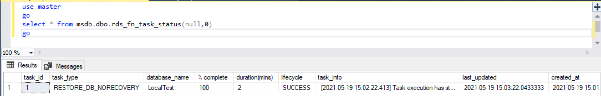
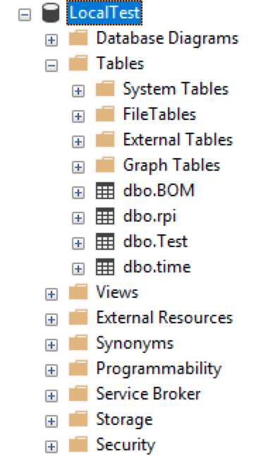

# Migrating SQL Server to Amazon RDS using native backup and restore

## Restoring a full backup to Amazon RDS for SQL Server
 - The backup files need to be in Amazon Simple Storage Service (Amazon S3) so they can be restored on Amazon RDS for SQL Server. 
 - Adding an option group for backup and restore with option `SQLSERVER_BACKUP_RESTORE`

1. Creating an IAM policy and role `RDS-Migration-Role` with below permission policy
```json
{
    "Version": "2012-10-17",
    "Statement": [
        {
            "Effect": "Allow",
            "Action": [
                "s3:ListBucket",
                "s3:GetBucketLocation"
            ],
            "Resource": [
                "arn:aws-cn:s3:::ray-database-migration"
            ]
        },
        {
            "Effect": "Allow",
            "Action": [
                "s3:GetObject",
                "s3:PutObject",
                "s3:ListMultipartUploadParts",
                "s3:AbortMultipartUpload"
            ],
            "Resource": [
                "arn:aws-cn:s3:::ray-database-migration/mysql8*",
                "arn:aws-cn:s3:::ray-database-migration/bsce*",
                "arn:aws-cn:s3:::ray-database-migration/*"
            ]
        }
    ]
}
```

2. Adding trust relationships for Amazon RDS to assume the role
```json
{
  "Version": "2012-10-17",
  "Statement": [
    {
      "Effect": "Allow",
      "Principal": {
        "Service": "rds.amazonaws.com"
      },
      "Action": "sts:AssumeRole"
    }
  ]
}
```

3. Adding an option group for backup and restore 
- On the Amazon RDS console, choose `Option Groups` in the navigation pane.
- Choose `Create Group`.
- Enter the name, description, engine, and engine version of your RDS server.
- Choose `Create`.
- Select the option group that you created, and choose `Add Option`.
- Choose `SQLSERVER_BACKUP_RESTORE`.
- Choose the IAM Role `RDS-Migration-Role` created in the earlier step.
- Choose `Immediately`.
- Choose `Add Option`.
- Associate the option group with the DB instance during DB creation or add to existed DB instance

4. Restoring the full backup to Amazon RDS
- Run the following Amazon RDS restore procedures in SQL Server Management Studio
```sql
use master
go

exec msdb.dbo.rds_restore_database
@restore_db_name='LocalTest',
@s3_arn_to_restore_from='arn:aws-cn:s3:::ray-database-migration/bsce/LocalTest.bak',
@with_norecovery=1,
@type='FULL';
go
```

The preceding restore task uses the `NORECOVERY` option by specifying `@with_norecovery=1`. The database is left in the `RESTORING` state, allowing for subsequent differential or log restores.

- If it is final full backup and no subsequent differential or log restores, you can run below code and skip the step #5 and step #6
```sql
use master
go

exec msdb.dbo.rds_restore_database
@restore_db_name='LocalTest',
@s3_arn_to_restore_from='arn:aws-cn:s3:::ray-database-migration/bsce/LocalTest.bak',
@with_norecovery=0,
@type='FULL';
go
```

- You can check the status of the restore task with
```sql
use master
go
select * from msdb.dbo.rds_fn_task_status(null,0) 
go
```



5. Restoring differential backups to Amazon RDS for SQL Server (optional)

Differential backups have all the changes since the last full backup. Because differential backups are cumulative, use the latest differential backup file to restore. 

```sql
use master
go
exec msdb.dbo.rds_restore_database
@restore_db_name='LocalTest',
@s3_arn_to_restore_from='arn:aws-cn:s3:::ray-database-migration/bsce/mydb_diff-1.bak',
@type='DIFFERENTIAL',
@with_norecovery=1;
go
```

6. Restoring subsequent transaction log backups to Amazon RDS for SQL Server (optional)

If you want to restore a database to a certain point, restore the full backup followed by the latest differential backup and all subsequent transaction logs up to that restore point.

Transaction logs record all the database modifications made by each transaction. You must create at least one full backup before you can create any log backups. The sequence of transaction log backups (called a log chain) is independent of data backups.

```sql
use master
go
exec msdb.dbo.rds_restore_log
@restore_db_name='LocalTest',
@s3_arn_to_restore_from='arn:aws-cn:s3:::ray-database-migration/bsce/mydb_log_n.trn',
@with_norecovery=1;
go
```

Before running a final log backup on the source database, issue a checkpoint to persist data pages located in the buffer pool to database files.

Also, while making a final log backup, update the status of the source database to be read-only to avoid any database changes on the source instance during cutover. Ensure there are no active transactions using DBCC OPENTRAN

```sql
-- source database
GO
ALTER DATABASE source_database SET SINGLE_USER WITH ROLLBACK IMMEDIATE
GO
ALTER DATABASE source_database SET READ_ONLY WITH ROLLBACK IMMEDIATE
GO
ALTER DATABASE source_database SET MULTI_USER
GO
```

When the database in read-only mode, we proceed with the final log backup on the source instance and restore it on Amazon RDS for SQL Server:

```sql
use master
go
exec msdb.dbo.rds_restore_log
@restore_db_name='LocalTest',
@s3_arn_to_restore_from='arn:aws-cn:s3:::ray-database-migration/bsce/mydb_log_final.trn',
@with_norecovery=0;
go
```

We restore the final log backup by specifying @with_norecovery=0. This brings the database state to online after the restore task completion.

7. Finishing a database restore

If the last restore task on the database was performed using `@with_norecovery=1`, the database is now in the `RESTORING` state. Open this database for normal operation by using the rds_finish_restore stored procedure.

```sql
exec msdb.dbo.rds_finish_restore @db_name='LocalTest';
```



8. Validating and cutting over

In the target RDS instance, check if all restore tasks completed successfully in Amazon RDS SQL for Server:

```sql
use master
go
select * from msdb.dbo.rds_fn_task_status(null,0) 
go
```

Additionally, you can build in data validation to compare record count and data records

8. Application code change
After successfully completing restore tasks and data validation, modify the RDS instance to enable Multi-AZ (For the production database). When this is complete, update the endpoint in the application to point to the RDS for SQL Server instance.

# Reference
[Importing and exporting SQL Server databases](https://docs.aws.amazon.com/AmazonRDS/latest/UserGuide/SQLServer.Procedural.Importing.html)

[Migrating SQL Server to Amazon RDS using native backup and restore](https://aws.amazon.com/blogs/database/migrating-sql-server-to-amazon-rds-using-native-backup-and-restore/)

[Connecting to a DB instance running the Microsoft SQL Server database engine](https://docs.aws.amazon.com/AmazonRDS/latest/UserGuide/USER_ConnectToMicrosoftSQLServerInstance.html)