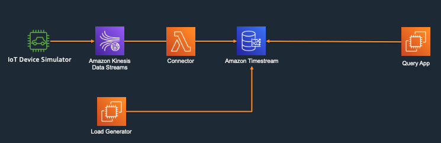

# Amazon Timestream Performance Testing

Architecture

You can use the [sample data ingestion load and query load generator](https://github.com/awslabs/amazon-timestream-tools/tree/master/tools/perf-scale-workload) to generate the ingest and query workload.

You can also use the IoT simulator to generate the load to Kinesis and using Connector to ingest data into Amazon Timestream database table. Below are testing architecture



## Setup the interface VPC endpoint

You can establish a private connection between your VPC and Amazon Timestream by creating an interface VPC endpoint. Interface endpoints are powered by AWS PrivateLink, a technology that enables the instances in your VPC to privately access Timestream APIs without public IP addresses. Traffic between your VPC and Timestream does not leave the Amazon network. 

1. Creating an interface VPC endpoint for Timestream 
- Constructing a VPC endpoint service name using your Timestream cell
```bash
aws timestream-query describe-endpoints --profile timestream-test --region us-east-1
{
    "Endpoints": [
        {
            "Address": "query-cell2.timestream.us-east-1.amazonaws.com",
            "CachePeriodInMinutes": 1440
        }
    ]
}
com.amazonaws.us-east-1.timestream.query-cell2

aws timestream-write describe-endpoints --profile timestream-test --region us-east-1
{
    "Endpoints": [
        {
            "Address": "ingest-cell2.timestream.us-east-1.amazonaws.com",
            "CachePeriodInMinutes": 1440
        }
    ]
}
com.amazonaws.us-east-1.timestream.ingest-cell2
```

## Ingest Data

## Query the Data

## Reference
[Amazon Timestream Tools and Samples](https://github.com/awslabs/amazon-timestream-tools)

[Deriving real-time insights over petabytes of time series data with Amazon Timestream](https://aws.amazon.com/cn/blogs/database/deriving-real-time-insights-over-petabytes-of-time-series-data-with-amazon-timestream/)


SELECT max(vd.measure_value::double) as max_sys, vd.vin
        FROM "kdaflink"."kinesis-6k" vd
        WHERE vd.pressureLevel = 'NORMAL' AND vd.measure_value::double > 50
        AND vd.time BETWEEN TIMESTAMP '2021-04-03 14:34:43.000000000' AND TIMESTAMP '2021-04-03 14:44:43.000000000'
        Group by vd.vin limit 20
        
        
SELECT count(1), vd.time FROM "kdaflink"."kinesis-6k" vd group by vd.time


SELECT count(1) FROM "kdaflink"."kinesis-6k" vd where vd.time BETWEEN TIMESTAMP '2021-04-03 14:34:43.000000000' AND TIMESTAMP '2021-04-03 14:35:00.000000000'