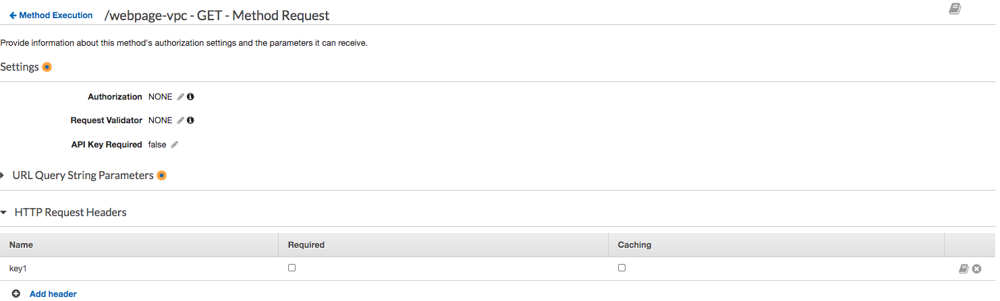
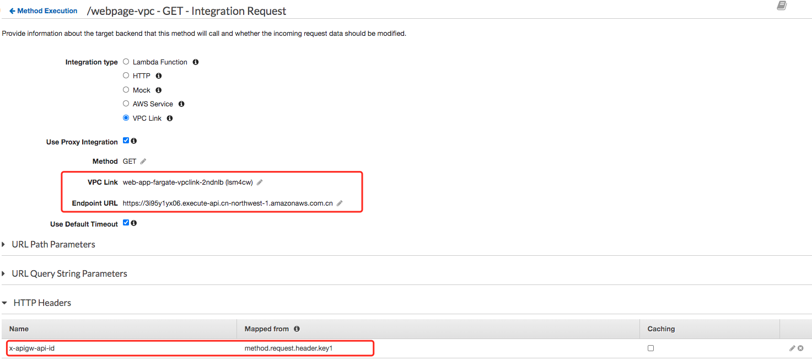

# 2 Private API invocation testing

## Architecture
1. In account 1: Fargate cluster expose web-app service by target group web-app-fargate-nlb-tg. The web-app-fargate-nlb-tg attached to NLB web-app-fargate-nlb-internal
2. In account 1: VPC link web-app-fargate-vpclink (t0f7wl) point to NLB web-app-fargate-nlb-internal
3. In account 1: Private API Fargate-webpage-private (3i95y1yx06) /webpage-vpc (8hwj4v) path GET method point to VPC link integration web-app-fargate-vpclink (t0f7wl) 
4. In account 1: VPC endpoint vpce-0d4d61b31cecd49fc used for private API Fargate-webpage-private (3i95y1yx06) 
5. In account 1: NLB web-app-fargate-nlb-internal2 route traffic to private API Fargate-webpage-private (3i95y1yx06) 
6. In account 1: VPC link web-app-fargate-vpclink-2ndnlb (lsm4cw) point to NLB web-app-fargate-nlb-internal2
7. In account 1: Private API Fargate-private-to-first-api /to-first-api (8hwj4v) path GET method point to VPC link integration web-app-fargate-vpclink-2ndnlb (lsm4cw) 
8. In account 1: VPC endpoint vpce-080de204ca78d2883 in account 1 consumer VPC for private API Fargate-private-to-first-api
9. In account 2: VPC endpoint vpce-08cbeb493b8abab4f used for private API Fargate-webpage-private (3i95y1yx06) 


## On Provider VPC of account1 or Consumer VPC of account1 NLB web-app-fargate-nlb-internal2 with -H 'x-apigw-api-id:3i95y1yx06' - Result: Success

Note: if you invoke without -k option of curl, it will report:

```bash
* Server certificate:
*  subject: CN=*.execute-api.cn-northwest-1.amazonaws.com.cn
*  start date: Apr 24 00:00:00 2020 GMT
*  expire date: Apr 14 12:00:00 2021 GMT
*  subjectAltName does not match web-app-fargate-nlb-internal2-fdeb5f1534e02ddb.elb.cn-northwest-1.amazonaws.com.cn
* SSL: no alternative certificate subject name matches target host name 'web-app-fargate-nlb-internal2-fdeb5f1534e02ddb.elb.cn-northwest-1.amazonaws.com.cn'
```

```bash
curl -v -k https://web-app-fargate-nlb-internal2-fdeb5f1534e02ddb.elb.cn-northwest-1.amazonaws.com.cn/dev/webpage-vpc-non-proxy -H 'x-apigw-api-id:3i95y1yx06'
   Trying 10.0.1.95...
* TCP_NODELAY set
* Connected to web-app-fargate-nlb-internal2-fdeb5f1534e02ddb.elb.cn-northwest-1.amazonaws.com.cn (10.0.1.95) port 443 (#0)
* ALPN, offering h2
* ALPN, offering http/1.1
* Cipher selection: ALL:!EXPORT:!EXPORT40:!EXPORT56:!aNULL:!LOW:!RC4:@STRENGTH
* successfully set certificate verify locations:
*   CAfile: /etc/pki/tls/certs/ca-bundle.crt
  CApath: none
* TLSv1.2 (OUT), TLS header, Certificate Status (22):
* TLSv1.2 (OUT), TLS handshake, Client hello (1):
* TLSv1.2 (IN), TLS handshake, Server hello (2):
* TLSv1.2 (IN), TLS handshake, Certificate (11):
* TLSv1.2 (IN), TLS handshake, Server key exchange (12):
* TLSv1.2 (IN), TLS handshake, Server finished (14):
* TLSv1.2 (OUT), TLS handshake, Client key exchange (16):
* TLSv1.2 (OUT), TLS change cipher, Change cipher spec (1):
* TLSv1.2 (OUT), TLS handshake, Finished (20):
* TLSv1.2 (IN), TLS change cipher, Change cipher spec (1):
* TLSv1.2 (IN), TLS handshake, Finished (20):
* SSL connection using TLSv1.2 / ECDHE-RSA-AES128-GCM-SHA256
* ALPN, server did not agree to a protocol
* Server certificate:
*  subject: CN=*.execute-api.cn-northwest-1.amazonaws.com.cn
*  start date: Apr 24 00:00:00 2020 GMT
*  expire date: Apr 14 12:00:00 2021 GMT
*  issuer: C=US; O=Amazon; OU=Server CA 1B; CN=Amazon
*  SSL certificate verify ok.
> GET /dev/webpage-vpc-non-proxy HTTP/1.1
> Host: web-app-fargate-nlb-internal2-fdeb5f1534e02ddb.elb.cn-northwest-1.amazonaws.com.cn
> User-Agent: curl/7.61.1
> Accept: */*
> x-apigw-api-id:3i95y1yx06
>
< HTTP/1.1 200 OK
< Server: Server
< Date: Tue, 23 Jun 2020 01:45:59 GMT
< Content-Type: application/json
< Content-Length: 51
< Connection: keep-alive
< x-amzn-RequestId: 11efdbb6-4c3c-4dfb-96a8-f1ce7943f847
< x-amz-apigw-id: OjvBvF2VZPgFQFw=
< X-Amzn-Trace-Id: Root=1-5ef15ed7-426a634a4a810394fc9b15c2
<
* Connection #0 to host web-app-fargate-nlb-internal2-fdeb5f1534e02ddb.elb.cn-northwest-1.amazonaws.com.cn left intact
<html><h1>Hello World From Ray Webpage!</h1></html>
```

## On Provider VPC of account1 or Consumer VPC of account1 NLB web-app-fargate-nlb-internal2 with -H 'Host: 3i95y1yx06.execute-api.cn-northwest-1.amazonaws.com' - Result: 403 Forbidden

The 403 caused by missing x-apigw-api-id due to NLB invoke the VPCE of API GW.

```bash
curl -k -v https://web-app-fargate-nlb-internal2-fdeb5f1534e02ddb.elb.cn-northwest-1.amazonaws.com.cn/dev/webpage-vpc-non-proxy -H 'Host: 3i95y1yx06.execute-api.cn-northwest-1.amazonaws.com'
   Trying 10.0.3.22...
* TCP_NODELAY set
* Connected to web-app-fargate-nlb-internal2-fdeb5f1534e02ddb.elb.cn-northwest-1.amazonaws.com.cn (10.0.3.22) port 443 (#0)
* ALPN, offering h2
* ALPN, offering http/1.1
* Cipher selection: ALL:!EXPORT:!EXPORT40:!EXPORT56:!aNULL:!LOW:!RC4:@STRENGTH
* successfully set certificate verify locations:
*   CAfile: /etc/pki/tls/certs/ca-bundle.crt
  CApath: none
* TLSv1.2 (OUT), TLS header, Certificate Status (22):
* TLSv1.2 (OUT), TLS handshake, Client hello (1):
* TLSv1.2 (IN), TLS handshake, Server hello (2):
* TLSv1.2 (IN), TLS handshake, Certificate (11):
* TLSv1.2 (IN), TLS handshake, Server key exchange (12):
* TLSv1.2 (IN), TLS handshake, Server finished (14):
* TLSv1.2 (OUT), TLS handshake, Client key exchange (16):
* TLSv1.2 (OUT), TLS change cipher, Change cipher spec (1):
* TLSv1.2 (OUT), TLS handshake, Finished (20):
* TLSv1.2 (IN), TLS change cipher, Change cipher spec (1):
* TLSv1.2 (IN), TLS handshake, Finished (20):
* SSL connection using TLSv1.2 / ECDHE-RSA-AES128-GCM-SHA256
* ALPN, server did not agree to a protocol
* Server certificate:
*  subject: CN=*.execute-api.cn-northwest-1.amazonaws.com.cn
*  start date: Apr 24 00:00:00 2020 GMT
*  expire date: Apr 14 12:00:00 2021 GMT
*  issuer: C=US; O=Amazon; OU=Server CA 1B; CN=Amazon
*  SSL certificate verify ok.
> GET /dev/webpage-vpc-non-proxy HTTP/1.1
> Host: 3i95y1yx06.execute-api.cn-northwest-1.amazonaws.com
> User-Agent: curl/7.61.1
> Accept: */*
>
< HTTP/1.1 403 Forbidden
< Server: Server
< Date: Tue, 23 Jun 2020 01:45:30 GMT
< Content-Type: application/json
< Content-Length: 23
< Connection: keep-alive
< x-amzn-RequestId: 5bb402aa-193f-4fd5-a6f7-1d9c07e5bf02
< x-amzn-ErrorType: ForbiddenException
< x-amz-apigw-id: Oju9IGv65PgFlBg=
<
* Connection #0 to host web-app-fargate-nlb-internal2-fdeb5f1534e02ddb.elb.cn-northwest-1.amazonaws.com.cn left intact
{"message":"Forbidden"}
```

## On Provider VPC of account1 or Consumer VPC of account1 NLB web-app-fargate-nlb-internal2 with -H 'x-apigw-api-id:3i95y1yx06' and -H 'Host: 3i95y1yx06.execute-api.cn-northwest-1.amazonaws.com' - Result: Success

```bash
curl -v https://web-app-fargate-nlb-internal2-fdeb5f1534e02ddb.elb.cn-northwest-1.amazonaws.com.cn/dev/webpage-vpc-non-proxy -H 'x-apigw-api-id:3i95y1yx06' -H 'Host: 3i95y1yx06.execute-api.cn-northwest-1.amazonaws.com'
*   Trying 10.0.9.229...
* TCP_NODELAY set
* Connected to web-app-fargate-nlb-internal2-fdeb5f1534e02ddb.elb.cn-northwest-1.amazonaws.com.cn (10.0.9.229) port 443 (#0)
* ALPN, offering h2
* ALPN, offering http/1.1
* Cipher selection: ALL:!EXPORT:!EXPORT40:!EXPORT56:!aNULL:!LOW:!RC4:@STRENGTH
* successfully set certificate verify locations:
*   CAfile: /etc/pki/tls/certs/ca-bundle.crt
  CApath: none
* TLSv1.2 (OUT), TLS header, Certificate Status (22):
* TLSv1.2 (OUT), TLS handshake, Client hello (1):
* TLSv1.2 (IN), TLS handshake, Server hello (2):
* TLSv1.2 (IN), TLS handshake, Certificate (11):
* TLSv1.2 (IN), TLS handshake, Server key exchange (12):
* TLSv1.2 (IN), TLS handshake, Server finished (14):
* TLSv1.2 (OUT), TLS handshake, Client key exchange (16):
* TLSv1.2 (OUT), TLS change cipher, Change cipher spec (1):
* TLSv1.2 (OUT), TLS handshake, Finished (20):
* TLSv1.2 (IN), TLS change cipher, Change cipher spec (1):
* TLSv1.2 (IN), TLS handshake, Finished (20):
* SSL connection using TLSv1.2 / ECDHE-RSA-AES128-GCM-SHA256
* ALPN, server did not agree to a protocol
* Server certificate:
*  subject: CN=*.execute-api.cn-northwest-1.amazonaws.com.cn
*  start date: Apr 24 00:00:00 2020 GMT
*  expire date: Apr 14 12:00:00 2021 GMT
*  issuer: C=US; O=Amazon; OU=Server CA 1B; CN=Amazon
*  SSL certificate verify ok.
> GET /dev/webpage-vpc-non-proxy HTTP/1.1
> Host: 3i95y1yx06.execute-api.cn-northwest-1.amazonaws.com
> User-Agent: curl/7.61.1
> Accept: */*
> x-apigw-api-id:3i95y1yx06
> 
< HTTP/1.1 200 OK
< Server: Server
< Date: Tue, 23 Jun 2020 02:14:10 GMT
< Content-Type: application/json
< Content-Length: 51
< Connection: keep-alive
< x-amzn-RequestId: e1f335f4-e11c-4b72-acca-e1262e84dd37
< x-amz-apigw-id: OjzJ7FytZPgF4Jg=
< X-Amzn-Trace-Id: Root=1-5ef16572-8980fbea95d6443c3c112669
< 
* Connection #0 to host web-app-fargate-nlb-internal2-fdeb5f1534e02ddb.elb.cn-northwest-1.amazonaws.com.cn left intact
<html><h1>Hello World From Ray Webpage!</h1></html>
```


## On Provider VPC of account1 or Consumer VPC of account1 invoke the Private API Fargate-private-to-first-api

curl -k -v https://v944po9kjb.execute-api.cn-northwest-1.amazonaws.com.cn/dev/to-first-api
*   Trying 172.16.33.221...
* TCP_NODELAY set
* Connected to v944po9kjb.execute-api.cn-northwest-1.amazonaws.com.cn (172.16.33.221) port 443 (#0)
* ALPN, offering h2
* ALPN, offering http/1.1
* Cipher selection: ALL:!EXPORT:!EXPORT40:!EXPORT56:!aNULL:!LOW:!RC4:@STRENGTH
* successfully set certificate verify locations:
*   CAfile: /etc/pki/tls/certs/ca-bundle.crt
  CApath: none
* TLSv1.2 (OUT), TLS header, Certificate Status (22):
* TLSv1.2 (OUT), TLS handshake, Client hello (1):
* TLSv1.2 (IN), TLS handshake, Server hello (2):
* TLSv1.2 (IN), TLS handshake, Certificate (11):
* TLSv1.2 (IN), TLS handshake, Server key exchange (12):
* TLSv1.2 (IN), TLS handshake, Server finished (14):
* TLSv1.2 (OUT), TLS handshake, Client key exchange (16):
* TLSv1.2 (OUT), TLS change cipher, Change cipher spec (1):
* TLSv1.2 (OUT), TLS handshake, Finished (20):
* TLSv1.2 (IN), TLS change cipher, Change cipher spec (1):
* TLSv1.2 (IN), TLS handshake, Finished (20):
* SSL connection using TLSv1.2 / ECDHE-RSA-AES128-GCM-SHA256
* ALPN, server did not agree to a protocol
* Server certificate:
*  subject: CN=*.execute-api.cn-northwest-1.amazonaws.com.cn
*  start date: Apr 24 00:00:00 2020 GMT
*  expire date: Apr 14 12:00:00 2021 GMT
*  issuer: C=US; O=Amazon; OU=Server CA 1B; CN=Amazon
*  SSL certificate verify ok.
> GET /dev/to-first-api HTTP/1.1
> Host: v944po9kjb.execute-api.cn-northwest-1.amazonaws.com.cn
> User-Agent: curl/7.61.1
> Accept: */*
>
< HTTP/1.1 500 Internal Server Error
< Server: Server
< Date: Tue, 23 Jun 2020 02:01:02 GMT
< Content-Type: application/json
< Content-Length: 36
< Connection: keep-alive
< x-amzn-RequestId: 5656bea2-a2eb-4943-91f9-0073f9a37143
< x-amzn-ErrorType: InternalServerErrorException
< x-amz-apigw-id: OjxO1FJGZPgFlBg=
<
* Connection #0 to host v944po9kjb.execute-api.cn-northwest-1.amazonaws.com.cn left intact
{"message": "Internal server error"}

Why 500 Internal server error? Let's use the API GW console Test client to find more reason

## Directly invoke from API GW console Test client
```bash
Execution log for request 2cd9f026-8ece-42b5-a448-fcbf917ba63e
Tue Jun 23 02:21:45 UTC 2020 : Starting execution for request: 2cd9f026-8ece-42b5-a448-fcbf917ba63e
Tue Jun 23 02:21:45 UTC 2020 : HTTP Method: GET, Resource Path: /to-first-api
Tue Jun 23 02:21:45 UTC 2020 : Method request path: {}
Tue Jun 23 02:21:45 UTC 2020 : Method request query string: {}
Tue Jun 23 02:21:45 UTC 2020 : Method request headers: {}
Tue Jun 23 02:21:45 UTC 2020 : Method request body before transformations: 
Tue Jun 23 02:21:45 UTC 2020 : Endpoint request URI: https://web-app-fargate-nlb-internal2-fdeb5f1534e02ddb.elb.cn-northwest-1.amazonaws.com.cn/dev/webpage-vpc
Tue Jun 23 02:21:45 UTC 2020 : Endpoint request headers: {x-amzn-apigateway-api-id=v944po9kjb, User-Agent=AmazonAPIGateway_v944po9kjb, Host=web-app-fargate-nlb-internal2-fdeb5f1534e02ddb.elb.cn-northwest-1.amazonaws.com.cn}
Tue Jun 23 02:21:45 UTC 2020 : Endpoint request body after transformations: 
Tue Jun 23 02:21:45 UTC 2020 : Sending request to https://web-app-fargate-nlb-internal2-fdeb5f1534e02ddb.elb.cn-northwest-1.amazonaws.com.cn/dev/webpage-vpc
Tue Jun 23 02:21:45 UTC 2020 : Execution failed due to configuration error: Host name 'web-app-fargate-nlb-internal2-fdeb5f1534e02ddb.elb.cn-northwest-1.amazonaws.com.cn' does not match the certificate subject provided by the peer (CN=*.execute-api.cn-northwest-1.amazonaws.com.cn)
Tue Jun 23 02:21:45 UTC 2020 : Method completed with status: 500
```

The `500 Internal server error` is caused by SSL check the request Host does not match the certificate subject
Could we pass through the Host of final private API Fargate-webpage-private?

## Directly invoke from API GW console Test client with
Host:3i95y1yx06.execute-api.cn-northwest-1.amazonaws.com
x-apigw-api-id:3i95y1yx06

```bash
Execution log for request ffff1427-15d4-461e-9f09-175229978c9f
Tue Jun 23 01:27:35 UTC 2020 : Starting execution for request: ffff1427-15d4-461e-9f09-175229978c9f
Tue Jun 23 01:27:35 UTC 2020 : HTTP Method: GET, Resource Path: /to-first-api-non-proxy
Tue Jun 23 01:27:35 UTC 2020 : Method request path: {}
Tue Jun 23 01:27:35 UTC 2020 : Method request query string: {}
Tue Jun 23 01:27:35 UTC 2020 : Method request headers: {Host= 3i95y1yx06.execute-api.cn-northwest-1.amazonaws.com}
Tue Jun 23 01:27:35 UTC 2020 : Method request body before transformations: 
Tue Jun 23 01:27:35 UTC 2020 : Endpoint request URI: https://web-app-fargate-nlb-internal2-fdeb5f1534e02ddb.elb.cn-northwest-1.amazonaws.com.cn/dev/webpage-vpc-non-proxy
Tue Jun 23 01:27:35 UTC 2020 : Endpoint request headers: {x-amzn-apigateway-api-id=v944po9kjb, Accept=application/json, User-Agent=AmazonAPIGateway_v944po9kjb, Host=web-app-fargate-nlb-internal2-fdeb5f1534e02ddb.elb.cn-northwest-1.amazonaws.com.cn, X-Amzn-Trace-Id=Root=1-5ef15a87-b31c1b2f5b53eaff76a0b7f2}
Tue Jun 23 01:27:35 UTC 2020 : Endpoint request body after transformations: 
Tue Jun 23 01:27:35 UTC 2020 : Sending request to https://web-app-fargate-nlb-internal2-fdeb5f1534e02ddb.elb.cn-northwest-1.amazonaws.com.cn/dev/webpage-vpc-non-proxy
Tue Jun 23 01:27:35 UTC 2020 : Execution failed due to configuration error: Host name 'web-app-fargate-nlb-internal2-fdeb5f1534e02ddb.elb.cn-northwest-1.amazonaws.com.cn' does not match the certificate subject provided by the peer (CN=*.execute-api.cn-northwest-1.amazonaws.com.cn)
Tue Jun 23 01:27:35 UTC 2020 : Method completed with status: 500
```

Seems the default header cannot pass through:

```bash
Endpoint request headers: {x-amzn-apigateway-api-id=v944po9kjb, Accept=application/json, User-Agent=AmazonAPIGateway_v944po9kjb, Host=web-app-fargate-nlb-internal2-fdeb5f1534e02ddb.elb.cn-northwest-1.amazonaws.com.cn, X-Amzn-Trace-Id=Root=1-5ef15a87-b31c1b2f5b53eaff76a0b7f2}
```

So we define the customer header in API GW and do the mapping

## Define propagate customer header
method.request.header.header1
method.request.header.key1





1. Directly invoke from API GW console Test client with 

header1:3i95y1yx06.execute-api.cn-northwest-1.amazonaws.com
key1:3i95y1yx06

```bash
Execution log for request 3db20ab4-7ec5-4725-b080-21f15f11a805
Tue Jun 23 01:57:18 UTC 2020 : Starting execution for request: 3db20ab4-7ec5-4725-b080-21f15f11a805
Tue Jun 23 01:57:18 UTC 2020 : HTTP Method: GET, Resource Path: /to-first-api
Tue Jun 23 01:57:18 UTC 2020 : Method request path: {}
Tue Jun 23 01:57:18 UTC 2020 : Method request query string: {}
Tue Jun 23 01:57:18 UTC 2020 : Method request headers: {key1=3i95y1yx06, header1=3i95y1yx06.execute-api.cn-northwest-1.amazonaws.com}
Tue Jun 23 01:57:18 UTC 2020 : Method request body before transformations: 
Tue Jun 23 01:57:18 UTC 2020 : Endpoint request URI: https://web-app-fargate-nlb-internal2-fdeb5f1534e02ddb.elb.cn-northwest-1.amazonaws.com.cn/dev/webpage-vpc
Tue Jun 23 01:57:18 UTC 2020 : Endpoint request headers: {key1=3i95y1yx06, header1=3i95y1yx06.execute-api.cn-northwest-1.amazonaws.com, x-amzn-apigateway-api-id=v944po9kjb, User-Agent=AmazonAPIGateway_v944po9kjb, Host=web-app-fargate-nlb-internal2-fdeb5f1534e02ddb.elb.cn-northwest-1.amazonaws.com.cn, x-apigw-api-id=3i95y1yx06}
Tue Jun 23 01:57:18 UTC 2020 : Endpoint request body after transformations: 
Tue Jun 23 01:57:18 UTC 2020 : Sending request to https://web-app-fargate-nlb-internal2-fdeb5f1534e02ddb.elb.cn-northwest-1.amazonaws.com.cn/dev/webpage-vpc
Tue Jun 23 01:57:18 UTC 2020 : Execution failed due to configuration error: Host name 'web-app-fargate-nlb-internal2-fdeb5f1534e02ddb.elb.cn-northwest-1.amazonaws.com.cn' does not match the certificate subject provided by the peer (CN=*.execute-api.cn-northwest-1.amazonaws.com.cn)
Tue Jun 23 01:57:18 UTC 2020 : Method completed with status: 500
```

2. We test on Provider VPC of account1 or Consumer VPC of account1 invoke the Private API Fargate-private-to-first-api with

```bash
curl -k -v https://v944po9kjb.execute-api.cn-northwest-1.amazonaws.com.cn/dev/to-first-api -H 'key1:3i95y1yx06' -H 'header1:3i95y1yx06.execute-api.cn-northwest-1.amazonaws.com'

   Trying 172.16.33.221...
* TCP_NODELAY set
* Connected to v944po9kjb.execute-api.cn-northwest-1.amazonaws.com.cn (172.16.33.221) port 443 (#0)
* ALPN, offering h2
* ALPN, offering http/1.1
* Cipher selection: ALL:!EXPORT:!EXPORT40:!EXPORT56:!aNULL:!LOW:!RC4:@STRENGTH
* successfully set certificate verify locations:
*   CAfile: /etc/pki/tls/certs/ca-bundle.crt
  CApath: none
* TLSv1.2 (OUT), TLS header, Certificate Status (22):
* TLSv1.2 (OUT), TLS handshake, Client hello (1):
* TLSv1.2 (IN), TLS handshake, Server hello (2):
* TLSv1.2 (IN), TLS handshake, Certificate (11):
* TLSv1.2 (IN), TLS handshake, Server key exchange (12):
* TLSv1.2 (IN), TLS handshake, Server finished (14):
* TLSv1.2 (OUT), TLS handshake, Client key exchange (16):
* TLSv1.2 (OUT), TLS change cipher, Change cipher spec (1):
* TLSv1.2 (OUT), TLS handshake, Finished (20):
* TLSv1.2 (IN), TLS change cipher, Change cipher spec (1):
* TLSv1.2 (IN), TLS handshake, Finished (20):
* SSL connection using TLSv1.2 / ECDHE-RSA-AES128-GCM-SHA256
* ALPN, server did not agree to a protocol
* Server certificate:
*  subject: CN=*.execute-api.cn-northwest-1.amazonaws.com.cn
*  start date: Apr 24 00:00:00 2020 GMT
*  expire date: Apr 14 12:00:00 2021 GMT
*  issuer: C=US; O=Amazon; OU=Server CA 1B; CN=Amazon
*  SSL certificate verify ok.
> GET /dev/to-first-api HTTP/1.1
> Host: v944po9kjb.execute-api.cn-northwest-1.amazonaws.com.cn
> User-Agent: curl/7.61.1
> Accept: */*
> key1:3i95y1yx06
> header1:3i95y1yx06.execute-api.cn-northwest-1.amazonaws.com
>
< HTTP/1.1 500 Internal Server Error
< Server: Server
< Date: Tue, 23 Jun 2020 03:18:23 GMT
< Content-Type: application/json
< Content-Length: 36
< Connection: keep-alive
< x-amzn-RequestId: 54bdd397-329b-4351-94f5-53379d3bfc43
< x-amzn-ErrorType: InternalServerErrorException
< x-amz-apigw-id: Oj8j7Eb95PgFjMw=
<
* Connection #0 to host v944po9kjb.execute-api.cn-northwest-1.amazonaws.com.cn left intact
{"message": "Internal server error"}
```

