# Build Private API with API Gateway and integrate with VPC resource via API Gateway private integration

## Create Internal NLB route traffic to Fargate in private subnet

    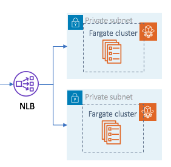

    SSH to jumpserver to verify the api work properly

    ```bash
    [ec2-user@ip-10-0-2-83 workspace]$ curl http://web-app-fargate-nlb-internal-a91fd47048eb1ef0.elb.cn-northwest-1.amazonaws.com.cn
    <html><h1>Hello World From Ray Webpage!</h1></html>
    [ec2-user@ip-10-0-2-83 workspace]$ curl http://web-app-fargate-nlb-internal-a91fd47048eb1ef0.elb.cn-northwest-1.amazonaws.com.cn:5000
    <html><h1>Hello World From Ray Webpage!</h1></html>
    ```

## Build a Regional REST API with API Gateway private integration

    [Quick start Step by Step guide](https://docs.aws.amazon.com/apigateway/latest/developerguide/getting-started-with-private-integration.html)

    [Set up API Gateway private integrations guide for different scenario](https://docs.aws.amazon.com/apigateway/latest/developerguide/set-up-private-integration.html)

    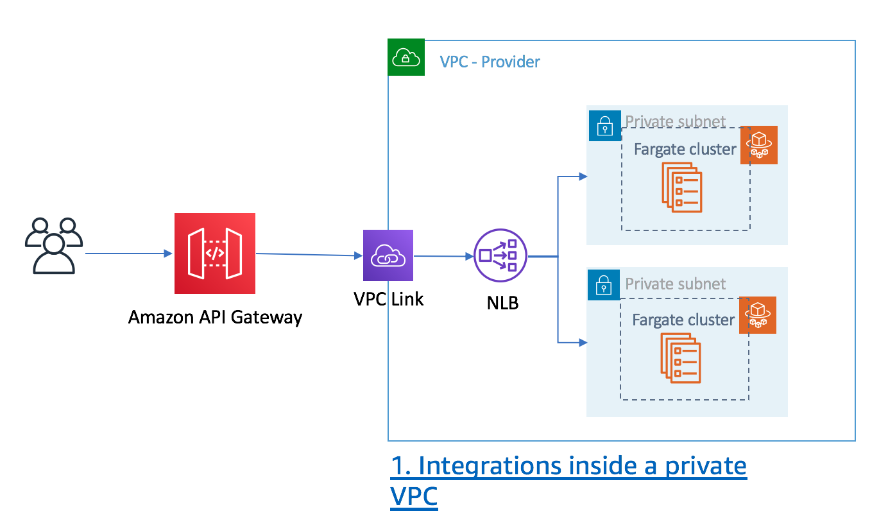

1. On API Gateway console creat the VPC link for REST APIs

    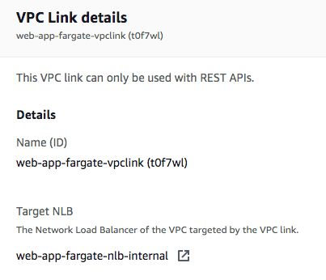

2. Choice a API to use (1) VPC Link for Integration type; (2) Choose Use Proxy Integration; (3)From the VPC Link drop-down list, select the VpcLink created in previous step.

    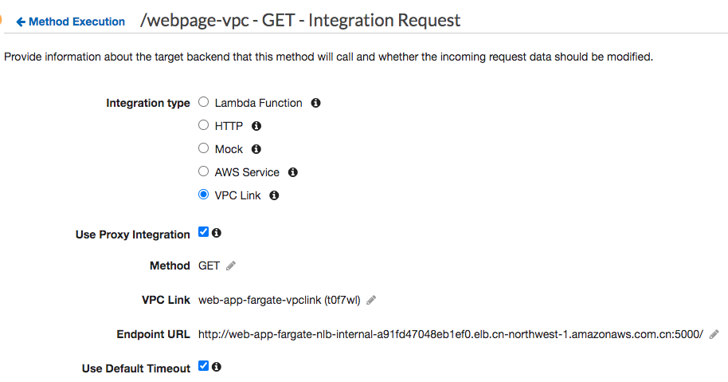

3. From the Actions drop-down menu, choose Deploy API

4. Testing new REST API from VPC (The VPC without API GW VPC endpoint) or destop via public internet

    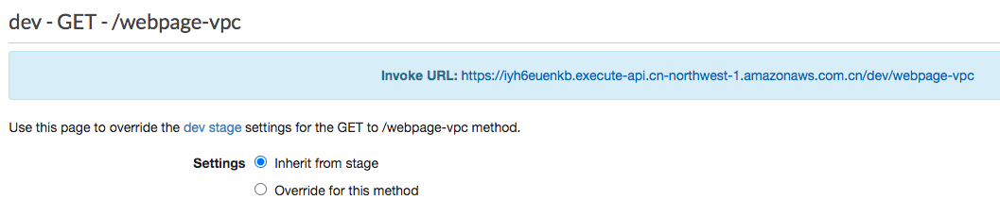

    ```bash
    curl https://iyh6euenkb.execute-api.cn-northwest-1.amazonaws.com.cn/dev/webpage-vpc
    <html><h1>Hello World From Ray Webpage!</h1></html>
    ```

## Build a Private REST API with API Gateway private integration

    Create a REST API that is only accessible from within a VPC. [Step by Step guide](https://docs.aws.amazon.com/apigateway/latest/developerguide/apigateway-private-apis.html)

    

1. Create an interface VPC endpoint for API Gateway execute-api

    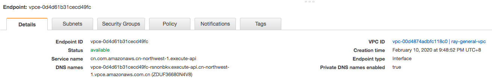

    - For Enable Private DNS Name, leave the check box selected. Private DNS is enabled by default. 
    
        When private DNS is enabled, you're able to access your API via private or public DNS. However, you cannot access public APIs from a VPC by using an API Gateway VPC endpoint with private DNS enabled. 

    - The security group you choose must be set to allow TCP Port 443 inbound HTTPS traffic from either an IP range in your VPC or another security group in your VPC. 
    - VPCE Policy in here is Full Access - Allow access by any user or service within the VPC using credentials from any AWS accounts.
    ```json
    {
    "Statement": [
            {
                "Action": "*",
                "Effect": "Allow",
                "Resource": "*",
                "Principal": "*"
            }
        ]
    }
    ```

2. Create a private API using the API Gateway console

    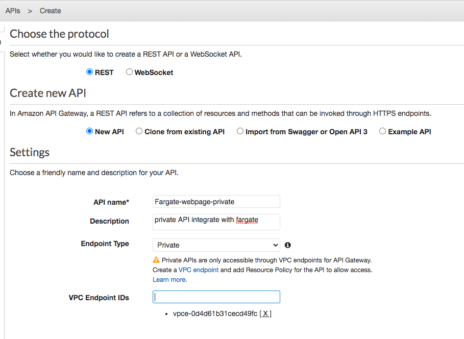

    ```bash
    aws apigateway create-rest-api --name Fargate-webpage-private \
    --endpoint-configuration '{ "types": ["PRIVATE"], "vpcEndpointIds" : ["vpce-0d4d61b31cecd49fc"] }' \
    --region cn-northwest-1
    ```

3. Set up a resource policy for a private API only allow specified VPC to acess this private API
    ```json
    {
    "Version": "2012-10-17",
    "Statement": [
        {
            "Effect": "Allow",
            "Principal": "*",
            "Action": "execute-api:Invoke",
            "Resource": "arn:aws-cn:execute-api:cn-northwest-1:{account_id}:{apigw_id}/*/*/*"
        },
        {
            "Effect": "Deny",
            "Principal": "*",
            "Action": "execute-api:Invoke",
            "Resource": "arn:aws-cn:execute-api:cn-northwest-1:{account_id}:{apigw_id}/*/*/*",
            "Condition" : {
                "StringNotEquals": {
                   "aws:SourceVpc": "{vpc_id}"
                }
            }
        }
    ]
    }
    ```

4. Create the Resource and Method

   Here I will test HTTP integration and private integration with or without proxy mode

    - HTTP Integration with Proxy Mode

    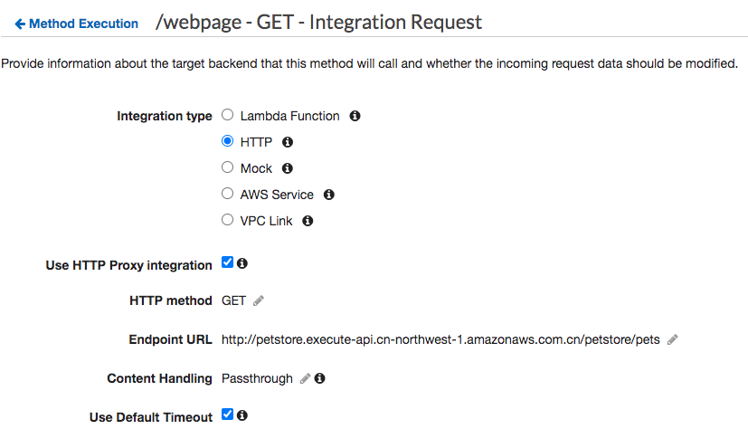

    - Private Integration VPCLink with Proxy Mode
    
    

    - HTTP Integration without Proxy Mode

    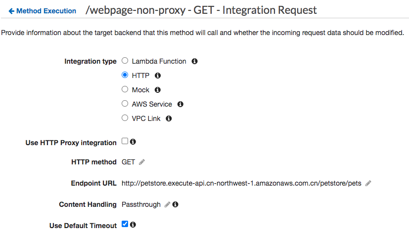

    - Private Integration VPCLink without Proxy Mode
    
    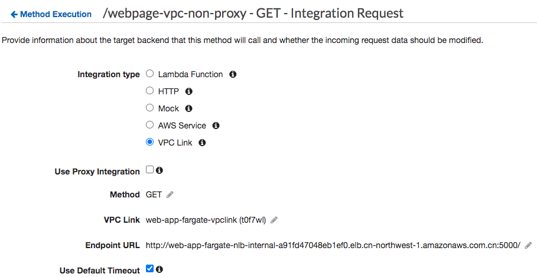

5. Deploy a private API using the API Gateway console as stage set to `dev`

    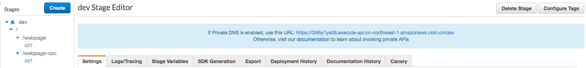

6. Invoking your private API
 
    Invoking your private API using private DNS names from EC2. The EC2 in the same VPC which VPC endpoint configured

    ```bash
    # HTTP Integration with Proxy Mode
    [ec2-user@ip-10-0-2-83 workspace]$ curl https://3i95y1yx06.execute-api.cn-northwest-1.amazonaws.com.cn/dev/webpage
    
    # Private Integration VPCLink with Proxy Mode
    [ec2-user@ip-10-0-2-83 workspace]$ curl https://3i95y1yx06.execute-api.cn-northwest-1.amazonaws.com.cn/dev/webpage-vpc

    # HTTP Integration without Proxy Mode
    [ec2-user@ip-10-0-2-83 workspace]$ curl https://3i95y1yx06.execute-api.cn-northwest-1.amazonaws.com.cn/dev/webpage-non-proxy

    # Private Integration VPCLink without Proxy Mode
    [ec2-user@ip-10-0-2-83 workspace]$ curl https://3i95y1yx06.execute-api.cn-northwest-1.amazonaws.com.cn/dev/webpage-vpc-non-proxy
    ```

7. Invoking your private API using endpoint-specific DNS hostnames
    
    You can access your private API using endpoint-specific DNS hostnames. These are DNS hostnames containing the VPC endpoint ID or API ID for your private API as following format:
    `https://{vpce}.execute-api.{region}.vpce.amazonaws.com/{stage}` or `https://{vpce}.execute-api.{cn-region}.vpce.amazonaws.com.cn/{stage}`
    
    ```bash
    # HTTP Integration with Proxy Mode
    [ec2-user@ip-10-0-2-83 workspace]$ curl -v https://vpce-0d4d61b31cecd49fc-rsnonbkv.execute-api.cn-northwest-1.vpce.amazonaws.com.cn/dev/webpage -H 'Host: 3i95y1yx06.execute-api.cn-northwest-1.amazonaws.com.cn'
    [ec2-user@ip-10-0-2-83 workspace]$ curl -v https://vpce-0d4d61b31cecd49fc-rsnonbkv.execute-api.cn-northwest-1.vpce.amazonaws.com.cn/dev/webpage -H'x-apigw-api-id:3i95y1yx06'
    
    # Private Integration VPCLink with Proxy Mode
    [ec2-user@ip-10-0-2-83 workspace]$ curl -v https://vpce-0d4d61b31cecd49fc-rsnonbkv.execute-api.cn-northwest-1.vpce.amazonaws.com.cn/dev/webpage-vpc -H 'Host: 3i95y1yx06.execute-api.cn-northwest-1.amazonaws.com.cn'
    [ec2-user@ip-10-0-2-83 workspace]$ curl -v https://vpce-0d4d61b31cecd49fc-rsnonbkv.execute-api.cn-northwest-1.vpce.amazonaws.com.cn/dev/webpage-vpc -H'x-apigw-api-id:3i95y1yx06'

    # HTTP Integration without Proxy Mode
    [ec2-user@ip-10-0-2-83 workspace]$ curl -v https://vpce-0d4d61b31cecd49fc-rsnonbkv.execute-api.cn-northwest-1.vpce.amazonaws.com.cn/dev/webpage-non-proxy -H 'Host: 3i95y1yx06.execute-api.cn-northwest-1.amazonaws.com.cn'
    [ec2-user@ip-10-0-2-83 workspace]$ curl -v https://vpce-0d4d61b31cecd49fc-rsnonbkv.execute-api.cn-northwest-1.vpce.amazonaws.com.cn/dev/webpage-non-proxy -H'x-apigw-api-id:3i95y1yx06'

    # Private Integration VPCLink without Proxy Mode
    [ec2-user@ip-10-0-2-83 workspace]$ curl -v https://vpce-0d4d61b31cecd49fc-rsnonbkv.execute-api.cn-northwest-1.vpce.amazonaws.com.cn/dev/webpage-vpc-non-proxy -H 'Host: 3i95y1yx06.execute-api.cn-northwest-1.amazonaws.com.cn'
    [ec2-user@ip-10-0-2-83 workspace]$ curl -v https://vpce-0d4d61b31cecd49fc-rsnonbkv.execute-api.cn-northwest-1.vpce.amazonaws.com.cn/dev/webpage-vpc-non-proxy -H'x-apigw-api-id:3i95y1yx06'
    ```

## Invoke a Private REST API from other account VPC


    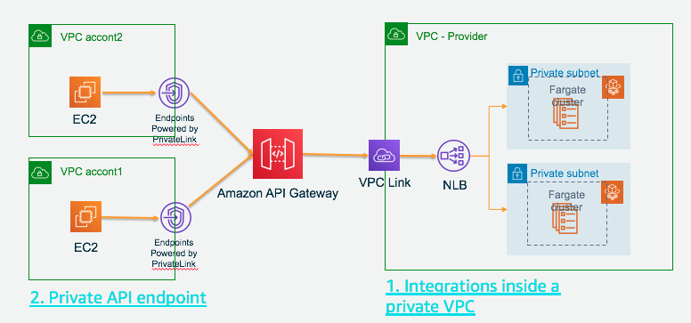

1. Create an interface VPC endpoint for API Gateway execute-api in 2nd account VPC

    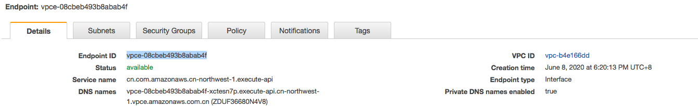

    - For Enable Private DNS Name, leave the check box selected. Private DNS is enabled by default. 
    - The security group you choose must be set to allow TCP Port 443 inbound HTTPS traffic from either an IP range in your VPC or another security group in your VPC. 
    - VPCE Policy in here is Full Access - Allow access by any user or service within the VPC using credentials from any AWS accounts.
    ```json
    {
    "Statement": [
            {
                "Action": "*",
                "Effect": "Allow",
                "Resource": "*",
                "Principal": "*"
            }
        ]
    }
    ```

2. Add new VPC endpoint to the private API

    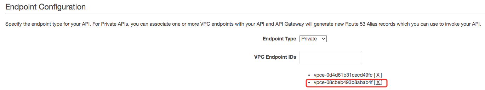

    ```bash
    aws apigateway update-rest-api --rest-api-id 3i95y1yx06 \
    --patch-operations "op='add',path='/endpointConfiguration/vpcEndpointIds',value='vpce-08cbeb493b8abab4f'"
    --region cn-northwest-1
    ```

3. Set up a resource policy for a private API only allow specified VPC to acess this private API
    ```json
    {
    "Version": "2012-10-17",
    "Statement": [
        {
            "Effect": "Allow",
            "Principal": "*",
            "Action": "execute-api:Invoke",
            "Resource": "arn:aws-cn:execute-api:cn-northwest-1:{account_id}:{apigw_id}/*/*/*"
        },
        {
            "Effect": "Deny",
            "Principal": "*",
            "Action": "execute-api:Invoke",
            "Resource": "arn:aws-cn:execute-api:cn-northwest-1:{account_id}:{apigw_id}/*/*/*",
            "Condition" : {
                "StringNotEquals": {
                   "aws:SourceVpc": ["{vpc_id}","{vpc_id_crossaccount}"]
                }
            }
        }
    ]
    }
    ```

4. Re-Deploy a private API using the API Gateway console as stage set to `dev`

    

5. Invoking your private API

   Invoking your private API using private DNS names from EC2. The EC2 in the second account VPC which VPC endpoint configured

    ```bash
    # HTTP Integration with Proxy Mode
    [ec2-user@ip-172-31-42-173 ~]$ curl https://3i95y1yx06.execute-api.cn-northwest-1.amazonaws.com.cn/dev/webpage
    
    # Private Integration VPCLink with Proxy Mode
    [ec2-user@ip-172-31-42-173 ~]$ curl https://3i95y1yx06.execute-api.cn-northwest-1.amazonaws.com.cn/dev/webpage-vpc

    # HTTP Integration without Proxy Mode
    [ec2-user@ip-172-31-42-173 ~]$ curl https://3i95y1yx06.execute-api.cn-northwest-1.amazonaws.com.cn/dev/webpage-non-proxy

    # Private Integration VPCLink without Proxy Mode
    [ec2-user@ip-172-31-42-173 ~]$ curl https://3i95y1yx06.execute-api.cn-northwest-1.amazonaws.com.cn/dev/webpage-vpc-non-proxy
    ```

6. Invoking your private API using endpoint-specific DNS hostnames
    
    Replace the endpoint-specific DNS hostnames to the cross account VPC endpoint DNS name:

    ```bash
    # HTTP Integration with Proxy Mode
    [ec2-user@ip-172-31-42-173 ~]$ curl -v https://vpce-08cbeb493b8abab4f-xctesn7p.execute-api.cn-northwest-1.vpce.amazonaws.com.cn/dev/webpage -H 'Host: 3i95y1yx06.execute-api.cn-northwest-1.amazonaws.com.cn'
    [ec2-user@ip-172-31-42-173 ~]$ curl -v https://vpce-08cbeb493b8abab4f-xctesn7p.execute-api.cn-northwest-1.vpce.amazonaws.com.cn/dev/webpage -H'x-apigw-api-id:3i95y1yx06'
    
    # Private Integration VPCLink with Proxy Mode
    [ec2-user@ip-172-31-42-173 ~]$ curl -v https://vpce-08cbeb493b8abab4f-xctesn7p.execute-api.cn-northwest-1.vpce.amazonaws.com.cn/dev/webpage-vpc -H 'Host: 3i95y1yx06.execute-api.cn-northwest-1.amazonaws.com.cn'
    [ec2-user@ip-172-31-42-173 ~]$ curl -v https://vpce-08cbeb493b8abab4f-xctesn7p.execute-api.cn-northwest-1.vpce.amazonaws.com.cn/dev/webpage-vpc -H'x-apigw-api-id:3i95y1yx06'

    # HTTP Integration without Proxy Mode
    [ec2-user@ip-172-31-42-173 ~]$ curl -v https://vpce-08cbeb493b8abab4f-xctesn7p.execute-api.cn-northwest-1.vpce.amazonaws.com.cn/dev/webpage-non-proxy -H 'Host: 3i95y1yx06.execute-api.cn-northwest-1.amazonaws.com.cn'
    [ec2-user@ip-172-31-42-173 ~]$ curl -v https://vpce-08cbeb493b8abab4f-xctesn7p.execute-api.cn-northwest-1.vpce.amazonaws.com.cn/dev/webpage-non-proxy -H'x-apigw-api-id:3i95y1yx06'

    # Private Integration VPCLink without Proxy Mode
    [ec2-user@ip-172-31-42-173 ~]$ curl -v https://vpce-08cbeb493b8abab4f-xctesn7p.execute-api.cn-northwest-1.vpce.amazonaws.com.cn/dev/webpage-vpc-non-proxy -H 'Host: 3i95y1yx06.execute-api.cn-northwest-1.amazonaws.com.cn'
    [ec2-user@ip-172-31-42-173 ~]$ curl -v https://vpce-08cbeb493b8abab4f-xctesn7p.execute-api.cn-northwest-1.vpce.amazonaws.com.cn/dev/webpage-vpc-non-proxy -H'x-apigw-api-id:3i95y1yx06'
    ```

## Complex scenario

1. In above section, we created the private API Fargate-webpage-private (3i95y1yx06) with private integration with Fargate resource

Now we add complex
```bash
Client -> Consumer VPC NLB (web-app-fargate-nlb-consumer) -> Interface VPCe to APIGW (vpce-080de204ca78d2883) for Consumer VPC 
-> Private API Fargate-private-to-first-api (v944po9kjb) -> (via VPC link) NLB (web-app-fargate-nlb-internal2) in Provider VPC 
-> Interface VPCe to APIGW (vpce-0d4d61b31cecd49fc) for Provider VPC -> private API Fargate-webpage-private (3i95y1yx06) 
-> (via VPC link) ECS NLB (web-app-fargate-nlb-internal) in Provider VPC -> Ecs Fargete in Provider VPC
```

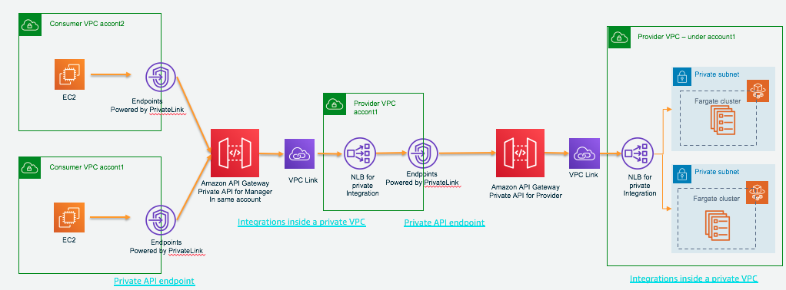

2. Get the Interface VPC endpoint of private API Fargate-webpage-private and make sure 443 point is available
```bash
nslookup 3i95y1yx06.execute-api.cn-northwest-1.amazonaws.com.cn
Server:         10.0.0.2
Address:        10.0.0.2#53

Non-authoritative answer:
3i95y1yx06.execute-api.cn-northwest-1.amazonaws.com.cn  canonical name = execute-api.cn-northwest-1.amazonaws.com.cn.
Name:   execute-api.cn-northwest-1.amazonaws.com.cn
Address: 10.0.11.153
Name:   execute-api.cn-northwest-1.amazonaws.com.cn
Address: 10.0.3.206
Name:   execute-api.cn-northwest-1.amazonaws.com.cn
Address: 10.0.0.75

telnet 10.0.11.153 443
Trying 10.0.11.153...
Connected to 10.0.11.153.
Escape character is '^]'.
^]
```

3. Create the NLB web-app-fargate-nlb-internal2 route traffic to VPC endpoint of private API Fargate-webpage-private

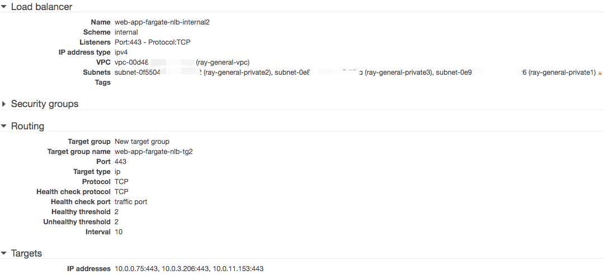

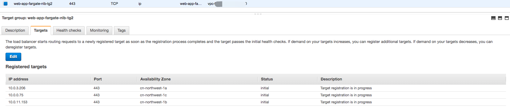

Verify from web-app-fargate-nlb-internal2 can access the private API Fargate-webpage-private

```bash
curl -k -v https://web-app-fargate-nlb-internal2-fdeb5f1534e02ddb.elb.cn-northwest-1.amazonaws.com.cn/dev/webpage-vpc -H 'Host: 3i95y1yx06.execute-api.cn-northwest-1.amazonaws.com.cn'

curl -k -v https://web-app-fargate-nlb-internal2-fdeb5f1534e02ddb.elb.cn-northwest-1.amazonaws.com.cn/dev/webpage-vpc -H'x-apigw-api-id:3i95y1yx06'

curl -k -v https://web-app-fargate-nlb-internal2-fdeb5f1534e02ddb.elb.cn-northwest-1.amazonaws.com.cn/dev/webpage-vpc-non-proxy -H 'Host: 3i95y1yx06.execute-api.cn-northwest-1.amazonaws.com.cn'

curl -k -v https://web-app-fargate-nlb-internal2-fdeb5f1534e02ddb.elb.cn-northwest-1.amazonaws.com.cn/dev/webpage-vpc-non-proxy -H 'Host: 3i95y1yx06.execute-api.cn-northwest-1.amazonaws.com.cn'
```

4. Create the private API use VPC link to integrated with web-app-fargate-nlb-internal2

To make the verification simple, I change the first private API Fargate-webpage-private (3i95y1yx06) resource policy to allow any

```json
{
    "Version": "2012-10-17",
    "Statement": [
        {
            "Effect": "Allow",
            "Principal": "*",
            "Action": "execute-api:Invoke",
            "Resource": "arn:aws-cn:execute-api:cn-northwest-1:account-id:3i95y1yx06/*/*/*"
        }
    ]
}
```

And set the second Private API Fargate-private-to-first-api (v944po9kjb) resource policy to allow any

```json
{
    "Version": "2012-10-17",
    "Statement": [
        {
            "Effect": "Allow",
            "Principal": "*",
            "Action": "execute-api:Invoke",
            "Resource": "arn:aws-cn:execute-api:cn-northwest-1:account-id:v944po9kjb/*/*/*"
        }
    ]
}
```

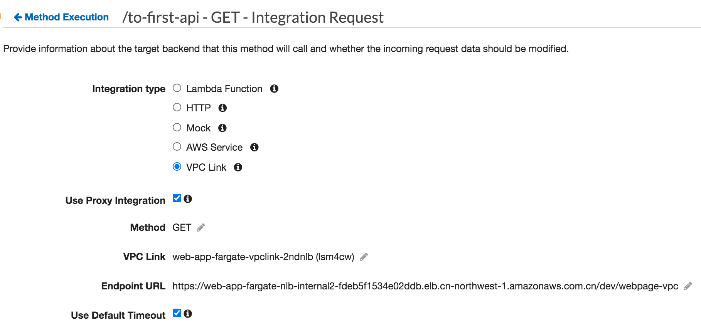

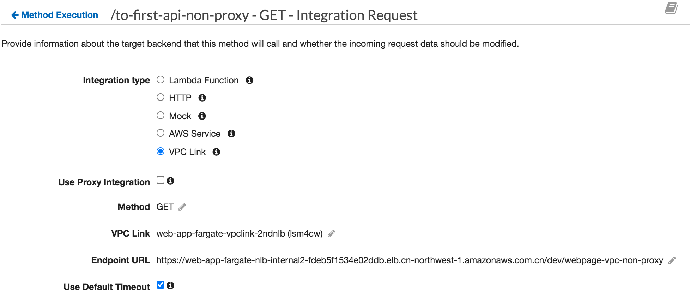

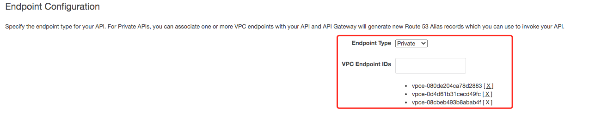

5. Testing

[Testing result](2PrivateAPI-Testing.md)


# Trouble shooting:
1. [How do I troubleshoot issues connecting to an API Gateway private API endpoint?](https://aws.amazon.com/premiumsupport/knowledge-center/api-gateway-private-endpoint-connection/)

2. [How to invoke a private API ](https://docs.aws.amazon.com/apigateway/latest/developerguide/apigateway-private-api-test-invoke-url.html)

How you access your private API will depend upon whether or not you have enabled private DNS on the VPC endpoint.

For example, while accessing private API from on-premises network via AWS Direct Connect, you will have private DNS enabled on the VPC endpoint. In such a case, follow the steps outlined in [Invoking Your Private API Using Endpoint-Specific Public DNS Hostnames](https://docs.aws.amazon.com/apigateway/latest/developerguide/apigateway-private-api-test-invoke-url.html#apigateway-private-api-public-dns). You cannot use private DNS names to access your private API from an on-premises network. 

3. [How do I troubleshoot HTTP 403 Forbidden errors from API Gateway?](https://aws.amazon.com/premiumsupport/knowledge-center/api-gateway-troubleshoot-403-forbidden/)