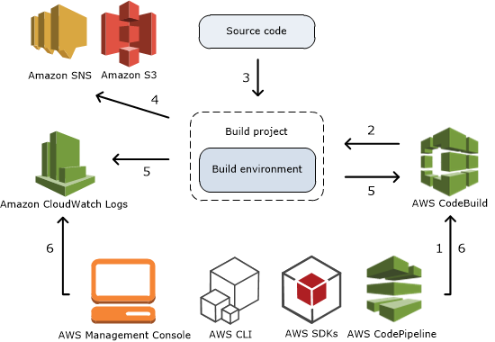
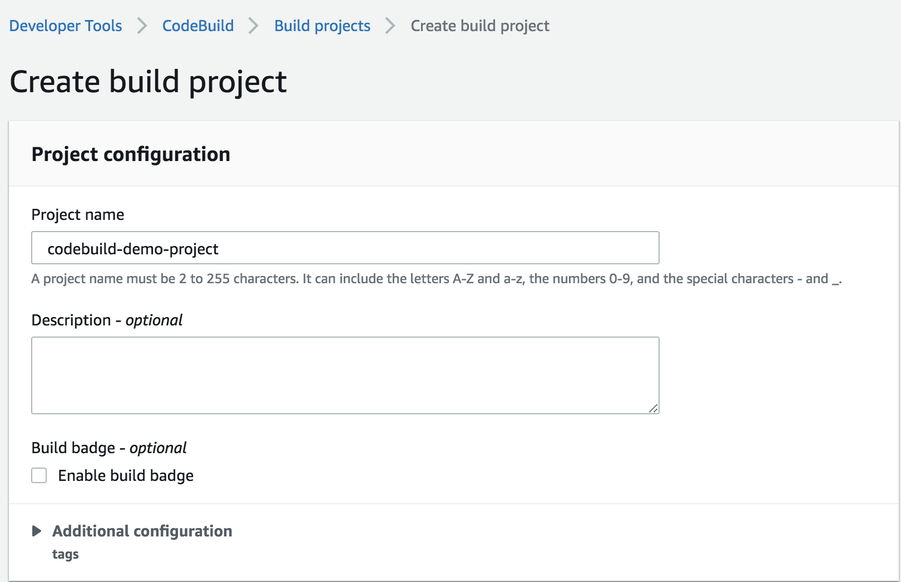
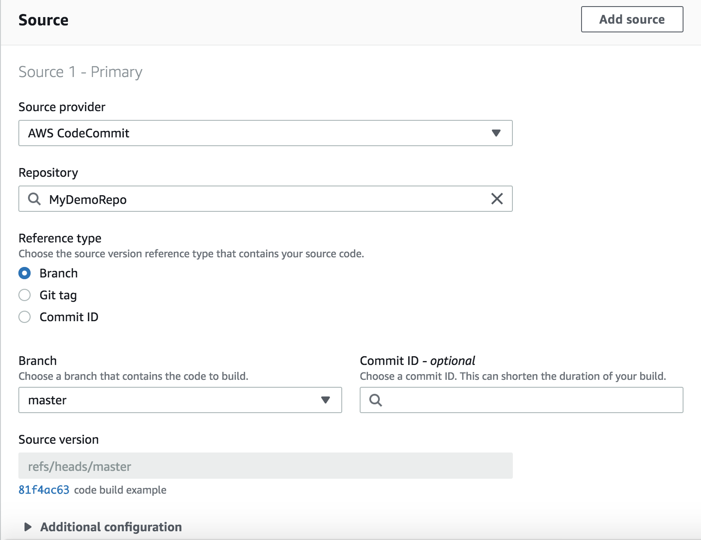
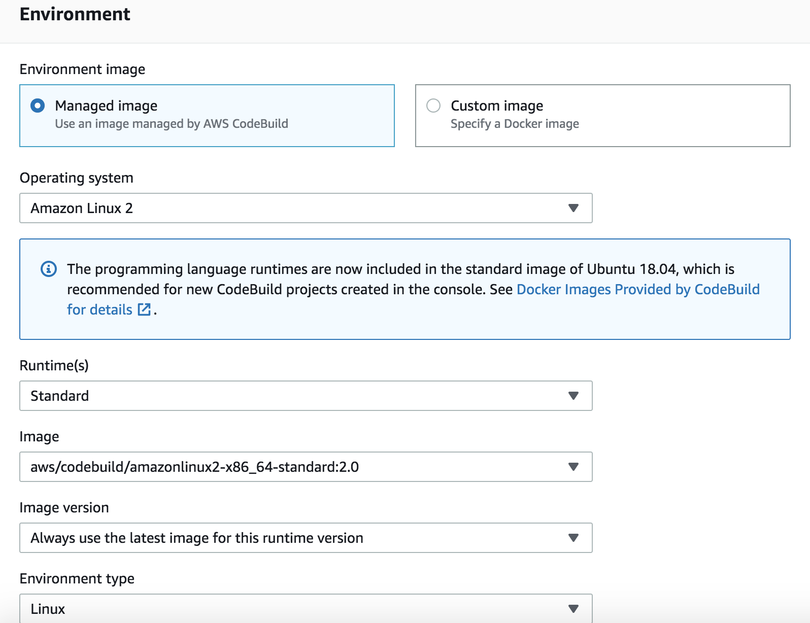
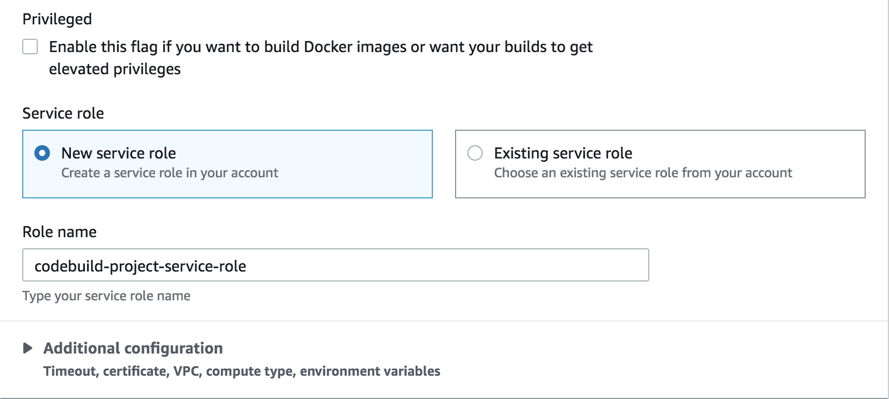
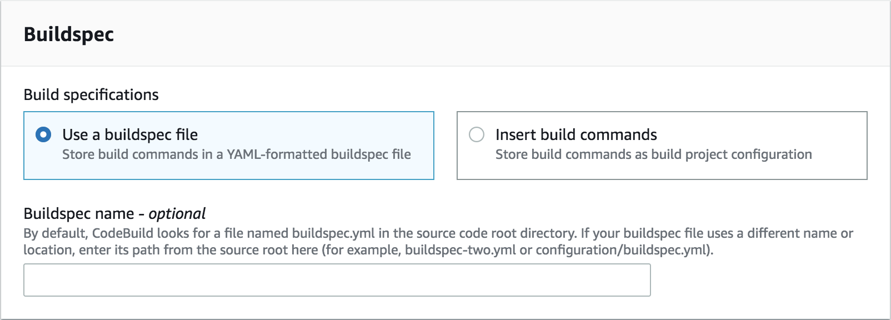
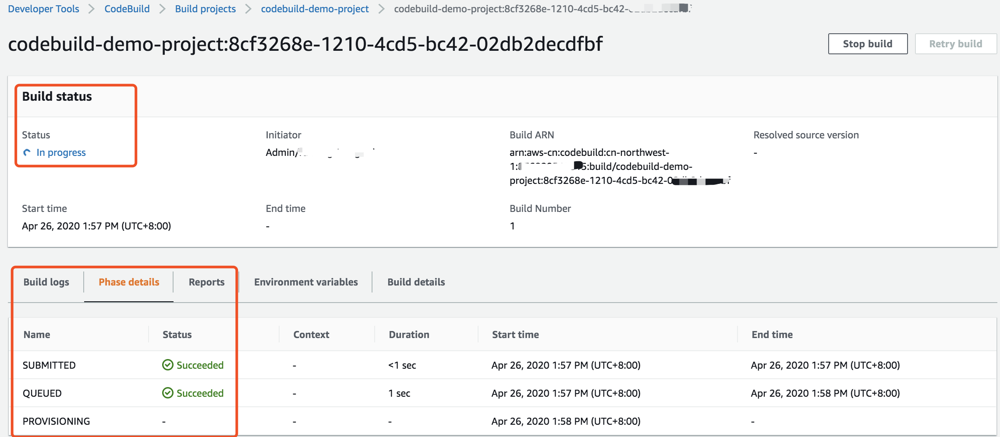

# Get start code build

## How CodeBuild works

1. Provide CodeBuild with a build project. 
Includes information about 
- How to run a build
- Where to get the source code
- Which build environment to use
- Which build commands to run
- Where to store the build output.

2. CodeBuild uses the build project to create the build environment.

3. CodeBuild downloads the source code into the build environment and then uses the build specification (buildspec)to run a build. 

4. The build environment uploads its output to an S3 bucket. It can also send build notifications to an Amazon SNS topic

5. While the build is running, the build environment sends information to CodeBuild and Amazon CloudWatch Logs.

6. While the build is running, you can use the AWS CodeBuild console, AWS CLI, or AWS SDKs to get summarized build information from CodeBuild and detailed build information from Amazon CloudWatch Logs.



## Getting started with AWS CodeBuild
[getting-started-console](https://docs.aws.amazon.com/codebuild/latest/userguide/getting-started.html)

[getting-started-cli](https://docs.aws.amazon.com/codebuild/latest/userguide/getting-started-cli.html)

1. Create two S3 buckets
- S3 bucket for build input. codebuild-regionID-accountID-input-bucket
- S3 bucket for build output. codebuild-regionID-accountID-output-bucket
```bash
aws s3 mb s3://codebuild-regionID-accountID-input-bucket --region cn-northwest-1
aws s3 mb s3://codebuild-regionID-accountID-output-bucket --region cn-northwest-1
```

2. Create source code
- Source code structure
```bash
(root directory name)
    |-- pom.xml
    `-- src
         |-- main
         |     `-- java
         |           `-- MessageUtil.java
         `-- test
               `-- java
                     `-- TestMessageUtil.java
```

- pom.xml
```xml
<project xmlns="http://maven.apache.org/POM/4.0.0" 
    xmlns:xsi="http://www.w3.org/2001/XMLSchema-instance"
    xsi:schemaLocation="http://maven.apache.org/POM/4.0.0 http://maven.apache.org/maven-v4_0_0.xsd">
  <modelVersion>4.0.0</modelVersion>
  <groupId>org.example</groupId>
  <artifactId>messageUtil</artifactId>
  <version>1.0</version>
  <packaging>jar</packaging>
  <name>Message Utility Java Sample App</name>
  <dependencies>
    <dependency>
      <groupId>junit</groupId>
      <artifactId>junit</artifactId>
      <version>4.11</version>
      <scope>test</scope>
    </dependency>	
  </dependencies>
  <build>
    <plugins>
      <plugin>
        <groupId>org.apache.maven.plugins</groupId>
        <artifactId>maven-compiler-plugin</artifactId>
        <version>3.8.0</version>
      </plugin>
    </plugins>
  </build>
</project>
```

3. Create the buildspec file buildspec.yml
- buildspec.yml
```yaml
version: 0.2

phases:
  install:
    runtime-versions:
      java: corretto11
  pre_build:
    commands:
      - echo Nothing to do in the pre_build phase...
  build:
    commands:
      - echo Build started on `date`
      - mvn install
  post_build:
    commands:
      - echo Build completed on `date`
artifacts:
  files:
    - target/messageUtil-1.0.jar
```

- Source code structure
```bash
(root directory name)
    |-- pom.xml
    |-- buildspec.yml
    `-- src
         |-- main
         |     `-- java
         |           `-- MessageUtil.java
         `-- test
               `-- java
                     `-- TestMessageUtil.java
```

4. Check in the code to CodeCommit repository
Follow up the [Get start codecommit](../codecommit/getstart-codecommit.md) to check in the code to CodeCommit repository MyDemoRepo.

5. Create the build project
If a CodeBuild console, choose Create build project. OR, on the navigation pane, expand Build, choose Build projects, and then choose Create build project `codebuild-demo-project`. 

Make sure the user with the AWSCodeBuildAdminAccess, AmazonS3ReadOnlyAccess, and IAMFullAccess managed permission to create the CodeBuild project

The [CodeBuild service role](https://docs.aws.amazon.com/codebuild/latest/userguide/setting-up.html#setting-up-service-role) used for run a CodeBuild build.

```bash
aws codebuild create-project --cli-input-json file://create-project.json --region cn-northwest-1
```

create-project.json
```json
{
  "name": "codebuild-demo-project",
  "source": {
    "type": "CODECOMMIT",
    "location": "https://git-codecommit.cn-northwest-1.amazonaws.com.cn/v1/repos/MyDemoRepo",
    "sourceIdentifier": "source-codecommit"
  },
  "artifacts": {
    "type": "S3",
    "location": "codebuild-regionID-accountID-output-bucket"
  },
  "environment": {
    "type": "LINUX_CONTAINER",
    "image": "aws/codebuild/amazonlinux2-x86_64-standard:2.0",
    "computeType": "BUILD_GENERAL1_SMALL"
  },
  "serviceRole": "arn:aws-cn:iam::account-ID:role/codebuild-project-service-role",
  "encryptionKey": "arn:aws-cn:kms:region-ID:account-ID:key/key-ID"
}
```












You can also create the source code location on S3 bucket

```bash
MessageUtil.zip
    |-- pom.xml
    |-- buildspec.yml
    `-- src
         |-- main
         |     `-- java
         |           `-- MessageUtil.java
         `-- test
               `-- java
                     `-- TestMessageUtil.java

aws s3 cp MessageUtil.zip s3://codebuild-regionID-accountID-input-bucket/codebuild-demo-project/MessageUtil.zip --region cn-northwest-1

aws codebuild create-project --cli-input-json file://create-project-s3.json --region cn-northwest-1

create-project-s3.json
{
  "name": "codebuild-demo-project",
  "source": {
    "type": "S3",
    "location": "codebuild-regionID-accountID-input-bucket/MessageUtil.zip"
  },
  "artifacts": {
    "type": "S3",
    "location": "codebuild-regionID-accountID-output-bucket"
  },
  "environment": {
    "type": "LINUX_CONTAINER",
    "image": "aws/codebuild/amazonlinux2-x86_64-standard:2.0",
    "computeType": "BUILD_GENERAL1_SMALL"
  },
  "serviceRole": "arn:aws-cn:iam::account-ID:role/codebuild-project-service-role",
  "encryptionKey": "arn:aws-cn:kms:region-ID:account-ID:key/key-ID"
}
```

6. Run the build
In the list of build projects, choose `codebuild-demo-project`, and then choose `Start build`.
```bash
aws codebuild start-build --project-name codebuild-demo-project --region cn-northwest-1
```

7. View build information
- Select `codebuild-demo-project:build-ID` -> `Build history` -> `Phase details` to see the summary info
- Select `codebuild-demo-project:build-ID` -> `Build history` -> `Build logs` to see the details info
```bash
aws codebuild batch-get-builds --ids codebuild-demo-project:8cf3268e-1210-4cd5-bc42-02db2decdfbf --region cn-northwest-1 --query 'builds[*].[id,currentPhase,buildStatus,phases[*].[phaseType, phaseStatus, contexts]]'
```
