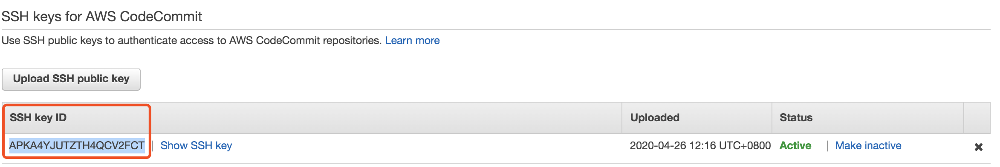

# Setting Up for AWS CodeCommit 

## The repository URL
Get clone url from:


- The HTTPS URL: you are using either Git credentials with your IAM user or the credential helper included with the AWS CLI.
```bash
git clone https://git-codecommit.cn-northwest-1.amazonaws.com.cn/v1/repos/MyDemoRepo
```
- The HTTPS (GRC) URL: you are using the git-remote-codecommit command on your local computer.
```bash
git clone codecommit::cn-northwest-1://MyDemoRepo
```
- The SSH URL: you are using an SSH public/private key pair with your IAM user.
```bash
git clone ssh://git-codecommit.cn-northwest-1.amazonaws.com.cn/v1/repos/MyDemoRepo
```

## Setting Up HTTPS Connections to AWS CodeCommit using Git Credentials
1. create the new IAM user with AWSCodeCommitPowerUser permission or you can use the existed user by check/add AWSCodeCommitPowerUser permission

2. Create Git Credentials for HTTPS Connections to CodeCommit


3. Working on CodeCommit Reposiotry
[Get Start Codecommit](devops/codecommit/getstart-codecommit.md)

## Setup for HTTPS Connections to AWS CodeCommit with git-remote-codecommit
1. create the new IAM user with AWSCodeCommitPowerUser permission or you can use the existed user by check/add AWSCodeCommitPowerUser permission

2. To install and configure the AWS CLI
```bash
aws codecommit help

# Configure the AWS CLI with a profile
aws configure
```

3. Install git-remote-codecommit
```bash
pip install git-remote-codecommit
.....
Successfully built git-remote-codecommit
Installing collected packages: git-remote-codecommit
Successfully installed git-remote-codecommit-1.13
```

4. Connect to the CodeCommit Console and Clone the Repository
**Note: git_remote_codecommit now has issue to support China region https://github.com/aws/git-remote-codecommit/issues/10**

You may encounter below error when run `git clone codecommit://MyDemoRepo`

```The following AWS Region is not available for use with AWS CodeCommit: cn-northwest-1. For more information about CodeCommit's availability in AWS Regions, see the AWS CodeCommit User Guide. If an AWS Region is listed as supported but you receive this error, try updating your version of the AWS CLI or the AWS SDKs.```

Workaround:

```bash
edit the file 
<YOUR_CURRENT_PYTHON_DIR>/site-packages/git_remote_codecommit/__init__.py

locate the line:
     available_regions = [region for partition in session.get_available_partitions() for region in session.get_available_regions('codecommit', partition)]
(Added in >>>) available_regions.append("cn-north-1")
(Added in >>>) available_regions.append("cn-northwest-1")
```

Clone your repository
```bash
# with default aws configure profile
git clone codecommit://MyDemoRepo
Cloning into 'MyDemoRepo'...
remote: Counting objects: 20, done.
Unpacking objects: 100% (20/20), done.

# with a specific aws configure profile
git clone codecommit://cn-north-1@MyDemoRepo
Cloning into 'MyDemoRepo'...
remote: Counting objects: 20, done.
Unpacking objects: 100% (20/20), done.

# with profile and region
git clone codecommit::cn-northwest-1://cn-north-1@MyDemoRepo
Cloning into 'MyDemoRepo'...
remote: Counting objects: 20, done.
Unpacking objects: 100% (20/20), done.
```

## Setting up for For SSH Connections
1. Set Up the Public and Private Keys for Git and CodeCommit
```bash
ssh-keygen
Generating public/private rsa key pair.
Enter file in which to save the key (~/.ssh/id_rsa): codecommit_rsa

cat ~/.ssh/codecommit_rsa.pub
# Copy the output
```

2. In the IAM console, choose your `IAM user`.
- Choose the `Security Credentials` tab, and then choose `Upload SSH public key`.
- Paste the `contents of your SSH public key` into the field, and then choose `Upload SSH public key`.
- Copy or save the information in `SSH Key ID`.




3. Edit ~/.ssh/config by add below line
```bash
Host git-codecommit.*.amazonaws.com.cn
  User {SSH Key ID}
  IdentityFile ~/.ssh/codecommit_rsa
```

4. Testing
```bash
ssh git-codecommit.cn-northwest-1.amazonaws.com.cn
You have successfully authenticated over SSH. You can use Git to interact with AWS CodeCommit. Interactive shells are not supported.Connection to git-codecommit.cn-northwest-1.amazonaws.com.cn closed by remote host.
Connection to git-codecommit.cn-northwest-1.amazonaws.com.cn closed.

# OR
ssh -v git-codecommit.cn-northwest-1.amazonaws.com.cn

# git clone
git clone ssh://git-codecommit.cn-northwest-1.amazonaws.com.cn/v1/repos/MyDemoRepo
```