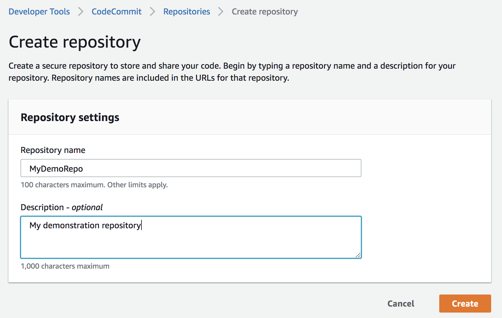
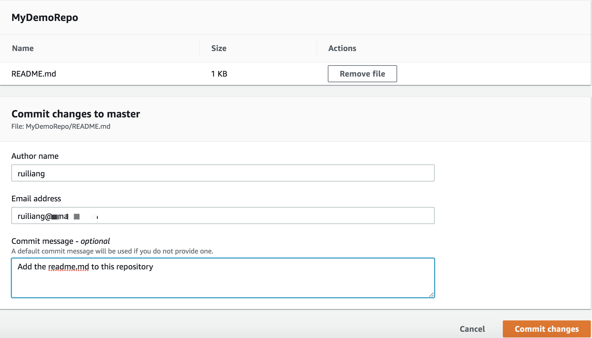
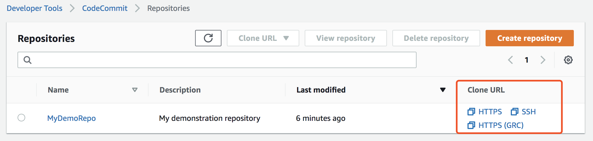
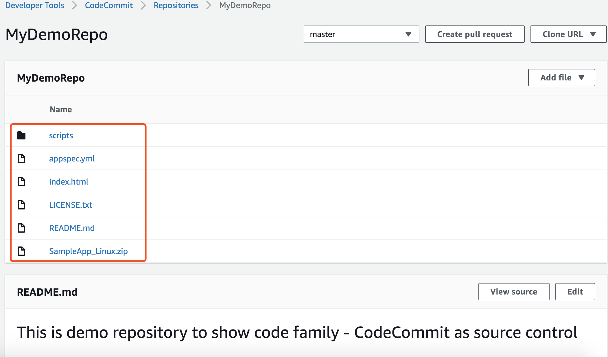
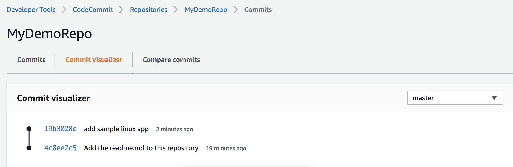
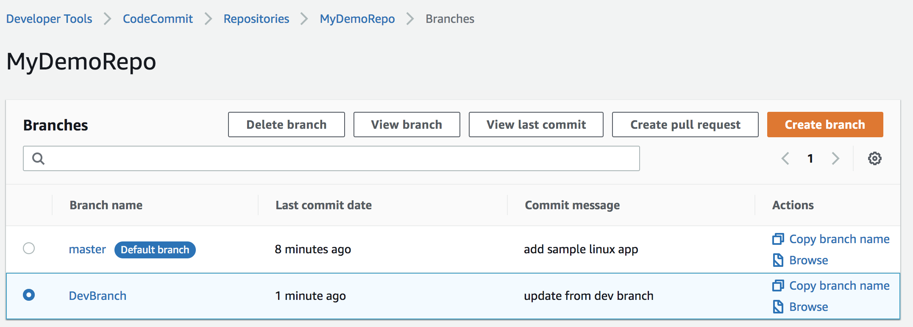
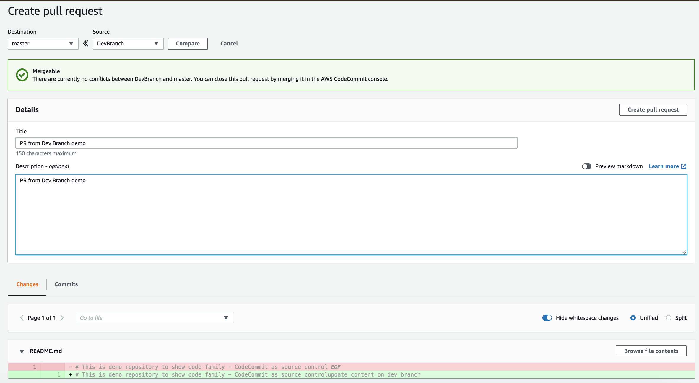
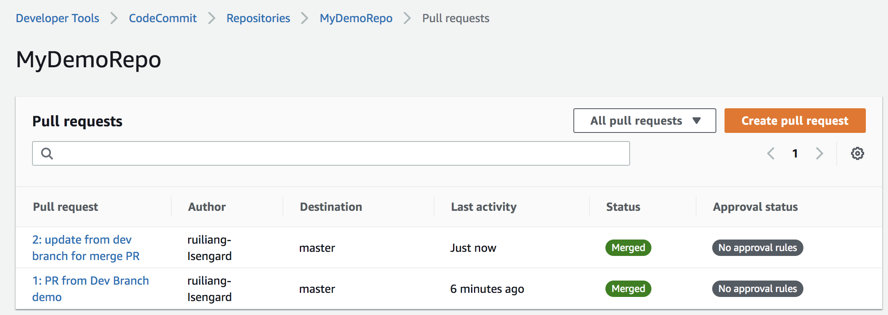
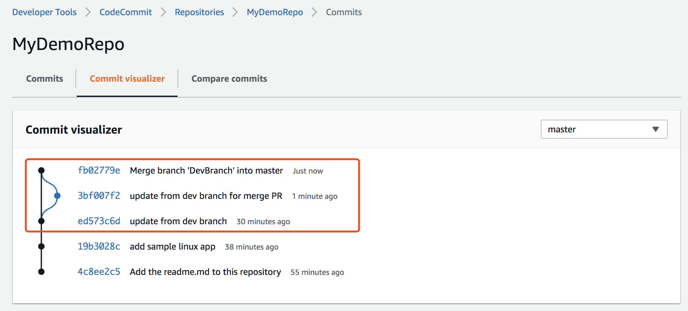
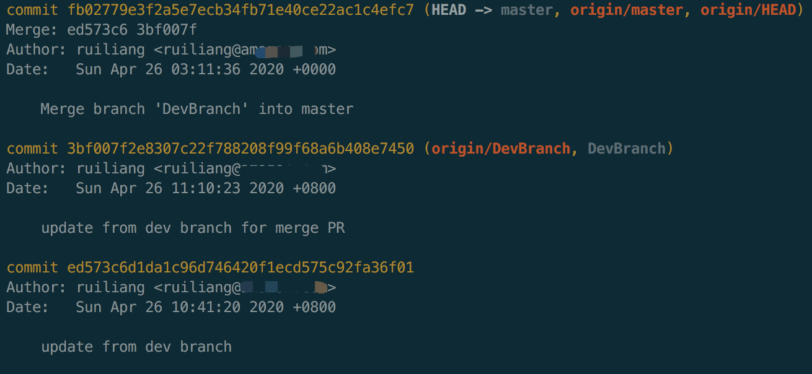

# Getting Started with AWS CodeCommit 

## Step 1: Create a CodeCommit Repository
Before you start, please complete [codecommit-setup](codecommit-setup.md)

On the Create repository page, create a MyDemoRepo repository. 



## Step 2: Add Files to Your Repository
1. Creating a file in the CodeCommit console.
2. Uploading a file from your local computer using the CodeCommit console.

- `Upload README.md` file to default master branch.
- Choose `Commit changes`



3. Using a Git client to clone the repository to your local computer, and then adding, committing, and pushing files to the CodeCommit repository.

You can find the clone url from:

- The HTTPS URL: you are using either Git credentials with your IAM user or the credential helper included with the AWS CLI.
- The HTTPS (GRC) URL: you are using the git-remote-codecommit command on your local computer.
- The SSH URL: you are using an SSH public/private key pair with your IAM user.

Here I use the https url
```bash
git clone https://git-codecommit.cn-northwest-1.amazonaws.com.cn/v1/repos/MyDemoRepo
Cloning into 'MyDemoRepo'...
Username for 'https://git-codecommit.cn-northwest-1.amazonaws.com.cn': 
Password for 'https://git-codecommit.cn-northwest-1.amazonaws.com.cn':
remote: Counting objects: 3, done.
Unpacking objects: 100% (3/3), done.
```

Adding, committing, and pushing files to the CodeCommit repository.
```bash
git config --local user.name "your-user-name"
git config --local user.email your-email-address
# create new files

# git commit
git add .
git commit -m "add sample linux app"

# git push
git push origin master
```

Browser the changes on CodeCommit Console




## Step 3: Working on a Branch
1. Create branch, commit on branch
```bash
git checkout -b DevBranch
echo "update content on dev branch" >> README.md

git status
On branch DevBranch
Changes not staged for commit:
  (use "git add <file>..." to update what will be committed)
  (use "git restore <file>..." to discard changes in working directory)
	modified:   README.md
no changes added to commit (use "git add" and/or "git commit -a")

git add README.md
git commit -m "update from dev branch"
[DevBranch ed573c6] update from dev branch
 1 file changed, 1 insertion(+), 1 deletion(-)

git push origin DevBranch
```

2. create a pull request (PR)

Create the PR on DevBranch





3. Mergethe PR

Mergethe PR





```bash
# Fetch the change
git checkout master
git pull

# If you want to continue DevBranch
git checkout DevBranch
git pull
```

4. Check the hisotry
```bash
git checkout master
git log
```


