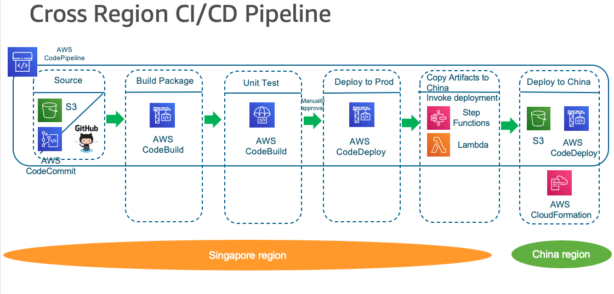
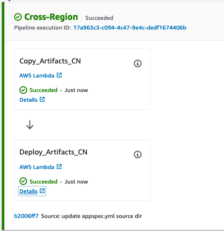
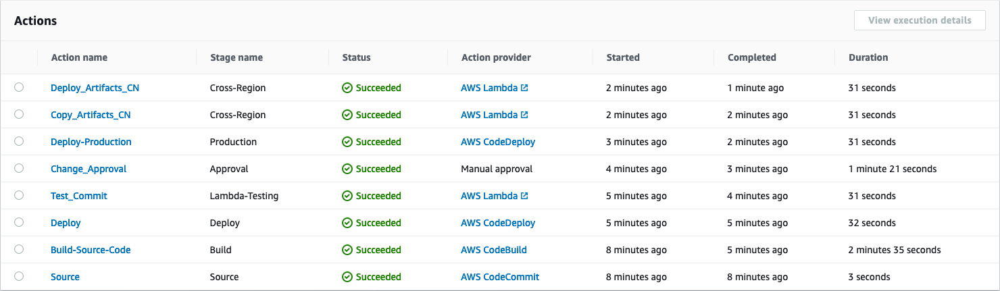
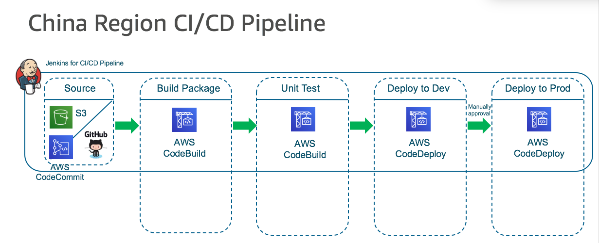

# Add a Cross-Region action in CodePipeline

Reuse the [CodePiple with CodeCommit and CodeDeploy](/aws-is-how/devops/codepipeline/quickstart/) pipeline and add a cross-Region action to a pipeline stage

# Pipeline and Deployment target in different Global regions


## Prepare the EC2 instance in new region - Tokyo Region
- Region: ap-northeast-1 Tokyo Region
- AMI: Amazon Linux 2 AMI (HVM), SSD Volume Type
- instance type: t2.micro
- IAM Role: ec2-codeX-instance-profile,
- User data: 
 
```bash
#!/bin/bash
yum -y update
yum install -y ruby
yum install -y aws-cli
cd /home/ec2-user
aws s3 cp s3://aws-codedeploy-us-east-2/latest/install . --region us-east-2
chmod +x ./install
./install auto
```

- Tag: Name:MyCodePipelineDemoProduction
- Security Group: 80, 443, 22

## Add CodeDeploy Project in Tokyo region
1. Create an application `MyDemoApplication` in CodeDeploy
- Choose EC2/On-premises as Compute Platform

2. Create Deployment group `MyDemoDeploymentGroup-Tokyo`
- MyCodeDeployRole as Service Role, follow the guide [create-service-role-for-codedeploy](https://docs.aws.amazon.com/codedeploy/latest/userguide/getting-started-create-service-role.html)
- Deployment type: In-place
- Environment configuration, choose Amazon EC2 Instances with tag `MyCodePipelineDemoProduction`
- Deployment configuration, choose `CodeDeployDefault.OneAtaTime`

## Add a cross-Region action to a pipeline stage
1. Add a cross-Region stage
- Add stage immediately after the Deploy stage with name `Cross-Region`
- Add action group with name `Deploy-Tokyo-Region`, Action provider as AWS CodeDeploy, Region as `Tokyo`
- Input artifacts: `SourceArtifact`, Application name: `MyDemoApplication`, Deployment group: `MyDemoDeploymentGroup-Tokyo`. Choose Save.

2. Trigger the new pipeline
```bash
aws codepipeline start-pipeline-execution --name two-stage-pipeline --region ap-southeast-1 --profile global
```

3. Verify your pipeline ran successfully and access the Public DNS of Tokyo region EC2 instances in your browser to view the index page for the sample application


# Pipeline in Global region and Deployment target in China region



## Create the cross-region-pipeline CodePipeline

Follow up the guide to create the  (https://docs.aws.amazon.com/codebuild/latest/userguide/getting-started.html)

1. Create the CodeCommit repository: `sample-cross-region`

```bash
tree
.
├── buildspec.yml
├── pom.xml
└── src
    ├── main
    │   └── java
    │       └── MessageUtil.java
    └── test
        └── java
            └── TestMessageUtil.java

5 directories, 4 files
```

2. Create the CodePipeline with name `cross-region-pipeline`

3. Add Source stage. 
- Source provider: `AWS CodeCommit`, Repository name: `sample-cross-region`, Branch name: master

3. Add Build stage.
  - Action Name: Build-Source-Code
  - Action provider: AWS CodeBuild
  - Input artifacts: SourceArtifact
  - choose Create project with Project name: Sample-Java-MessageUtil
    - Environment image, choose Managed image.
    - Operating system, choose Amazon Linux 2.
    - Runtime(s), choose Standard.
    - Image, choose aws/codebuild/amazonlinux2-x86_64-standard:3.0.
    - Image version and Environment type, use the default values.
    - Service Role: MyCodeBuildRole
    - Builspec: Using the buildspec.yml in the source code root directory
    - CloudWatch logs: /aws/codebuild/codebuilddemo
  - Build type: Single build
  - Output artifacts: MyAppBuild
- Edit the `Sample-Java-MessageUtil` Build project Artifacts setting by add the second artifact
    - Artifact identifier: messageUtil_jar (the same as defined in buildspec.yml secondary-artifacts)
    - Type S3 
    - bucket name `codebuild-region-ID-account-ID-output-bucket`
    - Name: Sample-Java-MessageUtil.zip
    - Leave Path blank
    - Artifacts packaging: Zip

4. Verify the `Sample-Java-MessageUtil` Build project can be executed successfully

THe artifact `messageUtil-1.0.jar` has been upload to `codebuild-region-ID-account-ID-output-bucket` bucket -> `Sample-Java-MessageUtil/target` folder

5. Edit the `cross-region-pipeline` pipeline to add the 2 CodeDeploy Stages

- Add stage immediately after the Build stage with name `Deploy`
    - Action provider: AWS CodeDeploy
    - Input artifacts: `MyAppBuild` which is the output artifact of CodeBuild
    - Application name: MyDemoApplication
    - Deployment group: MyDemoDeploymentGroupGlobal of MyDemoApplication
        - MyCodeDeployRole as Service Role, follow the guide [create-service-role-for-codedeploy](https://docs.aws.amazon.com/codedeploy/latest/userguide/getting-started-create-service-role.html)
        - Deployment type: In-place
        - Environment configuration, choose Amazon EC2 Instances with tag `MyCodePipelineDemo`
        - Deployment configuration, choose `CodeDeployDefault.OneAtaTime`
        - Clear Checkbox of Enable load balancing

- Add stage immediately after the `Deploy` stage with name `Production`
    - Action provider: AWS CodeDeploy
    - Input artifacts: `MyAppBuild` which is the output artifact of CodeBuild
    - Application name: MyDemoApplication
    - Deployment group: `CodePipelineProductionFleetGlobal` of MyDemoApplication
        - MyCodeDeployRole as Service Role, follow the guide [create-service-role-for-codedeploy](https://docs.aws.amazon.com/codedeploy/latest/userguide/getting-started-create-service-role.html)
        - Deployment type: In-place
        - Environment configuration, choose Amazon EC2 Instances with tag `MyCodePipelineDemoProduction`
        - Deployment configuration, choose `CodeDeployDefault.OneAtaTime`
        - Clear Checkbox of Enable load balancing

6. Verify the CodePipe can be executed successfully
```bash
ssh -i ssh-key ec2-user@deployment-target-ip
cd CodeDeploy-agent-deployment-archive
pwd
--> /opt/codedeploy-agent/deployment-root/e09113d5-b887-42fb-bfa5-08aa405b0d2d/d-AVVORRI9I/deployment-archive/target
ls
--> messageUtil-1.0.jar

# Check the location specify in appspec.yml
ll /tmp/messageUtil-1.0.jar
-rw-r--r-- 1 root root 2129 Aug 18 01:32 /tmp/messageUtil-1.0.jar
```

## Create the lambda function to copy the build artifact to China region S3 bucket
1. Create the Secrete `/codepipeline/china/credential` in AWS Secrete Manager in global region
2. Create Lambda execution role with permission of S3 and Secrete Manager
3. Use the `lambda-copy-s3.py` to create your lambda function `lambda-copy-s3` to copy the artifacts from global region s3 bucket to china region s3 bucket
The lambda function environment variables
```bash
S3_BUCKET_NAME_GLOBAL = codebuild-global-region-ID-account-ID-output-bucket
S3_BUCKET_NAME_CHINA = codebuild-china-region-ID-account-ID-output-bucket
```

Note:

- The sample function use the lambda `/tmp` storage, if you need large storage than 512MB, you can use the Lambda with AWS EFS
- If you need synchronize mess of S3 files, you can use the [amazon-s3-resumable-upload](https://github.com/aws-samples/amazon-s3-resumable-upload) to improve performance.


## Create the lambda function to trigger CodeDeploy to China region Instances
1. Prepare the EC2 instance in Beijing Region
- Region: cn-north-1 Beijing Region
- AMI: Amazon Linux 2 AMI (HVM), SSD Volume Type
- instance type: t2.micro
- IAM Role: ec2-codeX-instance-profile with permission of AmazonEC2RoleforAWSCodeDeploy 
- User data: 
 
```bash
#!/bin/bash
yum -y update
yum install -y ruby
yum install -y wget
yum install -y aws-cli
cd /home/ec2-user
wget https://aws-codedeploy-cn-north-1.s3.cn-north-1.amazonaws.com.cn/latest/install
chmod +x ./install
./install auto
service codedeploy-agent status
```

- Tag: Name:MyCodePipelineDemoProduction
- Security Group: 80, 443, 22

2. Create a CodeDeploy Application in China region
- Create an application `MyDemoApplication` in CodeDeploy
- Choose EC2/On-premises as Compute Platform
- Create Deployment group `CodePipelineProductionFleetChina` under MyDemoApplication
- MyCodeDeployRole as Service Role, follow the guide [create-service-role-for-codedeploy](https://docs.aws.amazon.com/codedeploy/latest/userguide/getting-started-create-service-role.html)
- Deployment type: In-place
- Environment configuration, choose Amazon EC2 Instances with tag `MyCodePipelineDemoProduction`
- Deployment configuration, choose `CodeDeployDefault.OneAtaTime`
- Clear Checkbox of Enable load balancing

3. Create lambda function `lambda-invoke-codedeploy`
- Lambda execution role with permission of S3 and CodeDeploy and CodePipe
- Use the `lambda-invoke-codedeploy.py` to create your lambda function `lambda-invoke-codedeploy` to invoke CodeDeploy in china region
- The lambda function environment variables
```bash
S3_BUCKET_NAME_CHINA = codebuild-china-region-ID-account-ID-output-bucket
S3_ARTIFACT_NAME_CHINA = Sample-Java-MessageUtil.zip
```

4. The deployment should be executed successfully and check the deployment target EC2
```bash
ssh -i ssh-key ec2-user@deployment-target-china-ip
ll /opt/codedeploy-agent/deployment-root/cbc49513-fec7-4f00-9128-3b8772dcef8b/d-7VB8IE874/deployment-archive
total 4
-rw-r--r-- 1 root root 92 Aug 18 06:16 appspec.yml
drwxr-xr-x 2 root root 33 Aug 18 06:55 target
ll /opt/codedeploy-agent/deployment-root/cbc49513-fec7-4f00-9128-3b8772dcef8b/d-7VB8IE874/deployment-archive/target/
total 4
-rw-r--r-- 1 root root 2129 Aug 18 06:18 messageUtil-1.0.jar

# Check the location specify in appspec.yml
ll /tmp/messageUtil-1.0.jar
-rw-r--r-- 1 root root 2129 Aug 18 06:18 /tmp/messageUtil-1.0.jar
```

## Add the Cross region deployment stage to the sample-cross-region CodePipeline
1. Add a cross-Region stage
- Add stage immediately after the Production Deploy stage with name `Cross-Region`
- Add action group with name `Copy_Artifacts_CN`, Action provider as AWS Lambda 
    - Input artifacts: `MyAppBuild`, Function name: `lambda-copy-s3`
- Add action group with name `Deploy_Artifacts_CN`, Action provider as AWS Lambda 
    - Input artifacts: `MyAppBuild`, Function name: `lambda-invoke-codedeploy`



2. Trigger the new pipeline
```bash
aws codepipeline start-pipeline-execution --name cross-region-pipeline --region ap-southeast-1 --profile global
```

3. Verify your pipeline ran successfully and check the deployment target EC2 on Singapore region and Beijing region




# Pipeline and Deployment target in China region

Here use the Jenkins to create the whole CI/CD pipeline

