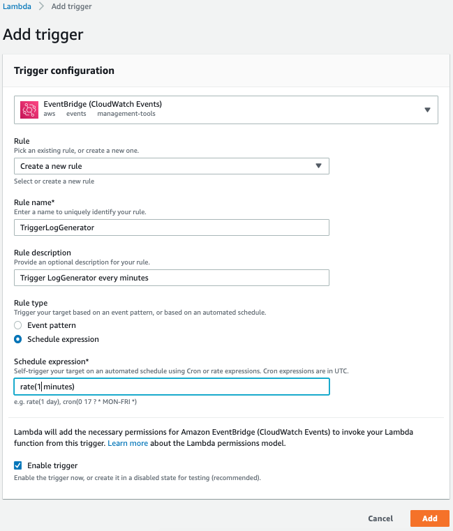

# CloudWatch Logs Insights

CloudWatch Logs Insights enables you to interactively search and analyze your log data in Amazon CloudWatch Logs.

CloudWatch Logs Insights includes a purpose-built query language with a few simple but powerful commands. 

CloudWatch Logs Insights automatically discovers fields in logs from AWS services such as Amazon Route 53, AWS Lambda, AWS CloudTrail, and Amazon VPC, and any application or custom log that emits log events as JSON.

# Create the LogGenerator Lambda

- LogGenerator Lambda code (set the timeout as 10s)

```javascript
exports.handler = async (event) => {
    function gaussianRand() {
      var rand = 0;
 
      for (var i = 0; i < 4; i += 1) {
        rand += Math.random();
      }
 
      return rand / 4;
    }
 
    function gaussianRandom(start, end) {
      return Math.floor(start + gaussianRand() * (end - start + 1));
    }
 
    function guid() {
        function s4() {
            return Math.floor((1 + Math.random()) * 0x10000)
                .toString(16)
                .substring(1);
        }
        return s4() + s4() + '-' + s4() + '-' + s4() + '-' + s4() + '-' + s4() + s4() + s4();
    }

    const accountIds = [
        "123456789012",
        "654624563457",
        "754422245757",
        "940239948572",
        "568850394824",
        "607093287452",
        "600795938547",
        "230230496820",
        "401930510395",
        "306923858185",
        "809493485203",
        "543345678004",
        "634624563450",
        "656422205948",
        "756239093045",
        "534850340023",
        "423093299485",
        "157959388814",
        "730230490958",
        "801930511244",
        "506923858765"
    ];
 
    const paths = [
        "index.html",
        "index.html",
        "index.html",
        "index.html",
        "index.html",
        "index.html",
        "index.html",
        "index.html",
        "index.html",
        "index.html",
        "index.html",
        "index.html",
        "index.html",
        "index.html",
        "index.html",
        "index.html",
        "index.html",
        "index.html",
        "index.html",
        "index.html",
        "admin",
        "admin",
        "login",
        "login",
        "login",
        "login",
        "login",
        "login",
        "login",
        "login"
    ];
 
    const userAgents = [
        "Mozilla/5.0 (Windows NT 10.0; Win64; x64) AppleWebKit/537.36 (KHTML, like Gecko) Chrome/70.0.3538.102 Safari/537.36",
        "Mozilla/5.0 (Macintosh; Intel Mac OS X 10_14_1) AppleWebKit/537.36 (KHTML, like Gecko) Chrome/70.0.3538.77 Safari/537.36",
        "Mozilla/5.001 (windows; U; NT4.0; en-us) Gecko/25250101",
        "Mozilla/5.0 (Macintosh; Intel Mac OS X 10_13_6) AppleWebKit/537.36 (KHTML, like Gecko) Chrome/69.0.3497.100 Safari/537.36",
        "Mozilla/5.0 (Windows NT 10.0; Win64; x64) AppleWebKit/537.36 (KHTML, like Gecko) Chrome/70.0.3538.77 Safari/537.36",
        "Mozilla/5.0 (Windows NT 6.1; Win64; x64) AppleWebKit/537.36 (KHTML, like Gecko) Chrome/70.0.3538.102 Safari/537.36",
        "Mozilla/5.0 (Macintosh; Intel Mac OS X 10_14_0) AppleWebKit/537.36 (KHTML, like Gecko) Chrome/70.0.3538.102 Safari/537.36",
        "Mozilla/5.0 (Macintosh; Intel Mac OS X 10_12_6) AppleWebKit/537.36 (KHTML, like Gecko) Chrome/70.0.3538.77 Safari/537.36",
        "Mozilla/5.0 (X11; Linux x86_64) AppleWebKit/537.36 (KHTML, like Gecko) Chrome/69.0.3497.100 Safari/537.36",
        "Mozilla/5.0 (Macintosh; Intel Mac OS X 10_14_1) AppleWebKit/537.36 (KHTML, like Gecko) Chrome/70.0.3538.102 Safari/537.36",
        "Mozilla/5.0 (Macintosh; Intel Mac OS X 10_12_6) AppleWebKit/537.36 (KHTML, like Gecko) Chrome/70.0.3538.102 Safari/537.36",
        "Boto3/1.9.45 Python/3.7.1 Windows/10 Botocore/1.12.45",
        "Mozilla/5.0 (Macintosh; Intel Mac OS X 10_13_6) AppleWebKit/537.36 (KHTML, like Gecko) Chrome/70.0.3538.77 Safari/537.36",
        "Mozilla/5.0 (Windows NT 10.0; Win64; x64) AppleWebKit/537.36 (KHTML, like Gecko) Chrome/67.0.3396.79 Safari/537.36",
        "Mozilla/5.0 (X11; Linux x86_64) AppleWebKit/537.36 (KHTML, like Gecko) Chrome/70.0.3538.77 Safari/537.36",
        "Mozilla/5.0 (Windows NT 6.1; WOW64) AppleWebKit/537.36 (KHTML, like Gecko) Chrome/69.0.3497.81 Safari/537.36",
        "Mozilla/5.0 (Macintosh; Intel Mac OS X 10.12; rv:63.0) Gecko/20100101 Firefox/63.0",
        "Boto3/1.7.9 Python/3.6.5 Windows/2012ServerR2 Botocore/1.10.9",
        "Mozilla/5.0 (Macintosh; Intel Mac OS X 10_14_0) AppleWebKit/537.36 (KHTML, like Gecko) Chrome/72.0.3610.2 Safari/537.36",
        "Mozilla/5.0 (Macintosh; Intel Mac OS X 10.13; rv:63.0) Gecko/20100101 Firefox/63.0",
        "Mozilla/5.0 (Windows NT 6.1; Win64; x64) AppleWebKit/537.36 (KHTML, like Gecko) Chrome/70.0.3538.77 Safari/537.36",
        "Mozilla/5.0 (X11; Linux x86_64) AppleWebKit/537.36 (KHTML, like Gecko) Chrome/70.0.3538.67 Safari/537.36",
        "Mozilla/5.0 (Macintosh; Intel Mac OS X 10_12_2) AppleWebKit/537.36 (KHTML, like Gecko) Chrome/70.0.3538.77 Safari/537.36",
        "Mozilla/5.0 (Macintosh; Intel Mac OS X 10_14_1) AppleWebKit/537.36 (KHTML, like Gecko) Chrome/69.0.3497.81 Safari/537.36",
        "Mozilla/5.0 (X11; Ubuntu; Linux x86_64; rv:63.0) Gecko/20100101 Firefox/63.0",
        "Mozilla/5.0 (Macintosh; Intel Mac OS X 10_14_0) AppleWebKit/537.36 (KHTML, like Gecko) Chrome/69.0.3497.100 Safari/537.36 OPR/56.0.3051.99",
        "Mozilla/5.0 (Macintosh; Intel Mac OS X 10.14; rv:63.0) Gecko/20100101 Firefox/63.0",
        "Mozilla/5.0 (Macintosh; Intel Mac OS X 10_13_6) AppleWebKit/537.36 (KHTML, like Gecko) Chrome/70.0.3538.102 Safari/537.36",
        "Mozilla/5.0 (X11; Linux x86_64) AppleWebKit/537.36 (KHTML, like Gecko) Chrome/70.0.3538.102 Safari/537.36",
        "Mozilla/5.0 (Macintosh; Intel Mac OS X 10_13_3) AppleWebKit/537.36 (KHTML, like Gecko) Chrome/70.0.3538.77 Safari/537.36",
        "Mozilla/5.0 (Macintosh; Intel Mac OS X 10_14_0) AppleWebKit/537.36 (KHTML, like Gecko) Chrome/70.0.3538.77 Safari/537.36",
        "Mozilla/5.0 (X11; Linux x86_64) AppleWebKit/537.36 (KHTML, like Gecko) Ubuntu Chromium/70.0.3538.77 Chrome/70.0.3538.77 Safari/537.36",
        "Mozilla/5.0 (Macintosh; Intel Mac OS X 10_13_6) AppleWebKit/605.1.15 (KHTML, like Gecko) Version/12.0.1 Safari/605.1.15",
        "Mozilla/5.0 (X11; Linux x86_64) AppleWebKit/537.36 (KHTML, like Gecko) Chrome/68.0.3440.106 Safari/537.36",
        "Mozilla/5.0 (Macintosh; Intel Mac OS X 10_14_1) AppleWebKit/605.1.15 (KHTML, like Gecko) Version/12.0.1 Safari/605.1.15",
        "Mozilla/5.0 (Windows NT 6.1; Win64; x64; rv:60.0) Gecko/20100101 Firefox/60.0",
        "Mozilla/5.0 (Macintosh; Intel Mac OS X 10_13_5) AppleWebKit/605.1.15 (KHTML, like Gecko) Version/11.1.1 Safari/605.1.15",
        "Mozilla/5.0 (Windows NT 10.0; WOW64) AppleWebKit/537.36 (KHTML, like Gecko) Chrome/70.0.3538.102 Safari/537.36",
        "Mozilla/5.0 (Windows NT 10.0; Win64; x64) AppleWebKit/537.36 (KHTML, like Gecko) Chrome/65.0.3325.181 Safari/537.36",
        "Mozilla/5.0 (Macintosh; Intel Mac OS X 10_13_3) AppleWebKit/537.36 (KHTML, like Gecko) Chrome/70.0.3538.102 Safari/537.36",
        "Mozilla/5.0 (Macintosh; Intel Mac OS X 10_14) AppleWebKit/605.1.15 (KHTML, like Gecko) Version/12.0 Safari/605.1.15",
        "Mozilla/5.0 (Macintosh; Intel Mac OS X 10_13_6) AppleWebKit/537.36 (KHTML, like Gecko) Chrome/65.0.3288.0 Safari/537.36",
        "Mozilla/5.0 (Windows NT 10.0; Win64; x64; rv:63.0) Gecko/20100101 Firefox/63.0",
        "Mozilla/5.0 (Macintosh; Intel Mac OS X 10_11_6) AppleWebKit/537.36 (KHTML, like Gecko) Chrome/70.0.3538.77 Safari/537.36",
        "Mozilla/5.0 (Macintosh; Intel Mac OS X 10_13_3) AppleWebKit/604.5.6 (KHTML, like Gecko) Version/11.0.3 Safari/604.5.6"
    ];
 
    const srcIps = [
        "81.14.225.11",
        "11.16.112.15",
        "21.23.15.53",
        "31.153.21.23",
        "41.64.38.53",
        "151.15.31.21",
        "161.23.33.35",
        "271.75.15.6",
        "181.111.125.12",
        "91.5.53.16",
        "101.66.35.10",
        "111.23.35.11",
        "121.35.15.53",
        "181.44.25.1",
        "111.56.12.5",
        "121.43.515.5",
        "131.13.421.3",
        "141.4.28.5",
        "51.25.11.1",
        "61.13.73.3",
        "71.5.55.62",
        "81.11.12.123",
        "191.5.54.165",
        "93.6.36.102",
        "11.3.23.11",
        "21.5.112.131",
        "81.14.225.11",
        "11.16.112.15",
        "21.23.15.53",
        "31.153.21.23",
        "41.64.38.53",
        "151.15.31.21",
        "81.14.225.11",
        "11.16.112.15",
        "21.23.15.53",
        "31.153.21.23",
        "81.14.225.11",
        "11.16.112.15",
        "21.23.15.53",
        "81.14.225.11",
        "11.16.112.15",
        "81.14.225.11",
        "81.14.225.11"
    ];
 
    const hosts = [
        "i-0fad264ff3264f7ff",
        "i-1fbc264fb219023fb",
        "i-2fcb264d111adfcd1",
        "i-3fda264d3a1953fd3",
        "i-4fe0264eaf1954fea",
        "i-5ef1264fbe1955efb",
        "i-6d122641cd1956d1c",
        "i-7c232642dc1957c2d",
        "i-8b342643eb1958b3e",
        "i-9a4526444a1959a44"
    ];
 
    const httpVerbs = [
        "GET",
        "GET",
        "GET",
        "GET",
        "GET",
        "GET",
        "GET",
        "GET",
        "GET",
        "POST"
    ];
 
    const minutes = Math.round(Math.random() * 10) + 1;
 
    const startTime = new Date();
    while (true) {
        if (new Date() - startTime > (minutes * 60 * 1000)) {
            break;
        }
     
        let statusCode = 200;
        let errorMessage = undefined;
     
        const rand = Math.random() * 1000;
     
        if (rand > 996) {
            statusCode = 500;
            errorMessage = "Server failure";
        } else if (rand > 990) {
            statusCode = 404;
            errorMessage = "File not found";
        } else if (rand > 970) {
            statusCode = 400;
            errorMessage = "Bad request";
        }
     
        const hostIndex = Math.floor(Math.random() * hosts.length);
     
        let durationFactor = 1;
        if (hostIndex == 0) {
            durationFactor = 14;
        }
     
        console.log(JSON.stringify({
            accountId: accountIds[Math.floor(Math.random() * accountIds.length)],
            userAgent: userAgents[Math.floor(Math.random() * userAgents.length)],
            srcIp: srcIps[Math.floor(Math.random() * srcIps.length)],
            httpVerb: httpVerbs[Math.floor(Math.random() * httpVerbs.length)],
            path: paths[Math.floor(Math.random() * paths.length)],
            host: hosts[hostIndex],
            requestId: guid(),
            duration: ((gaussianRandom(5000 * durationFactor, 120000 * durationFactor)) / 100) + (10 * hostIndex),
            requestSize: gaussianRandom(100, 1533),
            responseSize: gaussianRandom(543, 54034),
            statusCode: statusCode,
            errorMessage: errorMessage,
            myarrray: {
            items:[
                {account: accountIds[Math.floor(Math.random() * accountIds.length)]},
                {account: accountIds[Math.floor(Math.random() * accountIds.length)]} 
                ]}
        }));
    }
 
    return {
        statusCode: 200
    };
};

```

- Add the EventBridge (CloudWatch Events) as the trigger



## Query on CloudWatch Logs Insights

- log group: `/aws/Lambda/LogGenerator`

CloudWatch Logs Insights automatically discovers fields in logs which data format is JSON.

- Preview
```
fields @timestamp, @message
| sort @timestamp desc
| limit 20
```

- List with with filter
```
filter statusCode = 500
| fields @timestamp, accountId, path, duration
```

- List with filter and sort
```
filter statusCode = 500
| fields @timestamp, accountId, path, duration
| sort duration desc
```

- List with aggregation and sort
```
filter statusCode = 400
| stats max(duration) as d by accountId, path
| sort d desc 
| limit 20
```

- Timeseries
```
filter statusCode = 500
| stats max(duration) as d by bin(1m) 
```

- Percentiles
```
filter statusCode = 500
| stats pct(duration, 99.9) as d by host
| sort d desc
```

- Accessing fields in JSON logs
```
stats count(*) as no_of_events by myarrray.items.0.account 
| display myarrray.items.0.account, no_of_events
```

## More CloudWatch logs Insight

- log message
```json
{
    "EVENT_TIME": "2020-10-20T08:43:43.738852",
    "TICKER": "TBV",
    "PRICE": 29.73
}
```

- Aggregate field in JSON logs
```
filter TICKER like /AMZN/
| stats count(*) as exceptionCount by bin(5m)
| sort exceptionCount desc
```

- Aggregate field in Text logs
```
filter @message like /"TICKER": "TBV"/
| stats count(*) as exceptionCount by bin(5m)
| sort exceptionCount desc
```