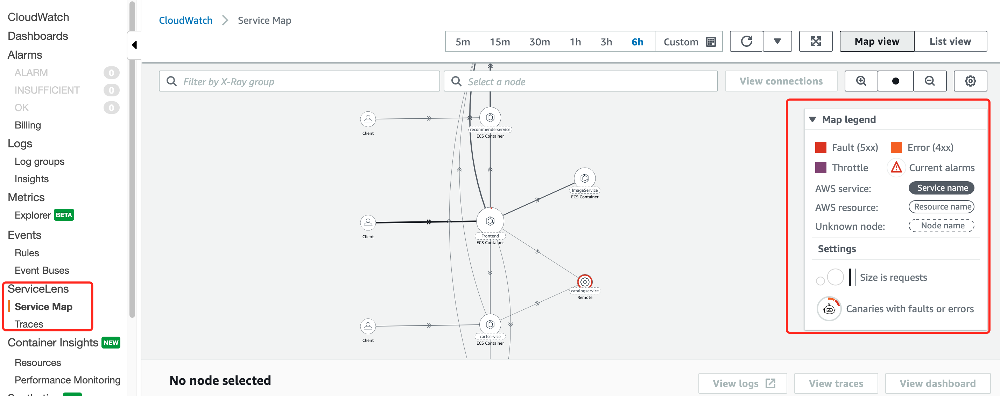
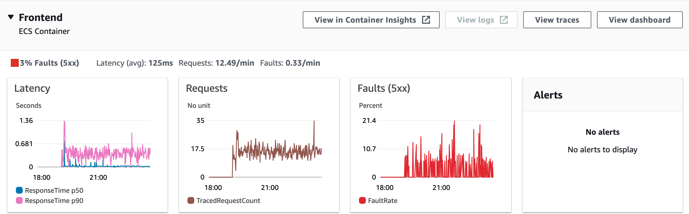
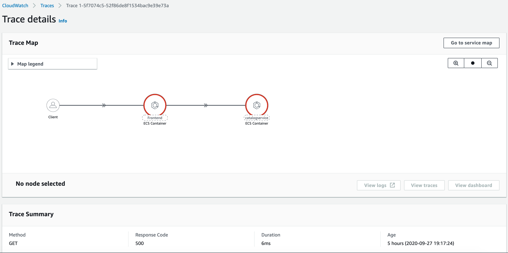

# CloudWatch ServiceLens

CloudWatch ServiceLens enhances the observability of your services and applications by enabling you to integrate traces, metrics, logs, and alarms into one place.

ServiceLens integrates CloudWatch with AWS X-Ray to provide an end-to-end view of your application to help you more efficiently pinpoint performance bottlenecks and identify impacted users. A service map displays your service endpoints and resources as “nodes” and highlights the traffic, latency, and errors for each node and its connections.

