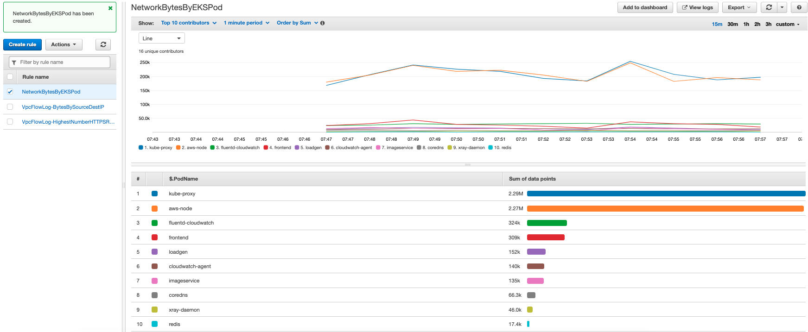

# Contributor Insights

Contributor Insights enables you to analyze log data and create time series that display contributor information. You can check metrics about the top-N contributors, the total number of unique contributors, and their usage.

You create rules that evaluate CloudWatch Logs log events which define the log fields that identify the contributors, such as IpAddress. You can also filter the log data to find and analyze the behavior of individual contributors.

Use cases:
1. Evaluate the number and percentage of impacted customers or resources, e.g. unique count of customers experiencing API faults.
2. Identify top 100 most impacted customers or problematic resources, e.g. top callers experiencing request timeouts or top shards receiving the most bytes.
3. Create on-demand metrics for specific customer or resource, e.g. top calling IP addresses for a customer account being throttled.

The types of logs that Contributor Insights can aggregate:
1. VPC Flow Logs
2. Amazon API Gateway Logs: Execution logging and Access logging
3. CloudWatch Logs

## VPC Flow Log Example
1. Install VPC Flow Logs

```bash
# Trust policy for flow log service
TRUSTPOLICY='{
  "Version": "2012-10-17",
  "Statement": [
    {
      "Sid": "",
      "Effect": "Allow",
      "Principal": {
        "Service": "vpc-flow-logs.amazonaws.com"
      },
      "Action": "sts:AssumeRole"
    }
  ]
}' 

# create cloudwatch logging role for flow logs
aws iam create-role --role-name publishFlowLogs --assume-role-policy-document "$TRUSTPOLICY" \
--region eu-west-1

ROLEARN=$(aws iam get-role --role-name publishFlowLogs --output text --region eu-west-1 | grep publishFlowLogs | awk '{print $2}')

# create cloudwatch logging role for flow logs
aws iam attach-role-policy --role-name publishFlowLogs --policy-arn arn:aws:iam::aws:policy/CloudWatchLogsFullAccess --region eu-west-1


VPCID=$(aws ec2 describe-vpcs --filter "Name=tag:Name,Values=eksctl-observability-workshop-cluster/VPC" --output text --region eu-west-1 | grep VPCS | awk '{print $8}')
echo $VPCID

aws ec2 create-flow-logs \
    --resource-type VPC --resource-ids  $VPCID \
    --traffic-type ALL --log-group-name workshop-flow-logs \
    --deliver-logs-permission-arn $ROLEARN --region eu-west-1

{
    "Unsuccessful": [], 
    "FlowLogIds": [
        "fl-08bbbe96fa2024f11"
    ], 
    "ClientToken": "ChbGo2P5yjXYjz5clj/fYi37SvnN5yt+Z0Sa26yHj90="
}
```

2. VPC Flow Log Contributor Insights Rule Examples

Paste below Syntax to create the example Contributor Insights Rules

- Byte Transfers by Source and Destination IP Address

```json
{
    "Schema": {
        "Name": "CloudWatchLogRule",
        "Version": 1
    },
    "AggregateOn": "Sum",
    "Contribution": {
        "Filters": [],
        "Keys": [
            "srcaddr",
            "dstaddr"
        ],
        "ValueOf": "bytes"
    },
    "LogFormat": "CLF",
    "LogGroupNames": [
        "workshop-flow-logs"
    ],
    "Fields": {
        "4": "srcaddr",
        "5": "dstaddr",
        "10": "bytes"
    }
}
```

- Highest Number of HTTPS Requests

```json
{
    "Schema": {
        "Name": "CloudWatchLogRule",
        "Version": 1
    },
    "LogGroupNames": [
        "workshop-flow-logs"
    ],
    "LogFormat": "CLF",
    "Fields": {
        "5": "destination address",
        "7": "destination port",
        "9": "packet count"
    },
    "Contribution": {
        "Keys": [
            "destination address"
        ],
        "ValueOf": "packet count",
        "Filters": [
            {
                "Match": "destination port",
                "EqualTo": 443
            }
        ]
    },
    "AggregateOn": "Sum"
}
```


- Rejected TCP Connections

```json
{
    "Schema": {
        "Name": "CloudWatchLogRule",
        "Version": 1
    },
    "LogGroupNames": [
        "workshop-flow-logs"
    ],
    "LogFormat": "CLF",
    "Fields": {
        "3": "interfaceID",
        "4": "sourceAddress",
        "8": "protocol",
        "13": "action"
    },
    "Contribution": {
        "Keys": [
            "interfaceID",
            "sourceAddress"
        ],
        "Filters": [
            {
                "Match": "protocol",
                "EqualTo": 6
            },
            {
                "Match": "action",
                "In": [
                    "REJECT"
                ]
            }
        ]
    },
    "AggregateOn": "Sum"
}
```

## Create a Contributor Insights Rule for your EKS

Paste below Syntax to create the example Contributor Insights Rules

- NetworkBytesByEKSPod

```bash
{
    "Schema": {
        "Name": "CloudWatchLogRule",
        "Version": 1
    },
    "LogGroupNames": [
        "/aws/containerinsights/observability-workshop/performance"
    ],
    "LogFormat": "JSON",
    "Contribution": {
        "Keys": [
            "$.PodName"
        ],
        "ValueOf": "$.pod_interface_network_total_bytes",
        "Filters": []
    },
    "AggregateOn": "Sum"
}
```


