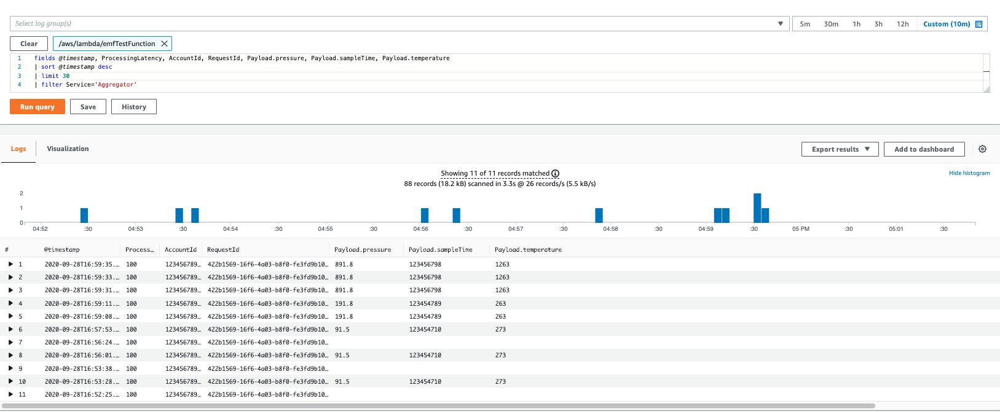

# CloudWatch embedded metric format

The CloudWatch embedded metric format enables you to ingest complex high-cardinality application data in logs and to generate actionable metrics from them. 

You can embed custom metrics alongside detailed log event data, and CloudWatch automatically extracts the custom metrics from logs, so that you can visualize and alarm on them, for real-time incident detection. 

Additionally, the detailed log events associated with the extracted metrics can be queried using CloudWatch Logs Insights to provide deep insights into the root causes of operational events.

You can generate your logs using a client library [Using the Client Libraries to Generate Embedded Metric Format Logs](https://docs.aws.amazon.com/AmazonCloudWatch/latest/monitoring/CloudWatch_Embedded_Metric_Format_Libraries.html)

You can manually construct the logs and submit them using the ‘PutLogEvents’ API or the CloudWatch agent.

## Create CloudWatch embedded metric format example
1. Create the lambda function `emfTestFunction` using runtime as NodeJS 12.x
```bash
mkdir emfTestFunction
cd emfTestFunction
npm init
npm install aws-embedded-metrics
```

- index.js

```javascript
const { metricScope } = require("aws-embedded-metrics");

const aggregator = metricScope(metrics => async event => {
  console.log("received message");
  console.log(event.payload);
  console.log(event.payload.sampleTime);
  metrics.putDimensions({ Service: "Aggregator" });
  metrics.putMetric("ProcessingLatency", 100, "Milliseconds");
  metrics.setProperty("AccountId", "123456789012");
  metrics.setProperty("RequestId", "422b1569-16f6-4a03-b8f0-fe3fd9b100f8");
  metrics.setProperty("DeviceId", "61270781-c6ac-46f1-baf7-22c808af8162");
  metrics.setProperty("Payload", {
    sampleTime: event.payload.sampleTime,
    temperature: event.payload.temperature,
    pressure: event.payload.pressure
  });
  console.log("completed aggregation successfully.");
});

exports.handler = aggregator;

```

```bash
zip -r lambda.zip *
aws lambda update-function-code --function-name emfTestFunction \
--zip-file fileb://lambda.zip --region eu-west-1

aws lambda invoke --function-name emfTestFunction \
--payload '{ "payload": {"sampleTime": 123454710,"temperature": 273.0,"pressure": 91.5}}' \
response.json --log-type Tail --query 'LogResult' --output text --region eu-west-1 |  base64 -d

2020-09-28T08:57:53.110Z        351e4fd2-7824-4afc-a11c-ec3552868db2    INFO    received message
2020-09-28T08:57:53.110Z        351e4fd2-7824-4afc-a11c-ec3552868db2    INFO    { sampleTime: 123454710, temperature: 273, pressure: 91.5 }
2020-09-28T08:57:53.110Z        351e4fd2-7824-4afc-a11c-ec3552868db2    INFO    123454710
2020-09-28T08:57:53.110Z        351e4fd2-7824-4afc-a11c-ec3552868db2    INFO    completed aggregation successfully.
```

## Check the Customer CloudWatch Metrics

```javascript
metrics.putDimensions({ Service: "Aggregator" });
metrics.putMetric("ProcessingLatency", 100, "Milliseconds");
```

Navigate to CloudWatch and click ‘Metrics’ -> ‘aws-embedded-metrics’ box under ‘Custom Namespaces’. 


Upon clicking `aws-embedded-metrics`


## CloudWatch Log Insights query

Navigate to CloudWatch Log Insights and select the ‘Log Group’ that starts with ‘/aws/lambda/emfTestFunction’ and ‘Run Query’ of below SQL
```sql
fields @timestamp, ProcessingLatency, AccountId, RequestId, Payload.pressure, Payload.sampleTime, Payload.temperature
| sort @timestamp desc
| limit 20
| filter Service='Aggregator'
```

