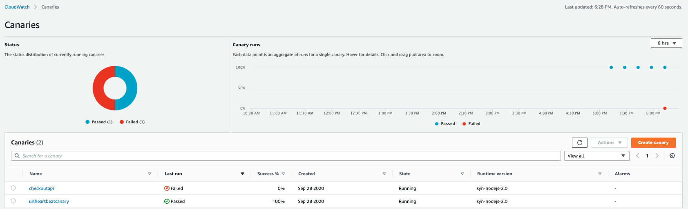
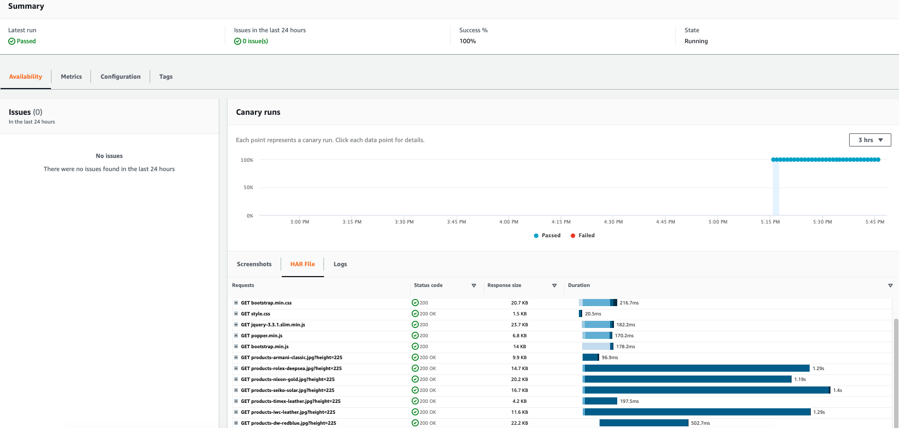

# Sythentic Canary tests

Use CloudWatch Synthetics to monitor complete transactions for broken or dead links, step by step task completions, page load errors, load latencies for UI assets, and more complex wizard flows, or checkout flows.

The steps to create the Sythentic Canary tests

1. Create a canary
2. Set thresholds
3. View Canary details

## Create a canary

- choose `Use a blueprint` -> `Heartbeat monitoring`
    - Name: urlheartbeatcanary
    - URL: EKS `AnyCompany Shop` frontend URL
    - Schedule:`Run continuously and once per 1 minutes`
    - Access permissions: `Create a new role`

- choose `Use a blueprint` -> `API Canary`
    - Name: checkoutapi
    - Methd: POST
    - URL: EKS `AnyCompany Shop` frontend URL, append /cart/checkout
    - Header: Content-Type:application/x-www-form-urlencoded; Accept:text/html,application/xhtml+xml,application/xml
    - Data: 
    ```
    "name":"ray",
    "email":"ray@example.com",
    "address":"123+Main+Street",
    "country":"United+States",
    "state":"Nevada",
    "zip":"ABC",
    "city":"NYC",
    "paymentMethod":"AmazonPay"
    ```
    - Schedule:`Run continuously and once per 1 minutes`
    - Access permissions: `existing role` - the role created by `urlheartbeatcanary`

View Canary details





## Customer script
1. You can modify the canary lambda script

2. You can create the lambda script from scrach

sample script:

```javascript
var synthetics = require('Synthetics');
const log = require('SyntheticsLogger');

const flowBuilderBlueprint = async function () {
    // INSERT URL here
    let url = "";

    let page = await synthetics.getPage();

    // Navigate to the initial url
    await synthetics.executeStep('navigateToUrl', async function (timeoutInMillis = 30000) {
        await page.goto(url, {waitUntil: ['load', 'networkidle0'], timeout: timeoutInMillis});
    });

    // Execute customer steps
    await synthetics.executeStep('customerActions', async function () {
        //Wait for element with ID 'id123' 
        await page.waitForSelector("id123", { timeout: 30000 });
        
        //Click element with ID 'id123'
        await page.click("id123");
        try {
            await synthetics.takeScreenshot("click", 'result');
        } catch(ex) {
            synthetics.addExecutionError('Unable to capture screenshot.', ex);
        }

        //Wait for element with ID 'id456'
        await page.waitForSelector("id456", { timeout: 30000 });
        try {
            await synthetics.takeScreenshot("verifySelector", 'result');
        } catch(ex) {
            synthetics.addExecutionError('Unable to capture screenshot.', ex);
        }

        //Type 'Test' in textbox with ID 'id789'
        await page.type("id789", "Test");
        try {
            await synthetics.takeScreenshot("input", 'result');
        } catch(ex) {
            synthetics.addExecutionError('Unable to capture screenshot.', ex);
        }


    });
};

exports.handler = async () => {
    return await flowBuilderBlueprint();
};

```
