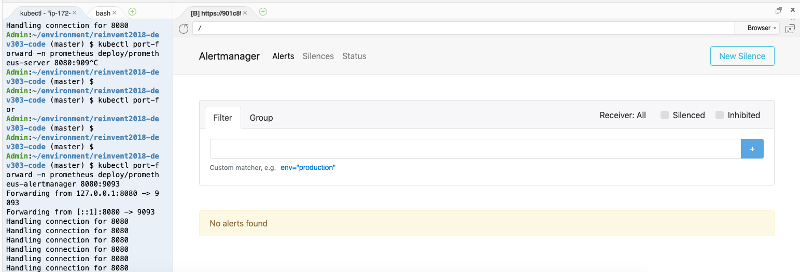
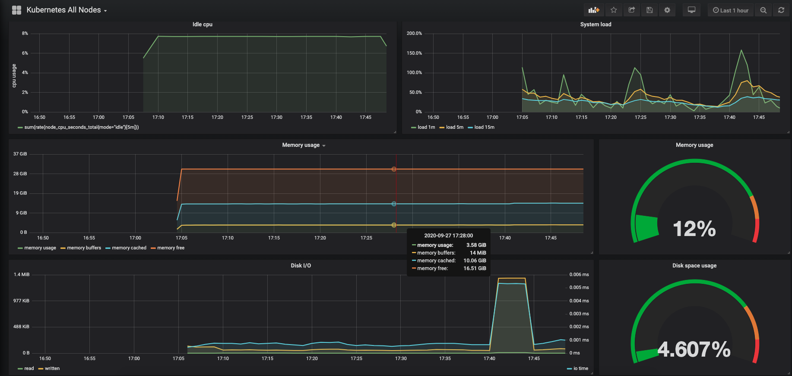
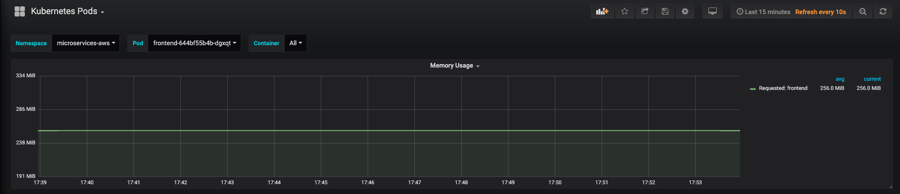

# Configure the Observability

Observability including the monitor metrics and container logs

## Appoarch 1: Observability for Amazon EKS using Amazon CloudWatch Container Insights

Follow up the [CloudWatch Container Insights documentation](https://docs.aws.amazon.com/AmazonCloudWatch/latest/monitoring/deploy-container-insights-EKS.html)

1. Quick Start Setup for Container Insights on Amazon EKS
```bash
AWS_REGION=eu-west-1
# Get the nodegroup (assuming there is only 1 nodegroup at this point)
NODEGROUP=$(eksctl get nodegroups --cluster=observability-workshop --region=$AWS_REGION | awk '{print $2}' | tail -n1)
echo $NODEGROUP
# Get EKS worker node IAM instance role ARN
PROFILE=$(aws ec2 describe-instances --filters Name=tag:Name,Values=observability-workshop-$NODEGROUP-Node --query 'Reservations[0].Instances[0].IamInstanceProfile.Arn' --output text --region=$AWS_REGION | cut -d '/' -f 2)
echo $PROFILE
# Fetch IAM instance role name
ROLE=$(aws iam get-instance-profile --instance-profile-name $PROFILE --query "InstanceProfile.Roles[0].RoleName" --output text --region=$AWS_REGION)
echo $ROLE # Print role name

aws iam attach-role-policy --role-name $ROLE --policy-arn arn:aws:iam::aws:policy/CloudWatchLogsFullAccess --region eu-west-1

curl https://raw.githubusercontent.com/aws-samples/amazon-cloudwatch-container-insights/master/k8s-yaml-templates/quickstart/cwagent-fluentd-quickstart.yaml | sed "s/{{cluster_name}}/observability-workshop/;s/{{region_name}}/eu-west-1/" | kubectl apply -f -

namespace/amazon-cloudwatch created
serviceaccount/cloudwatch-agent created
clusterrole.rbac.authorization.k8s.io/cloudwatch-agent-role created
clusterrolebinding.rbac.authorization.k8s.io/cloudwatch-agent-role-binding created
configmap/cwagentconfig created
daemonset.apps/cloudwatch-agent created
configmap/cluster-info created
serviceaccount/fluentd created
clusterrole.rbac.authorization.k8s.io/fluentd-role created
clusterrolebinding.rbac.authorization.k8s.io/fluentd-role-binding created
configmap/fluentd-config created
daemonset.apps/fluentd-cloudwatch created

# curl https://raw.githubusercontent.com/aws-samples/amazon-cloudwatch-container-insights/latest/k8s-deployment-manifest-templates/deployment-mode/daemonset/container-insights-monitoring/quickstart/cwagent-fluentd-quickstart.yaml | sed "s/{{cluster_name}}/observability-workshop/;s/{{region_name}}/eu-west-1/" | kubectl apply -f -
```


2. Set Up the CloudWatch Agent to Collect Cluster Metrics
```bash
# Create a Namespace for CloudWatch
kubectl apply -f https://raw.githubusercontent.com/aws-samples/amazon-cloudwatch-container-insights/latest/k8s-deployment-manifest-templates/deployment-mode/daemonset/container-insights-monitoring/cloudwatch-namespace.yaml
# Create a Service Account in the Cluster
kubectl apply -f https://raw.githubusercontent.com/aws-samples/amazon-cloudwatch-container-insights/latest/k8s-deployment-manifest-templates/deployment-mode/daemonset/container-insights-monitoring/cwagent/cwagent-serviceaccount.yaml
# Create a ConfigMap for the CloudWatch Agent
curl -O https://raw.githubusercontent.com/aws-samples/amazon-cloudwatch-container-insights/latest/k8s-deployment-manifest-templates/deployment-mode/daemonset/container-insights-monitoring/cwagent/cwagent-configmap.yaml
sed "s/{{cluster_name}}/observability-workshop/;s/{{region_name}}/eu-west-1/"
kubectl apply -f cwagent-configmap.yaml
# Deploy the CloudWatch Agent as a DaemonSet
curl -O  https://raw.githubusercontent.com/aws-samples/amazon-cloudwatch-container-insights/latest/k8s-deployment-manifest-templates/deployment-mode/daemonset/container-insights-monitoring/cwagent/cwagent-daemonset.yaml
# Uncomment the port section in the cwagent-daemonset.yaml file
kubectl apply -f cwagent-daemonset.yaml
kubectl get pods -n amazon-cloudwatch
NAME                       READY   STATUS    RESTARTS   AGE
cloudwatch-agent-bfwnn     1/1     Running   0          6s
cloudwatch-agent-bldz2     1/1     Running   0          29s
cloudwatch-agent-ds27z     1/1     Running   0          21s
cloudwatch-agent-sfkq8     1/1     Running   0          43s
```
3. Set Up FluentD as a DaemonSet to Send Logs to CloudWatch Logs
```bash
# Install FluentD
kubectl create configmap cluster-info \
--from-literal=cluster.name=observability-workshop \
--from-literal=logs.region=eu-west-1 -n amazon-cloudwatch
# deploy the FluentD DaemonSet
kubectl apply -f https://raw.githubusercontent.com/aws-samples/amazon-cloudwatch-container-insights/latest/k8s-deployment-manifest-templates/deployment-mode/daemonset/container-insights-monitoring/fluentd/fluentd.yaml
# Validate the deployment
kubectl get pods -n amazon-cloudwatch
NAME                       READY   STATUS    RESTARTS   AGE
cloudwatch-agent-bfwnn     1/1     Running   0          4m48s
cloudwatch-agent-bldz2     1/1     Running   0          5m11s
cloudwatch-agent-ds27z     1/1     Running   0          5m3s
cloudwatch-agent-sfkq8     1/1     Running   0          5m25s
fluentd-cloudwatch-28qqc   1/1     Running   0          68s
fluentd-cloudwatch-6dhrz   1/1     Running   0          81s
fluentd-cloudwatch-n25lq   1/1     Running   0          99s
fluentd-cloudwatch-sk9dk   1/1     Running   0          108s

# To verify the FluentD setup for Container Insights
The list of log groups should be created in CloudWatch Logs
/aws/containerinsights/Cluster_Name/application
/aws/containerinsights/Cluster_Name/host
/aws/containerinsights/Cluster_Name/dataplane
/aws/containerinsights/Cluster_Name/performance
```


4. Optional: Set Up Amazon EKS Control Plane Logging
5. Optional: Enable App Mesh Envoy Access Logs
6. Updating or Deleting Container Insights on Amazon EKS and Kubernetes
```bash
curl https://raw.githubusercontent.com/aws-samples/amazon-cloudwatch-container-insights/master/k8s-yaml-templates/quickstart/cwagent-fluentd-quickstart.yaml | sed "s/{{cluster_name}}/observability-workshop/;s/{{region_name}}/eu-west-1/" | kubectl delete -f -

#curl https://raw.githubusercontent.com/aws-samples/amazon-cloudwatch-container-insights/latest/k8s-deployment-manifest-templates/deployment-mode/daemonset/container-insights-monitoring/quickstart/cwagent-fluentd-quickstart.yaml | sed "s/{{cluster_name}}/observability-workshop/;s/{{region_name}}/eu-west-1/" | kubectl delete -f -
```

## Appoarch 2: Observability for Amazon EKS using FluentBit, Prometheus, Grafana

1. [Logging with Elasticsearch, Fluent Bit, and Kibana](https://www.eksworkshop.com/intermediate/230_logging/)

2. [Health and Performance Monitoring using Prometheus and Grafana](https://www.eksworkshop.com/intermediate/240_monitoring/)

- Installing helm
```bash
# Check helm has been installed
helm version --client
# Install helm guide
curl "https://raw.githubusercontent.com/kubernetes/helm/master/scripts/get" > get_helm.sh
chmod +x get_helm.sh
./get_helm.sh
```

- Set up the helm tiller on your cluster
```bash
# Create service account
kubectl -n kube-system create serviceaccount tiller
# Create cluster wide role binding
kubectl create clusterrolebinding tiller --clusterrole cluster-admin --serviceaccount=kube-system:tiller
# Init helm with service account from above
helm init --service-account=tiller
# Wait a few seconds for tiller to become ready
helm ls # This should not return any output when successful.
echo $? # Should be 0
```

- Deploy Prometheus
```bash
kubectl create namespace prometheus
helm repo add prometheus-community https://prometheus-community.github.io/helm-charts
helm repo add stable https://kubernetes-charts.storage.googleapis.com/
helm repo update

helm install -f deploy/prometheus/prometheus-values.yaml prometheus-community/prometheus --name prometheus --namespace prometheus

kubectl get all -n prometheus

NAME                                                 READY   STATUS    RESTARTS   AGE
pod/prometheus-alertmanager-9cd5ff84c-h677p          2/2     Running   0          104s
pod/prometheus-kube-state-metrics-6df5d44568-rzqsb   1/1     Running   0          104s
pod/prometheus-node-exporter-7kdj9                   1/1     Running   0          104s
pod/prometheus-node-exporter-kfl5z                   1/1     Running   0          104s
pod/prometheus-node-exporter-kxs79                   1/1     Running   0          104s
pod/prometheus-node-exporter-srz8r                   1/1     Running   0          104s
pod/prometheus-pushgateway-d5cdd57c9-xgg8h           1/1     Running   0          104s
pod/prometheus-server-6cc8697866-dsp79               2/2     Running   0          104s

NAME                                    TYPE        CLUSTER-IP       EXTERNAL-IP   PORT(S)    AGE
service/prometheus-alertmanager         ClusterIP   10.100.181.137   <none>        80/TCP     105s
service/prometheus-kube-state-metrics   ClusterIP   10.100.99.30     <none>        8080/TCP   105s
service/prometheus-node-exporter        ClusterIP   None             <none>        9100/TCP   105s
service/prometheus-pushgateway          ClusterIP   10.100.146.16    <none>        9091/TCP   105s
service/prometheus-server               ClusterIP   10.100.73.66     <none>        80/TCP     105s

NAME                                      DESIRED   CURRENT   READY   UP-TO-DATE   AVAILABLE   NODE SELECTOR   AGE
daemonset.apps/prometheus-node-exporter   4         4         4       4            4           <none>          105s

NAME                                            READY   UP-TO-DATE   AVAILABLE   AGE
deployment.apps/prometheus-alertmanager         1/1     1            1           105s
deployment.apps/prometheus-kube-state-metrics   1/1     1            1           105s
deployment.apps/prometheus-pushgateway          1/1     1            1           105s
deployment.apps/prometheus-server               1/1     1            1           105s

NAME                                                       DESIRED   CURRENT   READY   AGE
replicaset.apps/prometheus-alertmanager-9cd5ff84c          1         1         1       105s
replicaset.apps/prometheus-kube-state-metrics-6df5d44568   1         1         1       105s
replicaset.apps/prometheus-pushgateway-d5cdd57c9           1         1         1       105s
replicaset.apps/prometheus-server-6cc8697866               1         1         1       105s

# Get the Prometheus server URL
kubectl port-forward -n prometheus deploy/prometheus-server 8080:9090

Cloud9 environment, click Tools / Preview / Preview Running Application append path `/targets`

# Get the alertmanager server URL
kubectl port-forward -n prometheus deploy/prometheus-alertmanager 8080:9093

Cloud9 environment, click Tools / Preview / Preview Running Application
```




- Deploy Grafana
```bash
kubectl create namespace grafana
helm repo add grafana https://grafana.github.io/helm-charts
helm repo update

helm install -f deploy/prometheus/grafana-values.yaml grafana/grafana --name grafana --namespace grafana

kubectl get all -n grafana

# Get the grafana URL
kubectl get svc -n grafana grafana -o jsonpath='{.status.loadBalancer.ingress[0].hostname}'

# Get the admin password
kubectl get secret --namespace grafana grafana -o jsonpath="{.data.admin-password}" | base64 --decode ; echo
```

Open the grafana url and input the admin and password

Import the dashboard to monitor cluter by `Paste the JSON contents from the file deploy/monitoring/cluster-dashboard.json` into the input field.




Import the dashboard to monitor all pods by `Paste the JSON contents from the file deploy/monitoring/pod-dashboard.json` into the input field.





- Deploy prometheus-operator

You can use the The prometheus-operator will deploy prometheus, controller, kube-state-metrics, alertmanager, grafana

```bash
kubectl create namespace prometheus
helm repo add prometheus-community https://prometheus-community.github.io/helm-charts
helm repo add stable https://kubernetes-charts.storage.googleapis.com/
helm repo update

helm install -f deploy/prometheus/prometheus-values.yaml prometheus-community/kube-prometheus-stack --name kube-prometheus-stack --namespace prometheus

kubectl get all -n prometheus

NAME                                                           READY   STATUS    RESTARTS   AGE
pod/alertmanager-kube-prometheus-stack-alertmanager-0          2/2     Running   0          13m
pod/kube-prometheus-stack-grafana-8678c89c49-mtbrt             2/2     Running   0          13m
pod/kube-prometheus-stack-kube-state-metrics-bbf56d7f5-7lx59   1/1     Running   0          13m
pod/kube-prometheus-stack-operator-6dc46fb7fb-7k4v9            2/2     Running   0          13m
pod/kube-prometheus-stack-prometheus-node-exporter-6lfbc       1/1     Running   0          13m
pod/kube-prometheus-stack-prometheus-node-exporter-7cbq9       1/1     Running   0          13m
pod/kube-prometheus-stack-prometheus-node-exporter-lgmxd       1/1     Running   0          13m
pod/kube-prometheus-stack-prometheus-node-exporter-s8f9z       1/1     Running   0          13m
pod/prometheus-kube-prometheus-stack-prometheus-0              3/3     Running   1          13m

NAME                                                     TYPE        CLUSTER-IP       EXTERNAL-IP   PORT(S)                      AGE
service/alertmanager-operated                            ClusterIP   None             <none>        9093/TCP,9094/TCP,9094/UDP   13m
service/kube-prometheus-stack-alertmanager               ClusterIP   10.100.21.220    <none>        9093/TCP                     13m
service/kube-prometheus-stack-grafana                    ClusterIP   10.100.177.126   <none>        80/TCP                       13m
service/kube-prometheus-stack-kube-state-metrics         ClusterIP   10.100.129.131   <none>        8080/TCP                     13m
service/kube-prometheus-stack-operator                   ClusterIP   10.100.56.64     <none>        8080/TCP,443/TCP             13m
service/kube-prometheus-stack-prometheus                 ClusterIP   10.100.30.136    <none>        9090/TCP                     13m
service/kube-prometheus-stack-prometheus-node-exporter   ClusterIP   10.100.250.239   <none>        9100/TCP                     13m
service/prometheus-operated                              ClusterIP   None             <none>        9090/TCP                     13m

NAME                                                            DESIRED   CURRENT   READY   UP-TO-DATE   AVAILABLE   NODE SELECTOR   AGE
daemonset.apps/kube-prometheus-stack-prometheus-node-exporter   4         4         4       4            4           <none>          13m

NAME                                                       READY   UP-TO-DATE   AVAILABLE   AGE
deployment.apps/kube-prometheus-stack-grafana              1/1     1            1           13m
deployment.apps/kube-prometheus-stack-kube-state-metrics   1/1     1            1           13m
deployment.apps/kube-prometheus-stack-operator             1/1     1            1           13m

NAME                                                                 DESIRED   CURRENT   READY   AGE
replicaset.apps/kube-prometheus-stack-grafana-8678c89c49             1         1         1       13m
replicaset.apps/kube-prometheus-stack-kube-state-metrics-bbf56d7f5   1         1         1       13m
replicaset.apps/kube-prometheus-stack-operator-6dc46fb7fb            1         1         1       13m

NAME                                                               READY   AGE
statefulset.apps/alertmanager-kube-prometheus-stack-alertmanager   1/1     13m
statefulset.apps/prometheus-kube-prometheus-stack-prometheus       1/1     13m

kubectl --namespace prometheus get pods -l "release=kube-prometheus-stack"
NAME                                                   READY   STATUS    RESTARTS   AGE
kube-prometheus-stack-operator-6dc46fb7fb-7k4v9        2/2     Running   0          14m
kube-prometheus-stack-prometheus-node-exporter-6lfbc   1/1     Running   0          14m
kube-prometheus-stack-prometheus-node-exporter-7cbq9   1/1     Running   0          14m
kube-prometheus-stack-prometheus-node-exporter-lgmxd   1/1     Running   0          14m
kube-prometheus-stack-prometheus-node-exporter-s8f9z   1/1     Running   0          14m

# Get the Prometheus server URL
kubectl port-forward -n prometheus service/kube-prometheus-stack-prometheus 8080:9090
# open URL
Cloud9 environment, click Tools / Preview / Preview Running Application append path `/targets`

# Get the alertmanager server URL
kubectl port-forward -n prometheus service/kube-prometheus-stack-alertmanager 8080:9093
# Get the admin password
kubectl get secret --namespace prometheus alertmanager-kube-prometheus-stack-alertmanager -o jsonpath="{.data.admin-password}" | base64 --decode ; echo
# open URL
Cloud9 environment, click Tools / Preview / Preview Running Application

# Get the grafana URL
kubectl port-forward -n prometheus service/kube-prometheus-stack-grafana 8080:80
# Get the admin password
kubectl get secret --namespace prometheus kube-prometheus-stack-grafana -o jsonpath="{.data.admin-password}" | base64 --decode ; echo
# open URL
Open Cloud9 URL append path `/login` in a new browser tab
```

