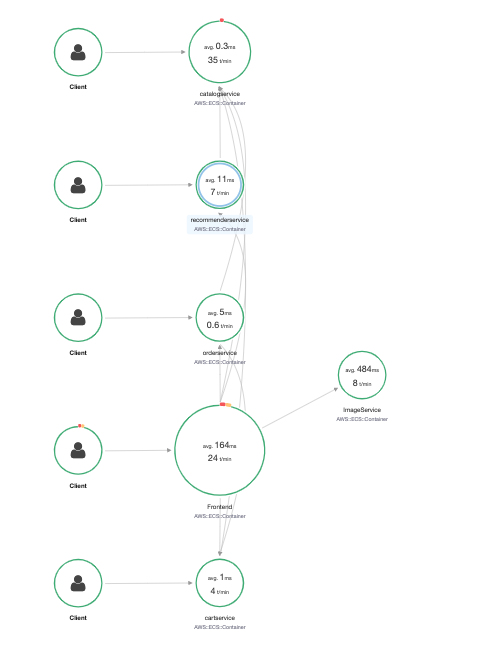

# Distributed Tracing with AWS X-Ray

## IAM permissions for worker nodes

```bash
eksctl utils associate-iam-oidc-provider --cluster observability-workshop --approve --region eu-west-1

eksctl create iamserviceaccount --name xray-daemon --namespace microservices-aws \
--cluster observability-workshop \
--attach-policy-arn arn:aws:iam::aws:policy/AWSXRayDaemonWriteAccess \
--attach-policy-arn arn:aws:iam::aws:policy/CloudWatchAgentServerPolicy \
--approve --region eu-west-1
```

**Deprecated**:
```bash
# Get the nodegroup (assuming there is only 1 nodegroup at this point)
NODEGROUP=$(eksctl get nodegroups --cluster=observability-workshop | awk '{print $2}' | tail -n1)

# Get EKS worker node IAM instance role ARN
PROFILE=$(aws ec2 describe-instances --filters Name=tag:Name,Values=observability-workshop-$NODEGROUP-Node --query 'Reservations[0].Instances[0].IamInstanceProfile.Arn' --output text | cut -d '/' -f 2)

ROLE=$(aws iam get-instance-profile --instance-profile-name $PROFILE --query "InstanceProfile.Roles[0].RoleName" --output text)

echo $ROLE

# Attach IAM policy to enable AWS X-Ray access
aws iam attach-role-policy --role-name $ROLE --policy-arn arn:aws:iam::aws:policy/AWSXRayDaemonWriteAccess

# Attach IAM policy to enable AWS CloudWatch Container Insight
aws iam attach-role-policy --role-name $ROLE --policy-arn arn:aws:iam::aws:policy/CloudWatchAgentServerPolicy
```

## Deploy AWS X-Ray daemonset
```bash
kubectl apply -f deploy/tracing/
kubectl get pods -l app=xray-daemon -n microservices-aws

NAME                READY   STATUS    RESTARTS   AGE
xray-daemon-6zcsl   1/1     Running   0          93s
xray-daemon-gcq9x   1/1     Running   0          93s
xray-daemon-tgswz   1/1     Running   0          93s
xray-daemon-zdzwv   1/1     Running   0          93s
```

## Adding X-Ray to the microservices

### Using pre-built containers (Easy)
When you use the pre-built container images, all the necessary instrumentation is already enabled.

### Instrumenting application code (Informative)
Follow up the guide https://github.com/aws-samples/reinvent2018-dev303-code/blob/master/docs/lab3.md#b-instrumenting-application-code-informative

### check the tracing




## Adding Chaos

To see how AWS X-Ray helps understand end user impact. 

Deploy a Pod that will randomly kill one of the services, which are part of the eCommerce application. 

```bash
kubectl get pods -n microservices-aws
```

Every 2 - 5 Minutes a randomly selected service will be killed.  Kubernetes will detect the failure and will automatically re-spawn the container. Still, some requests will fail and end users will see an impact. This impact will be visible within AWS X-Ray.

```bash
kubectl apply -f deploy/eks/randomizer.yaml
kubectl get pods -l app=randomizer -n microservices-aws
```


To stop generating chaos within your application simply delete the generator with the command

```bash
kubectl delete -f deploy/eks/randomizer.yaml
```