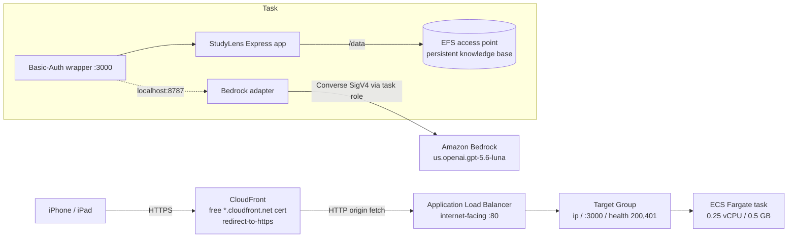

# StudyLens on ECS Fargate + EFS + ALB + CloudFront (keyless Bedrock)

Deploy a stateful single-container Node app ([`studylens`](https://www.npmjs.com/package/studylens))
to AWS as a **fully-managed (免运维), low-cost, phone/iPad-friendly** service with:

- **Persistent storage** on EFS (StudyLens keeps its knowledge base as JSON files on the local FS — no DB),
- **A trusted HTTPS URL with no domain / no ACM cert** (CloudFront's free `*.cloudfront.net` cert),
- **Keyless LLM access**: an in-container adapter translates the app's OpenAI-compatible calls to
  **Amazon Bedrock Converse** (`us.openai.gpt-5.6-luna`) using the ECS **task IAM role** — no API key stored anywhere,
- **HTTP Basic-Auth** in front (the app ships no auth of its own).

This directory is a reusable pattern; it happens to wrap StudyLens but applies to any stateful,
local-filesystem, OpenAI-compatible container.

## Architecture



Why these choices:

- **ECS Fargate, not App Runner.** App Runner **cannot mount EFS**
  ([apprunner-roadmap #14](https://github.com/aws/apprunner-roadmap/issues/14)) and stops accepting new
  customers 2026-04-30. A local-filesystem app on App Runner loses all data on every restart. Fargate mounts EFS natively.
- **CloudFront for HTTPS.** With no registered domain, an ALB alone only yields untrusted
  `http://*.elb.amazonaws.com` — Basic-Auth over plain HTTP would leak the password. Every CloudFront
  distribution gets a free trusted cert, so `https://xxxx.cloudfront.net` works on iOS and "Add to Home Screen".
- **Keyless Bedrock adapter.** StudyLens only speaks OpenAI `/v1/chat/completions`. `app/bedrock-openai-adapter.js`
  exposes that shape on `localhost:8787` and forwards to Bedrock `Converse` via the task role. `openai.gpt-5.6-luna`
  requires an **inference profile** (`us.openai.gpt-5.6-luna`) — the bare model id is rejected for on-demand.

## Files

| Path | What it is |
|---|---|
| `app/Dockerfile` | `node:20-slim` wrapping `studylens@0.1.8` (portal SPA is prebuilt in the tarball) + the AWS SDK for the adapter |
| `app/server.js` | HTTP Basic-Auth gate composed in front of the StudyLens Express app |
| `app/bedrock-openai-adapter.js` | OpenAI `/v1/chat/completions` → Bedrock `Converse` shim (SigV4/IAM, no key) |
| `app/entrypoint.sh` | Ensures `/data` dirs, seeds `llm-config.json` on first boot only, starts adapter then app |
| `app/buildspec.yml` | CodeBuild spec: ECR login → `docker build` → push `:latest` |
| `terraform/` | Full IaC reproducing the live stack (EFS, IAM, ECS, ALB, CloudFront) |

## Deploy — build the image (CodeBuild, no local Docker needed)

The gateway host had no Docker access, so the image is built by CodeBuild.

```bash
# 1. ECR repo
aws ecr create-repository --repository-name studylens --region us-east-1

# 2. Zip app/ (Dockerfile + server.js + bedrock-openai-adapter.js + entrypoint.sh + buildspec.yml)
#    and upload to an S3 bucket the CodeBuild role can read.
zip -j source.zip app/*
aws s3 cp source.zip s3://<your-bucket>/studylens-build/source.zip

# 3. A CodeBuild project (privileged Linux, amazonlinux2-x86_64-standard:5.0) with env ECR_URI,
#    service role allowing ecr:* on the repo + logs + s3:GetObject on the source, then:
aws codebuild start-build --project-name studylens-build
# -> pushes <acct>.dkr.ecr.us-east-1.amazonaws.com/studylens:latest
```

## Deploy — infrastructure (Terraform)

```bash
cd terraform
cp terraform.tfvars.example terraform.tfvars   # fill image_uri; keep the password out of git
export TF_VAR_basic_auth_pass='<your-password>'

terraform init
terraform apply
terraform output public_url    # https://xxxx.cloudfront.net  (add to Home Screen)
```

The Terraform module creates: EFS filesystem + access point (uid/gid 1000, `/studylens`) + one mount
target per supported AZ; task SG (NFS self + 3000 from ALB) and ALB SG (80 in); the task execution role
(`AmazonECSTaskExecutionRolePolicy`) and task role (Bedrock `InvokeModel`/`Converse`); a CloudWatch log
group; the ECS cluster, task definition (EFS volume at `/data`), and service (1 task, public IP); the ALB
+ target group + HTTP listener; and the CloudFront distribution with the managed *CachingDisabled* +
*AllViewerExceptHostHeader* policies.

> **AZ note (this account):** ECS/ALB reject `use1-az3/az5/az6`. `supported_azs` defaults to
> `us-east-1a/1c/1d`; adjust for other accounts.

> **ECS prerequisite:** the account needs the service-linked role `AWSServiceRoleForECS`
> (`aws iam create-service-linked-role --aws-service-name ecs.amazonaws.com`) once per account.

## Operations

- **Redeploy after an image push:** `aws ecs update-service --cluster studylens --service studylens --force-new-deployment`
- **Logs:** CloudWatch group `/ecs/studylens`
- **Health:** ALB target group health check on `/` accepts `200,401` (401 = the Basic-Auth gate is up)
- **Change the LLM in the UI:** StudyLens rewrites `/data/llm-config.json`; `entrypoint.sh` only seeds it on
  first boot, so UI edits survive redeploys.

## Cost (~$22/mo, us-east-1)

ALB ~$16 + Fargate 0.25 vCPU / 0.5 GB always-on ~$6 + EFS/CloudFront pennies + Bedrock per-token (pay-per-use).
The ALB is the bulk; to reach ~$6–12/mo you would move off Fargate to a single always-on EC2 + Elastic IP
(trading zero-ops for OS patching), since CloudFront needs a stable resolvable origin and a Fargate task's
public IP is ephemeral.

## Teardown

`terraform destroy` (from `terraform/`) removes everything this module created. If you built via CodeBuild,
also delete the ECR repo, the CodeBuild project, the S3 source object, and the `/ecs/studylens` log group.
