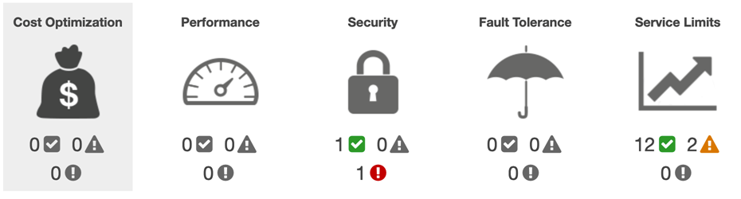

# How to make the Trust Advisor Check automatically?

Trust Advisor help identify the baseline issue of below 5 pillars. There is no additional charge for Trust Advisor execution.



Make sure 
1. customers with a Business or Enterprise support plan
2. The lambda execution role has the `AssumeRole` permission
```json
{
    "Version": "2012-10-17",
    "Statement": {
        "Effect": "Allow",
        "Action": "sts:AssumeRole",
        "Resource": "*"
    }
}
```
3. You can use the **AWS Security Token Service (AWS STS) token to cross account** trigger and retrieve Trust Advisor report. More details about [How can I configure a Lambda function to assume a role from another AWS account?](https://aws.amazon.com/premiumsupport/knowledge-center/lambda-function-assume-iam-role/)

- The Trust Advisor API permission Role account B
```json
{
    "Version": "2012-10-17",
    "Statement": [
        {
            "Sid": "VisualEditor0",
            "Effect": "Allow",
            "Action": [
                "trustedadvisor:*",
                "support:*"
            ],
            "Resource": "*"
        }
    ]
}
```

- Modify the trust policy of the assumed role in account B
```json
{
  "Version": "2012-10-17",
  "Statement": [
    {
      "Effect": "Allow",
      "Principal": {
        "Service": "lambda.amazonaws.com"
      },
      "Action": "sts:AssumeRole"
    },
    {
      "Effect": "Allow",
      "Principal": {
        "AWS": "arn:aws:iam::710299592439:role/lambda_basic_execution"
      },
      "Action": "sts:AssumeRole"
    }
  ]
}
```

## Refresh Function RefereshTrustedAdvisor

Invoke the Trust Advisor API to trigger the Check [referesh-trusted-advisor.py](script/referesh-trusted-advisor.py)

- Runtime: Python 3.8
- Memory: 128MB
- Timeout: 60 seconds
- Env variable: STS_ROLE_ARN cross account STS Role ARN

## Report Function TrustedAdvisorReport

Get the Trust Advisor report and sent out via email to receiver [get-trusted-advisor-report.py](script/get-trusted-advisor-report.py)

- Runtime: Python 3.8
- Memory: 256MB
- Timeout: 120 seconds
- Env variable: TO_EMAIL and FROM_EMAIL for sender email and receiver email; STS_ROLE_ARN cross account STS Role ARN

## Step Function

Integrate 2 function and automatically triggered by Amazon EventBridge (CloudWatch Events)

Sample step function define:

[step-function.json](script/step-function.json)

# Reference
[Using Trusted Advisor as a web service](https://docs.aws.amazon.com/awssupport/latest/user/trustedadvisor.html)