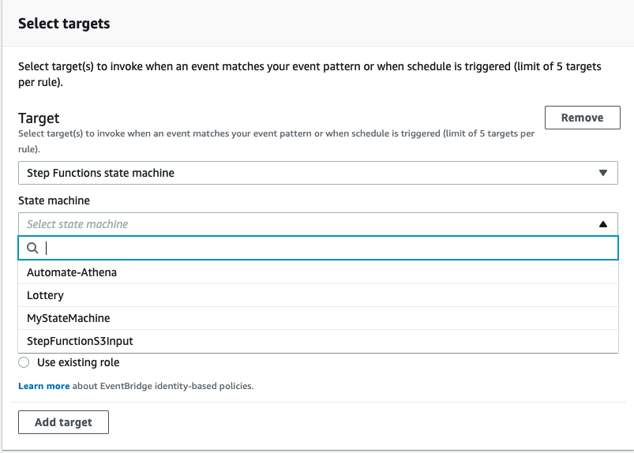
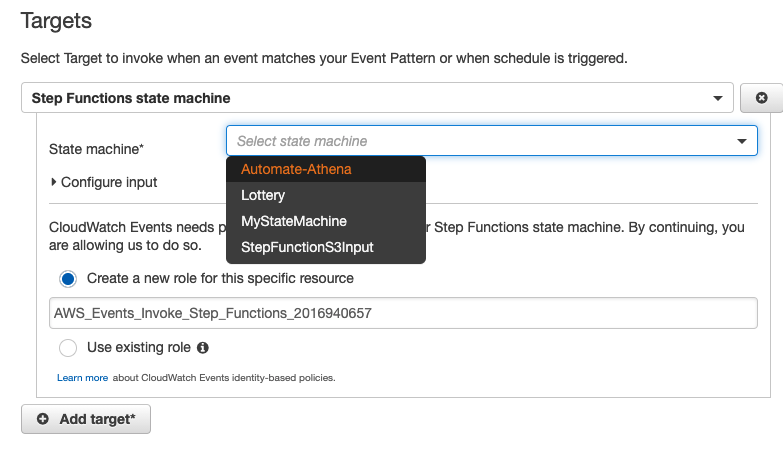
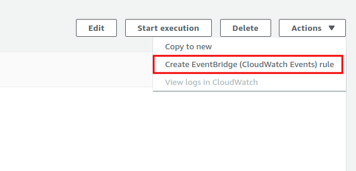

# Configure Step Functions state machine as a target of event

There are 3 options to configure Step Functions state machine as a target in EventBridge

## Option 1: Step Functions state machine as a target in EventBridge

https://docs.aws.amazon.com/eventbridge/latest/userguide/eb-targets.html

## Option 2: Step Functions state machine as a target in CloudWatch Event console

https://docs.aws.amazon.com/step-functions/latest/dg/tutorial-cloudwatch-events-target.html

## Option 3: Routing a Step Functions event to EventBridge in the EventBridge console

https://docs.aws.amazon.com/step-functions/latest/dg/cw-events.html

## Cross account event handling
- step function target account: event bridge -> step function
- event source account: source event bridge -> target event bus

https://docs.aws.amazon.com/eventbridge/latest/userguide/eb-cross-account.html