# AmazonMQ Workshop

[Official guide](https://github.com/aws-samples/amazon-mq-workshop)

- Lab 1: Prepare
- Lab 2: Using Point-To-Point Messaging Using Queues
- Lab 3: Using Publish-Subscribe Messaging Using Topics
- Lab 4: Testing a Broker Fail-over
- Lab 5: Set-Up Amazon CloudWatch to Monitor Our Broker
- Lab 6: Tighten up Security with Access Control
- Lab 7: Active MQ Broker Statistics
- Lab 8: Protocol Interoperability
- Lab 9: Network of Brokers
- Lab 10: Performance Testing
- Performance Consideration
- Lab 11: Polyglot programming

## Lab1: Prepare
- Global region: [Launch the CloudFormation Stack](https://github.com/aws-samples/amazon-mq-workshop/blob/master/labs/lab-setup.md)
- China region: 
- Option 1: [Launch the CloudFormation Stack](scripts/CreateAmazonMQWorkshop.yaml)
- Option 2: [set-up an Amazon MQ broker](https://github.com/aws-samples/amazon-mq-workshop/blob/master/labs/lab-1.md)
  - Broker name: `Broker`
  - Broker instance type: `mq.m5.large`
  - Deployment mode: `Active/standby broker for high availability` and `Durability Optimized Storage`
  - Broker engine: `5.15.9`
  - Username: workshopUser
  - Password: <choose one>
  - Broker Configuration: Create a new configuration with default values
  - Logs: select General and Audit
  - Network and security: Select existing VPC, subnet(s) and security group(s)
  - Virtual Private Cloud (VPC): {Stackname}-VPC
  - Subnet(s): {Stackname}-PublicSubnet1 and {Stackname}-PublicSubnet2
  - Security group(s): {Stackname}-AmazonMQSecurityGroup for port: `61617, 8162, 8883, 61614, 5671`
  - Encryption: AWS managed CMK
  - Public accessibility: Yes (to be able to access the Apache ActiveMQ web console)
  - Maintenance window: No preference
- China region: Create System Manager Paramete Store: `MQBrokerUserPassword`, Type: `String`, Value: `<Username>,<Password>`

## Lab 2: Using Point-To-Point Messaging Using Queues
1. Cloud9 Setting

Copy failover string link beside the OpenWire row of AmazonMQ Broker console to copy the string to your clipboard

Replace the ttps://github.com/aws-samples/amazon-mq-workshop/setup.sh with integration/MQ/scripts/setup.sh

```bash
git clone https://github.com/aws-samples/amazon-mq-workshop/

export AWS_DEFAULT_REGION=cn-northwest-1

# Replace the setup.sh with integration/MQ/scripts/setup.sh
cd amazon-mq-workshop
export temp_url="<failover url>"
echo "url=\"$temp_url\"" >> ~/.bashrc 
./setup.sh
Installing jq...
Updating java to 1.8...
Updating maven to 3.6...
Installing maven performance plugin...
Getting broker urls...
Saving broker urls...
Accessing parameter store...
Done.

source ~/.bashrc
```

2. Split 4 terminal tabs windows that you will use for the workshop are created after having run this step.

3. Start the sender on terminal tab 1
```bash
java -jar ./bin/amazon-mq-client.jar -url $url -mode sender -type queue -destination workshop.queueA -name Sender-1

19.04.2021 03:23:33.208 - Sender: sent '[queue://workshop.queueA] [Sender-1] Message number 1'
19.04.2021 03:23:34.217 - Sender: sent '[queue://workshop.queueA] [Sender-1] Message number 2'
19.04.2021 03:23:35.226 - Sender: sent '[queue://workshop.queueA] [Sender-1] Message number 3'
19.04.2021 03:23:36.235 - Sender: sent '[queue://workshop.queueA] [Sender-1] Message number 4'
19.04.2021 03:23:37.244 - Sender: sent '[queue://workshop.queueA] [Sender-1] Message number 5'
```

4. Start the second sender on terminal tab 2
```bash
java -jar ./bin/amazon-mq-client.jar -url $url -mode sender -type queue -destination workshop.queueA -name Sender-2
```

Now you have 2 clients sending messages to the same queue.

5. Start first receiver on terminal tab 3
```bash
java -jar ./bin/amazon-mq-client.jar -url $url -mode receiver -type queue -destination workshop.queueA
```

6. Start a second receiver on terminal tab 4
```bash
java -jar ./bin/amazon-mq-client.jar -url $url -mode receiver -type queue -destination workshop.queueA
```

You now have 2 clients listening on the same queue. You will observe that 
- each message is only delivered to one receiver, not both. 
- there is no direct relationship between sender and receiver. 
- stop one receiver, the remind receiver will get all sender messages.
- restart the stopped receiver, each message is only delivered to one receiver again.


## Lab 3: Using Publish-Subscribe Messaging Using Topics
1. start the sender on terminal tab 1
```bash
java -jar ./bin/amazon-mq-client.jar -url $url -mode sender -type topic -destination demo.topicA -name Sender-1
```

2. start the second sender on terminal tab 2
```bash
java -jar ./bin/amazon-mq-client.jar -url $url -mode sender -type topic -destination demo.topicA -name Sender-2
```

3. start a receiver on terminal tab 3
```bash
java -jar ./bin/amazon-mq-client.jar -url $url -mode receiver -type topic -destination demo.topicA
```

4. start the second receiver on terminal tab 4
```bash
java -jar ./bin/amazon-mq-client.jar -url $url -mode receiver -type topic -destination demo.topicA
```

You now have 2 clients listening on the same Topic. You will observe that
- multiple senders can send messages to the same topic
- multiple receivers can receive messages from the same topic. 
- each message is delivered to all receivers.

## Lab 4: Testing a Broker Fail-over
1. start the sender on terminal tab 1
```bash
java -jar ./bin/amazon-mq-client.jar -url $url -mode sender -type queue -destination workshop.queueA -name Sender-1
```

2. start the receiver on terminal tab 3
```bash
java -jar ./bin/amazon-mq-client.jar -url $url -mode receiver -type queue -destination workshop.queueA
```

3. Navigate your brokers details page and click on `Actions -> Reboot broker`

4. Shortly after, you should see an exception at both sender and receiver for the primary broker isn't reachable any more.
```bash
[ActiveMQ Transport: ssl://broker-id.mq.us-east-1.amazonaws.com/10.42.1.177:61617] WARN org.apache.activemq.transport.failover.FailoverTransport - Transport (ssl://broker-id.mq.us-east-1.amazonaws.com:61617) failed , attempting to automatically reconnect: {}
java.io.EOFException
        at java.io.DataInputStream.readInt(DataInputStream.java:392)
        at org.apache.activemq.openwire.OpenWireFormat.unmarshal(OpenWireFormat.java:268)
        at org.apache.activemq.transport.tcp.TcpTransport.readCommand(TcpTransport.java:240)
        at org.apache.activemq.transport.tcp.TcpTransport.doRun(TcpTransport.java:232)
        at org.apache.activemq.transport.tcp.TcpTransport.run(TcpTransport.java:215)
        at java.lang.Thread.run(Thread.java:748)
```

After waiting a few more seconds, you should see a successful reconnect from your clients to the secondary broker, which is now the new primary one

```bash
[ActiveMQ Task-3] INFO org.apache.activemq.transport.failover.FailoverTransport - Successfully reconnected to ssl://standby-broker-id.mq.us-east-1.amazonaws.com:61617
```

## Lab 5: Set-Up Amazon CloudWatch to Monitor Our Broker
1. Run command the terminal tab1 to send a few message to a queue where no receiver is listening to
```bash
java -jar ./bin/amazon-mq-client.jar -url $url -mode sender -type queue -destination workshop.DLQTest -name Sender-1 -ttl 1000
```

2. Working with Amazon CloudWatch Metrics
- Broker Metrics
- Topic Metrics by Broker
- Queue Metrics by Broker
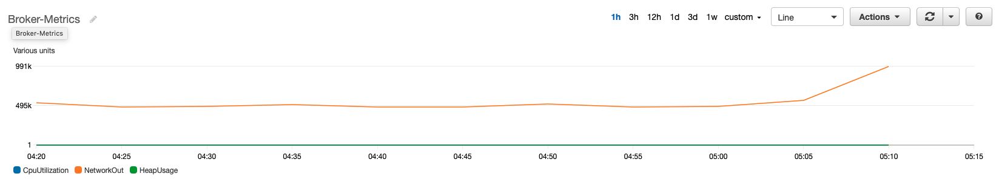

3. Monitoring of an active queue
- Check the workshop.DLQTest 
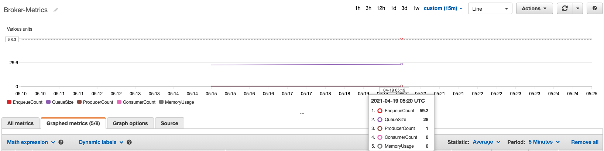

## Lab 6: Tighten up Security with Access Control

Use the access control policies to control which user can send/receive messages from which queues/topics

1. Create new users `user1` and `user2`

Create two users. One with the name and group user1 and a second one with the name and group user2

2. Apply the changes via `Actions -> Reboot broker`. Wait the status in the `Pending modifications` column is empty.
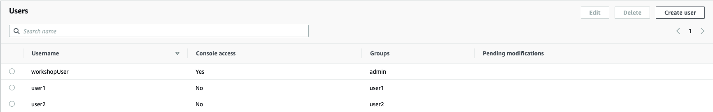

3. Edit the configuration

The configuration is to allow user1 to manage, write and read from queue.user1, but not user2, who is allowed instead to a/r/w on topic.user2

```xml
<authorizationPlugin>
      <map>
        <authorizationMap>
          <authorizationEntries>
            <authorizationEntry admin="admin,activemq-webconsole" queue="&gt;" read="admin,activemq-webconsole" write="admin,activemq-webconsole"/>
            <authorizationEntry admin="admin,activemq-webconsole" topic="&gt;" read="admin,activemq-webconsole" write="admin,activemq-webconsole"/>
            <authorizationEntry admin="admin,user1" queue="queue.user1" read="user1" write="user1"/>
            <authorizationEntry admin="admin,user2" read="user2" topic="topic.user2" write="user2"/>
            <authorizationEntry admin="admin,user1,user2" read="admin,user1,user2" topic="ActiveMQ.Advisory.&gt;" write="admin,user1,user2"/>
          </authorizationEntries>
          <tempDestinationAuthorizationEntry>
            <tempDestinationAuthorizationEntry admin="tempDestinationAdmins" read="tempDestinationAdmins" write="tempDestinationAdmins"/>
          </tempDestinationAuthorizationEntry>
        </authorizationMap>
      </map>
    </authorizationPlugin>
```

Select `Immediately` and click on `Apply`

4. Testing

After the broker is again in the status Running, execute the commands

- Error indicating that user2 is not authorized to write into this queue `queue.user1`.
```bash
java -jar ./bin/amazon-mq-client.jar -url $url -user user2 -password workshopUser -mode sender -type queue -destination queue.user1 -name user2

Error: User user2 is not authorized to write to: queue://queue.user1
```

- User1 can write on this queue `queue.user1`
```bash
java -jar ./bin/amazon-mq-client.jar -url $url -user user1 -password workshopUser -mode sender -type queue -destination queue.user1 -name user1
```

- Error indicating that user1 is not authorized to write into this topic `topic.user2`.
```bash
java -jar ./bin/amazon-mq-client.jar -url $url -user user1 -password workshopUser -mode sender -type topic -destination topic.user2 -name user1

Error: User user1 is not authorized to write to: topic://topic.user2
```

- User2 can write on this topic `topic.user2`
```bash
java -jar ./bin/amazon-mq-client.jar -url $url -user user2 -password workshopUser -mode sender -type topic -destination topic.user2 -name user2
```

## Lab 7: Active MQ Broker Statistics
1. Get ActiveMQ Web console address
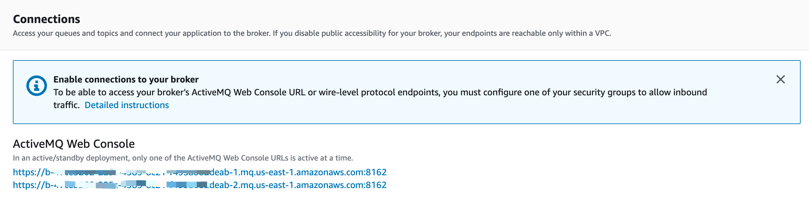

2. Log into the ActiveMQ Web console
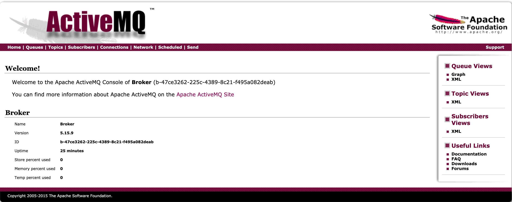

3. Managing Queues
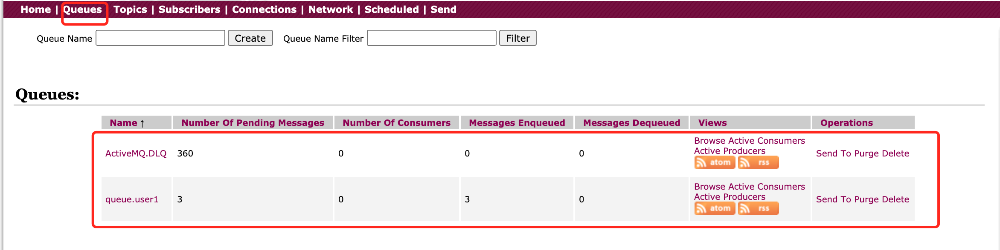
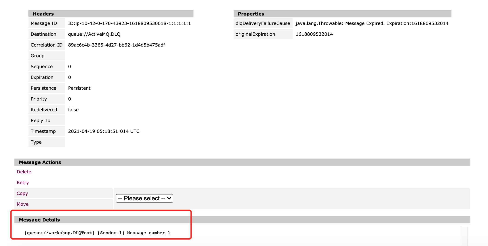

3. Managing Topic


## Lab 8: Protocol Interoperability
1. APIs and Protocols
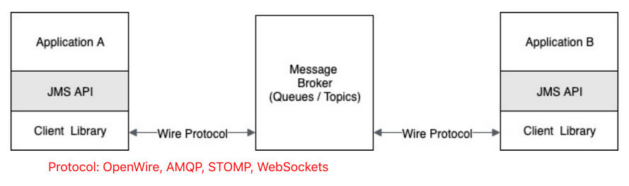

2. The JMS API implementation for a client library provides a common API for JVM based languages. Thus removes dependency on a specific protocol or client library.

3. Sample programs

| Sample | Protocol | Provider |
| -------- | ---- | ----------- |
| amazon-mq-client.jar | OpenWire | [JMS 1.1 API using ActiveMq client library](https://mvnrepository.com/artifact/org.apache.activemq/activemq-client/5.15.9)|
| amqp-client.jar | AMQP | [JMS 1.1 API using Apache Qpid client library](https://mvnrepository.com/artifact/org.apache.qpid/qpid-jms-client/0.45.0). This library supports JMS 2.0 as well. |
| mqtt-client.jar | MQTT | [Paho MQTT Library](https://mvnrepository.com/artifact/org.eclipse.paho/org.eclipse.paho.client.mqttv3/1.2.1) |
| stomp-client.jar | STOMP | [Active MQ STOMP Client library](https://mvnrepository.com/artifact/org.apache.activemq/activemq-stomp/5.15.9) |

4. start a sender using the `OpenWire` protocol in terminal Tab1
```bash
java -jar ./bin/amazon-mq-client.jar -url $url -mode sender -type topic -destination workshop.topicA -name OpenWire
```

5. start a receiver using the Stomp protocol in terminal Tab2

Note: This client doesn't support the failover connection url.

```bash
stomp_url="stomp+ssl://b-47ce3262-225c-4389-8c21-f495a082deab-1.mq.us-east-1.amazonaws.com:61614"
java -jar ./bin/stomp-client.jar -url $stomp_url -mode receiver -type topic -destination workshop.topicA
```

6. start a receiver using the MQTT protocol in terminal Tab3

Note: This client doesn't support the failover connection url and expects the scheme to be ssl instead of mqtt+ssl.

```bash
mqtt_url="ssl://b-47ce3262-225c-4389-8c21-f495a082deab-1.mq.us-east-1.amazonaws.com:8883"
java -jar ./bin/mqtt-client.jar -url $mqtt_url -mode receiver -destination workshop/topicA
```

7. start a receiver using the AMQP protocol in terminal Tab4

Note: This client supports the failover connection url, but not the scheme amqp+ssl. It expects the scheme in the form amqps

```bash
amqp_url="failover:(amqp://b-47ce3262-225c-4389-8c21-f495a082deab-1.mq.us-east-1.amazonaws.com:5671,amqp://b-47ce3262-225c-4389-8c21-f495a082deab-2.mq.us-east-1.amazonaws.com:5671)"
java -jar ./bin/amqp-client.jar -url $amqp_url -mode receiver -type topic -destination workshop.topicA
```


## Lab 9: Network of Brokers

Go to AWS Console, Open console for Amazon MQ, find one of the mesh brokers, the name of the broker is CloudFormation NoB1, NoB2 or NoB3.

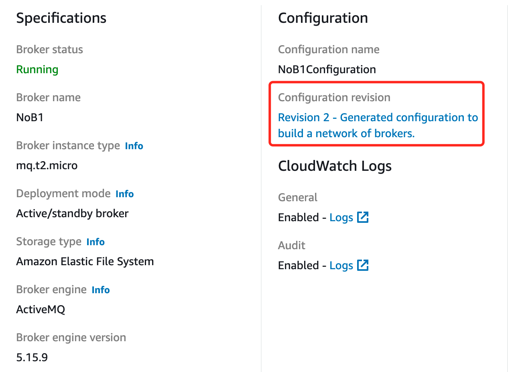


Each networkConnector establishes a connection from one broker to another in a `specific direction`. A networkConnector from Broker1 to Broker2, propagates messages from Broker1 to Broker2. 

In order for Broker2 to send messages to Broker1, either add an `explicit` networkConnector from Broker2 to Broker1 or mark the Broker1 to Broker2 networkConnector with `duplex` attribute.

Each broker can accept connections from clients. The client endpoints are named transportConnectors. 

In order to scale, client connections can be divided across brokers. Because these brokers are all connected using network connectors, when a producer sends messages to say Broker 1, the messages can be consumed from Broker 2 or from Broker 3. 

This helps to distribute the load from clients across brokers in Mesh.

```xml
  <networkConnectors>
    <networkConnector conduitSubscriptions="false" consumerTTL="1" messageTTL="-1" name="QueueConnector_ConnectingBroker_1_To_2" uri="masterslave:(ssl://b-74fe726d-46f9-41d1-a7e9-f1d84b83269e-1.mq.us-east-1.amazonaws.com:61617,ssl://b-74fe726d-46f9-41d1-a7e9-f1d84b83269e-2.mq.us-east-1.amazonaws.com:61617)" userName="workshopUser">
      <excludedDestinations>
        <topic physicalName="&gt;"/>
      </excludedDestinations>
    </networkConnector>
    <networkConnector conduitSubscriptions="true" consumerTTL="1" messageTTL="-1" name="TopicConnector_ConnectingBroker_1_To_2" uri="masterslave:(ssl://b-74fe726d-46f9-41d1-a7e9-f1d84b83269e-1.mq.us-east-1.amazonaws.com:61617,ssl://b-74fe726d-46f9-41d1-a7e9-f1d84b83269e-2.mq.us-east-1.amazonaws.com:61617)" userName="workshopUser">
      <excludedDestinations>
        <queue physicalName="&gt;"/>
      </excludedDestinations>
    </networkConnector>
    <networkConnector conduitSubscriptions="false" consumerTTL="1" messageTTL="-1" name="QueueConnector_ConnectingBroker_1_To_3" uri="masterslave:(ssl://b-11acb049-f1ec-4ad6-bc72-65c1e42a7647-1.mq.us-east-1.amazonaws.com:61617,ssl://b-11acb049-f1ec-4ad6-bc72-65c1e42a7647-2.mq.us-east-1.amazonaws.com:61617)" userName="workshopUser">
      <excludedDestinations>
        <topic physicalName="&gt;"/>
      </excludedDestinations>
    </networkConnector>
    <networkConnector conduitSubscriptions="true" consumerTTL="1" messageTTL="-1" name="TopicConnector_ConnectingBroker_1_To_3" uri="masterslave:(ssl://b-11acb049-f1ec-4ad6-bc72-65c1e42a7647-1.mq.us-east-1.amazonaws.com:61617,ssl://b-11acb049-f1ec-4ad6-bc72-65c1e42a7647-2.mq.us-east-1.amazonaws.com:61617)" userName="workshopUser">
      <excludedDestinations>
        <queue physicalName="&gt;"/>
      </excludedDestinations>
    </networkConnector>
  </networkConnectors>
  <transportConnectors>
    <transportConnector name="openwire" rebalanceClusterClients="true" updateClusterClients="true"/>
  </transportConnectors>
```

1. Producer Load Balancing

Producers can be load balanced across the network of brokers, by concentrating them on a set of brokers in the network. For example, in a Mesh network of 3 brokers, producers can be spread across Broker1 and Broker2. The consumers can be connected to Broker3.

2. Consumer Load Balancing

In the networkConnector configuration you should have noticed an attribute named    `conduitSubscriptions`. This setting specifies how the messages are distributed. By default, AmazonMQ sets `conduitSubscriptions` to false

When `conduitSubscriptions set to true`, as below

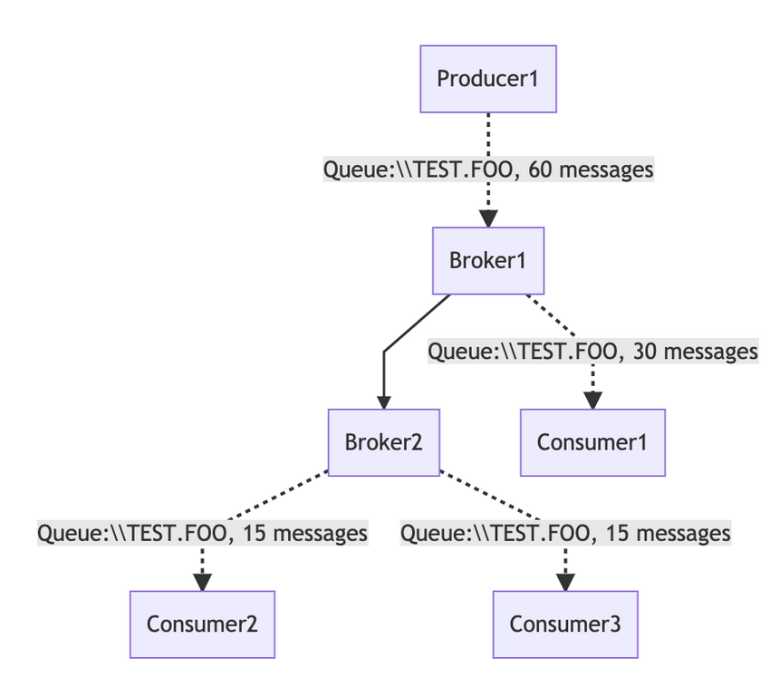

When `conduitSubscriptions set to false`, as below

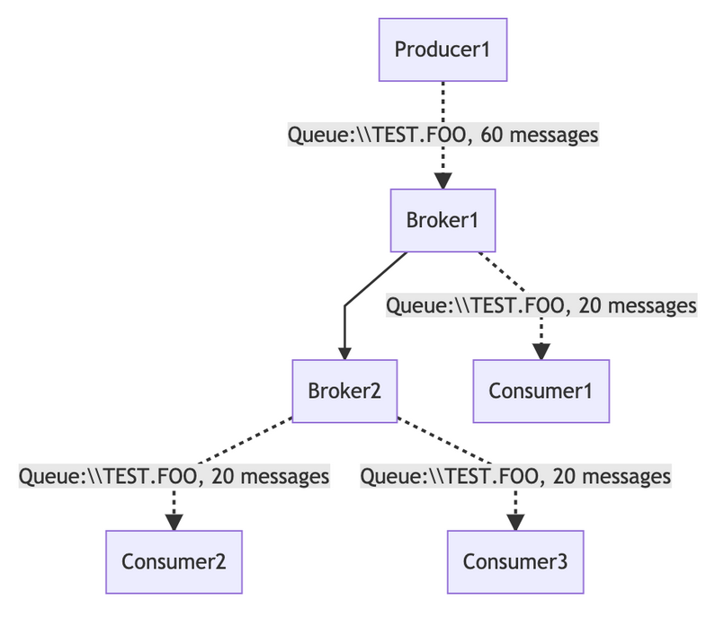

3. Test Consumer Load Balancing
- start 1 producer to send messages to Broker1. 
```bash
java -jar ./bin/amazon-mq-client.jar -url $mesh1url -mode sender -type queue -destination workshop.queueA -name Sender-1

20.04.2021 01:08:35.167 - Sender: sent '[queue://workshop.queueA] [Sender-1] Message number 70'
20.04.2021 01:08:36.177 - Sender: sent '[queue://workshop.queueA] [Sender-1] Message number 71'
20.04.2021 01:08:37.188 - Sender: sent '[queue://workshop.queueA] [Sender-1] Message number 72'
20.04.2021 01:08:38.199 - Sender: sent '[queue://workshop.queueA] [Sender-1] Message number 73'
20.04.2021 01:08:39.213 - Sender: sent '[queue://workshop.queueA] [Sender-1] Message number 74'
20.04.2021 01:08:40.224 - Sender: sent '[queue://workshop.queueA] [Sender-1] Message number 75'
20.04.2021 01:08:41.235 - Sender: sent '[queue://workshop.queueA] [Sender-1] Message number 76'
20.04.2021 01:08:42.249 - Sender: sent '[queue://workshop.queueA] [Sender-1] Message number 77'
20.04.2021 01:08:43.262 - Sender: sent '[queue://workshop.queueA] [Sender-1] Message number 78'
```
- Once this done, give a couple of seconds to start the flow of messages, run the 2nd command to start a receiver on Broker2
```bash
java -jar ./bin/amazon-mq-client.jar -url $mesh2url -mode receiver -type queue -destination workshop.queueA

20.04.2021 01:08:36.169 - Receiver: received '[queue://workshop.queueA] [Sender-1] Message number 71'
20.04.2021 01:08:38.191 - Receiver: received '[queue://workshop.queueA] [Sender-1] Message number 73'
20.04.2021 01:08:40.216 - Receiver: received '[queue://workshop.queueA] [Sender-1] Message number 75'
20.04.2021 01:08:42.238 - Receiver: received '[queue://workshop.queueA] [Sender-1] Message number 77'
20.04.2021 01:08:44.267 - Receiver: received '[queue://workshop.queueA] [Sender-1] Message number 79'
```
- run another receiver from Broker3. You should notice that messages are being distributed equally among two receivers and receivers are reading from the same queue on two different brokers. This is the result of `conduitSubscriptions (false)`
```bash
java -jar ./bin/amazon-mq-client.jar -url $mesh3url -mode receiver -type queue -destination workshop.queueA

20.04.2021 01:08:35.145 - Receiver: received '[queue://workshop.queueA] [Sender-1] Message number 70'
20.04.2021 01:08:37.182 - Receiver: received '[queue://workshop.queueA] [Sender-1] Message number 72'
20.04.2021 01:08:39.205 - Receiver: received '[queue://workshop.queueA] [Sender-1] Message number 74'
20.04.2021 01:08:41.230 - Receiver: received '[queue://workshop.queueA] [Sender-1] Message number 76'
20.04.2021 01:08:43.254 - Receiver: received '[queue://workshop.queueA] [Sender-1] Message number 78'
```

4. Testing Producer Load Balancing
- Run the commands in two separate terminals to start 2 producers connecting to Broker1.
```bash
java -jar ./bin/amazon-mq-client.jar -url $mesh1url -mode sender -type queue -destination workshop.queueA -name Sender-1

java -jar ./bin/amazon-mq-client.jar -url $mesh1url -mode sender -type queue -destination workshop.queueA -name Sender-2
```
- Run the commands to start receivers in two separate terminals each connecting to Broker2 and Broker3.
```bash
java -jar ./bin/amazon-mq-client.jar -url $mesh2url -mode receiver -type queue -destination workshop.queueA 
```
```bash
java -jar ./bin/amazon-mq-client.jar -url $mesh3url -mode receiver -type queue -destination workshop.queueA
```

Two producers on one broker and two consumers each on different brokers. Leave them running for the High Availability testing

5. Testing High Availability

- Check the setting：
```xml
<transportConnectors>
    <transportConnector name="openwire" rebalanceClusterClients="true" updateClusterClients="true"/>
  </transportConnectors>
```

- Pick Broker1 (or any broker) and reboot the broker.

You should have noticed that client connections are automatically updated to available broker's URL and rebalanced to available brokers. Once the rebooted broker is in Running state, the client connections get rebalanced again. 

If your application needs a way to handle the interruption and resumption of connections, you can implement a TransportListener

```bash
[ActiveMQ Transport: ssl://b-8c179698-24f6-45a6-916d-34ef70aad5c2-1.mq.us-east-1.amazonaws.com/10.42.1.187:61617] WARN org.apache.activemq.transport.failover.FailoverTransport - Transport (ssl://b-8c179698-24f6-45a6-916d-34ef70aad5c2-1.mq.us-east-1.amazonaws.com:61617) failed , attempting to automatically reconnect: {}
java.io.EOFException
        at java.io.DataInputStream.readInt(DataInputStream.java:392)
        at org.apache.activemq.openwire.OpenWireFormat.unmarshal(OpenWireFormat.java:268)
        at org.apache.activemq.transport.tcp.TcpTransport.readCommand(TcpTransport.java:240)
        at org.apache.activemq.transport.tcp.TcpTransport.doRun(TcpTransport.java:232)
        at org.apache.activemq.transport.tcp.TcpTransport.run(TcpTransport.java:215)
        at java.lang.Thread.run(Thread.java:748)
[ActiveMQ Task-3] INFO org.apache.activemq.transport.failover.FailoverTransport - Successfully reconnected to ssl://b-74fe726d-46f9-41d1-a7e9-f1d84b83269e-2.mq.us-east-1.amazonaws.com:61617

20.04.2021 01:17:58.917 - Receiver: received '[queue://workshop.queueA] [Sender-1] Message number 252'
20.04.2021 01:17:59.930 - Receiver: received '[queue://workshop.queueA] [Sender-1] Message number 253'
....
[ActiveMQ Task-4] INFO org.apache.activemq.transport.failover.FailoverTransport - Successfully reconnected to ssl://b-11acb049-f1ec-4ad6-bc72-65c1e42a7647-1.mq.us-east-1.amazonaws.com:61617
```

## Lab 10: Performance testing

Learn how to do Performance Testing using ActiveMQ Maven Plug-in.

1. Concurrent Store and Dispatch:

Concurrent store and dispatch is a strategy that facilitates high rates of message throughput provided the consumers are able to keep up with the flow of messages from the broker.

For `fast conumser`, setting the `concurrentStoreAndDispatchQueues` (or `concurrentStoreAndDispatchTopics`) to true (default) will increase throughput. When this setting is set to true, Broker sends messages directly from producer to consumer, once consumer acknowledges message receipt, Broker commits the messages to disk.

However, when producers are sending messages at a higher rate than consumers, then this flag should be set to `false`.

2. Open MQClient
```bash
cd ~/environment/activemq-perftest
cp ~/environment/amazon-mq-workshop/openwire-producer.properties ~/environment/activemq-perftest
cp ~/environment/amazon-mq-workshop/openwire-consumer.properties ~/environment/activemq-perftest
```

3. run the first command (consumer) in one terminal and the second command (producer) in a different terminal
Since the default configuration for Broker sets concurrentStoreAndDispatchQueues to true, we will start the consumers first and then the producers to see full impact of this setting.
```bash
mvn activemq-perf:consumer -DsysTest.propsConfigFile=openwire-consumer.properties 
mvn activemq-perf:producer -DsysTest.propsConfigFile=openwire-producer.properties 
```

4. Result
- Provider: Average Troughput is 420 for 5 clients
```xml
<property name='perfTpSummary'>
<props>
<prop key='SystemTotalTP'>126093</prop>
<prop key='SystemTotalClients'>5</prop>
<prop key='SystemAveTP'>420.31</prop>
<prop key='SystemAveEMMTP'>417.44666666666666</prop>
<prop key='SystemAveClientTP'>84.062</prop>
<prop key='SystemAveClientEMMTP'>83.48933333333333</prop>
<prop key='MinClientTP'>clientName=JmsProducer0,value=14</prop>
<prop key='MaxClientTP'>clientName=JmsProducer4,value=147</prop>
<prop key='MinClientTotalTP'>clientName=JmsProducer0,value=23142</prop>
<prop key='MaxClientTotalTP'>clientName=JmsProducer4,value=27417</prop>
<prop key='MinClientAveTP'>clientName=JmsProducer0,value=77.14</prop>
<prop key='MaxClientAveTP'>clientName=JmsProducer4,value=91.39</prop>
<prop key='MinClientAveEMMTP'>clientName=JmsProducer0,value=76.71</prop>
<prop key='MaxClientAveEMMTP'>clientName=JmsProducer4,value=90.85</prop>
</props>
</property>

```

- Consumer: Average Troughput is 415 for 5 clients
```xml
<property name='perfTpSummary'>
<props>
<prop key='SystemTotalTP'>124674</prop>
<prop key='SystemTotalClients'>5</prop>
<prop key='SystemAveTP'>415.58</prop>
<prop key='SystemAveEMMTP'>413.6466666666667</prop>
<prop key='SystemAveClientTP'>83.116</prop>
<prop key='SystemAveClientEMMTP'>82.72933333333334</prop>
<prop key='MinClientTP'>clientName=JmsConsumer1,value=0</prop>
<prop key='MaxClientTP'>clientName=JmsConsumer1,value=116</prop>
<prop key='MinClientTotalTP'>clientName=JmsConsumer4,value=24934</prop>
<prop key='MaxClientTotalTP'>clientName=JmsConsumer1,value=24935</prop>
<prop key='MinClientAveTP'>clientName=JmsConsumer4,value=83.11333333333333</prop>
<prop key='MaxClientAveTP'>clientName=JmsConsumer1,value=83.11666666666666</prop>
<prop key='MinClientAveEMMTP'>clientName=JmsConsumer4,value=82.72666666666667</prop>
<prop key='MaxClientAveEMMTP'>clientName=JmsConsumer1,value=82.73</prop>
</props>
</property>
```

5. Test only a producer without a consumer
```bash
mvn activemq-perf:producer -DsysTest.propsConfigFile=openwire-producer.properties 
```

    The performance degrades relatively in comparison with the previous test. The average performance is 5 times slower compared relatively to running consumers and producers at the same time in the earlier test.

- Provider: Average Troughput is 83 for 5 clients
```xml
<property name='perfTpSummary'>
<props>
<prop key='SystemTotalTP'>24913</prop>
<prop key='SystemTotalClients'>5</prop>
<prop key='SystemAveTP'>83.04333333333334</prop>
<prop key='SystemAveEMMTP'>81.60333333333332</prop>
<prop key='SystemAveClientTP'>16.608666666666668</prop>
<prop key='SystemAveClientEMMTP'>16.320666666666664</prop>
<prop key='MinClientTP'>clientName=JmsProducer3,value=2</prop>
<prop key='MaxClientTP'>clientName=JmsProducer4,value=21</prop>
<prop key='MinClientTotalTP'>clientName=JmsProducer2,value=4982</prop>
<prop key='MaxClientTotalTP'>clientName=JmsProducer4,value=4983</prop>
<prop key='MinClientAveTP'>clientName=JmsProducer2,value=16.606666666666666</prop>
<prop key='MaxClientAveTP'>clientName=JmsProducer4,value=16.61</prop>
<prop key='MinClientAveEMMTP'>clientName=JmsProducer2,value=16.25</prop>
<prop key='MaxClientAveEMMTP'>clientName=JmsProducer0,value=16.46</prop>
</props>
</property>
```

6. Change `concurrentStoreAndDispatchQueues` to `false` by `Edit Configuration`
```xml
<persistenceAdapter>
    <kahaDB  concurrentStoreAndDispatchQueues="false"/>
</persistenceAdapter>
```

- run the first command (consumer) in one terminal and the second command (producer) in a different terminal
```bash
mvn activemq-perf:consumer -DsysTest.propsConfigFile=openwire-consumer.properties 
mvn activemq-perf:producer -DsysTest.propsConfigFile=openwire-producer.properties 
```

Average Consumer Troughput is 202 for 5 clients. The Average Troughput has been improved around 2-3 times. The Average Producer Troughput is 490 for 5 clients 490
```bash
#########################################
####    SYSTEM THROUGHPUT SUMMARY    ####
#########################################
System Total Throughput: 147089
System Total Clients: 5
System Average Throughput: 490.2966666666667
System Average Throughput Excluding Min/Max: 450.22666666666663
System Average Client Throughput: 98.05933333333334
System Average Client Throughput Excluding Min/Max: 90.04533333333333
Min Client Throughput Per Sample: clientName=JmsConsumer1, value=0
Max Client Throughput Per Sample: clientName=JmsConsumer2, value=2649
Min Client Total Throughput: clientName=JmsConsumer2, value=29337
Max Client Total Throughput: clientName=JmsConsumer3, value=29472
Min Average Client Throughput: clientName=JmsConsumer2, value=97.79
Max Average Client Throughput: clientName=JmsConsumer3, value=98.24
#########################################

#########################################
####    SYSTEM THROUGHPUT SUMMARY    ####
#########################################
System Total Throughput: 60610
System Total Clients: 5
System Average Throughput: 202.0333333333333
System Average Throughput Excluding Min/Max: 199.7
System Average Client Throughput: 40.40666666666666
System Average Client Throughput Excluding Min/Max: 39.94
Min Client Throughput Per Sample: clientName=JmsProducer4, value=0
Max Client Throughput Per Sample: clientName=JmsProducer4, value=50
Min Client Total Throughput: clientName=JmsProducer0, value=12116
Max Client Total Throughput: clientName=JmsProducer1, value=12125
Min Average Client Throughput: clientName=JmsProducer0, value=40.38666666666666
Max Average Client Throughput: clientName=JmsProducer1, value=40.416666666666664
Min Average Client Throughput Excluding Min/Max: clientName=JmsProducer0, value=39.88666666666666
Max Average Client Throughput Excluding Min/Max: clientName=JmsProducer4, value=40.08
```

- Test only a producer without a consumer
```bash
mvn activemq-perf:producer -DsysTest.propsConfigFile=openwire-producer.properties 
```

Average Producer Troughput is 214 for 5 clients. The Average Troughput has been improved around 2-3 times

```xml
<property name='perfTpSummary'>
<props>
<prop key='SystemTotalTP'>64338</prop>
<prop key='SystemTotalClients'>5</prop>
<prop key='SystemAveTP'>214.45999999999998</prop>
<prop key='SystemAveEMMTP'>213.51</prop>
<prop key='SystemAveClientTP'>42.891999999999996</prop>
<prop key='SystemAveClientEMMTP'>42.702</prop>
<prop key='MinClientTP'>clientName=JmsProducer4,value=0</prop>
<prop key='MaxClientTP'>clientName=JmsProducer4,value=57</prop>
<prop key='MinClientTotalTP'>clientName=JmsProducer1,value=12866</prop>
<prop key='MaxClientTotalTP'>clientName=JmsProducer4,value=12868</prop>
<prop key='MinClientAveTP'>clientName=JmsProducer1,value=42.88666666666666</prop>
<prop key='MaxClientAveTP'>clientName=JmsProducer4,value=42.89333333333333</prop>
<prop key='MinClientAveEMMTP'>clientName=JmsProducer1,value=42.696666666666665</prop>
<prop key='MaxClientAveEMMTP'>clientName=JmsProducer4,value=42.70333333333333</prop>
</props>
</property>
```

7. Conclusion

- If your workload contains consumers that are slower than producers, you get better performance using `concurrentStoreAndDispatchQueues = false.`

- On the other hand, if your consumers can keep up with producers, you get significantly better performance using `concurrentStoreAndDispatchQueues = true`. Keep in mind that this is the default for AmazonMQ.

## Performance Consideration
[Ensuring effective Amazon MQ performance ](https://docs.aws.amazon.com/amazon-mq/latest/developer-guide/ensuring-effective-amazon-mq-performance.html)

[Measuring the throughput for Amazon MQ using the JMS Benchmark](https://aws.amazon.com/blogs/compute/measuring-the-throughput-for-amazon-mq-using-the-jms-benchmark/)

[activemq-performance-module](https://activemq.apache.org/activemq-performance-module-users-manual)

## Lab 11: Polyglot programming

How to use other programming languages to communicate with AmazonMQ. You will work with a .Net client as an example.