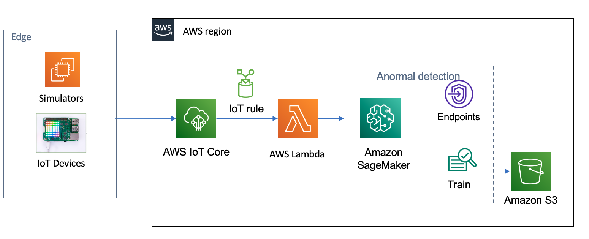
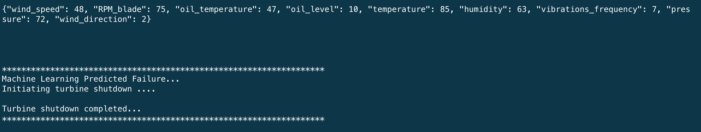
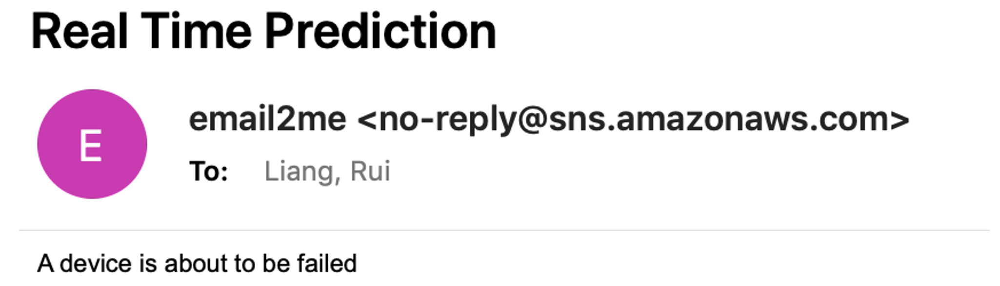

# Using AWS IoT and Amazon SageMaker to do IoT Devices Predictive Maintenance

This article uses machine learning for predictive maintenance, uses Wind Turbine simulation data as an example data set, uses Amazon SageMaker for model training, and deploys inference endpoints. The edge side collects device data through AWS IoT, uses IoT Rules to trigger Lambda to call the predictive maintenance inference API, determines whether the device will be abnormal, and gives a notification

The algorithm we use is called XGBoost (eXtreme Gradient Boosting), which is a supervised machine learning algorithm that tries to combine a series of estimates from a set of simpler and weaker models to accurately predict the target variable. XGBoost can be used to deal with regression, classification (binary and multi-class) and ranking problems. Use XGBoost to predict whether equipment will be damaged and perform predictive maintenance in advance.

The demonstration in this article uses wind turbine simulation data, and the data structure includes:
- wind_speed
- RPM_blade
- oil_temperature
- oil_level
- temperature
- humidity
- vibrations_frequency
- pressure
- wind_direction
- Whether it is damaged: breakdown

You can use this solution to automatically detect potential equipment failures and provide recommended actions. The solution is easy to deploy and includes a sample data set, but you can modify the solution to work with other data sets to build your own IoT predictive maintenance solutions.

The following figure shows the architecture in this article



Data is sent from the device to AWS IoT, and then routed to AWS Lambda through the AWS IoT Rules Engine. Lambda invokes the API of predictive maintenance detection, and the predictive maintenance model is deployed on Amazon SageMaker. When an abnormality is detected, the Lambda function will send a notification and perform corresponding operations on the device. Predictive maintenance model deployment uses historical data for training on Amazon SageMaker, and training and verification data is stored on Amazon S3.

The hands on lab including:
1. Uses Cloud9 as a simulation of IoT devices: [device_simulator](scripts/device_simulator.py)
2. Register the IoT thing on AWS IoT Core
3. Train and deploy the Amazon SageMaker model: [xgboost_modeL](scripts/xgboost_model_training_and_deplyment.ipynb)
4. Create cloud resources to monitor and detect devices that to be abnormally: [lambda_function](scripts/lambda_function.py)
5. Use simulated equipment to conduct predictive maintenance testing and send notifications
```bash
1. Upload the IoT transaction certificate to the Cloud9 instance

2. Modify the code device_simulator.py according to your actual configuration
# Configure IoT entry point and certificates
host = "atvhelbe9tja0.iot.us-east-1.amazonaws.com"
rootCAPath = "cert/AmazonRootCA1.pem"
certificatePath = "cert/windturbine.cert.pem"
privateKeyPath = "cert/windturbine.private.key"

3. Run the code
python device_simulator.py device_data.csv
```

When the deployed XGBoost endpoint predicts that the device will be abnormal, use shadows to set the device state to Off, and the edge IoT device receives the state setting flag and stops the device, as shown in the following figure



At the same time, Lambda will also trigger a notification to remind staff to perform predictive maintenance
