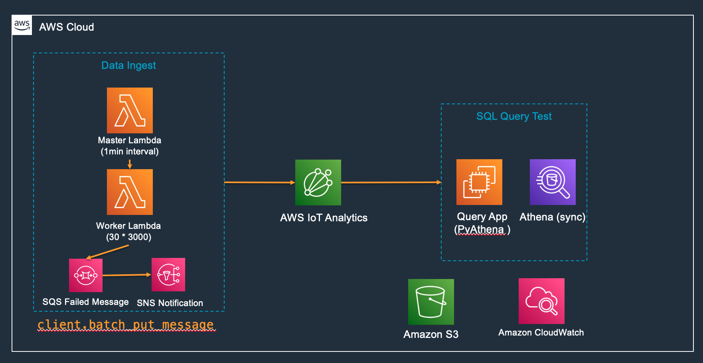
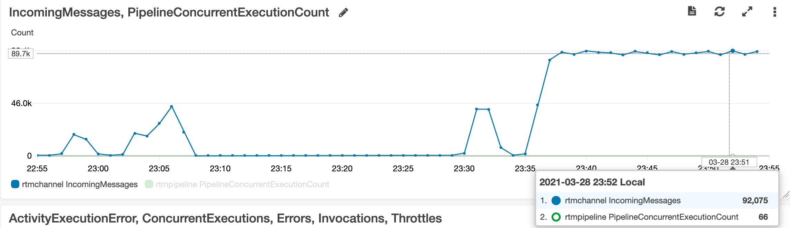
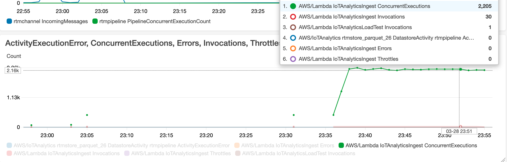
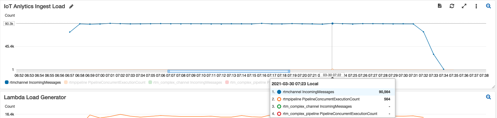
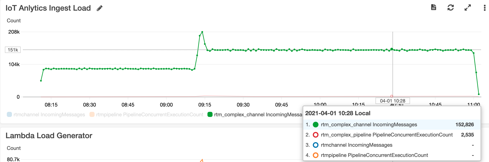
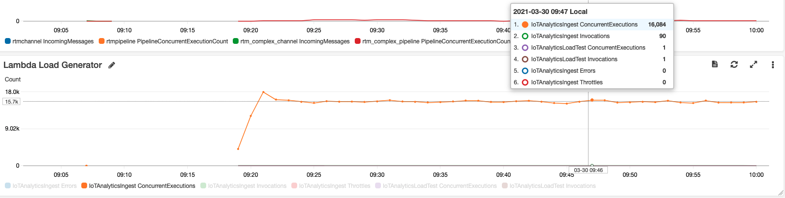
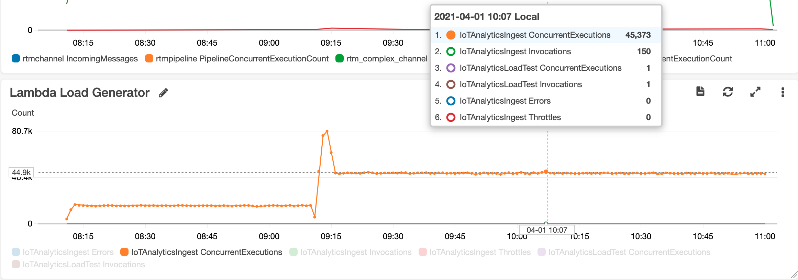

# AWS IoT Analytics Perfomrance testing

Architecture


# 1KB payload testing
## Prepare the IoT analytics
1. Creating a channel `rtmchannel`
```bash
aws iotanalytics create-channel --cli-input-json file://create-channel-test.json \
--region us-east-1 --profile us-east-1
```

2. Creating a data store `rtmstore_parquet`
```bash
aws iotanalytics create-datastore --cli-input-json file://create-datastore-test.json \
--region us-east-1 --profile us-east-1
```

3. Creating a pipeline `rtmpipeline`
```bash
aws iotanalytics create-pipeline --cli-input-json file://create-pipeline-test.json  \
--region us-east-1 --profile us-east-1
```

## Ingest data generator
1. Single Thread ingest and Monitoring the ingested data
```bash
python scripts/rtm_sim.py 
```

2. Multiple Threads load testing
- Create the SQS for lambda failure destination `rtm-sim-failure`
- Create the worker lambda function `IoTAnalyticsIngest` with [rtm_sim_lambda.py](scripts/rtm_sim_lambda.py) and configure the `Asynchronous invocation`- `On failure` event sent to `rtm-sim-failure` SQS queue
- Create the Failure SQS notification lambda function `SQSNotifySNS` with [SQSNotifySNS.py](scripts/SQSnotifySNS.py)
- Create the Main lambda function `IoTAnalyticsLoadTest` to invoke the worker lambda function `IoTAnalyticsIngest`
- Create the event bridge trigger the Main lambda function `IoTAnalyticsLoadTest` every 1 minute

- You can monitor the ingested data from `channel Monitoring` section
- You can monitor the ingested data from `pipeline Monitoring` section for each activity


- You can monitor the lambda failure SQS destination `rtm-sim-failure`, make sure there is no failure
- You can monitor the lambda `IoTAnalyticsIngest` current execution



3. The ingest performance：

Using Main lambda function `IoTAnalyticsLoadTest` will currently trigger 30 the worker lambda function `IoTAnalyticsIngest` instances every 1 minute. For each invocation, the worker lambda function `IoTAnalyticsIngest` instance will ingest 3*1000 messages via `batch_put_message`

| Message Size | Data Interval (seconds) | Load Generator current write TPS | Error Rate % | Test Duration (mins) | IoTAnalyticsIngest TPS |
| --- | --- | --- | --- | --- | --- |
| 1KB | 60 | 30 * 3000 / 60 = 1500 | 0 | 30 | 1535 |

## Using Athena to get the SQL query result
1. Create tables (The iot analytics default no compression for parquet format)
```sql
CREATE EXTERNAL TABLE `rtm_rtmstore_parquet`(
  `vin` string, 
  `trip_id` string, 
  `systolic` int, 
  `diastolic` int, 
  `pressurelevel` string, 
  `temp` int, 
  `event_time` timestamp, 
  `bms_tbc_volt` array<string>)
PARTITIONED BY ( 
  `__dt` string)
ROW FORMAT SERDE 
  'org.apache.hadoop.hive.ql.io.parquet.serde.ParquetHiveSerDe' 
STORED AS INPUTFORMAT 
  'org.apache.hadoop.hive.ql.io.parquet.MapredParquetInputFormat' 
OUTPUTFORMAT 
  'org.apache.hadoop.hive.ql.io.parquet.MapredParquetOutputFormat'
LOCATION
  's3://ruiliang-smarthome-iot-analytics-datastore/datastore/rtmstore_parquet/'
TBLPROPERTIES (
  'classification'='parquet', 
  'compressionType'='none', 
  'typeOfData'='file')
```

2. Load Partition
```sql
MSCK REPAIR TABLE rtm_rtmstore_parquet;
```

3. Run the query
```sql
/* Get the total rows of table */
select count(*) from quicksightdb.rtm_rtmstore_parquet;

/* Get the total rows between time range*/
/*20,000*/
select count(*) from quicksightdb.rtm_rtmstore_parquet where event_time BETWEEN TIMESTAMP '2021-03-28 22:59:20.270' AND TIMESTAMP '2021-03-28 23:59:20.270';
/*200,000*/
select count(*) from quicksightdb.rtm_rtmstore_parquet where event_time BETWEEN TIMESTAMP '2021-03-28 15:02:20.270' AND TIMESTAMP '2021-03-28 15:35:20.270';
/*2,000,000*/
select count(*) from quicksightdb.rtm_rtmstore_parquet where event_time BETWEEN TIMESTAMP '2021-03-28 01:02:20.270' AND TIMESTAMP '2021-03-28 23:59:20.270';

select vin, systolic, pressurelevel from rtm_rtmstore_parquet where (event_time BETWEEN TIMESTAMP '2021-03-28 22:59:20.270' AND TIMESTAMP '2021-03-28 23:59:20.270') limit 10;

SELECT vd.vin, vd.trip_id, vd.temp, vd.pressurelevel
        FROM quicksightdb.rtm_rtmstore_parquet vd
        where(vd.pressurelevel='NORMAL')
        AND(vd.event_time BETWEEN TIMESTAMP '2021-03-28 22:59:20.270' AND TIMESTAMP '2021-03-28 23:59:20.270')
        AND vd.temp > 100
        ORDER BY vd.event_time
        Limit 100

SELECT vd.vin, COUNT(DISTINCT vd.trip_id) AS total
        FROM quicksightdb.rtm_rtmstore_parquet vd
        WHERE (vd.pressurelevel = 'NORMAL')
        AND (vd.event_time BETWEEN TIMESTAMP '2021-03-28 22:59:20.270' AND TIMESTAMP '2021-03-28 23:59:20.270')
        GROUP BY vd.vin

CREATE EXTERNAL TABLE `vin_metadata`(
  `vin` string, 
  `vin_amount` string
  )
ROW FORMAT SERDE 
  'org.apache.hadoop.hive.serde2.OpenCSVSerde' 
WITH SERDEPROPERTIES ( 
  'escapeChar'='\\', 
  'quoteChar'='\"', 
  'separatorChar'=',')
LOCATION
  's3://ruiliang-smarthome-iot-analytics-datastore/vin_metadata/'
TBLPROPERTIES ("skip.header.line.count"="1")

SELECT vd.vin, vd.trip_id, vd.systolic,
        CASE vd.pressureLevel WHEN 'High' THEN 'alert' WHEN 'Low' THEN 'caution' ELSE 'go' END as instructions 
        FROM quicksightdb.rtm_rtmstore_parquet vd
        WHERE vd.diastolic > 100
        AND (vd.event_time BETWEEN TIMESTAMP '2021-03-28 22:59:20.270' AND TIMESTAMP '2021-03-28 23:59:20.270')

SELECT vd.vin, vd.trip_id, vd.systolic, l.vin_amount vin_amount,
        CASE vd.pressureLevel WHEN 'High' THEN 'alert' WHEN 'Low' THEN 'caution' ELSE 'go' END as instructions 
        FROM quicksightdb.rtm_rtmstore_parquet vd, quicksightdb.vin_metadata l
        WHERE vd.vin = l.vin AND (vd.diastolic > 100)
        AND (vd.event_time BETWEEN TIMESTAMP '2021-03-28 22:59:20.270' AND TIMESTAMP '2021-03-28 23:59:20.270')

SELECT vd.vin, vd.trip_id, vd.systolic, l.vin_amount vin_amount,
        CASE vd.pressureLevel WHEN 'High' THEN 'alert' WHEN 'Low' THEN 'caution' ELSE 'go' END as instructions 
        FROM quicksightdb.vin_metadata l
        LEFT JOIN quicksightdb.rtm_rtmstore_parquet vd ON vd.vin = l.vin
        WHERE (vd.diastolic > 100)
        AND (vd.event_time BETWEEN TIMESTAMP '2021-03-28 22:59:20.270' AND TIMESTAMP '2021-03-28 23:59:20.270')

SELECT max(vd.systolic) AS max_systolic, vd.vin, l.vin_amount vin_amount
        FROM quicksightdb.rtm_rtmstore_parquet vd, quicksightdb.vin_metadata l
        WHERE vd.vin = l.vin AND (vd.diastolic > 100)
        AND (vd.event_time BETWEEN TIMESTAMP '2021-03-28 22:59:20.270' AND TIMESTAMP '2021-03-28 23:59:20.270')
        Group by vd.vin, vin_amount
```

4. Get the S3 object number and bucke size
```bash
aws s3 ls s3://ruiliang-smarthome-iot-analytics-datastore/datastore/rtmstore_parquet/ --recursive --human-readable --summarize --region us-east-1 --profile us-east-1
```

5. Query the data via pyathena
```bash
pip install pyathena
python scripts/query_athena.py
```

| Table size (rows) | SQL count time window | SQL select limit 20 | SQL between and great than | SQL group by | SQL case | SQL join | SQL max |
| --- | --- | --- | --- | --- | --- | --- | --- |
| 2327546 | 6s | 1.28s | 5.9s | 7.47s | 7.77s | 6.27s | 6.27s | 
| 218781 | 6s | 1.23s | 5.74s | 6.4s | 5.92s | 6.14s | 5.2s |
| 20619 | 6s | 1.08s | 5.2s | 5.6s | 5.4s | 5.75s | 4.7s | 

6. Performance Tunning
- Using `SNAPPY` compression and combine the small files
```sql
CREATE table new_rtmstore_parquet
WITH (format='PARQUET',
parquet_compression='SNAPPY',
partitioned_by=array['__dt'],
external_location = 's3://ruiliang-smarthome-iot-analytics-datastore/datastore/new_rtmstore_parquet/')
AS
SELECT vin, trip_id, systolic, diastolic, pressurelevel,
       temp, event_time, bms_tbc_volt, __dt
FROM rtm_rtmstore_parquet
WHERE cast(__dt as timestamp) < DATE ('2021-03-29');

MSCK REPAIR TABLE new_rtmstore_parquet;
```

- Run the query
Modify the table to `new_rtmstore_parquet`

```bash
pip install pyathena
python scripts/query_athena.py
```

| Table size (rows) | SQL count time window | SQL select limit 20 | SQL between and great than | SQL group by | SQL case | SQL join | SQL max |
| --- | --- | --- | --- | --- | --- | --- | --- |
| 2327546 | 1.36s | 1.66s | 2.39s | 2.28s | 3.98s | 3.75s | 2.36s |
| 218781 | 1.21s | 1.16s | 2.25s | 1.78s | 2.29s | 2.38s | 2.07s |
| 20619 | 1.17s | 1.12s | 2.02s | 1.74s | 2.41s | 2.3s | 1.71s |


# 9KB payload testing
## Prepare the IoT analytics
1. Creating a channel `rtm_complex_channel`
```bash
aws iotanalytics create-channel --cli-input-json file://complex/create-channel-new.json \
--region us-east-1 --profile us-east-1
```

2. Creating a data store `rtm_complex_store`
```bash
aws iotanalytics create-datastore --cli-input-json file://create-datastore-new.json \
--region us-east-1 --profile us-east-1
```

3. Creating a pipeline `rtm_complex_pipeline`
```bash
aws iotanalytics create-pipeline --cli-input-json file://create-pipeline-new.json  \
--region us-east-1 --profile us-east-1
```

## Ingest data generator
1. Modify the generator function `rtm_sim.py` and `rtm_sim_lambda.py` to create 9KB payload
```python
    # data1 = get_low_pressure(vin)
    # data2 = get_normal_pressure(vin)
    # data3 = get_high_pressure(vin)
    # send_batch(data1, data2, data3)
    data = generate_data(vin)
    send(data)
```

2. Multiple Threads load testing
- Update the worker lambda function `IoTAnalyticsIngest` with new [rtm_sim_lambda.py](scripts/rtm_sim_lambda.py)
- Update the Main lambda function `IoTAnalyticsLoadTest` to current invoke 90 the worker lambda function `IoTAnalyticsIngest`.
```python
modify for i in range(30): to for i in range(90):
```
- Keep the event bridge trigger interval as every 1 minute
- You can monitor the ingested data from `channel Monitoring` section
- You can monitor the ingested data from `pipeline Monitoring` section for each activity


    We can continue increase the current ingest to 150 lambda instances with each 1000 message per second
    


- You can monitor the lambda failure SQS destination `rtm-sim-failure`, make sure there is no failure
- You can monitor the lambda `IoTAnalyticsIngest` current execution


    We can continue increase the current ingest to 150 lambda instances with each 1000 message per second
    

3. The ingest performance：

Using Main lambda function `IoTAnalyticsLoadTest` will currently trigger 90 the worker lambda function `IoTAnalyticsIngest` instances every 1 minute. For each invocation, the worker lambda function `IoTAnalyticsIngest` instance will ingest 1000 messages via `batch_put_message`

| Message Size | Data Interval (seconds) | Load Generator current write TPS | Error Rate % | Test Duration (mins) | IoTAnalyticsIngest TPS |
| --- | --- | --- | --- | --- | --- |
| 9KB | 60 | 90 * 1000 / 60 = 1500 | 0 | 60 | 1535 |
| 9KB | 60 | 150 * 1000 / 60 = 2500 | 0 | 120 | 2548 |


## Using Athena to get the SQL query result
1. Create tables (The iot analytics default no compression for parquet format)
```sql
CREATE EXTERNAL TABLE `rtm_complex_store`(
  `vin` string, 
  `event_time` timestamp, 
  `trip_id` string, 
  `systolic` int, 
  `diastolic` int, 
  `pressurelevel` string, 
  `temp` int, 
  `signals` array<struct<name:string,value:float>>, 
  `listsignals` array<struct<name:string,value:array<float>>>)
PARTITIONED BY ( 
  `__dt` string)
ROW FORMAT SERDE 
  'org.apache.hadoop.hive.ql.io.parquet.serde.ParquetHiveSerDe' 
STORED AS INPUTFORMAT 
  'org.apache.hadoop.hive.ql.io.parquet.MapredParquetInputFormat' 
OUTPUTFORMAT 
  'org.apache.hadoop.hive.ql.io.parquet.MapredParquetOutputFormat'
LOCATION
  's3://ruiliang-smarthome-iot-analytics-datastore/datastore/rtm_complex_store/'
TBLPROPERTIES (
  'classification'='parquet', 
  'compressionType'='none', 
  'typeOfData'='file')
```

2. Load Partition
```sql
MSCK REPAIR TABLE rtm_complex_store;
```

3. Using `SNAPPY` compression and combine the small files
```sql
CREATE table new_rtm_complex_store
WITH (format='PARQUET',
parquet_compression='SNAPPY',
partitioned_by=array['__dt'],
external_location = 's3://ruiliang-smarthome-iot-analytics-datastore/datastore/new_rtm_complex_store/')
AS
SELECT vin, event_time, trip_id, systolic, diastolic, pressurelevel,
       temp, signals, listsignals, __dt
FROM rtm_complex_store
WHERE cast(__dt as timestamp) < DATE ('2021-03-31');

/* Use INSERT INTO to Add Data */
MSCK REPAIR TABLE rtm_complex_store;

INSERT INTO new_rtm_complex_store
SELECT vin, event_time, trip_id, systolic, diastolic, pressurelevel,
       temp, signals, listsignals, __dt
FROM rtm_complex_store
WHERE cast(__dt as timestamp) > DATE ('2021-03-30');

MSCK REPAIR TABLE new_rtm_complex_store;
```


4. Run the query
```sql
/* Get the total rows of table */
select count(*) from quicksightdb.new_rtm_complex_store;

/* Get the total rows between time range*/
/*60,000*/
select count(*) from quicksightdb.new_rtm_complex_store where event_time BETWEEN TIMESTAMP '2021-03-30 00:00:01.270' AND TIMESTAMP '2021-03-30 01:20:37.270';
/*600,000*/
select count(*) from quicksightdb.new_rtm_complex_store where event_time BETWEEN TIMESTAMP '2021-03-30 00:00:01.270' AND TIMESTAMP '2021-03-30 01:27:01.270';
/*610,000*/
select count(*) from quicksightdb.rtm_rtmstore_parquet where event_time BETWEEN TIMESTAMP '2021-03-30 00:00:01.270' AND TIMESTAMP '2021-03-30 03:01:01.270';

select vin, systolic, pressurelevel, event_time from quicksightdb.new_rtm_complex_store where event_time BETWEEN TIMESTAMP '2021-03-30 00:00:01.270' AND TIMESTAMP '2021-03-30 01:27:01.270' limit 10;

SELECT vd.vin, vd.trip_id, vd.temp, vd.pressurelevel
        FROM quicksightdb.new_rtm_complex_store vd
        where(vd.pressurelevel='NORMAL')
        AND(vd.event_time BETWEEN TIMESTAMP '2021-03-30 00:00:01.270' AND TIMESTAMP '2021-03-30 01:27:01.270')
        AND vd.temp > 100
        ORDER BY vd.event_time
        Limit 100

SELECT vd.vin, COUNT(DISTINCT vd.trip_id) AS total
        FROM quicksightdb.new_rtm_complex_store vd
        WHERE (vd.pressurelevel = 'NORMAL')
        AND(vd.event_time BETWEEN TIMESTAMP '2021-03-30 00:00:01.270' AND TIMESTAMP '2021-03-30 01:27:01.270')
        GROUP BY vd.vin  

SELECT vd.vin, vd.trip_id, vd.systolic,
        CASE vd.pressureLevel WHEN 'High' THEN 'alert' WHEN 'Low' THEN 'caution' ELSE 'go' END as instructions 
        FROM quicksightdb.new_rtm_complex_store vd
        WHERE (vd.diastolic > 40)
        AND(vd.event_time BETWEEN TIMESTAMP '2021-03-30 00:00:01.270' AND TIMESTAMP '2021-03-30 01:27:01.270')

SELECT vd.vin, vd.trip_id, vd.systolic, l.vin_amount vin_amount,
        CASE vd.pressureLevel WHEN 'High' THEN 'alert' WHEN 'Low' THEN 'caution' ELSE 'go' END as instructions 
        FROM quicksightdb.new_rtm_complex_store vd, quicksightdb.vin_metadata l
        WHERE vd.vin = l.vin AND (vd.diastolic > 40)
        AND(vd.event_time BETWEEN TIMESTAMP '2021-03-30 00:00:01.270' AND TIMESTAMP '2021-03-30 01:27:01.270')
        limit 100

SELECT vd.vin, vd.trip_id, vd.systolic, l.vin_amount vin_amount,
        CASE vd.pressureLevel WHEN 'High' THEN 'alert' WHEN 'Low' THEN 'caution' ELSE 'go' END as instructions 
        FROM quicksightdb.vin_metadata l
        LEFT JOIN quicksightdb.new_rtm_complex_store vd ON vd.vin = l.vin
        WHERE (vd.diastolic > 40)
        AND(vd.event_time BETWEEN TIMESTAMP '2021-03-30 00:00:01.270' AND TIMESTAMP '2021-03-30 01:27:01.270')
        limit 100

SELECT max(vd.systolic) AS max_systolic, vd.vin, l.vin_amount vin_amount
        FROM quicksightdb.new_rtm_complex_store vd, quicksightdb.vin_metadata l
        WHERE vd.vin = l.vin AND (vd.diastolic > 40)
        AND(vd.event_time BETWEEN TIMESTAMP '2021-03-30 00:00:01.270' AND TIMESTAMP '2021-03-30 01:27:01.270')
        Group by vd.vin, vin_amount

SELECT date_trunc('minute', vd.event_time) AS min_timestamp, AVG(vd.diastolic) AS avg_value_1min, vd.vin
        FROM quicksightdb.new_rtm_complex_store vd
        WHERE (vd.pressurelevel = 'NORMAL')
        AND(vd.event_time BETWEEN TIMESTAMP '2021-03-30 00:00:01.270' AND TIMESTAMP '2021-03-30 01:27:01.270')
        Group by 1, vd.vin limit 20
```


| Table size (rows) | SQL count time window | SQL select limit 20 | SQL between and great than | SQL group by | SQL case | SQL join | SQL max |
| --- | --- | --- | --- | --- | --- | --- | --- |
| 105,292,887 | 1.74s | 1.41s | 2.52s | 2.87s | 1.576s | 2.192s | 2.98s |
| 6,114,905 | 1.816s | 1.58s | 2.2s | 2.464s | 2.63s | 2.75s | 2.92s |
| 643,995 | 1.224s | 1.522s | 1.69s | 1.834s | 2.12s | 2.09s | 2.74s |
| 64,121 | 1.08s | 1.246s | 1.608s | 1.758s | 2.066s | 1.96s | 2.278s |


# Reference
After you run the `MSCK REPAIR TABLE`, you get the message `Partitions not in metastore: rtm_complex_store:__dt=2021-03-31 00:00:00`

[MSCK REPAIR TABLE detects partitions in Athena but doesn't add them to metastore](https://aws.amazon.com/premiumsupport/knowledge-center/athena-aws-glue-msck-repair-table/)
