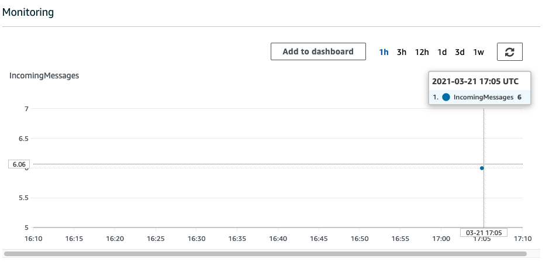

# Ingesting data to AWS IoT Analytics Using the BatchPutMessage API

1. Creating a channel
```bash
aws iotanalytics list-channels --region us-east-1 --profile us-east-1

aws iotanalytics create-channel --cli-input-json file://scripts/create-channel-customerS3.json \
--region us-east-1 --profile us-east-1

aws iotanalytics describe-channel --channel-name ratchannel --region us-east-1 --profile us-east-1
```

2. Creating a data store
```bash
aws iotanalytics list-datastores --region us-east-1 --profile us-east-1

aws iotanalytics create-datastore --cli-input-json file://scripts/create-datastore-customerS3.json \
--region us-east-1 --profile us-east-1

aws iotanalytics describe-datastore --datastore-name ratstore --region us-east-1 --profile us-east-1

aws iotanalytics update-datastore --cli-input-json file://scripts/create-datastore-customerS3.json \
--region us-east-1 --profile us-east-1

aws iotanalytics create-datastore --datastore-name rtmstore_parquet \
--datastore-storagecustomerManagedS3={bucket=ruiliang-iot-datastore,roleArn=arn:aws-cn:iam::account_id:role/service-role/iot-analytics-datastore-role} --region cn-north-1 --profile cn-north-1
```

3. Creating a pipeline
```bash
aws iotanalytics list-pipelines --region us-east-1 --profile us-east-1

aws iotanalytics create-pipeline --cli-input-json file://scripts/create-pipeline.json  \
--region us-east-1 --profile us-east-1

aws iotanalytics describe-pipeline  --pipeline-name ratpipeline --region us-east-1 --profile us-east-1
```

4. Runt the ingest and Monitoring the ingested data
```bash
python scripts/bloodpressure_sim.py 
```
- You can monitor the ingested data from `channel Monitoring` section
- You can monitor the ingested data from `pipeline Monitoring` section for each activity

channel-monitoring


5. Creating a dataset to get the SQL query result

You retrieve data from a data store by creating a SQL dataset or a container dataset. 

- Querying data
```bash
aws iotanalytics create-dataset --cli-input-json file://scripts/select-all-dataset.json \
--region us-east-1 --profile us-east-1

aws iotanalytics create-dataset-content --dataset-name ratdataset \
--region us-east-1 --profile us-east-1

aws iotanalytics create-dataset --cli-input-json file://scripts/select-5mins-dataset.json \
--region us-east-1 --profile us-east-1

aws iotanalytics create-dataset-content --dataset-name ratdataset_5mins \
--region us-east-1 --profile us-east-1
```

```json
"triggers": [
        {
            "schedule": {
                "expression": "rate(5 minutes)"
            }
        }
    ]
OR 
The DatasetTrigger that specifies when the data set is automatically updated. Triggering dataset can be specified only for CONTAINER dataset
"triggers": [
        {
            "dataset": {
                "name": "ratdataset_5mins"
            }
        }
    ]

```

- Accessing the queried data
The result of the query is your data set content, stored as a file, in CSV format.
You can use the Athena to exploer the data
```bash
aws iotanalytics get-dataset-content --dataset-name ratdataset \
--region us-east-1 --profile us-east-1
```

6. Using Athena to get the SQL query result
```bash
pip install pyathena
python scripts/query_athena.py
```