# AWS IoT Events Quick Start

AWS IoT Events enables you to monitor inputs from telemetry data sources and trigger actions based on events. 

In this lab we will set up automated triggers for actions on HAVC equipment based on a sequence of readings for temperature, CO2, room lighting level, and humidity from rooms in a building. 

HAVC will be turned on if 5 consecutive readings indicate that the room is occcupied. A room is considered occupied when the CO2 level is more than 600, or temperature is higher than 70, or light level in the room is greater than 100 lumens. 

Hvac will be turned off if a configurable timer set to 60 seconds counts down successfully when the room was not occupied during the count down period. A room is considered unoccupied when the CO2 level is less than 600, and temperature is less than 70, and light level in the room is less 100 lumens.

## Step 1 - Create two SNS topics and create subscriptions for email notification
1. Create `hvacSetToOff` and `hvacSetToOn` topics
2. Craete the email notification subscription for each topic

## Step 2 - Launch a IoT Events detector model
1. On AWS IoT Events Console -> Create detector model -> Click Create new

## Step 3 - Create the input format
1. Create a JSON file called `sensorData.json` with below content
```json
{ "sensorData": { "co2": 23, "light": 750, "temperature": 47, "humidity": 90 }, "hvacData": { "status": "on" } }
```

2. Upload the input format
- Click on `Create Input` on detector model screen. 
- Input name as `sensorInput` and Description as `Room sensors and hvac status input`. 
- Upload a JSON file with `sensorData.json`. 
- Scroll down and make sure that the check marks against the input elements from the JSON file are selected. 
- Click on `Create`. 
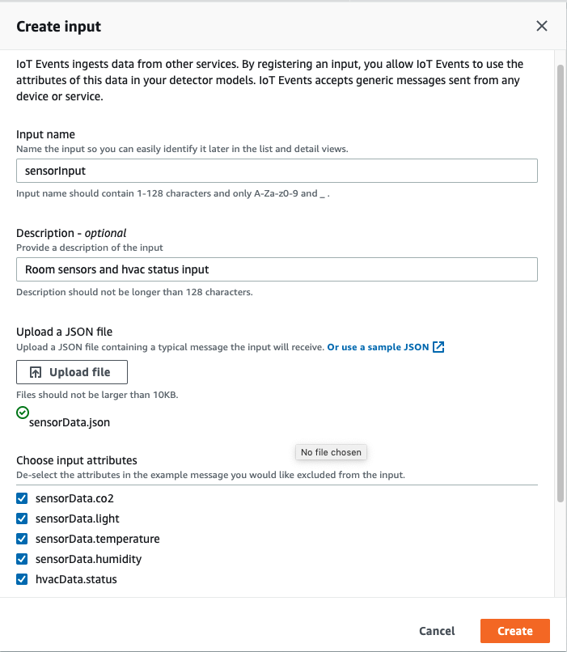

## Step 4 - Create the Detector Model
### Create the `hvacTurnedOn` State
1. Create the `hvacTurnedOn` State: State name `hvacTurnedOn`   
2. Next to `OnEnter`, click on Add event.
- Event name as `initial`
- Event condition as `true`. The event will always be triggered on entry into this state
- Add action to `Set Variable`, `Assign value` of `variable i` to `1`. Then click on Save. 
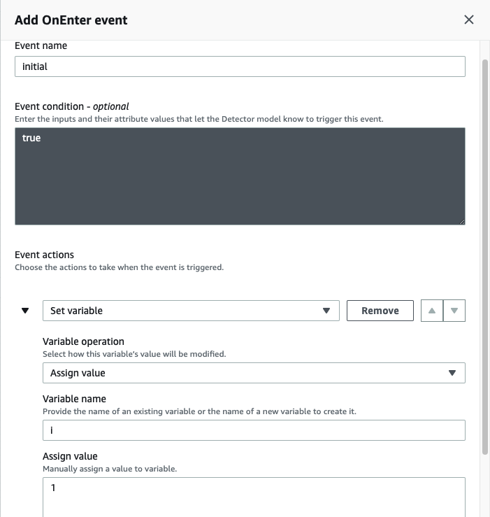

### Create the `hvacTurnedOff` State
1. Create the `hvacTurnedOff` State: State name  `hvacTurnedOff`

2. Next to `OnEnter`, click on Add event.
- Event name as `room unoccupied`
- Event condition as `timeout("unoccupiedDuration")`. The event will be a wait period of 60 seconds for timer to count down to zero, before this condition evaluates to true.
- Add action to `Set Variable`, `Assign value` of `variable i` to `1`. Then click on Save. 
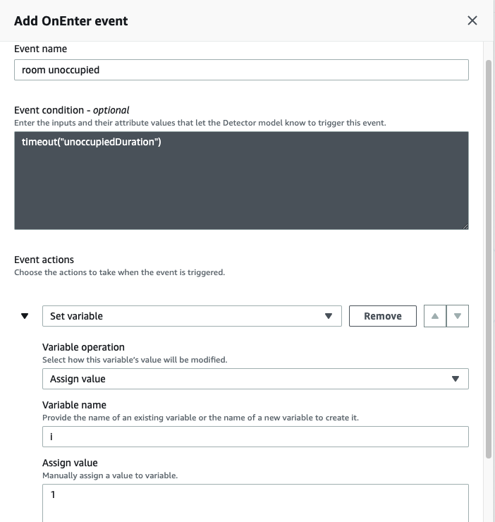

3. Create an `OnInput` entry event for the state `hvacTurnedOff`. 
If the room remains unoccupied until the timer counts to zero, we will turn the hvac off. 
- Next to `OnInput`, click on Add event.
- Event name as `turn off`
- Event condition as `$input.sensorInput.hvacData.status == "on"`. The event will set `sensorInput.hvacData.status` to `on`.
- Add action to `Send SNS message`, enter the `ARN of the SNS topic hvacSetToOff` and use `default payload`
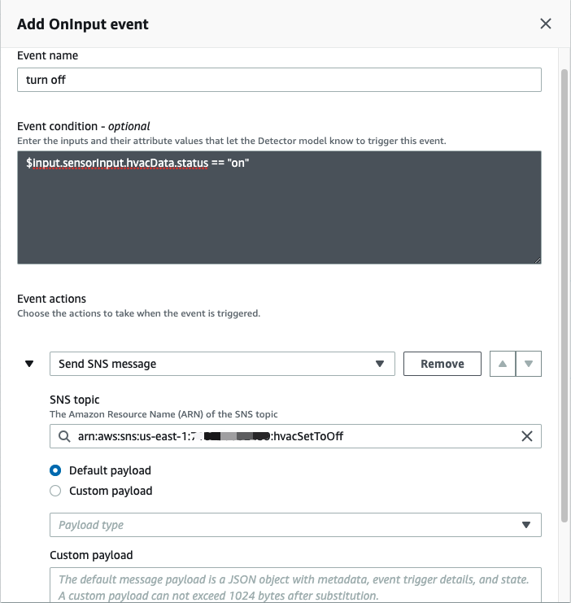

3. Create another `OnInput` entry event for the state `hvacTurnedOff`. 
It used to check for conditions whether the hvac should be turned on
- Next to `OnInput`, click on Add event.
- Event name as `turn on`
- Event condition as `($input.sensorInput.sensorData.co2 >= 600 || $input.sensorInput.sensorData.light >= 100 || $input.sensorInput.sensorData.temperature >= 72 || $input.sensorInput.sensorData.humidity >= 75) && $input.sensorInput.hvacData.status == "off"`. 
- Add action to `Set variable`. Type variable name as `roomOccupied`, select `Increment` as operation. 
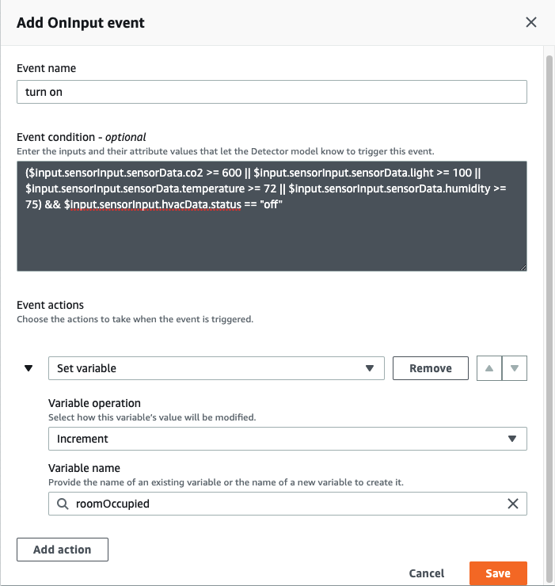

### Create the `RoomUnoccupied` transition event
1. Create the transition element from `hvacTurnedOn` to state `hvacTurnedOff`.
- Event name as `RoomUnoccupied`

2. Event trigger logic `$input.sensorInput.sensorData.co2 < 600 && $input.sensorInput.sensorData.light < 100 && $input.sensorInput.sensorData.temperature < 70  && $input.sensorInput.hvacData.status == "on"`

3. Add Event actions: `Set timer`. For the timer details, select `Create` as operation. Enter timer name as `unoccupiedDuration`, Timer duration as `60`, `Seconds` as Unit. 
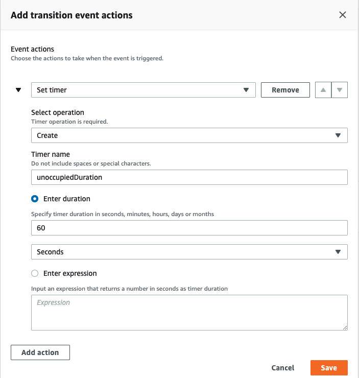

4. Add another Eventaction: `Set variable`. Type variable name as `roomOccupied`, select `Assign value` as operation. For Variable value enter 0. 
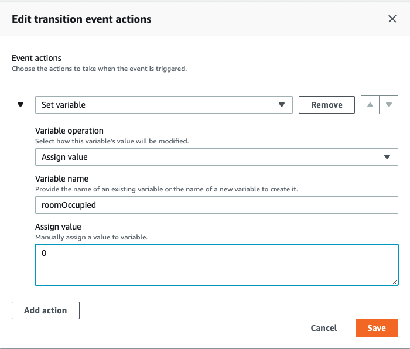


### Create the `RoomUnoccupied` transition event
1. Create the transition element from `hvacTurnedOff` to state `hvacTurnedOn`.
- Event name as `roomOccupied`

2. Event trigger logic `$variable.roomOccupied > 3`
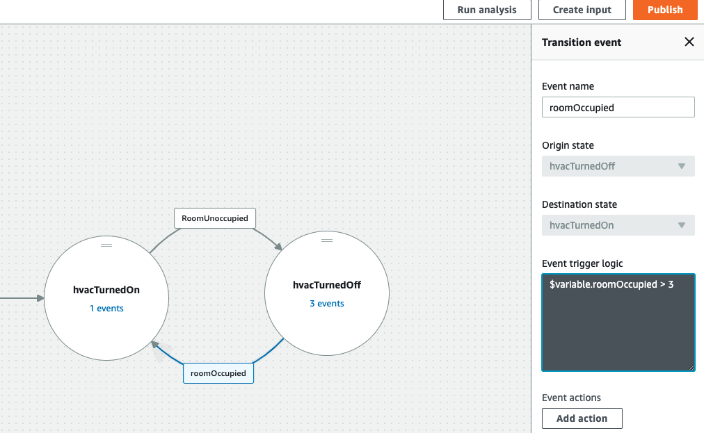

3. Add Event actions: `Send SNS message`. Enter the `ARN of the SNS topic hvacSetToOn` and use `default payload`
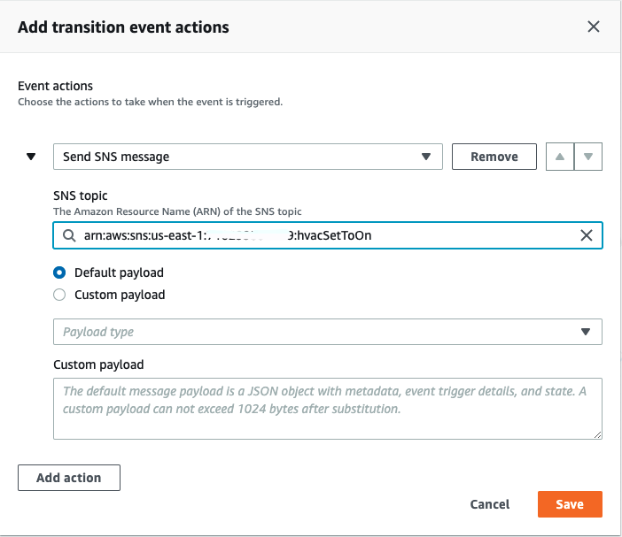

- Add action to `Send SNS message`, enter the `ARN of the SNS topic hvacSetToOff` and use `default payload`


### Connect the `Start` state to `hvacTurnedOn` state
1. Connect the `Start` state to `hvacTurnedOn` state. Click on `Start` in the main window, Select `hvacTurnedOn` from the drop down for Destination state


### Edit detector model
1. Set the detector model name from `Untitled` to `hvacModel` and description as `Turns hvac on or off depending on occupancy`. 

2. Enter IAM role as `workshopIotEventsRole` which will be created with the necessary permissions. 

3. Then choose `Create a detector for each unique key value`. For the Detector creation key enter `RoomId`: By creating a detector for each unique key, you will have separate model instances for each room id. 

4. `Batch evaluation` for evaluation method
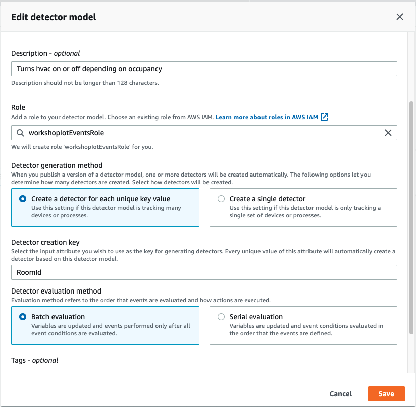

### Publish the detector model. 
1. Click on Publish at the top right of the page. 

## Step 5 - Turn on logging in IoT Events
1. Click on IoT Event `Settings` -> `Edit`
2. Log level: `Info` and IAM Role `IotEventsLogRole`
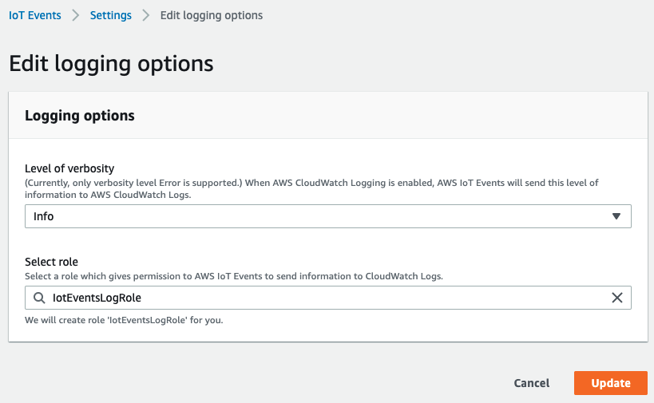

## Step 6 - Configure IoT Core to send sensor data to IoT Events

Create a rule in IoT Core that will listen to messages published to our topic and forward them to the detector.

1. On the Create IoT Core Rules `hvacEventsRule`
- Rule Name: `hvacEventsRule`
- Description: `Forward room sensor inputs to IoT Events`. 
- Query Statement: `SELECT *, topic(2) as RoomId FROM 'hvac/+/status'`. The attribute topic(2) in the select statement will append the second element from the topic (specified RoomId) before sending the message to IoT Events. 
- Select an action `Send a message to an IoT Events Input`. 
    - Input: `sensorInput`
    - Role: `IoTCoreInvokeIotEventsRole`
- Create a rule    


## Step 7 - Test the hvac detector model
1. Publish the following message to topic `hvac/R01/status`.
```json
{ "sensorData": { "co2": 100, "light": 10, "temperature": 65, "humidity": 60 }, "hvacData": { "status": "on" } }
```

The detector based on `RoomId` as `R01` should be created

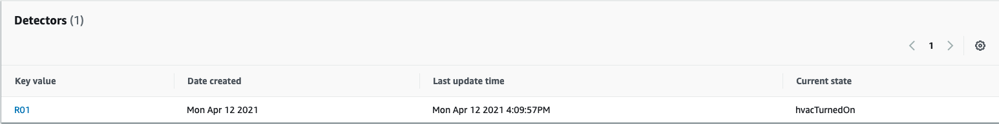

2. After 60 seconds, you will receive message hvac has been turned off
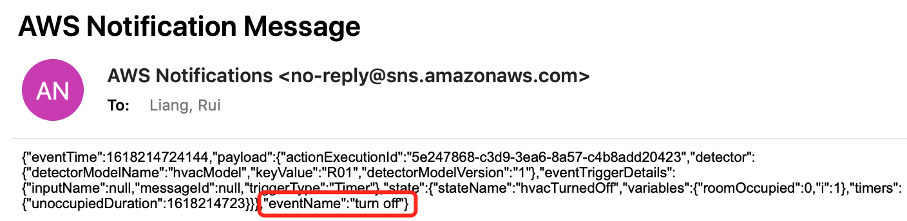

3. Update the inputs to indicate that the room is now occupied. Publish the following message to topic `hvac/R01/status`. You need publish the similar message 5 times.
```json
{ "sensorData": { "co2": 1000, "light": 800, "temperature": 73, "humidity": 80 }, "hvacData": { "status": "off" } }
{ "sensorData": { "co2": 1100, "light": 800, "temperature": 73, "humidity": 80 }, "hvacData": { "status": "off" } }
{ "sensorData": { "co2": 900, "light": 800, "temperature": 73, "humidity": 80 }, "hvacData": { "status": "off" } }
{ "sensorData": { "co2": 1000, "light": 800, "temperature": 83, "humidity": 80 }, "hvacData": { "status": "off" } }
{ "sensorData": { "co2": 800, "light": 600, "temperature": 71, "humidity": 80 }, "hvacData": { "status": "off" } }
```

4. The current state of hvac is off and it should be turned on. 
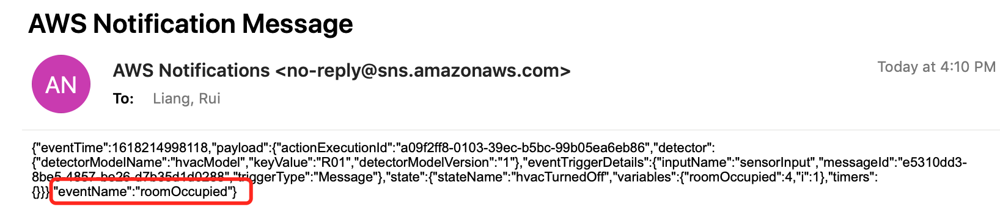

# Reference
[AWS IoT Events Workshop](http://iot.awsworkshops.com/aws-iot-events/lab70-ioteventsgettingstarted/)