# AWS IoT Greengrass V2 Workshop

This workshop based on [Global region AWS IoT Greengrass V2 Workshop](https://greengrassv2.workshop.aws/en/) and can be running on AWS China Beijing region. 

AWS IoT Greengrass is an Internet of Things (IoT) open source edge runtime and cloud service that helps you build, deploy, and manage device software.

You can program your devices to act locally on the data they generate, execute predictions based on machine learning models, filter and aggregate device data, and only transmit necessary information to the cloud.

The following diagram shows how an AWS IoT Greengrass device interacts with the AWS IoT Greengrass cloud service and other AWS services in the AWS Cloud. 

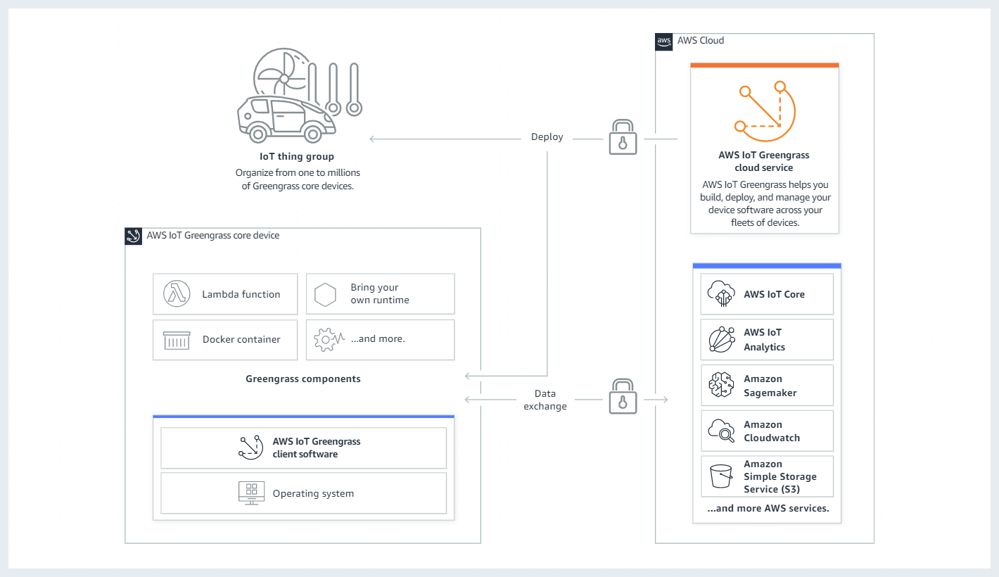
- Greengrass Core device

    A device that runs the AWS IoT Greengrass Core software. A Greengrass Core device is an AWS IoT thing. You can add multiple Core devices to AWS IoT thing groups to create groups of Greengrass Core devices

- Greengrass component

    A Greengrass component is a software module that is deployed to and runs on a Greengrass Core device. All software that is developed and deployed with AWS IoT Greengrass is modeled as a component. AWS IoT Greengrass provides pre-built public components that provide features and functionality that you can use in your applications. You can also develop your own custom components.
    - Recipe: A JSON or YAML file that describes the software module by defining component details, configuration and parameters.
    - Artifact: The source code, binaries, or scripts that define the software that will run on your device: Lambda function, a Docker container or a custom runtime.
    - Dependency: The relationship between components that enables you to enforce automatic updates or restarts of dependent components.

- Deployment

The process to send components and apply the desired component configuration to a destination target device: a single Greengrass core device or a group of Greengrass core devices.

## Notice
1. This workshop running on AWS Beijing region: `cn-north-1`

2. This workshop will use the Cloud9 to simulate the Edge Device. To simulate the remote edge device, I use the Tokyo region: `ap-northeast-1` to launch the Cloud9. You can also launch the Cloud9 instance from AWS China Marketplace. Note if you the China Marketplace Cloud9, it is not Ubuntu OS. You may need change the commands used for following labs to Amazon Linux
- Environment type Create a new EC2 instance for environment (direct access)
- Instance type m5.large (8 GiB RAM + 2 vCPU)
- Platform Ubuntu Server 18.04 LTS

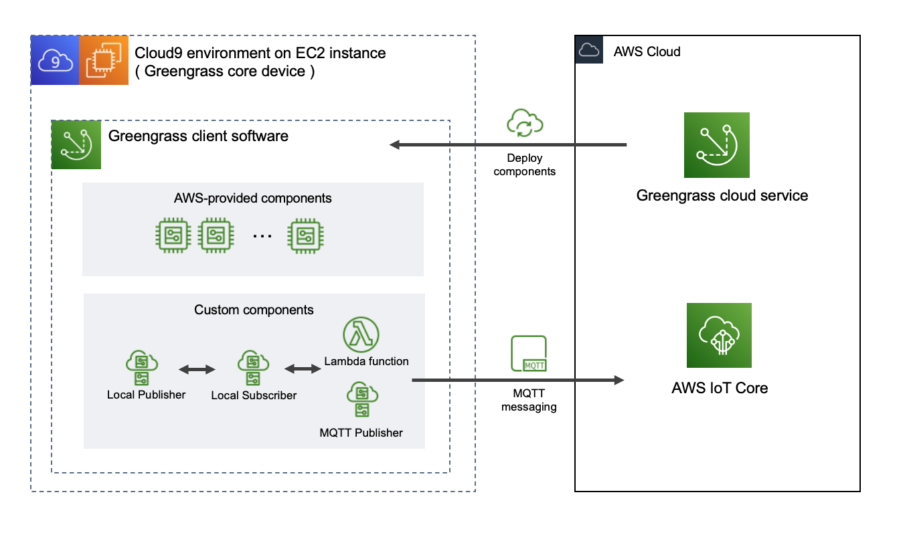

3. I used the `ap-northeast-1` Cloud9 as edge device and IoT greengrass will be located in AWS Beijing region: `cn-north-1`. So I need use the AWS Beijing region: `cn-north-1` credential. 

The Minimal IAM policy for installer to provision AWS IoT Greengrass Core software resources : https://docs.aws.amazon.com/greengrass/v2/developerguide/provision-minimal-iam-policy.html 

```bash
> aws configure
AWS Access Key ID [None]: xxxxxxxxxxxxxx
AWS Secret Access Key [None]: xxxxxxxxxxxxxxxxxxxxxxxxxx
Default region name [None]: cn-north-1
Default output format [None]: json

export AWS_DEFAULT_REGION=cn-north-1
export AWS_ACCESS_KEY_ID="The AccessKeyId value of the result above"
export AWS_SECRET_ACCESS_KEY="The SecretAccessKey value of the result above"
```

4. Please update the IAM Policy and ARN using AWS China format: `arn:aws-cn`

5. Set the cloud9 security group inbound rules


## Run the workshop

Follow up the guide [AWS IoT Greengrass V2 Workshop](https://greengrassv2.workshop.aws/en/)

***Note, IoT greengrass cloud service and IoT core are running on AWS Beijing region: `cn-north-1` and Greengrass core device is running on Cloud9 environment on Tokyo region: `ap-northeast-1`***

### Lab 1: Greengrass setup
1. Greengrass setup
```bash
Admin:~/environment $ mkdir ggworkshop
Admin:~/environment $ cd ggworkshop/

Admin:~/environment/ggworkshop $ curl -s https://d2s8p88vqu9w66.cloudfront.net/releases/greengrass-nucleus-latest.zip > greengrass-nucleus-latest.zip && unzip greengrass-nucleus-latest.zip -d GreengrassCore
Archive:  greengrass-nucleus-latest.zip
  inflating: GreengrassCore/LICENSE  
  inflating: GreengrassCore/NOTICE   
  inflating: GreengrassCore/README.md  
  inflating: GreengrassCore/THIRD-PARTY-LICENSES  
  inflating: GreengrassCore/bin/greengrass.service.template  
  inflating: GreengrassCore/bin/loader  
  inflating: GreengrassCore/bin/loader.cmd  
  inflating: GreengrassCore/conf/recipe.yaml  
  inflating: GreengrassCore/lib/Greengrass.jar  
Admin:~/environment/ggworkshop $ ls
GreengrassCore  greengrass-nucleus-latest.zip

Admin:~/environment/ggworkshop $ sudo -E java -Droot="/greengrass/v2" -Dlog.store=FILE -jar ./GreengrassCore/lib/Greengrass.jar --aws-region cn-north-1 --thing-name GreengrassQuickStartCore-20210624 --thing-group-name GreengrassQuickStartGroup --component-default-user ggc_user:ggc_group --provision true --setup-system-service true --deploy-dev-tools true
Creating user ggc_user 
ggc_user created 
Creating group ggc_group 
ggc_group created 
Added ggc_user to ggc_group 
Provisioning AWS IoT resources for the device with IoT Thing Name: [GreengrassQuickStartCore-20210624]...
Creating new IoT policy "GreengrassV2IoTThingPolicy"
Creating keys and certificate...
Attaching policy to certificate...
Creating IoT Thing "GreengrassQuickStartCore-20210624"...
Attaching certificate to IoT thing...
Successfully provisioned AWS IoT resources for the device with IoT Thing Name: [GreengrassQuickStartCore-20210624]!
Adding IoT Thing [GreengrassQuickStartCore-20210624] into Thing Group: [GreengrassQuickStartGroup]...
Successfully added Thing into Thing Group: [GreengrassQuickStartGroup]
Setting up resources for aws.greengrass.TokenExchangeService ... 
TES role alias "GreengrassV2TokenExchangeRoleAlias" does not exist, creating new alias...
TES role "GreengrassV2TokenExchangeRole" does not exist, creating role...
IoT role policy "GreengrassTESCertificatePolicyGreengrassV2TokenExchangeRoleAlias" for TES Role alias not exist, creating policy...
Attaching TES role policy to IoT thing...
No managed IAM policy found, looking for user defined policy...
No IAM policy found, will attempt creating one...
IAM role policy for TES "GreengrassV2TokenExchangeRoleAccess" created. This policy DOES NOT have S3 access, please modify it with your private components' artifact buckets/objects as needed when you create and deploy private components 
Attaching IAM role policy for TES to IAM role for TES...
Configuring Nucleus with provisioned resource details...
Downloading Root CA from "https://www.amazontrust.com/repository/AmazonRootCA1.pem"
Created device configuration
Successfully configured Nucleus with provisioned resource details!
Creating a deployment for Greengrass first party components to the thing group
Configured Nucleus to deploy aws.greengrass.Cli component
Successfully set up Nucleus as a system service
```

```bash
Admin:~/environment/ggworkshop $ /greengrass/v2/bin/greengrass-cli -V
Greengrass CLI Version: 2.2.0

Admin:~/environment/ggworkshop $ sudo systemctl status greengrass.service
● greengrass.service - Greengrass Core
   Loaded: loaded (/etc/systemd/system/greengrass.service; enabled; vendor preset: enabled)
   Active: active (running) since Thu 2021-06-24 11:05:00 UTC; 1min 38s ago
 Main PID: 4690 (sh)
    Tasks: 33 (limit: 4915)
   CGroup: /system.slice/greengrass.service
           ├─4690 /bin/sh /greengrass/v2/alts/current/distro/bin/loader
           └─4704 java -Dlog.store=FILE -Dlog.store=FILE -Droot=/greengrass/v2 -jar /greengrass/v2/alts/current/distro/lib/Greengrass.jar --setup-system-service false

Jun 24 11:05:00 ip-172-16-95-40 systemd[1]: Started Greengrass Core.
Jun 24 11:05:00 ip-172-16-95-40 sh[4690]: Greengrass root: /greengrass/v2
Jun 24 11:05:00 ip-172-16-95-40 sh[4690]: JVM options: -Dlog.store=FILE -Droot=/greengrass/v2
Jun 24 11:05:00 ip-172-16-95-40 sh[4690]: Nucleus options: --setup-system-service false
Jun 24 11:05:03 ip-172-16-95-40 sh[4690]: Launching Nucleus...
Jun 24 11:05:03 ip-172-16-95-40 sh[4690]: AWS libcrypto resolve: searching process and loaded modules
Jun 24 11:05:03 ip-172-16-95-40 sh[4690]: AWS libcrypto resolve: found static aws-lc HMAC symbols
Jun 24 11:05:03 ip-172-16-95-40 sh[4690]: AWS libcrypto resolve: found static aws-lc libcrypto 1.1.1 EVP_MD symbols
Jun 24 11:05:04 ip-172-16-95-40 sh[4690]: Launched Nucleus successfully.

Admin:~/environment/ggworkshop $ sudo systemctl enable greengrass.service
```

2. IAM Policy Setup
***Note: Please update the IAM Policy and ARN using AWS China format: `arn:aws-cn`***

## Lab 2 Create First component
1. Build the local deployment of your component for testing
```bash
# Creating component artifacts
Admin:~/environment $ mkdir -p ~/environment/ggworkshop/GreengrassCore/artifacts/com.example.HelloWorld/1.0.0 && touch ~/environment/ggworkshop/GreengrassCore/artifacts/com.example.HelloWorld/1.0.0/hello_world.py

# Creating a recipe for a component
Admin:~/environment $ mkdir -p ggworkshop/GreengrassCore/recipes && touch ggworkshop/GreengrassCore/recipes/com.example.HelloWorld-1.0.0.json

# Local deployment
sudo /greengrass/v2/bin/greengrass-cli deployment create \
  --recipeDir ~/environment/ggworkshop/GreengrassCore/recipes \
  --artifactDir ~/environment/ggworkshop/GreengrassCore/artifacts \
  --merge "com.example.HelloWorld=1.0.0"
AWS libcrypto resolve: searching process and loaded modules
AWS libcrypto resolve: found static aws-lc HMAC symbols
AWS libcrypto resolve: found static aws-lc libcrypto 1.1.1 EVP_MD symbols
Jun 28, 2021 4:15:43 PM software.amazon.awssdk.eventstreamrpc.EventStreamRPCConnection$1 onConnectionSetup
INFO: Socket connection /greengrass/v2/ipc.socket:8033 to server result [AWS_ERROR_SUCCESS]
Jun 28, 2021 4:15:43 PM software.amazon.awssdk.eventstreamrpc.EventStreamRPCConnection$1 onProtocolMessage
INFO: Connection established with event stream RPC server
Local deployment submitted! Deployment Id: 216901bf-b7b5-49b6-bc66-41ae4fabb626

# Run the component
sudo tail -F /greengrass/v2/logs/greengrass.log
2021-06-28T16:16:04.662Z [INFO] (pool-2-thread-11) com.aws.greengrass.deployment.DeploymentService: Current deployment finished. {DeploymentId=216901bf-b7b5-49b6-bc66-41ae4fabb626, serviceName=DeploymentService, currentState=RUNNING}
2021-06-28T16:16:04.699Z [INFO] (pool-2-thread-11) com.aws.greengrass.deployment.DeploymentStatusKeeper: Stored deployment status. {DeploymentId=216901bf-b7b5-49b6-bc66-41ae4fabb626, DeploymentStatus=SUCCEEDED}

tail -F /tmp/Greengrass_HelloWorld.log
Hello, gcr ggworkshop world! Current time: 2021-06-28 15:17:15.753868.
Hello, gcr ggworkshop world! Current time: 2021-06-28 15:17:16.755044.
Hello, gcr ggworkshop world! Current time: 2021-06-28 15:17:17.756215.
```

2. Publish your component to AWS for deployment to other devices 
```bash
aws s3 cp --recursive /home/ubuntu/environment/ggworkshop/GreengrassCore/ s3://iot-workshop-lab/ggcv2-workshop/quickstart/ --region cn-north-1 --profile cn-north-1

cd /home/ubuntu/environment/ggworkshop/GreengrassCore/recipes && aws greengrassv2 create-component-version  --inline-recipe fileb://com.example.HelloWorld-1.0.0.cloud.json --region cn-north-1
{
    "arn": "arn:aws-cn:greengrass:cn-north-1:876820548815:components:com.example.HelloWorld:versions:1.0.0",
    "componentName": "com.example.HelloWorld",
    "componentVersion": "1.0.0",
    "creationTimestamp": "2021-06-28T15:40:57.260000+00:00",
    "status": {
        "componentState": "REQUESTED",
        "message": "NONE",
        "errors": {}
    }
}

aws greengrassv2 list-components --region cn-north-1
{
    "components": [
        {
            "arn": "arn:aws-cn:greengrass:cn-north-1:876820548815:components:com.example.HelloWorld",
            "componentName": "com.example.HelloWorld",
            "latestVersion": {
                "arn": "arn:aws-cn:greengrass:cn-north-1:876820548815:components:com.example.HelloWorld:versions:1.0.0",
                "componentVersion": "1.0.0",
                "creationTimestamp": "2021-06-28T15:40:57.260000+00:00",
                "description": "My first AWS IoT Greengrass component.",
                "publisher": "Amazon",
                "platforms": [
                    {
                        "attributes": {
                            "os": "linux"
                        }
                    }
                ]
            }
        }
    ]
}
```

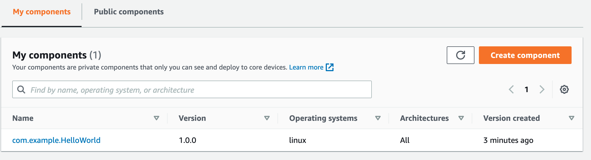

## Lab 3 Pub / Sub inter-process communication (IPC) 

By using IPC SDK feature, Publisher (Pub) and Subscriber (Sub) communication can be performed between each process of the custom component.

The local publisher and local subscriber concepts which allowed the Greengrass device to act as the data provider

This lab show how to create 
- a component that reads sensor data and keeps publishing to a topic, 
- a component that subscribes to that topic logs and receives the messages, 
- a custom component that uses IPC.

1. Publisher implementation
```bash
mkdir -p ~/environment/ggworkshop/GreengrassCore/artifacts/com.example.Publisher/1.0.0 && cd ~/environment/ggworkshop/GreengrassCore/artifacts/com.example.Publisher/1.0.0
touch example_publisher.py dummy_sensor.py

touch ~/environment/ggworkshop/GreengrassCore/recipes/com.example.Publisher-1.0.0.json 

# Local deployment
sudo /greengrass/v2/bin/greengrass-cli deployment create \
  --recipeDir ~/environment/ggworkshop/GreengrassCore/recipes \
  --artifactDir ~/environment/ggworkshop/GreengrassCore/artifacts \
  --merge "com.example.Publisher=1.0.0"
AWS libcrypto resolve: searching process and loaded modules
AWS libcrypto resolve: found static aws-lc HMAC symbols
AWS libcrypto resolve: found static aws-lc libcrypto 1.1.1 EVP_MD symbols
Jun 28, 2021 4:21:11 PM software.amazon.awssdk.eventstreamrpc.EventStreamRPCConnection$1 onConnectionSetup
INFO: Socket connection /greengrass/v2/ipc.socket:8033 to server result [AWS_ERROR_SUCCESS]
Jun 28, 2021 4:21:11 PM software.amazon.awssdk.eventstreamrpc.EventStreamRPCConnection$1 onProtocolMessage
INFO: Connection established with event stream RPC server
Local deployment submitted! Deployment Id: 6222ba9b-8587-4751-859b-0b1469777165

sudo tail -F /greengrass/v2/logs/greengrass.log
2021-06-28T16:21:34.751Z [INFO] (pool-2-thread-11) com.aws.greengrass.deployment.DeploymentService: Current deployment finished. {DeploymentId=6222ba9b-8587-4751-859b-0b1469777165, serviceName=DeploymentService, currentState=RUNNING}
2021-06-28T16:21:34.810Z [INFO] (pool-2-thread-11) com.aws.greengrass.deployment.DeploymentStatusKeeper: Stored deployment status. {DeploymentId=6222ba9b-8587-4751-859b-0b1469777165, DeploymentStatus=SUCCEEDED}

tail -F /tmp/Greengrass_Publisher.log


```

2. Subscriber implementation
```bash
mkdir -p ~/environment/ggworkshop/GreengrassCore/artifacts/com.example.Subscriber/1.0.0 && cd ~/environment/ggworkshop/GreengrassCore/artifacts/com.example.Subscriber/1.0.0
touch example_subscriber.py

touch ~/environment/ggworkshop/GreengrassCore/recipes/com.example.Subscriber-1.0.0.json 

sudo /greengrass/v2/bin/greengrass-cli deployment create \
  --recipeDir ~/environment/ggworkshop/GreengrassCore/recipes \
  --artifactDir ~/environment/ggworkshop/GreengrassCore/artifacts \
  --merge "com.example.Subscriber=1.0.0"
AWS libcrypto resolve: searching process and loaded modules
AWS libcrypto resolve: found static aws-lc HMAC symbols
AWS libcrypto resolve: found static aws-lc libcrypto 1.1.1 EVP_MD symbols
Jun 28, 2021 4:23:36 PM software.amazon.awssdk.eventstreamrpc.EventStreamRPCConnection$1 onConnectionSetup
INFO: Socket connection /greengrass/v2/ipc.socket:8033 to server result [AWS_ERROR_SUCCESS]
Jun 28, 2021 4:23:36 PM software.amazon.awssdk.eventstreamrpc.EventStreamRPCConnection$1 onProtocolMessage
INFO: Connection established with event stream RPC server
Local deployment submitted! Deployment Id: b3b02ff7-f2f3-40a3-b842-baa9a0bbfc00

sudo tail -F /greengrass/v2/logs/greengrass.log
2021-06-28T16:24:04.860Z [INFO] (pool-2-thread-11) com.aws.greengrass.deployment.DeploymentService: Current deployment finished. {DeploymentId=b3b02ff7-f2f3-40a3-b842-baa9a0bbfc00, serviceName=DeploymentService, currentState=RUNNING}
2021-06-28T16:24:04.925Z [INFO] (pool-2-thread-11) com.aws.greengrass.deployment.DeploymentStatusKeeper: Stored deployment status. {DeploymentId=b3b02ff7-f2f3-40a3-b842-baa9a0bbfc00, DeploymentStatus=SUCCEEDED}

aws greengrassv2 list-effective-deployments --core-device-thing-name GreengrassQuickStartCore-20210624 --region cn-north-1

{
    "effectiveDeployments": [
        {
            "deploymentId": "396b4463-b8dc-445e-9285-c7178c1c9e23",
            "deploymentName": "Deployment for GreengrassQuickStartGroup",
            "iotJobId": "d25c5a37-4e96-4c79-9c16-b11197ba0016",
            "iotJobArn": "arn:aws-cn:iot:cn-north-1:876820548815:job/d25c5a37-4e96-4c79-9c16-b11197ba0016",
            "targetArn": "arn:aws-cn:iot:cn-north-1:876820548815:thinggroup/GreengrassQuickStartGroup",
            "coreDeviceExecutionStatus": "SUCCEEDED",
            "reason": "SUCCESSFUL",
            "creationTimestamp": "2021-06-24T11:04:59.971000+00:00",
            "modifiedTimestamp": "2021-06-24T11:04:59.971000+00:00"
        }
    ]
}

tail -F /tmp/Greengrass_Subscriber.log
{'timestamp': '2021-06-28 16:24:22.506476', 'value': 25.911408566751078}
{'timestamp': '2021-06-28 16:24:23.508547', 'value': 26.520449940591366}
{'timestamp': '2021-06-28 16:24:24.510606', 'value': 26.134682239352856}
{'timestamp': '2021-06-28 16:24:25.512673', 'value': 25.429967621778765}
{'timestamp': '2021-06-28 16:24:26.514768', 'value': 26.193506179190702}
```

3. Check the local deployment
```bash
sudo /greengrass/v2/bin/greengrass-cli component list

AWS libcrypto resolve: searching process and loaded modules
AWS libcrypto resolve: found static aws-lc HMAC symbols
AWS libcrypto resolve: found static aws-lc libcrypto 1.1.1 EVP_MD symbols
Jun 28, 2021 4:25:51 PM software.amazon.awssdk.eventstreamrpc.EventStreamRPCConnection$1 onConnectionSetup
INFO: Socket connection /greengrass/v2/ipc.socket:8033 to server result [AWS_ERROR_SUCCESS]
Jun 28, 2021 4:25:51 PM software.amazon.awssdk.eventstreamrpc.EventStreamRPCConnection$1 onProtocolMessage
INFO: Connection established with event stream RPC server
Components currently running in Greengrass:
Component Name: aws.greengrass.Nucleus
    Version: 2.2.0
    State: FINISHED
    Configuration: {"awsRegion":"cn-north-1","componentStoreMaxSizeBytes":"10000000000","deploymentPollingFrequency":"15","deploymentPollingFrequencySeconds":15.0,"envStage":"prod","fleetStatus":{"periodicStatusPublishIntervalSeconds":86400.0},"greengrassDataPlanePort":"8443","iotCredEndpoint":"cl2wym6klmhng.credentials.iot.cn-north-1.amazonaws.com.cn","iotDataEndpoint":"a3lk6rh9gr0knb.ats.iot.cn-north-1.amazonaws.com.cn","iotRoleAlias":"GreengrassV2TokenExchangeRoleAlias","jvmOptions":"-Dlog.store=FILE","logging":{},"mqtt":{"spooler":{}},"networkProxy":{"proxy":{}},"platformOverride":{},"runWithDefault":{"posixShell":"sh","posixUser":"ggc_user:ggc_group"},"telemetry":{}}
Component Name: DeploymentService
    Version: 0.0.0
    State: RUNNING
    Configuration: null
Component Name: com.example.HelloWorld
    Version: 1.0.0
    State: RUNNING
    Configuration: {"Message":"gcr ggworkshop world"}
Component Name: com.example.Publisher
    Version: 1.0.0
    State: RUNNING
    Configuration: {"accessControl":{"aws.greengrass.ipc.pubsub":{"com.example.Publisher:pubsub:1":{"operations":["aws.greengrass#PublishToTopic"],"policyDescription":"Allows access to publish to all topics.","resources":["*"]}}}}
Component Name: FleetStatusService
    Version: 0.0.0
    State: RUNNING
    Configuration: null
Component Name: aws.greengrass.Cli
    Version: 2.2.0
    State: RUNNING
    Configuration: {"AuthorizedPosixGroups":null}
Component Name: UpdateSystemPolicyService
    Version: 0.0.0
    State: RUNNING
    Configuration: null
Component Name: TelemetryAgent
    Version: 0.0.0
    State: RUNNING
    Configuration: null
Component Name: com.example.Subscriber
    Version: 1.0.0
    State: RUNNING
    Configuration: {"accessControl":{"aws.greengrass.ipc.pubsub":{"com.example.Subscriber:pubsub:1":{"operations":["aws.greengrass#SubscribeToTopic"],"policyDescription":"Allows access to publish to all topics.","resources":["*"]}}}}
```

4. Publish your component to AWS for deployment to other devices 
```bash
aws s3 cp --recursive /home/ubuntu/environment/ggworkshop/GreengrassCore/ s3://iot-workshop-lab/ggcv2-workshop/quickstart/ --region cn-north-1 --profile cn-north-1

cd /home/ubuntu/environment/ggworkshop/GreengrassCore/recipes && aws greengrassv2 create-component-version  --inline-recipe fileb://com.example.Publisher-1.0.0.cloud.json --region cn-north-1
{
    "arn": "arn:aws-cn:greengrass:cn-north-1:876820548815:components:com.example.Publisher:versions:1.0.0",
    "componentName": "com.example.Publisher",
    "componentVersion": "1.0.0",
    "creationTimestamp": "2021-06-28T16:36:40.409000+00:00",
    "status": {
        "componentState": "REQUESTED",
        "message": "NONE",
        "errors": {}
    }
}


aws s3 cp --recursive /home/ubuntu/environment/ggworkshop/GreengrassCore/ s3://iot-workshop-lab/ggcv2-workshop/quickstart/ --region cn-north-1 --profile cn-north-1

cd /home/ubuntu/environment/ggworkshop/GreengrassCore/recipes && aws greengrassv2 create-component-version  --inline-recipe fileb://com.example.Subscriber-1.0.0.cloud.json --region cn-north-1
{
    "arn": "arn:aws-cn:greengrass:cn-north-1:876820548815:components:com.example.Subscriber:versions:1.0.0",
    "componentName": "com.example.Subscriber",
    "componentVersion": "1.0.0",
    "creationTimestamp": "2021-06-28T16:38:40.299000+00:00",
    "status": {
        "componentState": "REQUESTED",
        "message": "NONE",
        "errors": {}
    }
}

aws greengrassv2 list-components --region cn-north-1
{
    "components": [
        {
            "arn": "arn:aws-cn:greengrass:cn-north-1:876820548815:components:com.example.Subscriber",
            "componentName": "com.example.Subscriber",
            "latestVersion": {
                "arn": "arn:aws-cn:greengrass:cn-north-1:876820548815:components:com.example.Subscriber:versions:1.0.0",
                "componentVersion": "1.0.0",
                "creationTimestamp": "2021-06-28T16:38:40.299000+00:00",
                "description": "A component that subscribes to messages.",
                "publisher": "Amazon",
                "platforms": [
                    {
                        "attributes": {}
                    }
                ]
            }
        },
        {
            "arn": "arn:aws-cn:greengrass:cn-north-1:876820548815:components:com.example.Publisher",
            "componentName": "com.example.Publisher",
            "latestVersion": {
                "arn": "arn:aws-cn:greengrass:cn-north-1:876820548815:components:com.example.Publisher:versions:1.0.0",
                "componentVersion": "1.0.0",
                "creationTimestamp": "2021-06-28T16:36:40.409000+00:00",
                "description": "A component that publishes messages.",
                "publisher": "Amazon",
                "platforms": [
                    {
                        "attributes": {}
                    }
                ]
            }
        },
        {
            "arn": "arn:aws-cn:greengrass:cn-north-1:876820548815:components:com.example.HelloWorld",
            "componentName": "com.example.HelloWorld",
            "latestVersion": {
                "arn": "arn:aws-cn:greengrass:cn-north-1:876820548815:components:com.example.HelloWorld:versions:1.0.0",
                "componentVersion": "1.0.0",
                "creationTimestamp": "2021-06-28T16:29:27.878000+00:00",
                "description": "My first AWS IoT Greengrass component.",
                "publisher": "Amazon",
                "platforms": [
                    {
                        "attributes": {
                            "os": "linux"
                        }
                    }
                ]
            }
        }
    ]
}
```

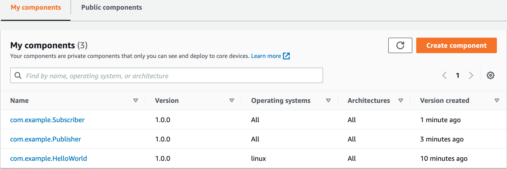

## Lab4 Greengrass Lambda to IoT Core

The Greengrass 2.0 Lambda function allows you to specify local PubSub communication (interprocess communication) or IoT Core MQTT messages as the event source.

The local publisher and local subscriber concepts which allowed the Greengrass device to act as the data provider

AWS Lambda function as a custom component to communicate between the processes of the custom component and with the IoT Core in the cloud

1. Creating a lambda function code
```bash
mkdir -p ~/environment/lambda && touch ~/environment/lambda/lambda_function.py

aws iot describe-endpoint --endpoint-type iot:Data-ATS --region cn-north-1
```

2. Creating the deployment package
```bash
cd ~/environment/lambda
docker run --rm -v $(pwd):/var/task amazon/aws-sam-cli-build-image-python3.8:latest \
pip install boto3 -t ./

#  zip the script files
zip -r lambda_artifact.zip ./ 

# Download zip file
```

3. Create the lambda function on `cn-north-1` region Console
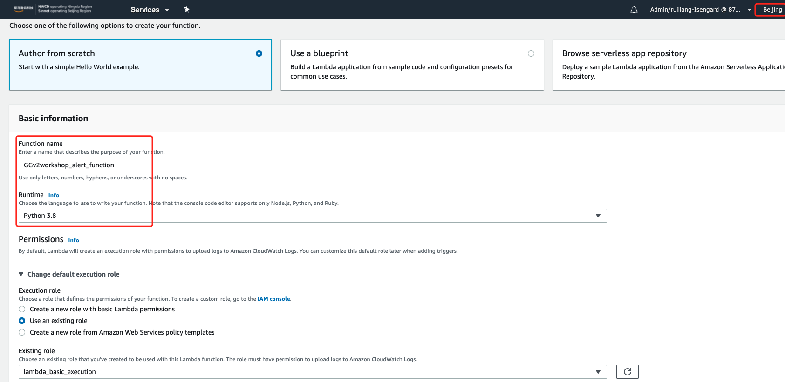

4. Creating and deploying components of greengrass
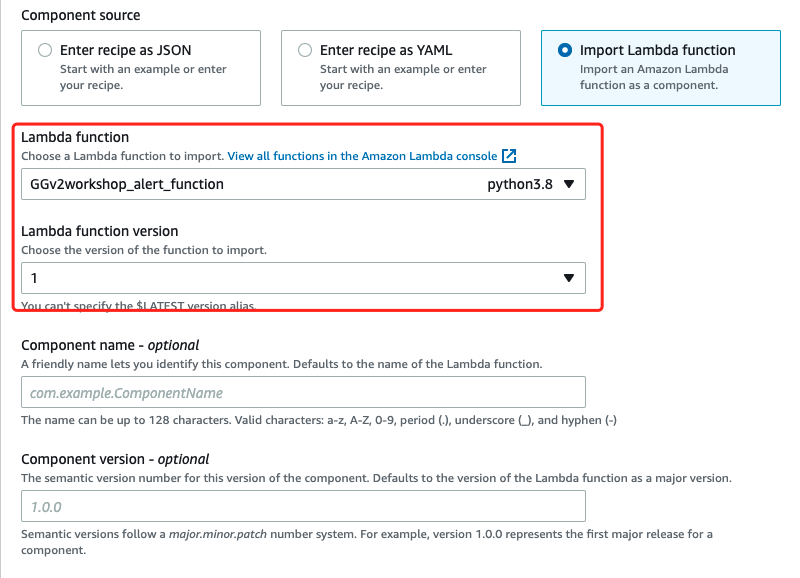
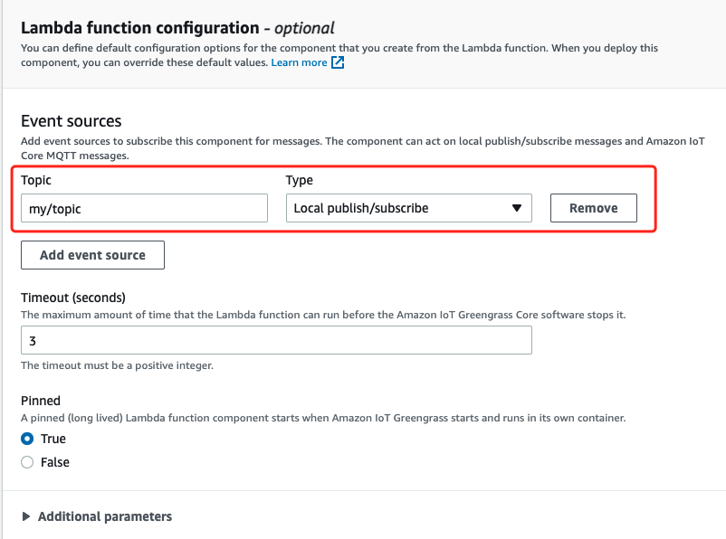
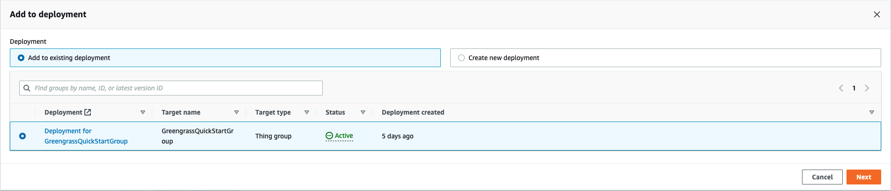

Check the greengrass logs
```bash
sudo tail -F /greengrass/v2/logs/greengrass.log
```

Check the IoT Greengrass console
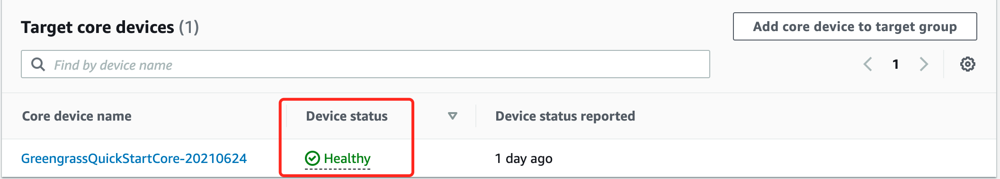

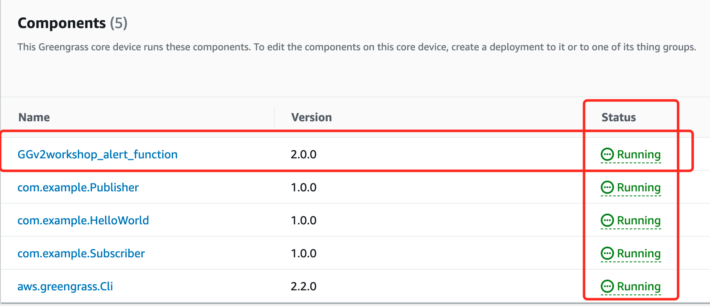

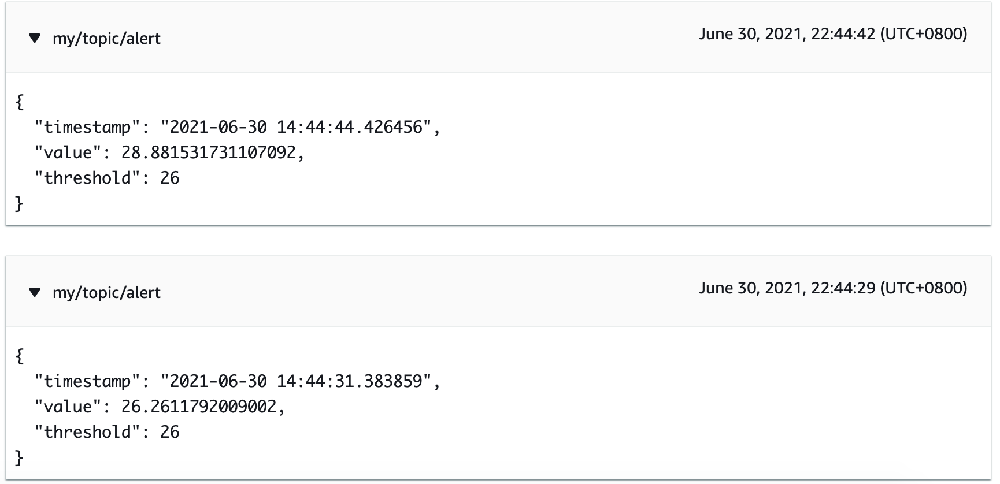

## Lab 5 Local MQTT Broker

When the data provider resides outside of the Greengrass device, a publish target can be introduced in the form of an MQTT Bridge. This is turning the Greengrass device into an Local MQTT Gateway. This enables architectures that fit restricted network use-cases (such as with Industrial IoT environments) or local communications and processing as with Smart Home use cases. The data provider device in the restricted network and Greengrass Core acting as Device Gateway hosted in DMZ network.

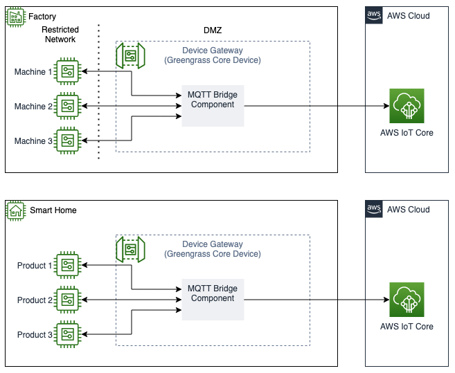

1. Create the MQTT Bridge using Mosquitto
```bash
mkdir -p ~/environment/ggworkshop/GreengrassCore/artifacts/com.example.MqttBridge/1.0.0 && cd ~/environment/ggworkshop/GreengrassCore/artifacts/com.example.MqttBridge/1.0.0
touch mosquitto.conf bridge.conf cleanup.sh startup.sh

aws iot describe-endpoint --endpoint-type iot:Data-ATS --region cn-north-1
```

- Edit the mosquitto.conf bridge.conf cleanup.sh startup.sh
- Create a recipe
```bash
touch ~/environment/ggworkshop/GreengrassCore/recipes/com.example.MqttBridge-1.0.0.json 
```
- Deploy the component
```bash
sudo /greengrass/v2/bin/greengrass-cli deployment create \
  --recipeDir ~/environment/ggworkshop/GreengrassCore/recipes \
  --artifactDir ~/environment/ggworkshop/GreengrassCore/artifacts \
  --merge "com.example.MqttBridge=1.0.0"

AWS libcrypto resolve: searching process and loaded modules
AWS libcrypto resolve: found static aws-lc HMAC symbols
AWS libcrypto resolve: found static aws-lc libcrypto 1.1.1 EVP_MD symbols
Jun 30, 2021 3:03:59 PM software.amazon.awssdk.eventstreamrpc.EventStreamRPCConnection$1 onConnectionSetup
INFO: Socket connection /greengrass/v2/ipc.socket:8033 to server result [AWS_ERROR_SUCCESS]
Jun 30, 2021 3:03:59 PM software.amazon.awssdk.eventstreamrpc.EventStreamRPCConnection$1 onProtocolMessage
INFO: Connection established with event stream RPC server
Local deployment submitted! Deployment Id: 11a30a19-33bc-4fa1-a147-26cc0f6f9bc2

sudo tail -F /greengrass/v2/logs/greengrass.log

2021-06-30T15:04:22.027Z [INFO] (pool-2-thread-30) com.aws.greengrass.deployment.DeploymentService: deployment-task-execution. Finished deployment task. {deploymentId=11a30a19-33bc-4fa1-a147-26cc0f6f9bc2, serviceName=DeploymentService, currentState=RUNNING}
2021-06-30T15:04:37.207Z [INFO] (pool-2-thread-29) com.aws.greengrass.deployment.DeploymentService: Current deployment finished. {DeploymentId=11a30a19-33bc-4fa1-a147-26cc0f6f9bc2, serviceName=DeploymentService, currentState=RUNNING}
2021-06-30T15:04:37.314Z [INFO] (pool-2-thread-29) com.aws.greengrass.deployment.DeploymentStatusKeeper: Stored deployment status. {DeploymentId=11a30a19-33bc-4fa1-a147-26cc0f6f9bc2, DeploymentStatus=SUCCEEDED}


sudo tail -f /greengrass/v2/logs/com.example.MqttBridge.log

sudo /greengrass/v2/bin/greengrass-cli component list
Component Name: com.example.MqttBridge
    Version: 1.0.0
    State: RUNNING
    Configuration: {"region":"cn-north-1"}

ps -aux | grep mosquitto

systemctl status mosquitto

mosquitto -v

netstat -plnt

sudo /greengrass/v2/bin/greengrass-cli component restart --names "com.example.MqttBridge"
```

- Optional, publish to Cloud IoT Greengrass
aws s3 cp --recursive /home/ubuntu/environment/ggworkshop/GreengrassCore/ s3://iot-workshop-lab/ggcv2-workshop/quickstart/ --region cn-north-1

cd ~/environment/ggworkshop/GreengrassCore/recipes && aws greengrassv2 create-component-version --inline-recipe fileb://com.example.MqttBridge-1.0.0.cloud.json --region cn-north-1
{
    "arn": "arn:aws-cn:greengrass:cn-north-1:876820548815:components:com.example.MqttBridge:versions:1.0.0",
    "componentName": "com.example.MqttBridge",
    "componentVersion": "1.0.0",
    "creationTimestamp": "2021-06-30T16:18:07.373000+00:00",
    "status": {
        "componentState": "REQUESTED",
        "message": "NONE",
        "errors": {}
    }
}
```

2. Create the publisher component
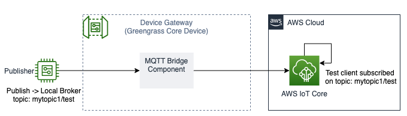

- Create the mqttbridgepublisher.sh
```bash
mkdir -p ~/environment/ggworkshop/GreengrassCore/artifacts/com.example.BridgePublisher/1.0.0 && cd ~/environment/ggworkshop/GreengrassCore/artifacts/com.example.BridgePublisher/1.0.0
touch mqttbridgepublisher.sh
```

- Create the recipe
```bash
touch ~/environment/ggworkshop/GreengrassCore/recipes/com.example.BridgePublisher-1.0.0.json
```

- Deploy the component
```bash
sudo /greengrass/v2/bin/greengrass-cli deployment create \
  --recipeDir ~/environment/ggworkshop/GreengrassCore/recipes \
  --artifactDir ~/environment/ggworkshop/GreengrassCore/artifacts \
  --merge "com.example.BridgePublisher=1.0.0"

AWS libcrypto resolve: searching process and loaded modules
AWS libcrypto resolve: found static aws-lc HMAC symbols
AWS libcrypto resolve: found static aws-lc libcrypto 1.1.1 EVP_MD symbols
Jun 30, 2021 3:14:22 PM software.amazon.awssdk.eventstreamrpc.EventStreamRPCConnection$1 onConnectionSetup
INFO: Socket connection /greengrass/v2/ipc.socket:8033 to server result [AWS_ERROR_SUCCESS]
Jun 30, 2021 3:14:22 PM software.amazon.awssdk.eventstreamrpc.EventStreamRPCConnection$1 onProtocolMessage
INFO: Connection established with event stream RPC server
Local deployment submitted! Deployment Id: ac45b611-1e02-40d7-9f5e-00bb1033f38c


sudo tail -F /greengrass/v2/logs/greengrass.log

2021-06-30T15:14:25.597Z [INFO] (pool-2-thread-31) com.aws.greengrass.deployment.DeploymentService: deployment-task-execution. Finished deployment task. {deploymentId=ac45b611-1e02-40d7-9f5e-00bb1033f38c, serviceName=DeploymentService, currentState=RUNNING}
2021-06-30T15:14:37.404Z [INFO] (pool-2-thread-29) com.aws.greengrass.deployment.DeploymentService: Current deployment finished. {DeploymentId=ac45b611-1e02-40d7-9f5e-00bb1033f38c, serviceName=DeploymentService, currentState=RUNNING}
2021-06-30T15:14:37.513Z [INFO] (pool-2-thread-29) com.aws.greengrass.deployment.DeploymentStatusKeeper: Stored deployment status. {DeploymentId=ac45b611-1e02-40d7-9f5e-00bb1033f38c, DeploymentStatus=SUCCEEDED}

sudo /greengrass/v2/bin/greengrass-cli component list
Component Name: com.example.BridgePublisher
    Version: 1.0.0
    State: RUNNING
    Configuration: {"message":"Hello MQTT Bridage Demo","topic":"mytopic1/test"}
```

- Navigate to the AWS Console -> IoT Core -> Test -> MQTT test client. Subscibe to mytopic1/test

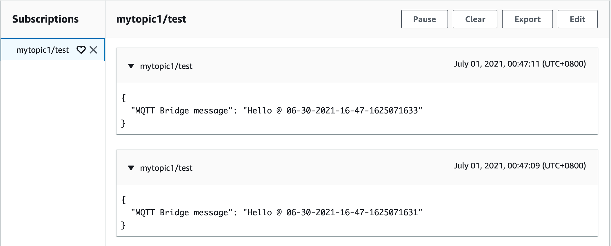

- Check the BridgePublisher.log
```bash
sudo tail -f /greengrass/v2/logs/com.example.BridgePublisher.log

2021-06-30T15:19:05.338Z [INFO] (Copier) com.example.BridgePublisher: stdout. Client localClientID sending PUBLISH (d0, q1, r0, m1, 'mytopic1/test', ... (62 bytes)). {scriptName=services.com.example.BridgePublisher.lifecycle.Run.script, serviceName=com.example.BridgePublisher, currentState=RUNNING}
```

3. Create the subscriber component
- Create the mqttbridgesubscriber.sh
```bash
mkdir -p ~/environment/ggworkshop/GreengrassCore/artifacts/com.example.BridgeSubscriber/1.0.0 && cd ~/environment/ggworkshop/GreengrassCore/artifacts/com.example.BridgeSubscriber/1.0.0
touch mqttbridgesubscriber.sh
```

- Create the recipe
```bash
touch ~/environment/ggworkshop/GreengrassCore/recipes/com.example.BridgeSubscriber-1.0.0.json
```

- Deploy the component
```bash
sudo /greengrass/v2/bin/greengrass-cli deployment create \
  --recipeDir ~/environment/ggworkshop/GreengrassCore/recipes \
  --artifactDir ~/environment/ggworkshop/GreengrassCore/artifacts \
  --merge "com.example.BridgeSubscriber=1.0.0"

AWS libcrypto resolve: searching process and loaded modules
AWS libcrypto resolve: found static aws-lc HMAC symbols
AWS libcrypto resolve: found static aws-lc libcrypto 1.1.1 EVP_MD symbols
Jun 30, 2021 3:29:40 PM software.amazon.awssdk.eventstreamrpc.EventStreamRPCConnection$1 onConnectionSetup
INFO: Socket connection /greengrass/v2/ipc.socket:8033 to server result [AWS_ERROR_SUCCESS]
Jun 30, 2021 3:29:40 PM software.amazon.awssdk.eventstreamrpc.EventStreamRPCConnection$1 onProtocolMessage
INFO: Connection established with event stream RPC server
Local deployment submitted! Deployment Id: 16b43f1c-f94d-4e72-aa78-5b8237dc6e15

sudo tail -F /greengrass/v2/logs/greengrass.log
2021-06-30T15:29:55.450Z [INFO] (pool-2-thread-31) com.aws.greengrass.deployment.DeploymentService: deployment-task-execution. Finished deployment task. {deploymentId=16b43f1c-f94d-4e72-aa78-5b8237dc6e15, serviceName=DeploymentService, currentState=RUNNING}
2021-06-30T15:30:07.590Z [INFO] (pool-2-thread-29) com.aws.greengrass.deployment.DeploymentService: Current deployment finished. {DeploymentId=16b43f1c-f94d-4e72-aa78-5b8237dc6e15, serviceName=DeploymentService, currentState=RUNNING}
2021-06-30T15:30:07.712Z [INFO] (pool-2-thread-29) com.aws.greengrass.deployment.DeploymentStatusKeeper: Stored deployment status. {DeploymentId=16b43f1c-f94d-4e72-aa78-5b8237dc6e15, DeploymentStatus=SUCCEEDED}

sudo /greengrass/v2/bin/greengrass-cli component list
Component Name: com.example.BridgeSubscriber
    Version: 1.0.0
    State: RUNNING
    Configuration: {"topic":"mytopic2/test"}
```

- Check the status and sent the MQTT message from Cloud IOT core

Navigate to the AWS Console -> IoT Core -> Test -> MQTT test client. Publish to mytopic2/test


```bash
sudo tail -f /greengrass/v2/logs/com.example.BridgeSubscriber.log

2021-06-30T17:09:08.546Z [INFO] (Copier) com.example.BridgeSubscriber: stdout. Client mosqsub|10817-ip-172-16 received PUBLISH (d0, q0, r0, m0, 'mytopic2/test', ... (65 bytes)). {scriptName=services.com.example.BridgeSubscriber.lifecycle.Run.script, serviceName=com.example.BridgeSubscriber, currentState=RUNNING}
2021-06-30T17:09:08.546Z [INFO] (Copier) com.example.BridgeSubscriber: stdout. mytopic2/test {. {scriptName=services.com.example.BridgeSubscriber.lifecycle.Run.script, serviceName=com.example.BridgeSubscriber, currentState=RUNNING}
2021-06-30T17:09:08.546Z [INFO] (Copier) com.example.BridgeSubscriber: stdout. "message": "Hello from Amazon IoT console test cloud test2". {scriptName=services.com.example.BridgeSubscriber.lifecycle.Run.script, serviceName=com.example.BridgeSubscriber, currentState=RUNNING}
2021-06-30T17:09:08.546Z [INFO] (Copier) com.example.BridgeSubscriber: stdout. }. {scriptName=services.com.example.BridgeSubscriber.lifecycle.Run.script, serviceName=com.example.BridgeSubscriber, currentState=RUNNING}
```