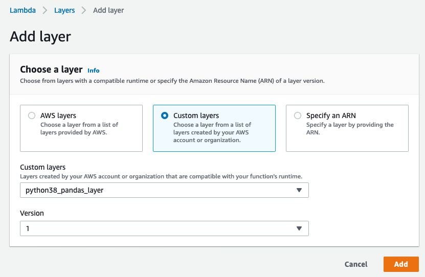
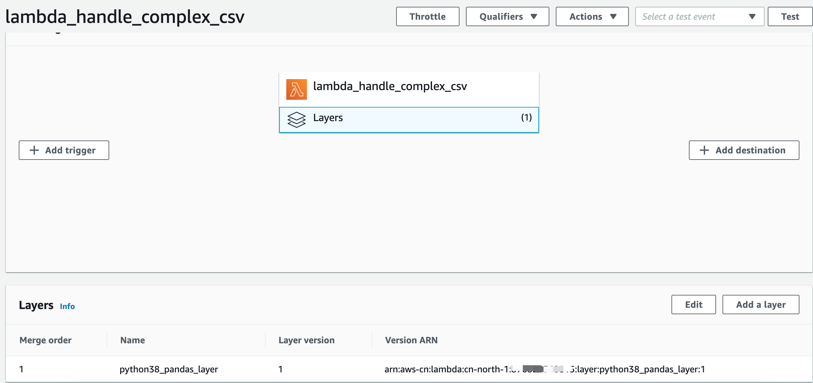

# Create the lambda Layer

The official guide for [AWS Lambda layers](https://docs.aws.amazon.com/lambda/latest/dg/configuration-layers.html)

**Note: A function can use up to 5 layers at a time. The total unzipped size of the function and all layers can't exceed the unzipped deployment package size limit of 250 MB.**


## To create a layer, use the `publish-layer-version` command
For example, create layer for `pandas`

1. Download library used by layer
```bash
#This name is very important. Please ensure that the folder name is exactly that
mkdir python && cd python/ 
pip install --use-feature=2020-resolver -i https://pypi.tuna.tsinghua.edu.cn/simple pytz -t ./
pip install --use-feature=2020-resolver -i https://pypi.tuna.tsinghua.edu.cn/simple s3fs -t ./
wget https://files.pythonhosted.org/packages/7d/4d/c1df56ed2370839f5a1b7bc5a4835ee73f46c2582beb5d3b14e87f2b3dc0/pandas-1.2.0-cp38-cp38-manylinux1_x86_64.whl
unzip pandas-1.2.0-cp38-cp38-manylinux1_x86_64.whl
wget https://files.pythonhosted.org/packages/77/0b/41e345a4f224aa4328bf8a640eeeea1b2ad0d61517f7d0890f167c2b5deb/numpy-1.19.4-cp38-cp38-manylinux1_x86_64.whl
unzip numpy-1.19.4-cp38-cp38-manylinux1_x86_64.whl

rm -r *.whl __pycache__
chmod -R 755 . && cd ..
#This name is very important. Please ensure that the zip name is exactly that
zip -r9 python.zip python
```

2. publish layer
```bash
aws s3 cp python.zip s3://ray-glue-streaming/catalog_test/lambda_code/python.zip --region cn-north-1

aws lambda publish-layer-version --layer-name python38_pandas_layer --description "pandas layer for python 3.8" --license-info "MIT" \
--content S3Bucket=ray-glue-streaming,S3Key=catalog_test/lambda_code/python.zip --compatible-runtimes python3.8 --region cn-north-1
```

3. In case, you want to delete a layer version
```bash
aws lambda delete-layer-version --layer-name python38_pandas_layer --version-number 1
```

## Layer permissions
```bash
aws lambda add-layer-version-permission --layer-name python38_pandas_layer \
--statement-id xaccount --action lambda:GetLayerVersion \
--principal target_account_id --version-number 1 --output text --region cn-north-1
```

## Configuring a function to use layers
1. To find layers that are compatible with your function's runtime,
```bash
aws lambda list-layers --compatible-runtime python3.8 --region cn-north-1
```

2. Configuring a function to use layers

By lambda console:


By aws CLI:
```bash
aws lambda update-function-configuration --function-name lambda_handle_complex_csv \
--layers arn:aws-cn:lambda:cn-north-1:layer-account-id:layer:python38_pandas_layer:1 \
--region cn-north-1 --profile second-cn
```


3. To remove all layers, specify an empty list. 
```bash
aws lambda update-function-configuration --function-name lambda_handle_complex_csv --layers [] --region cn-north-1 --profile second-cn
```