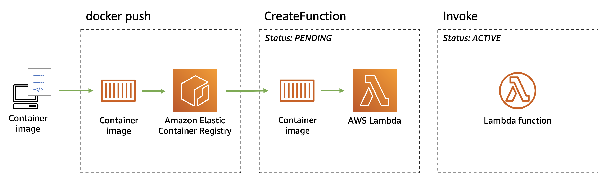
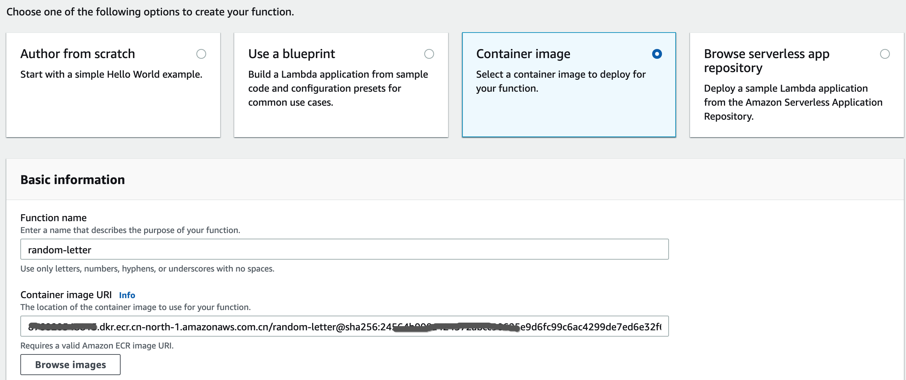
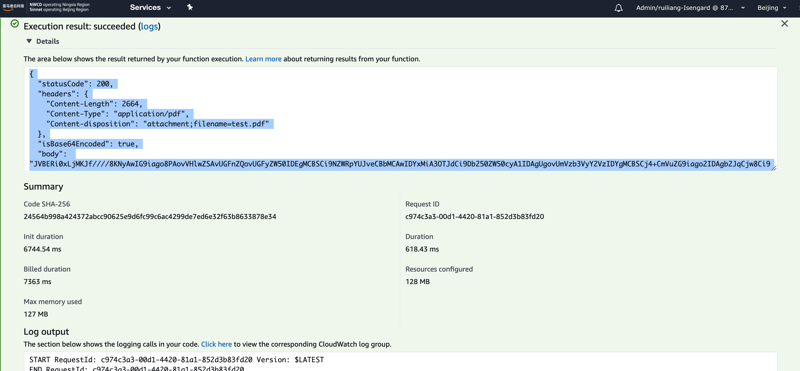
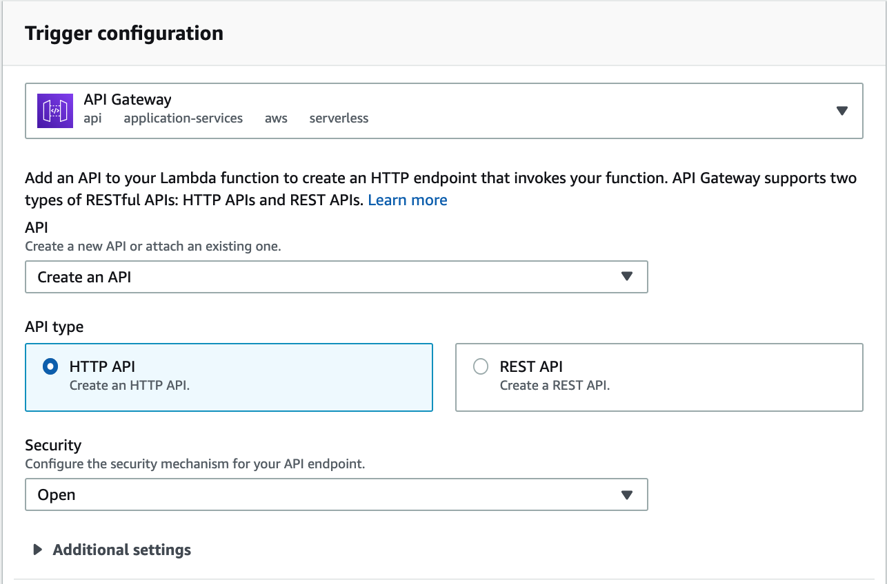
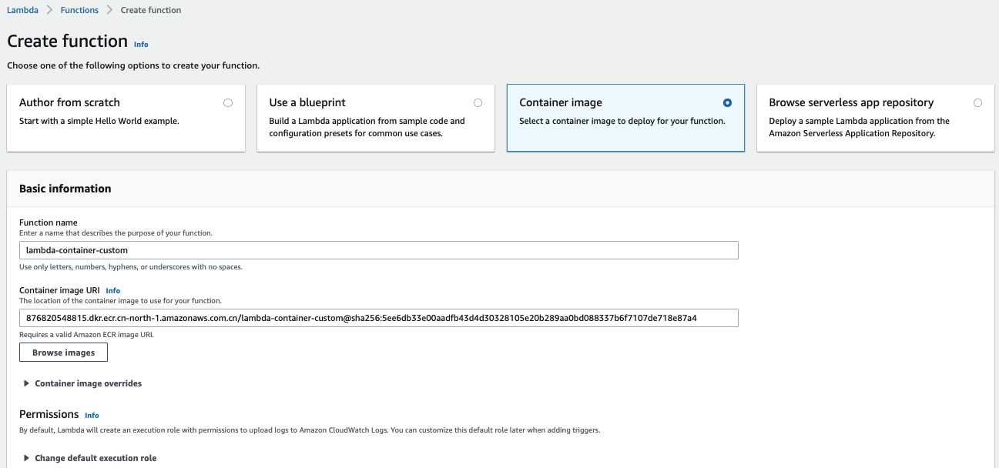
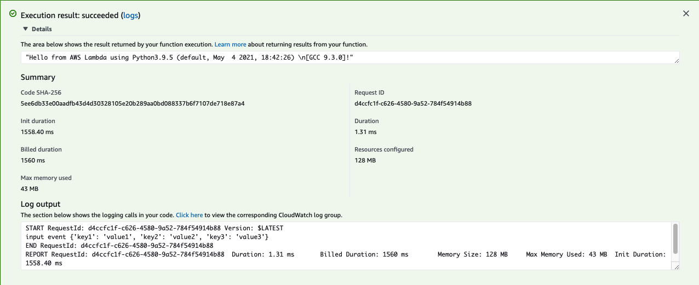

# AWS Lambda – Container Image Support

Now Customer can package and deploy Lambda functions as container images of up to 10 GB in size. It is useful for building and deploying larger workloads that rely on sizable dependencies, such as machine learning or data intensive workloads on Lambda

We are providing base images for all the supported Lambda runtimes (Python, Node.js, Java, .NET, Go, Ruby) and base images for custom runtimes based on Amazon Linux that you can extend to include your own runtime implementing the Lambda Runtime API. You can deploy your own arbitrary base images to Lambda, for example images based on Alpine or Debian Linux. To work with Lambda, these images must implement the Lambda Runtime API. 

There is a Lambda Runtime Interface Emulator that enables you to perform local testing of the container image and check that it will run when deployed to Lambda. It is open source project.

Here is common workflow to use the lambda container image



# Example of AWS-Provided base image
## generating a PDF file using the PDFKit module based on Node.js lambda runtime

1. Create the [app.js](scripts/lambda_container/app.js) as lambda function code
```bash
mkdir lambda-container
cd lambda-container
touch app.js
```
2. Intial the package
    ```bash
    curl -o- https://raw.githubusercontent.com/nvm-sh/nvm/v0.34.0/install.sh | bash
    . ~/.nvm/nvm.sh
    nvm install node or nvm install 12.22
    node -e "console.log('Running Node.js ' + process.version)"

    npm init
    {
    "name": "pdfkit-demo",
    "version": "1.0.0",
    "description": "lambda container pdfkit demo",
    "main": "app.js",
    "scripts": {
        "test": "echo \"Error: no test specified\" && exit 1"
    },
    "author": "ruiliang",
    "license": "ISC"
    }

    ```

3. Create the package.json and package-lock.json files
    ```bash
    npm install pdfkit
    npm install faker
    npm install get-stream
    ```

4. Build the docker image
- [Dockerfile](scripts/lambda_container/Dockerfile)
    ```
    FROM amazon/aws-lambda-nodejs:12
    COPY app.js package*.json ./
    RUN npm install
    CMD [ "app.lambdaHandler" ]
    ```

- Build the random-letter container image
    ```bash
    docker build -t random-letter .
    ```

- Test locally
    ```bash
    docker run -p 9000:8080 random-letter:latest

    curl -XPOST "http://localhost:9000/2015-03-31/functions/function/invocations" -d '{}'
    ```

5. upload the container image to ECR
    ```bash
    aws ecr create-repository --repository-name random-letter --image-scanning-configuration scanOnPush=true --profile china --region cn-north-1
    docker tag random-letter:latest 1234567890.dkr.ecr.cn-north-1.amazonaws.com.cn/random-letter:latest
    aws ecr get-login-password --profile china --region cn-north-1 | docker login --username AWS --password-stdin 1234567890.dkr.ecr.cn-north-1.amazonaws.com.cn
    docker push 1234567890.dkr.ecr.cn-north-1.amazonaws.com.cn/random-letter:latest
    ```

6. Create the Lambda Functions for container
- Create the function and select `container image`


- Testing function


7. Create a HTTP API with the API Gateway which backend is Lambda


8. Testing: access the API endpoint to generate the PDF file
    ```bash
    wget -O test.pdf https://kqw3bd0dtg.execute-api.cn-north-1.amazonaws.com.cn/default/random-letter
    ......
    HTTP request sent, awaiting response... 200 OK
    Length: 1926 (1.9K) [application/pdf]
    Saving to: ‘test.pdf’

    test.pdf                                100%[===============================================================================>]   1.88K  --.-KB/s    in 0s

    2021-09-15 19:30:25 (612 MB/s) - ‘test.pdf’ saved [1926/1926]
    ```

## Building a Custom base image 

Build an iamge based on python 3.9

1. Create the [app.py](scripts/lambda-container-custom/app.py) as lambda function
```bash
mkdir lambda-container-custom
cd lambda-container-custom
mkdir app && cd app
touch app.py
```

2. Create the [Dockerfile](scripts/lambda-container-custom/Dockerfile)
Here use the open source implementations of the [Lambda Runtime Interface Clients](https://docs.aws.amazon.com/lambda/latest/dg/runtimes-images.html) (which implement the Runtime API) for all the supported runtimes. 

3. Create the entry point script [entry.sh](scripts/lambda-container-custom/entry.sh)

4. Build the lambda-container-custom container image
    ```bash
    docker build -t lambda-container-custom .
    ```

5. Test locally

    The AWS Lambda Runtime Interface Emulator (RIE) is a proxy for the Lambda Runtime API that allows you to locally test your Lambda function packaged as a container image. The AWS base images for Lambda include the runtime interface emulator. You can also follow these steps if you built the RIE into your custom base image. 

    ```bash
    docker run -p 9000:8080 lambda-container-custom:latest 

    curl -XPOST "http://localhost:9000/2015-03-31/functions/function/invocations" -d '{}'

    "Hello from AWS Lambda using Python3.9.5 (default, May  4 2021, 18:42:26) \n[GCC 9.3.0]!"
    ```

6. upload the container image to ECR
    ```bash
    aws ecr create-repository --repository-name lambda-container-custom --image-scanning-configuration scanOnPush=true --profile china --region cn-north-1
    docker tag lambda-container-custom:latest 1234567890.dkr.ecr.cn-north-1.amazonaws.com.cn/lambda-container-custom:latest
    aws ecr get-login-password --profile china --region cn-north-1 | docker login --username AWS --password-stdin 1234567890.dkr.ecr.cn-north-1.amazonaws.com.cn
    docker push 1234567890.dkr.ecr.cn-north-1.amazonaws.com.cn/lambda-container-custom:latest
    ```

7. Create the Lambda Functions for container
- Create the function and select `container image`


- Testing function


## Using container image support for AWS Lambda with AWS SAM
1. Create the application
```bash
mkdir lambda-container-sam && cd lambda-container-sam
sam init
```

2. 

# Reference
[AWS Lambda – Container Image Support Announcement](https://aws.amazon.com/blogs/aws/new-for-aws-lambda-container-image-support/)

[Lambda images guide](https://docs.aws.amazon.com/lambda/latest/dg/lambda-images.html)

[Using container image support for AWS Lambda with AWS SAM](https://aws.amazon.com/blogs/compute/using-container-image-support-for-aws-lambda-with-aws-sam/)