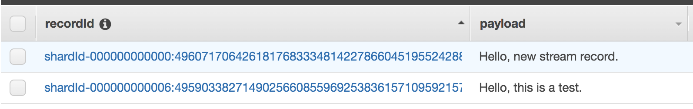
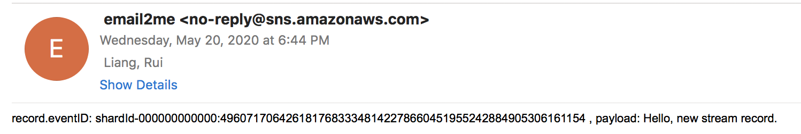

# Using AWS Lambda with Amazon Kinesis


## Preprare
1. Create the IAM execution role
```bash
Permissions – AWSLambdaKinesisExecutionRole.
Role name – lambda-kinesis-role.
```

2. Create a Kinesis stream

```bash
aws kinesis create-stream --stream-name lambda-stream --shard-count 1 --region ${AWS_REGION}

# Record the ARN of kinesis stream
Stream_ARN=$(aws kinesis describe-stream --stream-name lambda-stream --region ${AWS_REGION} --query 'StreamDescription.StreamARN' --output text)
echo $Stream_ARN
```

## Node.js Example
1. Create the function

- source code: Node.js example [index.js](index.js)

- deloy

```bash
zip function.zip index.js
aws lambda create-function --function-name ProcessKinesisRecords \
--zip-file fileb://function.zip --handler index.handler --runtime nodejs12.x \
--role lambda-kinesis-role-arn
```

- testing

```bash
aws lambda invoke --function-name ProcessKinesisRecords --payload file://input.json out.txt --region ${AWS_REGION}

# Cloudwatch logs
INFO	Decoded payload: Hello, this is a test.
```

2. Add an event source in AWS Lambda
```bash
aws lambda create-event-source-mapping --function-name ProcessKinesisRecords \
--event-source $Stream_ARN --batch-size 100 --starting-position LATEST --region ${AWS_REGION}

aws lambda list-event-source-mappings --function-name ProcessKinesisRecords \
--event-source $Stream_ARN --region ${AWS_REGION}
```


3. Testing from kinesis
```bash
aws kinesis put-record --stream-name lambda-stream --partition-key 1 \
--data "Hello, new stream record." --region ${AWS_REGION}
```

View the logs in the CloudWatch console

```bash
INFO	Decoded payload: Hello, new stream record.
```

4. Add addtional consumer
 - Add the DynamoDB and SNS permission to lambda-kinesis-role
 - create dynamodb table kinesis-lambda-table with partition key as recordId
 - create a SNS topic with name kinesis-lambda-sns
 - Lambda code


source code: [index-ddb.js](index-ddb.js)

5. Verify message delivery to DynamoDB table and SNS topic
```bash
aws lambda invoke --function-name ProcessKinesisRecords --payload file://input.json out.txt --region ${AWS_REGION}
aws kinesis put-record --stream-name lambda-stream --partition-key 1 \
--data "Hello, new stream record." --region ${AWS_REGION}
```





## Lambda Python Exmaple
1. Producer stock-producer.py

2. Consumer stock-consumer.py

- deloy

```bash
zip function.zip stock-consumer.py
aws lambda create-function --function-name ProcessStockKinesisRecords \
--zip-file fileb://function.zip --handler stock-consumer.lambda_handler --runtime python3.8 \
--role lambda-kinesis-role-arn
```

- create ddb table: kinesis-stock-table with partition key as recordId and sort key as event_time with RCU 10 and WCU 20 (with auto-scaling)

- test lambda function
```bash
aws lambda invoke --function-name ProcessStockKinesisRecords --payload file://input.json out.txt --region ${AWS_REGION}
```

3. Add an event source in AWS Lambda
```bash
aws lambda create-event-source-mapping --function-name ProcessStockKinesisRecords \
--event-source $Stream_ARN --batch-size 100 --starting-position LATEST --region ${AWS_REGION}

aws lambda list-event-source-mappings --function-name ProcessStockKinesisRecords \
--event-source $Stream_ARN --region ${AWS_REGION}
```

4. To configure a destination for failed-event records

- Under Lambda function Designer, choose Add destination.
- For Source, choose Stream invocation: For Stream, choose a stream that is mapped to the function: stream/lambda-stream
- For Destination: SNS


5. End to end verification
```
# Single record
aws lambda invoke --function-name ProcessStockKinesisRecords --payload file://input.json out.txt --region ${AWS_REGION}

# Multiple record
python stock-producer.py
```

## Cleanup
```bash
# Delete the lambda function
aws lambda delete-function --function-name ProcessKinesisRecords --region ${AWS_REGION}
aws lambda delete-function --function-name ProcessStockKinesisRecords --region ${AWS_REGION}

# Delete the DyanmoDB table and SNS topic
 - dynamodb table kinesis-lambda-table and kinesis-stock-table
 - SNS topic with name kinesis-lambda-sns

# Delete the stream
aws kinesis delete-stream --stream-name lambda-stream --region ${AWS_REGION}
```
# Resource
[Using AWS Lambda with Amazon Kinesis](https://docs.aws.amazon.com/lambda/latest/dg/with-kinesis.html)

https://www.casleyconsulting.co.jp/blog/engineer/5752/

https://note.com/tsukamoto/n/n9af2d6fec470