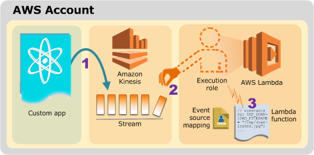
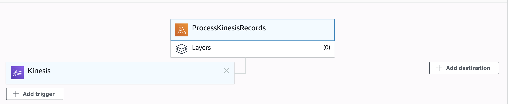
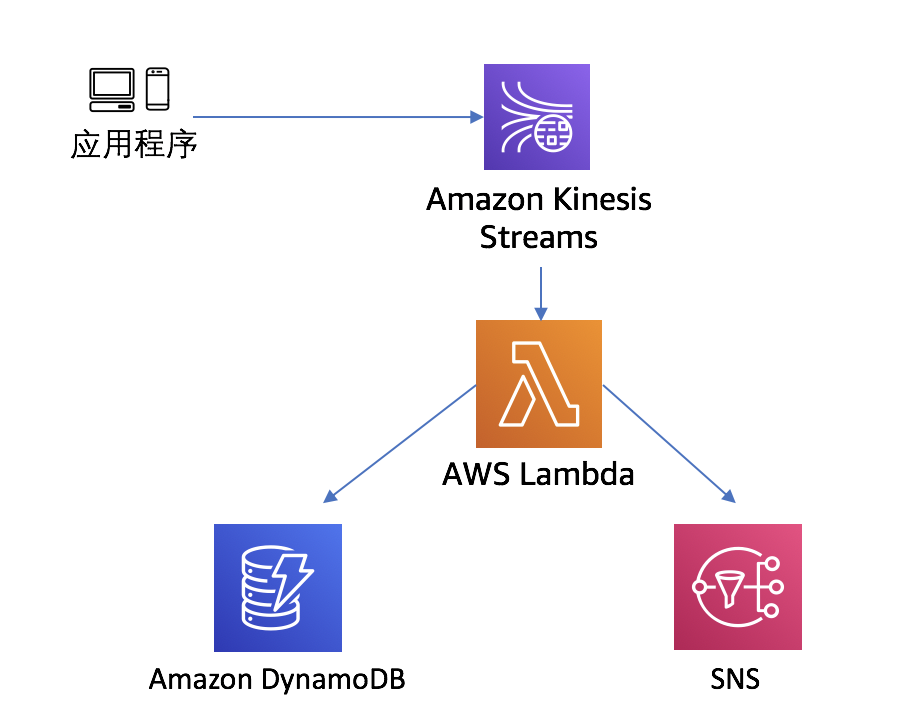

# Using AWS Lambda with Amazon Kinesis



1. Create the IAM execution role
```bash
Permissions – AWSLambdaKinesisExecutionRole.
Role name – lambda-kinesis-role.
```

2. Create a Kinesis stream

```bash
aws kinesis create-stream --stream-name lambda-stream --shard-count 1 --region ${AWS_REGION}

# Record the ARN of kinesis stream
Stream_ARN=$(aws kinesis describe-stream --stream-name lambda-stream --region ${AWS_REGION} --query 'StreamDescription.StreamARN' --output text)
echo $Stream_ARN
```

3. Create the function

index.js
```javascript
console.log('Loading function');

exports.handler = function(event, context) {
    //console.log(JSON.stringify(event, null, 2));
    event.Records.forEach(function(record) {
        // Kinesis data is base64 encoded so decode here
        var payload = Buffer.from(record.kinesis.data, 'base64').toString('ascii');
        console.log('Decoded payload:', payload);
    });
};
```

deloy
```bash
zip function.zip index.js
aws lambda create-function --function-name ProcessKinesisRecords \
--zip-file fileb://function.zip --handler index.handler --runtime nodejs12.x \
--role lambda-kinesis-role-arn
```

testing
```json
{
    "Records": [
        {
            "kinesis": {
                "kinesisSchemaVersion": "1.0",
                "partitionKey": "1",
                "sequenceNumber": "49590338271490256608559692538361571095921575989136588898",
                "data": "SGVsbG8sIHRoaXMgaXMgYSB0ZXN0Lg==",
                "approximateArrivalTimestamp": 1545084650.987
            },
            "eventSource": "aws:kinesis",
            "eventVersion": "1.0",
            "eventID": "shardId-000000000006:49590338271490256608559692538361571095921575989136588898",
            "eventName": "aws:kinesis:record",
            "invokeIdentityArn": "arn:aws-cb:iam::123456789012:role/lambda-kinesis-role",
            "awsRegion": "cn-northwest-1",
            "eventSourceARN": "arn:aws-cn:kinesis:cn-northwest-1:123456789012:stream/lambda-stream"
        }
    ]
}
```

```bash
aws lambda invoke --function-name ProcessKinesisRecords --payload file://input.json out.txt --region ${AWS_REGION}

# Cloudwatch logs
INFO	Decoded payload: Hello, this is a test.
```

4. Add an event source in AWS Lambda
```bash
aws lambda create-event-source-mapping --function-name ProcessKinesisRecords \
--event-source $Stream_ARN --batch-size 100 --starting-position LATEST --region ${AWS_REGION}

aws lambda list-event-source-mappings --function-name ProcessKinesisRecords \
--event-source $Stream_ARN --region ${AWS_REGION}
```



5. Testing from kinesis
```bash
aws kinesis put-record --stream-name lambda-stream --partition-key 1 \
--data "Hello, new stream record." --region ${AWS_REGION}
```

View the logs in the CloudWatch console

```bash
INFO	Decoded payload: Hello, new stream record.
```

6. Add addtional consumer
 - Add the DynamoDB and SNS permission to lambda-kinesis-role
 - create dynamodb table kinesis-lambda-table with partition key as recordId
 - create a SNS topic with name kinesis-lambda-sns
 - Lambda code



```javascript
const AWS = require('aws-sdk');
const dynamodb = new AWS.DynamoDB();
const sns = new AWS.SNS();

console.log('Loading function');

exports.handler = async (event) => {
  const [record] = event.Records;
  try {
    const payload = Buffer.from(record.kinesis.data, 'base64').toString('ascii');
    // save records to the dynamodb
    await dynamodb.putItem({
      TableName: 'kinesis-lambda-table',
      Item: {
        recordId: { S: record.eventID },
        payload: { S: payload },
      }
    }).promise();
  
    await sns.publish({
        TopicArn: process.env.NOTIFICATIONS_TOPIC_ARN,
        Subject: "kinesis-lambda-sns",
        Message: "record.eventID: " + record.eventID + " , payload: " + payload
      }).promise();

  } catch (err) {
    console.log(err);
  }
};
```

verify
```bash
aws lambda invoke --function-name ProcessKinesisRecords --payload file://input.json out.txt --region ${AWS_REGION}
aws kinesis put-record --stream-name lambda-stream --partition-key 1 \
--data "Hello, new stream record." --region ${AWS_REGION}
```


# Resource
https://www.casleyconsulting.co.jp/blog/engineer/5752/

https://note.com/tsukamoto/n/n9af2d6fec470