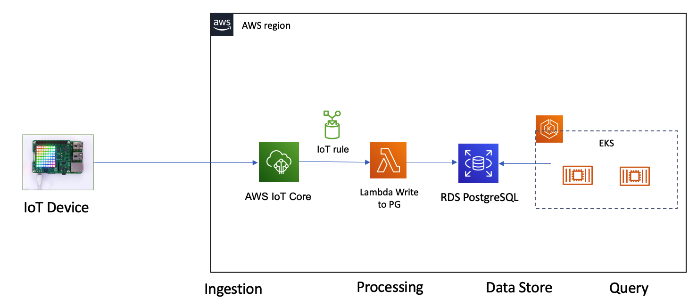

# Ingest data to IoT core and using lambda write date to RDS PostgreSQL

The architecture

Device simulator sent the MQTT message to AWS IoT Core. By using AWS IoT Rule, for each message will trigger AWS lambda function to write the data to RDS PostgreSQL



## Create the RDS PostgreSQL database and create the sample database iotdemo and table device_status
```bash
psql --host=DB_instance_endpoint --port=port --username=master_user_name --password --dbname=postgres

postgres=> CREATE DATABASE iotdemo;
postgres=> \connect iotdemo;
postgres=> DROP TABLE IF EXISTS device_status;

postgres=> CREATE TABLE device_status (
    deviceid VARCHAR(255) PRIMARY KEY,
    critical integer,
    alertmessage VARCHAR(128),
    alertcount integer,
    eventtime TIMESTAMP
);

postgres=> INSERT INTO device_status (deviceid, critical, alertmessage, alertcount, eventtime) VALUES ('1626712066.457285_6', 3, 'Temperature exceeded INTC', 8, '2021-07-20 00:13:16');

postgres=> select * from device_status limit 5;

postgres=> delete from device_status where critical=3

postgres=> \q
```

## Build the lambda function to query and insert data to RDS PostgreSQL
```bash
git clone https://github.com/jkehler/awslambda-psycopg2
cd awslambda-psycopg2/
cp -r psycopg2-3.8/ ~/workspace/aws-is-how/lambda/lambda-write-postgresql/
cd ~/workspace/aws-is-how/lambda/lambda-write-postgresql/
mv psycopg2-3.8 psycopg2

# Or you can install 
pip install AWSIoTPythonSDK --user -t ./
chmod -R 755 .

zip -r9 function.zip .

export RDS_HOST=<database host url>
export RDS_USERNAME=<username>
export RDS_USER_PWD=<password>
export RDS_DB_NAME=mydatabase
export RDS_PORT=5432
export role_arn=lambda_basic_execution
export subnet_ids=subnet_id
export sec_group_id=sg_id

aws lambda create-function --region "cn-north-1" \
    --function-name "lambda-postgresql"       \
    --zip-file fileb://function.zip  \
    --handler "lambda-postgresql.handler"     \
    --role "${role_arn}" --runtime "python3.8" --timeout 60 \
    --vpc-config SubnetIds="${subnet_ids}",SecurityGroupIds="${sec_group_id}" \
    --environment Variables="{RDS_HOST=${RDS_HOST},           \
                              RDS_USERNAME=${RDS_USERNAME},   \
                              RDS_USER_PWD=${RDS_USER_PWD},   \
                              RDS_PORT=${RDS_PORT},     \
                              RDS_DB_NAME=${RDS_DB_NAME}}"

aws lambda invoke --function-name lambda-postgresql --region cn-north-1 --log-type Tail out.txt | jq .LogResult | tr -d '"' | base64 -d 

zip -g function.zip lambda-postgresql.py
aws lambda update-function-code --function-name lambda-postgresql \
--zip-file fileb://function.zip --region cn-north-1
```

## Creat the IoT thing `lambda-iot-demo` and IoT Rule `iot_lambda_postgresql`
- IoT thing 
    - name: `lambda-iot-demo`
    - accept the default setting
    - create the IoT Policy for the thing, for this demo, we use the `iot:*` to allow evety IoT actions
    - Download the `ROOT_CA`, `PRIVATE_KEY`, `CERTIFICATE`

- IoT Rule
    - name: `iot_lambda_postgresql`
    - query: `SELECT * FROM '/lambda-postgresql/iot-alert'`
    - action: invoke `lambda-postgresql` 
    - error action: sent to SNS

## Run the Device simulator 
- Device simulator will send out 10 message per second
- Device simulator send out total 5001 message for one iteration

```bash
pip install AWSIoTPythonSDK --user
# Modify the IoT mqttc.configureEndpoint and mqttc.configureCredentials
python iot_generator.py

....
Message 5001 Published. Data: {"deviceid": "1626796168.298533_5001", "critical": 1, "alertmessage": "Temperature exceeded TBV", "alertcount": 5001, "eventtime": "2021-07-20 15:49:28"}
```

## Check the RDS PostgreSQL to verify the data are insert and recored

We can see total 5001 message inserted into RDS PostgreSQL device_status table

```sql
select * from device_status order by alertcount DESC, eventtime ASC limit 10;

iotdemo=> select * from device_status order by alertcount DESC, eventtime ASC limit 10;
        deviceid        | critical |       alertmessage        | alertcount |      eventtime
------------------------+----------+---------------------------+------------+---------------------
 1626796168.298533_5001 |        1 | Temperature exceeded TBV  |       5001 | 2021-07-20 15:49:28
 1626796168.197659_5000 |        4 | Temperature exceeded INTC |       5000 | 2021-07-20 15:49:28
 1626796168.096765_4999 |        1 | Temperature exceeded MSFT |       4999 | 2021-07-20 15:49:28
 1626796167.995975_4998 |        4 | Temperature exceeded TBV  |       4998 | 2021-07-20 15:49:27
 1626796167.895171_4997 |        4 | Temperature exceeded AMZN |       4997 | 2021-07-20 15:49:27
 1626796167.794342_4996 |        0 | Temperature exceeded AMZN |       4996 | 2021-07-20 15:49:27
 1626796167.693478_4995 |        4 | Temperature exceeded INTC |       4995 | 2021-07-20 15:49:27
 1626796167.592603_4994 |        0 | Temperature exceeded TBV  |       4994 | 2021-07-20 15:49:27
 1626796167.491427_4993 |        2 | Temperature exceeded MSFT |       4993 | 2021-07-20 15:49:27
 1626796167.390536_4992 |        1 | Temperature exceeded MSFT |       4992 | 2021-07-20 15:49:27
(10 rows)
```

You can continue sent out the other 5000 message

```bash
Message 10001 Published. Data: {"deviceid": "1626797146.247421_10001", "critical": 4, "alertmessage": "Temperature exceeded AAPL", "alertcount": 10001, "eventtime": "2021-07-20 16:05:46"}
```
```sql
iotdemo=> select * from device_status order by alertcount DESC, eventtime ASC limit 10;
        deviceid         | critical |       alertmessage        | alertcount |      eventtime

-------------------------+----------+---------------------------+------------+--------------------
-
 1626797146.247421_10001 |        4 | Temperature exceeded AAPL |      10001 | 2021-07-20 16:05:46
 1626797146.146706_10000 |        0 | Temperature exceeded TBV  |      10000 | 2021-07-20 16:05:46
 1626797146.045801_9999  |        4 | Temperature exceeded INTC |       9999 | 2021-07-20 16:05:46
 1626797145.945204_9998  |        1 | Temperature exceeded AMZN |       9998 | 2021-07-20 16:05:45
 1626797145.844371_9997  |        4 | Temperature exceeded AMZN |       9997 | 2021-07-20 16:05:45
 1626797145.743701_9996  |        4 | Temperature exceeded AAPL |       9996 | 2021-07-20 16:05:45
 1626797145.64266_9995   |        4 | Temperature exceeded AMZN |       9995 | 2021-07-20 16:05:45
 1626797145.541999_9994  |        3 | Temperature exceeded INTC |       9994 | 2021-07-20 16:05:45
 1626797145.441072_9993  |        2 | Temperature exceeded TBV  |       9993 | 2021-07-20 16:05:45
 1626797145.340253_9992  |        4 | Temperature exceeded AMZN |       9992 | 2021-07-20 16:05:45
(10 rows)
```

## Reference
[How do I configure a Lambda function to connect to an RDS instance?](https://aws.amazon.com/premiumsupport/knowledge-center/connect-lambda-to-an-rds-instance/)