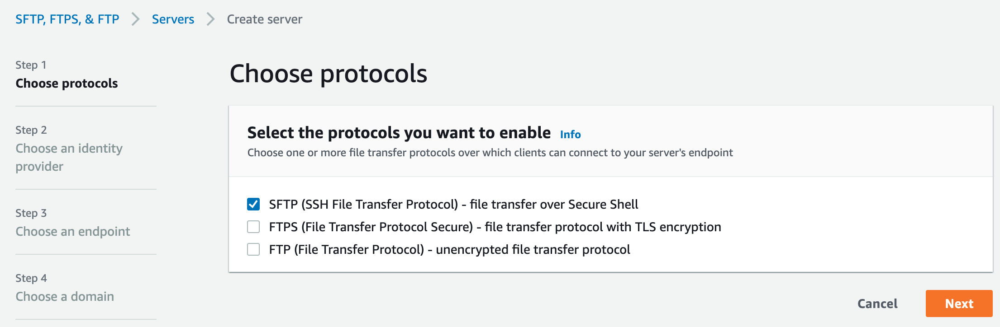
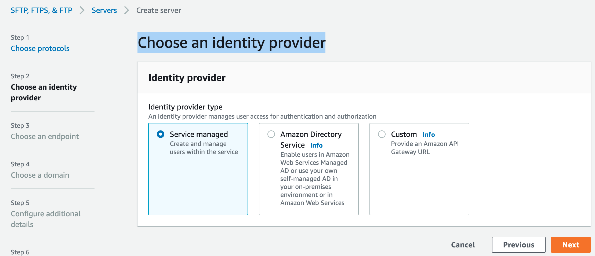
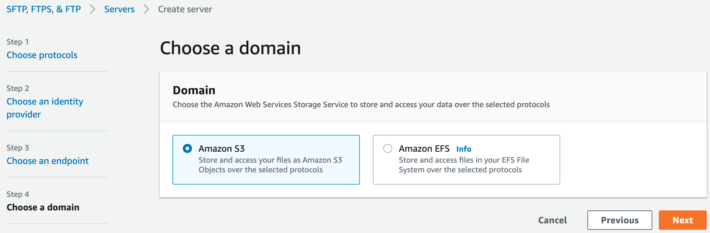
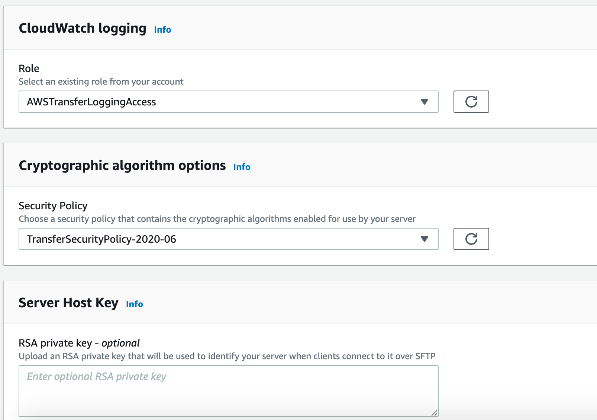
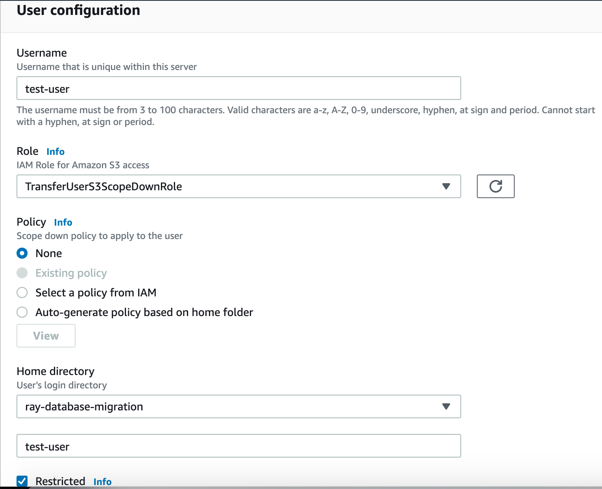

# Getting started with AWS Transfer Family

## Create an SFTP-enabled server
1. Create SFTP Server


2. Choose an identity provider - `Service managed`


3. Choose an endpoint - `Publicly accessible` and For Custom hostname, choose `None`. 


4. Choose a domain - `Amazon S3`


5. Configure additional details
  - CloudWatch logging role - `AWSTransferLoggingAccess` with Policy `AWSTransferLoggingAccessV3` and trust relationship as `transfer.amazonaws.com`
  - Cryptographic algorithm options
    - If `FIPS Enabled endpoint` is not selected, the `TransferSecurityPolicy-2020-06` security policy is attached to your server.
    - If `FIPS Enabled endpoint` is selected, the `TransferSecurityPolicy-FIPS-2020-06` security policy is attached to your server.


5. In Review and create, choose `Create server`. 

## Add a service managed user
1. Create the IAM policy `TransferUserS3ScopeDownPolicy` for managed user

The `transfer:HomeFolder`, `transfer:HomeBucket`, and `transfer:HomeDirectory` policy parameters. These parameters are set for the `HomeDirectory` that is configured for the user

```json
{
    "Version": "2012-10-17",
    "Statement": [
        {
            "Sid": "AllowListingOfUserFolder",
            "Action": [
                "s3:ListBucket"
            ],
            "Effect": "Allow",
            "Resource": [
                "arn:aws-cn:s3:::${transfer:HomeBucket}"
            ],
            "Condition": {
                "StringLike": {
                    "s3:prefix": [
                        "${transfer:HomeFolder}/*",
                        "${transfer:HomeFolder}"
                    ]
                }
            }
        },
        {
            "Sid": "HomeDirObjectAccess",
            "Effect": "Allow",
            "Action": [
                "s3:PutObject",
                "s3:GetObject",
                "s3:DeleteObject",
                "s3:DeleteObjectVersion",
                "s3:GetObjectVersion",
                "s3:GetObjectACL",
                "s3:PutObjectACL"
            ],
            "Resource": ["arn:aws-cn:s3:::${transfer:HomeDirectory}","arn:aws-cn:s3:::${transfer:HomeDirectory}/*"]
        }
    ]
}     
```

2. Create `TransferUserS3ScopeDownRole` with Policy `TransferUserS3ScopeDownPolicy` and trust relationship as `transfer.amazonaws.com`

3. For Policy, choose `None`.

4. For Home directory

5. (Optional) For Restricted, select the check box so that your users can't access anything outside of that folder and can't see the Amazon S3 bucket or folder name. 



6. Generate SSH keys
```bash
ssh-keygen -P "" -m PEM -f transfer_key_test_user
```
- Navigate to the transfer_key_test_user.pub file and open it.
- Copy the text and paste it in step 7 `SSH public key`. 

7. For `SSH public key`, enter the public SSH key portion of the SSH key pair. 

8. Choose `Add` to add your new user to the server

## Transfer a file using a client

Here using OpenSSH command line 

```bash
sftp -i ~/.ssh/transfer_key_test_user test_user@s-9e601bad60074ddaa.server.transfer.cn-north-1.amazonaws.com.cn
Connected to test_user@s-9e601bad60074ddaa.server.transfer.cn-north-1.amazonaws.com.cn.
sftp> pwd
Remote working directory: /ray-database-migration/test_user

sftp> cd /ray-database-migration/test_user

sftp> put airport-codes.csv
Uploading airport-codes.csv to /ray-database-migration/test_user/airport-codes.csv

sftp> bye
```