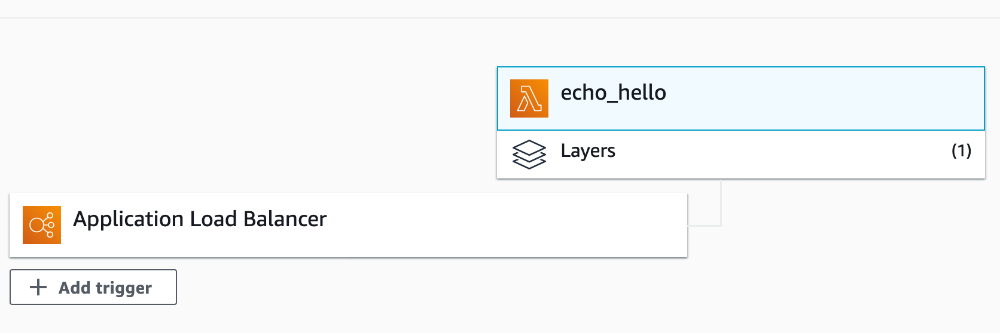
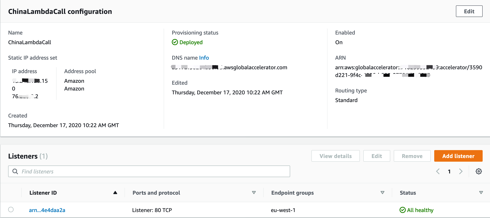
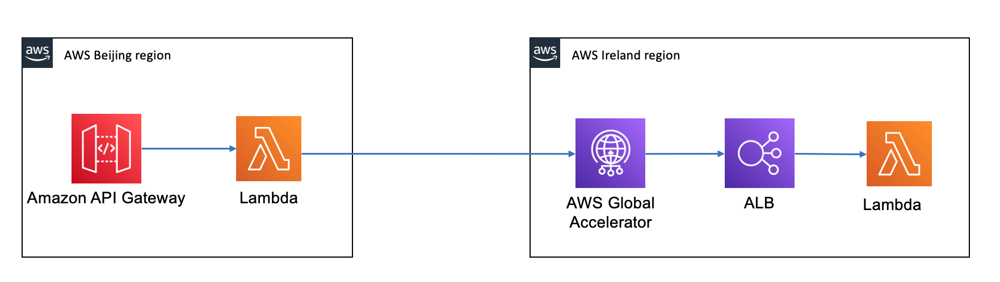
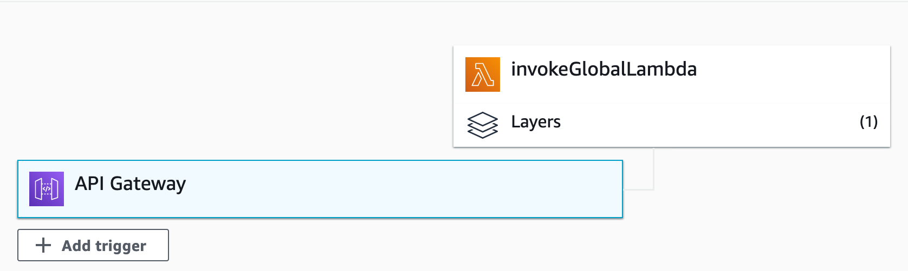
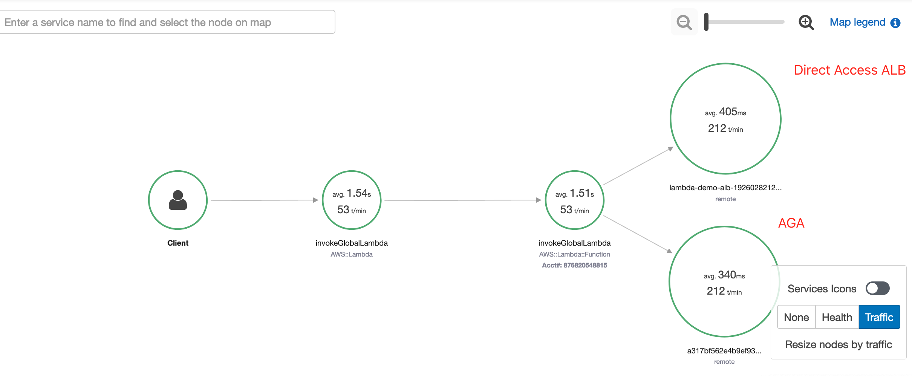

# Using Amazon Global Accelerator to improve cross board request improvement

1. Create the lambda funtion `echo_hello` in eu-west-1 region
```python
import json
import urllib
import boto3
from botocore.vendored import requests

def lambda_handler(event, context):
    myip = requests.get('http://checkip.amazonaws.com').text.rstrip()
    print(myip)
    return {
        'statusCode': 200,
        'body': json.dumps('Hello from Lambda!' + myip)
    }
```

2. Configure the Lambda functions as a target for an Application Load Balancer


3. Configure the Amazon Global Accelerator with endpoint to Application Load Balancer




4. Create the lambda funtion `invokeGlobalLambda` in cn-north-1 region

The [source code](script/lambda_function.py)



```bash
pip install -r requirements.txt --target ./package
cd package
zip -r ../my-deployment-package.zip .
cd ..
zip -g my-deployment-package.zip lambda_function.py

aws lambda update-function-code --function-name invokeGlobalLambda --zip-file fileb://my-deployment-package.zip --region cn-north-1

aws lambda invoke --function-name invokeGlobalLambda \
    --region cn-north-1 --log-type Tail \
    --query 'LogResult' --output text hello-output.txt | base64 --decode
```

5. Enable AWS Lambda with AWS X-Ray
```
aws lambda update-function-configuration --function-name invokeGlobalLambda \
--tracing-config Mode=Active --region cn-north-1
```

6. Run performance testing with Apache AB
```bash
ab -n 10000 -c 10 -s 360 https://myapi.execute-api.cn-north-1.amazonaws.com.cn/dev/invokeGlobalLambda


Concurrency Level:      10
Time taken for tests:   1596.488 seconds
Complete requests:      10000
Failed requests:        8400
   (Connect: 0, Receive: 0, Length: 8400, Exceptions: 0)
Total transferred:      3985579 bytes
HTML transferred:       1115579 bytes
Requests per second:    6.26 [#/sec] (mean)
Time per request:       1596.488 [ms] (mean)
Time per request:       159.649 [ms] (mean, across all concurrent requests)
Transfer rate:          2.44 [Kbytes/sec] received

Connection Times (ms)
              min  mean[+/-sd] median   max
Connect:       24   44  80.8     31    2210
Processing:  1347 1549 394.4   1516   16160
Waiting:     1347 1549 394.3   1515   16160
Total:       1373 1594 409.9   1551   16190

Percentage of the requests served within a certain time (ms)
  50%   1551
  66%   1567
  75%   1579
  80%   1589
  90%   1625
  95%   1676
  98%   1845
  99%   2536
 100%  16190 (longest request)
 ```

7. Check the invocation performance in X-Ray
