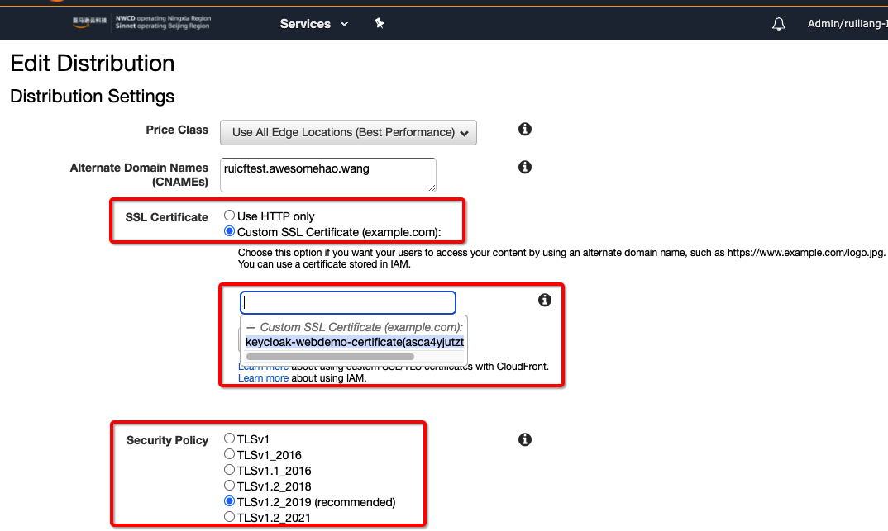

# Enable the HTTPS access for CloudFront

## How to upload the certificate for CloudFront
- Global region
    - Request the certificate on AWS Certificate Manager (ACM) and apply to CloudFront
    - If you need use the custom certificate, upload the certificate to AWS Certificate Manager (ACM) or AWS Identity and Access Management (IAM), and then apply to CloudFront
- China region
    - Upload the custom certificate to AWS Identity and Access Management (IAM), and then apply to CloudFront

If you're using a certificate imported to IAM, verify the CloudFront path `/cloudfront/DistributionName/`

```bash
aws iam upload-server-certificate --server-certificate-name CertificateName
--certificate-body file://public_key_certificate_file --private-key file://privatekey.pem 
--certificate-chain file://certificate_chain_file --path /cloudfront/DistributionName/
```

## Apply the HTTPS certificate on CloudFront distribution
- Enable SSL Certificate
- Choice Certificate
- Security Policy



## Reference
[How can I troubleshoot issues with using a custom SSL certificate for my CloudFront distribution?](https://aws.amazon.com/premiumsupport/knowledge-center/custom-ssl-certificate-cloudfront/?nc1=h_ls)

[Upload certificate on IAM](https://docs.aws.amazon.com/zh_cn/IAM/latest/UserGuide/id_credentials_server-certs.html)

[上传证书到IAM并配置中国区CloudFront服务](https://blog.bitipcman.com/upload-server-certificate-to-iam-and-enable-certificate-on-cloudfront/)

