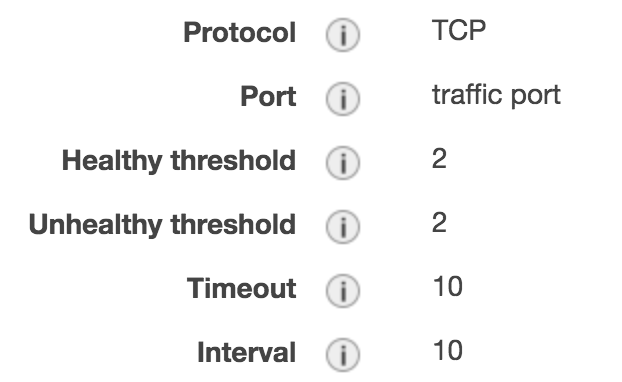
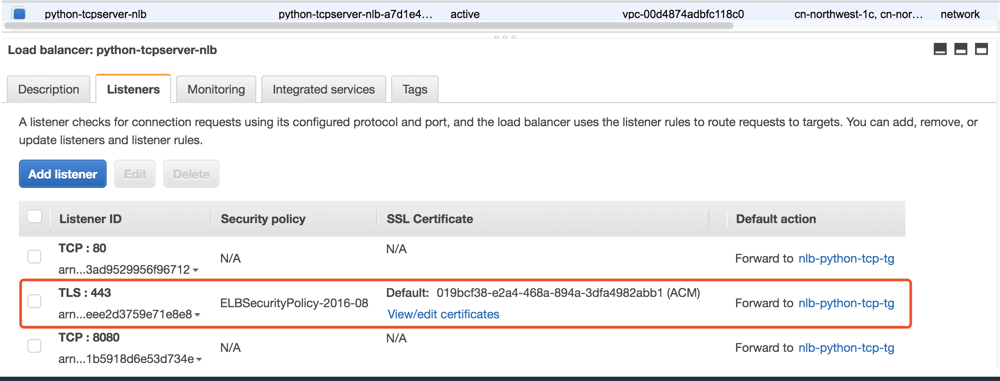
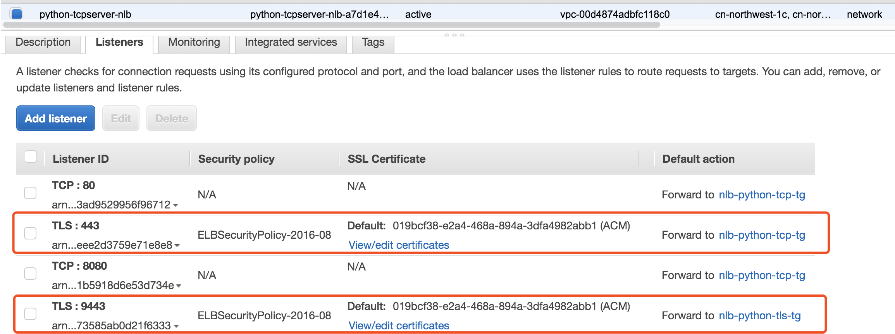

# NLB TLS Support

[TLS Termination for Network Load Balancers](https://aws.amazon.com/blogs/aws/new-tls-termination-for-network-load-balancers/)

[Network Loadblancer as demo](https://exampleloadbalancer.com/nlbtls_demo.html)

## Prepare - Create a Simple http server
```bash
mkdir -p httpserver && cd httpserver
# create index.html
<html>
    <head>
        <title>Python is awesome!</title>
    </head>
    <body>
        <h1>HTTP Server Hello</h1>
        <p>Congratulations! The HTTP Server is working!</p>
    </body>
</html>

# create server.py
import http.server
import socketserver
import sys

if len(sys.argv) >= 2:
    PORT = int(sys.argv[1])
else:
    PORT = 8080

Handler = http.server.SimpleHTTPRequestHandler

with socketserver.TCPServer(("", PORT), Handler) as httpd:
    print("serving at port", PORT)
    httpd.serve_forever()

# start server
$ python server.py
serving at port 8080
54.249.61.241 - - [17/Apr/2020 04:48:00] "GET / HTTP/1.1" 200 -
$ python server.py 8081
serving at port 8081

# Testing
curl http://52.82.21.64:8080/


# Add support Post, GET, HEAD
python simple-http-server.py -l 0.0.0.0 -p 8080

# Testing
curl http://<instance-ip>:8080/
curl -X POST -d "hello world" http://<instance-ip>:8080/
```

## NLB Support SSL/TLS

Use the Amazon ACM  managed SSL/TLS certificate

You can't export an Amazon Issued ACM public certificate for use on an EC2 instance because ACM manages the private key.

You can use SSL/TLS encryption for communication by putting your Amazon EC2 instance behind a service that integrates with ACM.
[ACM certificates for my http server hosted on an EC2 instance](https://aws.amazon.com/premiumsupport/knowledge-center/configure-acm-certificates-ec2/)

### Test case 1: Client TLS request -> TLS encryption -> NLB TLS licenser -> TCP forward -> Backend HTTP/TCP Server

NLB Configure Routing, I choose the communication protocol TCP that will be used between my NLB and my targets. 

1. Create a Target Group use TCP protocol
```bash
NLB_TCP_TG=nlb-python-tcp-tg
```




2. create the NLB TLS licenser
[Create the NLB TLS licenser guide](https://docs.aws.amazon.com/elasticloadbalancing/latest/network/create-tls-listener.html)

```bash
NLB_ARN=$(aws elbv2 describe-load-balancers --names ${NLB_NAME} --region ${AWS_REGION} --query "LoadBalancers[0].LoadBalancerArn" | sed 's/"//g')
echo ${NLB_ARN}
NLB_TG_ARN=$(aws elbv2 describe-target-groups --load-balancer-arn ${NLB_ARN} --region ${AWS_REGION} --query "TargetGroups[0].TargetGroupArn" | sed 's/"//g') 
echo ${NLB_TG_ARN}
NLB_TCP_TG_ARN=$(aws elbv2 describe-target-groups --names ${NLB_TCP_TG} --region ${AWS_REGION} --query "TargetGroups[0].TargetGroupArn" | sed 's/"//g') 
echo ${NLB_TCP_TG_ARN}

# Create TLS licenser
aws elbv2 create-listener \
    --load-balancer-arn ${NLB_ARN} \
    --protocol TLS --port 443 --certificates CertificateArn=arn:aws-cn:acm:cn-northwest-1:876820548815:certificate/019bcf38-e2a4-468a-894a-3dfa4982abb1 \
    --ssl-policy ELBSecurityPolicy-2016-08 \
    --default-actions Type=forward,TargetGroupArn=${NLB_TCP_TG_ARN} --region ${AWS_REGION}
```



3. Set access log
[按照文档配置存储日志的 S3 bucket](https://docs.amazonaws.cn/en_us/elasticloadbalancing/latest/network/load-balancer-access-logs.html)
```bash
aws elbv2 modify-load-balancer-attributes --load-balancer-arn ${NLB_ARN} \
  --attributes Key=access_logs.s3.enabled,Value=true Key=access_logs.s3.bucket,Value=ray-nlb-accesslogs-zhy Key=access_logs.s3.prefix,Value=gaming-server \
  --region ${AWS_REGION}

# 检查 NLB 的 access log已经配置
aws elbv2 describe-load-balancer-attributes --load-balancer-arn ${NLB_ARN} --region ${AWS_REGION}
```

4. Testing Client TLS request and NLB access log
```bash
NLB_ADDR=$(aws elbv2 describe-load-balancers --names ${NLB_NAME} --region ${AWS_REGION} --query "LoadBalancers[0].DNSName" | sed 's/"//g')
echo ${NLB_ADDR}

openssl s_client -connect ${NLB_ADDR}:443 -state

# CONNECTED(00000005)
# SSL_connect:before/connect initialization
# SSL_connect:unknown state
# SSL_connect:SSLv3 read server hello A
# depth=3 C = US, ST = Arizona, L = Scottsdale, O = "Starfield Technologies, Inc.", CN = Starfield Services Root Certificate Authority - G2
# verify error:num=20:unable to get local issuer certificate
# verify return:0
# SSL_connect:SSLv3 read server certificate A
# SSL_connect:SSLv3 read server key exchange A
# SSL_connect:SSLv3 read server done A
# SSL_connect:SSLv3 write client key exchange A
# SSL_connect:SSLv3 write change cipher spec A
# SSL_connect:SSLv3 write finished A
# SSL_connect:SSLv3 flush data
# SSL_connect:SSLv3 read server session ticket A
# SSL_connect:SSLv3 read finished A
# ---
# Certificate chain
#  0 s:/CN=ray-alb-webapp.top
#    i:/C=US/O=Amazon/OU=Server CA 1B/CN=Amazon
#  1 s:/C=US/O=Amazon/OU=Server CA 1B/CN=Amazon
#    i:/C=US/O=Amazon/CN=Amazon Root CA 1
#  2 s:/C=US/O=Amazon/CN=Amazon Root CA 1
#    i:/C=US/ST=Arizona/L=Scottsdale/O=Starfield Technologies, Inc./CN=Starfield Services Root Certificate Authority - G2
#  3 s:/C=US/ST=Arizona/L=Scottsdale/O=Starfield Technologies, Inc./CN=Starfield Services Root Certificate Authority - G2
#    i:/C=US/O=Starfield Technologies, Inc./OU=Starfield Class 2 Certification Authority
# ---
# Server certificate
# -----BEGIN CERTIFICATE-----
# .......
# -----END CERTIFICATE-----
# subject=/CN=ray-alb-webapp.top
# issuer=/C=US/O=Amazon/OU=Server CA 1B/CN=Amazon
# ---
# No client certificate CA names sent
# ---
# SSL handshake has read 5474 bytes and written 444 bytes
# ---
# New, TLSv1/SSLv3, Cipher is ECDHE-RSA-AES128-GCM-SHA256
# Server public key is 2048 bit
# Secure Renegotiation IS supported
# Compression: NONE
# Expansion: NONE
# No ALPN negotiated
# SSL-Session:
#     Protocol  : TLSv1.2
#     Cipher    : ECDHE-RSA-AES128-GCM-SHA256
#     Session-ID: 2D68B15A28B258A330EC10DEB9D06F399BE0798C166C1BBAD2B5B2057304DB38
#     Session-ID-ctx:
#.........
#.........
#     Start Time: 1587122564
#     Timeout   : 300 (sec)
#     Verify return code: 0 (ok)
# ---

# SSL3 alert read:warning:close notify
# closed
# SSL3 alert write:warning:close notify


curl -k -v "https://${NLB_ADDR}:443"

# * Rebuilt URL to: https://NLB_ADDR:443/
# *   Trying 161.189.xx.xx...
# * TCP_NODELAY set
# * Connected to NLB_ADDR (161.189.xx.xx) port 443 (#0)
# * ALPN, offering h2
# * ALPN, offering http/1.1
# * Cipher selection: ALL:!EXPORT:!EXPORT40:!EXPORT56:!aNULL:!LOW:!RC4:@STRENGTH
# * successfully set certificate verify locations:
# *   CAfile: /etc/ssl/cert.pem
#   CApath: none
# * TLSv1.2 (OUT), TLS handshake, Client hello (1):
# * TLSv1.2 (IN), TLS handshake, Server hello (2):
# * TLSv1.2 (IN), TLS handshake, Certificate (11):
# * TLSv1.2 (IN), TLS handshake, Server key exchange (12):
# * TLSv1.2 (IN), TLS handshake, Server finished (14):
# * TLSv1.2 (OUT), TLS handshake, Client key exchange (16):
# * TLSv1.2 (OUT), TLS change cipher, Client hello (1):
# * TLSv1.2 (OUT), TLS handshake, Finished (20):
# * TLSv1.2 (IN), TLS change cipher, Client hello (1):
# * TLSv1.2 (IN), TLS handshake, Finished (20):
# * SSL connection using TLSv1.2 / ECDHE-RSA-AES128-GCM-SHA256
# * ALPN, server did not agree to a protocol
# * Server certificate:
# *  subject: CN=ray-alb-webapp.top
# *  start date: Apr 17 00:00:00 2020 GMT
# *  expire date: May 17 12:00:00 2021 GMT
# *  issuer: C=US; O=Amazon; OU=Server CA 1B; CN=Amazon
# *  SSL certificate verify ok.
# > GET / HTTP/1.1
# > Host: NLB_ADDR
# > User-Agent: curl/7.54.0
# > Accept: */*
# >
# * HTTP 1.0, assume close after body
# < HTTP/1.0 200 OK
# < Server: BaseHTTP/0.6 Python/3.7.7
# < Date: Fri, 17 Apr 2020 11:21:54 GMT
# < Content-type: text/html
# <
# * TLSv1.2 (IN), TLS alert, Client hello (1):
# * Closing connection 0
# * TLSv1.2 (OUT), TLS alert, Client hello (1):
# <html><head><title>Python is awesome!</title></head>        <body><h1>Congratulations! The HTTP Server is working ip-10-0-0-81.cn-northwest-1.compute.internal : 10.0.0.81reqeust: / </h1></body></html>%

# 检查 S3 bucket，log日志是否生成
aws s3api list-objects-v2 --bucket ray-nlb-accesslogs-zhy --prefix gaming-server --max-items 10 --region ${AWS_REGION}

```

### Test case 2: Client TLS request -> TLS encryption -> NLB TLS licenser -> TLS forward -> Backend HTTP/TCP Server

NLB Configure Routing, I choose the communication protocol TLS that will be used between my NLB and my targets which means communication is encrypted; this allows you to make use of complete end-to-end encryption in transit.

1. Start HTTPS Server
```bash
python simple-https-server.py -l 0.0.0.0 -p 8443

# Testing
curl -k -v https://<instance-ip>:8443/
# * TLSv1.2 (OUT), TLS alert, Client hello (1):
# <html><head><title>Python is awesome!</title></head>        <body><h1>Congratulations! The HTTPS Server for TLS is working ip-10-0-0-81.cn-northwest-1.compute.internal : 10.0.0.81reqeust: / </h1></body></html>%

curl -X POST -d -k -v "hello tls" https://<instance-ip>:8443/
# * TLSv1.2 (OUT), TLS alert, Client hello (1):
# <html><head><title>Python is awesome!</title></head>        <body><h1>Congratulations! The HTTPS Server for TLS is working b'hello tls' </h1></body></html>%

nlb-python-tls-tg
```
Troubleshooting:
```bash
# Fix error: ssl.SSLError: [X509: KEY_VALUES_MISMATCH] key values mismatch (_ssl.c:3901)
# Make sure the output is the same
$ openssl x509 -noout -modulus -in cert.pem
$ openssl rsa -noout -modulus -in key-no-pass.pem

```

2. Create a Target Group use TCP protocol

```bash
NLB_TLS_TG=nlb-python-tls-tg
```
2. create the NLB TLS licenser
[Create the NLB TLS licenser guide](https://docs.aws.amazon.com/elasticloadbalancing/latest/network/create-tls-listener.html)

```bash
NLB_ARN=$(aws elbv2 describe-load-balancers --names ${NLB_NAME} --region ${AWS_REGION} --query "LoadBalancers[0].LoadBalancerArn" | sed 's/"//g')
echo ${NLB_ARN}
NLB_TLS_TG_ARN=$(aws elbv2 describe-target-groups --names ${NLB_TLS_TG} --region ${AWS_REGION} --query "TargetGroups[0].TargetGroupArn" | sed 's/"//g') 
echo ${NLB_TLS_TG_ARN}

# Create TLS licenser
aws elbv2 create-listener \
    --load-balancer-arn ${NLB_ARN} \
    --protocol TLS --port 9443 --certificates CertificateArn=arn:aws-cn:acm:cn-northwest-1:876820548815:certificate/019bcf38-e2a4-468a-894a-3dfa4982abb1 \
    --ssl-policy ELBSecurityPolicy-2016-08 \
    --default-actions Type=forward,TargetGroupArn=${NLB_TLS_TG_ARN} --region ${AWS_REGION}
```



3. Set access log - can be skipe if you finished Test case 1 
[按照文档配置存储日志的 S3 bucket](https://docs.amazonaws.cn/en_us/elasticloadbalancing/latest/network/load-balancer-access-logs.html)

```bash
aws elbv2 modify-load-balancer-attributes --load-balancer-arn ${NLB_ARN} \
  --attributes Key=access_logs.s3.enabled,Value=true Key=access_logs.s3.bucket,Value=ray-nlb-accesslogs-zhy Key=access_logs.s3.prefix,Value=gaming-server \
  --region ${AWS_REGION}

# 检查 NLB 的 access log已经配置
aws elbv2 describe-load-balancer-attributes --load-balancer-arn ${NLB_ARN} --region ${AWS_REGION}
```

4. Testing Client TLS request and NLB access log
```bash
NLB_ADDR=$(aws elbv2 describe-load-balancers --names ${NLB_NAME} --region ${AWS_REGION} --query "LoadBalancers[0].DNSName" | sed 's/"//g')
echo ${NLB_ADDR}

openssl s_client -connect ${NLB_ADDR}:9443 -state

# CONNECTED(00000006)
# SSL_connect:before/connect initialization
# SSL_connect:unknown state
# SSL_connect:SSLv3 read server hello A
# depth=3 C = US, ST = Arizona, L = Scottsdale, O = "Starfield Technologies, Inc.", CN = Starfield Services Root Certificate Authority - G2
# verify error:num=20:unable to get local issuer certificate
# verify return:0
# SSL_connect:SSLv3 read server certificate A
# SSL_connect:SSLv3 read server key exchange A
# SSL_connect:SSLv3 read server done A
# SSL_connect:SSLv3 write client key exchange A
# SSL_connect:SSLv3 write change cipher spec A
# SSL_connect:SSLv3 write finished A
# SSL_connect:SSLv3 flush data
# SSL_connect:SSLv3 read server session ticket A
# SSL_connect:SSLv3 read finished A
# ---
# Certificate chain
#  0 s:/CN=ray-alb-webapp.top
#    i:/C=US/O=Amazon/OU=Server CA 1B/CN=Amazon
#  1 s:/C=US/O=Amazon/OU=Server CA 1B/CN=Amazon
#    i:/C=US/O=Amazon/CN=Amazon Root CA 1
#  2 s:/C=US/O=Amazon/CN=Amazon Root CA 1
#    i:/C=US/ST=Arizona/L=Scottsdale/O=Starfield Technologies, Inc./CN=Starfield Services Root Certificate Authority - G2
#  3 s:/C=US/ST=Arizona/L=Scottsdale/O=Starfield Technologies, Inc./CN=Starfield Services Root Certificate Authority - G2
#    i:/C=US/O=Starfield Technologies, Inc./OU=Starfield Class 2 Certification Authority
# ---
# Server certificate
# -----BEGIN CERTIFICATE-----
# -----END CERTIFICATE-----
# subject=/CN=ray-alb-webapp.top
# issuer=/C=US/O=Amazon/OU=Server CA 1B/CN=Amazon
# ---
# No client certificate CA names sent
# ---
# SSL handshake has read 5474 bytes and written 444 bytes
# ---
# New, TLSv1/SSLv3, Cipher is ECDHE-RSA-AES128-GCM-SHA256
# Server public key is 2048 bit
# Secure Renegotiation IS supported
# Compression: NONE
# Expansion: NONE
# No ALPN negotiated
# SSL-Session:
#     Protocol  : TLSv1.2
#     Cipher    : ECDHE-RSA-AES128-GCM-SHA256
#     Session-ID: A6FE170A3ADDA8F3689BCF11EBE713F4CD47A3CEC3C7E85631A80D6CC002CA1D
#     Session-ID-ctx:
#     Master-Key: 250AD4B93481681A83838CB78B731D6DD6D758D85187DDADCD1F73B7CB2A81D07BEF67C78D22C7C5305671267E9C5B4F
#     TLS session ticket lifetime hint: 172800 (seconds)
#     TLS session ticket:
#.......
#.......
#     Start Time: 1587142161
#     Timeout   : 300 (sec)
#     Verify return code: 0 (ok)
# ---

# SSL3 alert read:warning:close notify
# closed
# SSL3 alert write:warning:close notify


curl -k -v "https://${NLB_ADDR}:9443" 

# * Rebuilt URL to: https://NLB_ADDR:9443/
# *   Trying 161.189.xx.xx...
# * TCP_NODELAY set
# * Connected to NLB_ADDR (161.189.xx.xx) port 9443 (#0)
# * ALPN, offering h2
# * ALPN, offering http/1.1
# * Cipher selection: ALL:!EXPORT:!EXPORT40:!EXPORT56:!aNULL:!LOW:!RC4:@STRENGTH
# * successfully set certificate verify locations:
# *   CAfile: /etc/ssl/cert.pem
#   CApath: none
# * TLSv1.2 (OUT), TLS handshake, Client hello (1):
# * TLSv1.2 (IN), TLS handshake, Server hello (2):
# * TLSv1.2 (IN), TLS handshake, Certificate (11):
# * TLSv1.2 (IN), TLS handshake, Server key exchange (12):
# * TLSv1.2 (IN), TLS handshake, Server finished (14):
# * TLSv1.2 (OUT), TLS handshake, Client key exchange (16):
# * TLSv1.2 (OUT), TLS change cipher, Client hello (1):
# * TLSv1.2 (OUT), TLS handshake, Finished (20):
# * TLSv1.2 (IN), TLS change cipher, Client hello (1):
# * TLSv1.2 (IN), TLS handshake, Finished (20):
# * SSL connection using TLSv1.2 / ECDHE-RSA-AES128-GCM-SHA256
# * ALPN, server did not agree to a protocol
# * Server certificate:
# *  subject: CN=ray-alb-webapp.top
# *  start date: Apr 17 00:00:00 2020 GMT
# *  expire date: May 17 12:00:00 2021 GMT
# *  issuer: C=US; O=Amazon; OU=Server CA 1B; CN=Amazon
# *  SSL certificate verify ok.
# > GET / HTTP/1.1
# > Host: NLB_ADDR:9443
# > User-Agent: curl/7.54.0
# > Accept: */*
# >
# * HTTP 1.0, assume close after body
# < HTTP/1.0 200 OK
# < Server: BaseHTTP/0.6 Python/3.7.7
# < Date: Fri, 17 Apr 2020 16:46:05 GMT
# < Content-type: text/html
# <
# * TLSv1.2 (IN), TLS alert, Client hello (1):
# * Closing connection 0
# * TLSv1.2 (OUT), TLS alert, Client hello (1):
# <html><head><title>Python is awesome!</title></head>        <body><h1>Congratulations! The HTTPS Server for TLS is working ip-10-0-0-81.cn-northwest-1.compute.internal : 10.0.0.81reqeust: / </h1></body></html>%

curl -X POST -d "aws sa" -k https://python-tcpserver-nlb-a7d1e48762c616f9.elb.cn-northwest-1.amazonaws.com.cn:9443/
# <html><head><title>Python is awesome!</title></head>        <body><h1>Congratulations! The HTTPS Server for TLS is working b'aws sa' </h1></body></html>

# 检查 S3 bucket，log日志是否生成
aws s3api list-objects-v2 --bucket ray-nlb-accesslogs-zhy --prefix gaming-server --max-items 10 --region ${AWS_REGION}

```