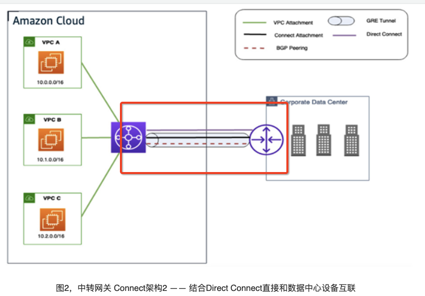
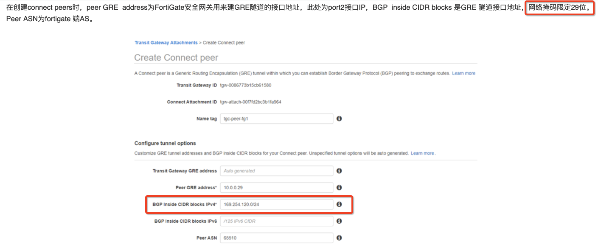

# Transit Gateway Connect

精读文章 [Transit Gateway Connect 集成FortiGate安全服务](https://aws.amazon.com/cn/blogs/china/transit-gateway-connect-connection-type-integrates-fortigate-security-service/)

1. 这篇文章里面的图二方法，用TGW Connect直连Direct Connect，这个和TGW Direct Connect attachment相比的区别是什么？什么场景用DX attachment 什么场景用TGW Connect链接DX？
- 回答：从连通性上讲没区别，都能通。TGW Connect的方式，可以理解为一种SD-WAN overlay的建立。这种方案表示SD-WAN是over所有的infra，包括DX 和 Public Internet，然后统一来管理。如果客户要求SDWAN Over Direct Connect 或者 VPN Over Direct Connect 的场景，可以使用上。

2. "6.4 中转网关路由表"
- 南北向流量：所有三个 VPC 传播路由到同一路由表。
- 东西向流量：如果需要控制和安全检查应用 VPC 之间的东西向流量，则需要多个中转网关路由表实现业务隔离，让业务间流量经过Fortigate安全网关。配合"8.5.3 VPC间东西向流量安全检查" 章节的配置。
- Hub 安全 VPC 不需要把整个VPC的路由通过 VPC 连接方式发布进来，只需要通过TGW connect 连接的BGP发布路由，因此，我们在此路由表里，删除安全VPC的Associations 和Propagations, 在Associations 和Propagations里只保留两个业务VPC 连接和 TGW connect连接

3. "6.5 Connect peers" 章节里面说 "在创建connect peers时，peer GRE  address为FortiGate安全网关用来建GRE隧道的接口地址，此处为port2接口IP，BGP  inside CIDR blocks 是GRE 隧道接口地址，网络掩码限定29位。 Peer ASN为fortigate 端AS。" 
- 注意：截图的时候有一个笔误，"BGP  inside CIDR blocks " 这里应该是 `169.254.120.0/29`

4. "7.1 业务VPC 路由表" 章节，
- 考虑两个业务VPC的互联网流量都需要通过Fortinet 防火墙进行防护，因此两个业务VPC不再设置互联网出口，任何业务VPC以外的网络的流量都需要通过中转网关路由到安全VPC互联网出口或其它VPC, 因此修改业务VPC路由默认网关至中转网关。并且配合 "9.2 从互联网访问业务服务器" 设置
- 如果需要互联网流量依旧保持走IGW，只有私有流量走 VPN / SD-WAN，那么路由规则是 0.0.0.0/0 走IGW；去往IDC的路由走 tgw。

5. 文章用 Fortinet 做例子，如果用其他品牌的VPN有啥技术要求才能配通 TGW Connect？
- 回答：只要支持GRE+BGP就可以连TGW Connect