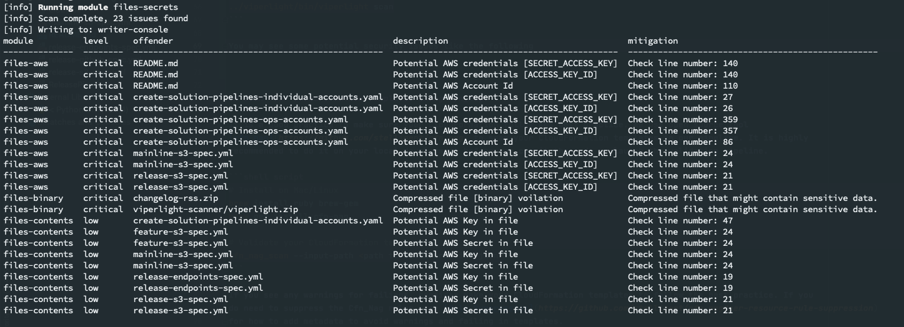

# Detect potential security issue in you code and cloudformation template

## Use viperlight-scanner to scan our content automatically.

Run the following command on your local development machine from the project root directory. You can run on Mac or Linux, if you are using Windows desktop, please try Amazon EC2.

```
cd project_folder
curl https://aws-solutions-build-assets.s3-us-west-2.amazonaws.com/viperlight-scanner/viperlight.zip -o viperlight.zip
unzip -q viperlight.zip -d ../viperlight
rm ./viperlight.zip
../viperlight/bin/viperlight scan
```

Notes: You may see some potential security issues like the following, try fix all the potential issues. The viper scanner may list some content which are not security issues. 



You can suppress those issues in .viperlightignore. You should add the .viperlightignore in your project’s root directory.

```bash
^dist/
CODE_OF_CONDUCT.md:4
CONTRIBUTING.md:50
source/code/schedulers/instance_scheduler.py:131
source/tests/cloudformation_util.py:26
```

You can also use the below open source one scanner-cli

https://github.com/hawkeyesec/scanner-cli

## Scan Your CloudFormation templates using Cfn_Nag
It is a good practice to make sure your CloudFormation follow AWS best practice. We use open source tool cfn_nag to scan your CloudFormation templates.

# Install on Mac/Linux
```bash
brew install ruby brew-gem
brew gem install cfn-nag
```

# Validate your CloudFormation templates
```bash
cfn_nag_scan --input-path <path to cloudformation json>
```

Notes: If you see any warnings or failings, consider make your CloudFormation templates to follow the best practice. If you do need to suppress the Cfn_Nag rules, see [Rule Suppression](https://github.com/stelligent/cfn_nag#per-resource-rule-suppression) for how to add metadata to avoid warnings and failing in templates.

```yaml
# Partial template
PublicAlbSecurityGroup:
  Properties:
    GroupDescription: 'Security group for a public Application Load Balancer'
    VpcId:
      Ref: vpc
  Type: AWS::EC2::SecurityGroup
  Metadata:
    cfn_nag:
      rules_to_suppress:
        - id: W9
          reason: "This is a public facing ELB and ingress from the internet should be permitted."
        - id: W2
          reason: "This is a public facing ELB and ingress from the internet should be permitted."
```