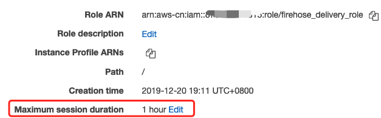

# Using temporary credentials with AWS resources

[Reference guide](https://docs.aws.amazon.com/IAM/latest/UserGuide/id_credentials_temp_use-resources.html)

## Step 1: Create the IAM Policy `STSAssumeRolePolicy`
```json
{
    "Version": "2012-10-17",
    "Statement": [
        {
            "Sid": "VisualEditor0",
            "Effect": "Allow",
            "Action": [
                "sts:AssumeRole",
                "sts:AssumeRoleWithSAML",
                "sts:AssumeRoleWithWebIdentity"
            ],
            "Resource": "*"
        }
    ]
}
```

## Step 2: Create IAM user `sts_user`

Create IAM user `sts_user` with Programmatic access and attach the `STSAssumeRolePolicy` Policy. This user only used for assume role.

## Step 3: Set the profile `sts_user` with IAM user `sts_user` credential
```bash
aws configure --profile sts_user
```

## Step 4: Set the target IAM Role `target-role-name` trust the IAM user `sts_user`

On the target IAM Role `target-role-name` setting of `Trust Relationship`. Add below policy section

```
{
      "Effect": "Allow",
      "Principal": {
        "AWS": "arn:aws-cn:iam::your-account:user/sts_user"
      },
      "Action": "sts:AssumeRole"
    }
```

## View and Update the "MaxSessionDuration" of IAM Role `target-role-name`


Or via CLI

```
aws iam get-role --role-name target-role-name --region cn-northwest-1
```

## Step 5: Get the target Role `target-role-name` temporary credentials via profile `sts_user`
```bash
aws sts assume-role --role-arn arn:aws-cn:iam::123456789012:role/target-role-name --role-session-name "role-name-session1" --duration-seconds 3600 --profile sts_user > assume-role-output.txt

export AWS_ACCESS_KEY_ID=$(cat assume-role-output.txt | jq '.Credentials.AccessKeyId' | sed 's/"//g')
export AWS_SECRET_ACCESS_KEY=$(cat assume-role-output.txt | jq '.Credentials.SecretAccessKey' | sed 's/"//g')
export AWS_SESSION_TOKEN=$(cat assume-role-output.txt | jq '.Credentials.SessionToken' | sed 's/"//g')

aws configure set aws_access_key_id $AWS_ACCESS_KEY_ID --profile target-role-profile
aws configure set aws_secret_access_key $AWS_SECRET_ACCESS_KEY --profile target-role-profile
aws configure set aws_session_token $AWS_SESSION_TOKEN --profile target-role-profile
aws configure set default.region cn-northwest-1 --profile target-role-profile

aws firehose --delivery-stream-name sample_firehose --record <value> --region cn-northwest-1 --profile target-role-profile
```
