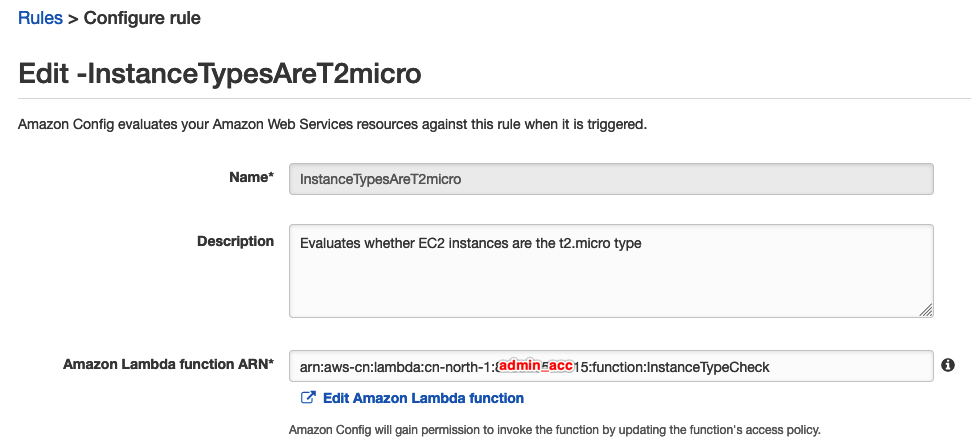
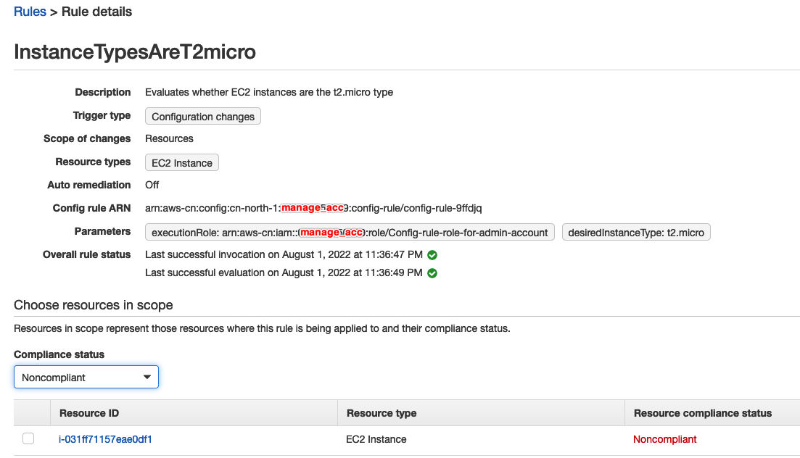

# Create a Lambda Function for a Cross-Account Config Rule
With appropriate authorization, you can create a Config rule in one account that uses an AWS Lambda function owned by another account. Such a setup allows you to maintain a single copy of the Lambda function. You do not have to duplicate source code across accounts.

## Steps overview
1.	Create a Lambda function for a cross-account Config rule in the admin-account.
2.	Authorize Config Rules in the managed-account to invoke a Lambda function in the admin-account.
3.	Create an IAM role in the managed-account to pass to the Lambda function.
4.	Add a policy and trust relationship to the IAM role in the managed-account.
5.	Creating a custom rule in the managed-account and Pass the IAM role from the managed-account to the Lambda function.

## Step by Step Guide
### Create a Lambda function for a cross-account Config rule in the admin-account.
[Follow up the guide](https://docs.aws.amazon.com/config/latest/developerguide/evaluate-config_develop-rules_getting-started.html) to create the sample Custom Lambda Rules that evaluates whether each of your EC2 instances is the t2.micro type.

1. to Creating an AWS Lambda Function for a Custom Config Rule `arn:aws-cn:lambda:cn-north-1:admin-account:function:InstanceTypeCheck`

The [lambda function sample code](scripts/cross-account-lambda-config.js) can be referred

1. lambda executionRole
`arn:aws-cn:iam::admin-account:role/service-role/LambdaConfigTriggerRole`

3. Creating a Custom Lambda Rule `InstanceTypesAreT2micro` to Evaluate Amazon EC2 Instances 

4. Review Compliance status: If the rule and the function are working as expected, a summary of the results appears after several minutes. For example, a result of 2 noncompliant resource(s) indicates that 2 of your instances are not t2.micro instances, and a result of Compliant indicates that all instances are t2.micro. 
   
### Authorize Config Rules in the managed-account to invoke a Lambda function in the admin-account.
1. Modify the Lambda function code to assume the IAM role passed on by the Config rule in the managed-account
   
    Because the Lambda function in admin-account will be used for reporting evaluation results in the managed-account, the Lambda function will need to be able to call the PutEvaluations Config API on the managed-account. We’ll pass the ARN of an IAM role in the managed-account to this Lambda function in admin-account as a rule parameter. We will need to add a few lines of code to the Lambda function’s handler in order to assume the IAM role passed on by the Config rule in the managed-account:

    ```js
        // Assume the role passed from the managed-account
        if (lambda_accountId != config_accountId){
            aws.config.credentials = new aws.TemporaryCredentials({RoleArn: ruleParameters.executionRole});
        }
        let config = new aws.ConfigService({});
        // Invoke the Config API to report the result of the evaluation
        config.putEvaluations(putEvaluationsRequest, (error, data)
    ```

2. Add the resource policy for the managed-account
    ```bash
    aws lambda add-permission --function-name InstanceTypeCheck \
    --statement-id <managed-account_invokeFunction> \
    --action "lambda:InvokeFunction" \
    --principal config.amazonaws.com.cn --source-account <managed-account> \
    --region cn-north-1 --profile china_ruiliang
    ```

### Create an IAM role in the managed-account to pass to the Lambda function in admin-account.
- Set Role Name: Config-rule-role-for-admin-account
- Select trusted entity - Amazon Web Services account - admin-account-id
- Policy
    ```json
    {
        "Version": "2012-10-17",
        "Statement": [
                {
                    "Effect": "Allow",
                    "Action": [
                        "config:PutEvaluations"
                    ],
                    "Resource": [
                        "*"
                    ]
                }
            ]
    }
    ```
- Record the role arn: `arn:aws-cn:iam::managed-account:role/Config-rule-role-for-admin-account`

### Add a policy and trust relationship to the IAM role in the managed-account.
- Update trusted entity of IAM Role Config-rule-role-for-admin-account in managed-account
    ```json
    {
        "Version": "2012-10-17",
        "Statement": [
            {
                "Effect": "Allow",
                "Principal": {
                        "Service": ["lambda.amazonaws.com","config.amazonaws.com","config.amazonaws.com.cn"],
                        "AWS": ["arn:aws-cn:iam::admin-account:root", "arn:aws-cn:iam::admin-account:role/service-role/LambdaConfigTriggerRole"]
                },
                "Action": "sts:AssumeRole",
                "Condition": {}
            }
        ]
    }
    ```

### Creating a custom rule in the managed-account and Pass the IAM role from the managed-account to the Lambda function.
1. In the AWS Config console of the managed-account, follow the steps to create a custom Config rule: `InstanceTypesAreT2micro`
- Description: Evaluates whether EC2 instances are the t2.micro type
- Name: InstanceTypesAreT2micro
- Paste the ARN of the Lambda function we created in the admin-account:
`arn:aws-cn:lambda:cn-north-1:admin-account:function:InstanceTypeCheck`
- Trigger type: `Configuration changes`
- Resource type: `EC2 Instance`
- Parameters:
  - `desiredInstanceType`:`t2.micro`
  - `executionRole`: `arn:aws-cn:iam::managed-account:role/Config-rule-role-for-admin-account`

2. Review Compliance status: If the rule and the function are working as expected, a summary of the results appears after several minutes. For example, a result of 2 noncompliant resource(s) indicates that 2 of your instances are not t2.micro instances, and a result of Compliant indicates that all instances are t2.micro. 





## Trouble shooting
1. Error: "AccessDeniedException: User: arn:aws-cn:sts::admin-account:assumed-role/LambdaConfigTriggerRole/InstanceTypeCheck is not authorized to perform: config:PutEvaluations because no identity-based policy allows the config:PutEvaluations action"

    AN: Add `AWSConfigRulesExecutionRole`

2. Failed to write to CloudWatch logs
   
    AN: Add `AWSLambdaBasicExecutionRole`

3. Error: "Could not load credentials from TemporaryCredentials"

    AN: Missing define the config rule Parameters in managed-account: `executionRole`: `arn:aws-cn:iam::managed-account:role/Config-rule-role-for-admin-account` 

4. Error: "User: arn:aws-cn:sts::admin-account:assumed-role/LambdaConfigTriggerRole/InstanceTypeCheck is not authorized to perform: sts:AssumeRole on resource: arn:aws-cn:iam::managed-account:role/Config-rule-role-for-admin-account"
   
   AN: Follow the guide [How do I configure a Lambda function to assume an IAM role in another AWS account](https://aws.amazon.com/premiumsupport/knowledge-center/lambda-function-assume-iam-role/). Usually it is missing add the policy statement to your Lambda function's execution role in admin-account
   ```json
    {
        "Version": "2012-10-17",
        "Statement": {
            "Effect": "Allow",
            "Action": "sts:AssumeRole",
            "Resource": "arn:aws-cn:iam::managed-account:role/Config-rule-role-for-admin-account"
        }
    }
    ```
   
## Reference
[How to Centrally Manage AWS Config Rules across Multiple AWS Accounts](https://aws.amazon.com/blogs/devops/how-to-centrally-manage-aws-config-rules-across-multiple-aws-accounts/)

[Creating AWS Config Custom Lambda Rules](https://docs.aws.amazon.com/config/latest/developerguide/evaluate-config_develop-rules_lambda-functions.html)

[How do I configure a Lambda function to assume an IAM role in another AWS account](https://aws.amazon.com/premiumsupport/knowledge-center/lambda-function-assume-iam-role/)
