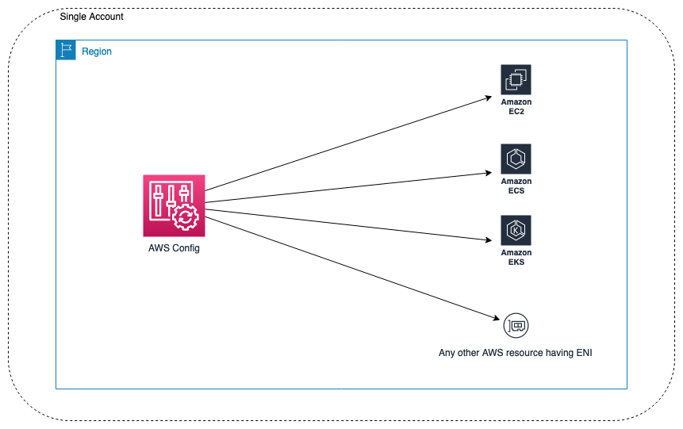
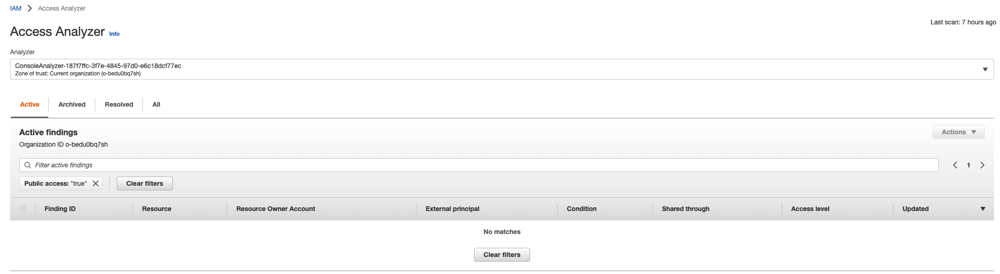

# Find Public Internet Facing Resources under account
- [Find Public Internet Facing Resources under account](#find-public-internet-facing-resources-under-account)
  - [Find Public IPs of Resources – Use AWS Config](#find-public-ips-of-resources--use-aws-config)
    - [Solution briefing](#solution-briefing)
    - [Resource Scope - elastic network interface with public IP:](#resource-scope---elastic-network-interface-with-public-ip)
    - [Account Scope:](#account-scope)
    - [Query SQL:](#query-sql)
    - [Automation](#automation)
    - [Reference](#reference)
  - [Quickly identify public access to resources using the IAM Access Analyzer](#quickly-identify-public-access-to-resources-using-the-iam-access-analyzer)
    - [Using AWS IAM Access Analyzer provable security for public and cross-account analysis](#using-aws-iam-access-analyzer-provable-security-for-public-and-cross-account-analysis)
    - [Reference](#reference-1)


## Find Public IPs of Resources – Use AWS Config
### Solution briefing
This is a scalable, serverless, and automated approach to discover public IP addresses assigned to resources in a single or multi-account environment in AWS, using AWS Config.

Single account is when you have all your resources in a single AWS account. A multi-account environment refers to many accounts under the same AWS Organization.

The advanced query feature of AWS Config provides capability using SQL to get current resource state metadata for a single account and Region, or multiple accounts and Regions. The advanced query will check for all elastic network interfaces in your account(s).

### Resource Scope - elastic network interface with public IP:
- EC2
- ELB
- EKS
- ECS
- Any resources has ENI

### Account Scope:
- Single account and single Region
- Multiple accounts and multiple Regions
- AWS Organization accounts



### Query SQL:
```sql
SELECT
  resourceId,
  resourceName,
  resourceType,
  configuration.association.publicIp,
  availabilityZone,
  awsRegion
WHERE
  resourceType='AWS::EC2::NetworkInterface'
  AND configuration.association.publicIp>'0.0.0.0'
```

### Automation
Customer can setup the automation workflow to get the public resources. The workflow can be done with Amazon EventBridge triggering an AWS Lambda function. You can configure an Amazon EventBridge schedule via rate or cron expressions, which define the frequency. This AWS Lambda function will host the code to make an API call to AWS Config that will run an advanced query. When the results are returned, they can be stored on Amazon S3. These result files can be timestamped (via naming or S3 versioning) in order to keep a history of public IPs used in your account. The result set can then be fed into or accessed by the vulnerability tool of your choice.

[Automaiton ArchforIPs](scripts/Fig4-ArchforIPs.png)

Note: AWS Config advanced queries can also be used to query IPv6 addresses. You can use the “configuration.ipv6Addresses” AWS Config property to get IPv6 addresses. Please check [code in github](https://github.com/awslabs/aws-config-resource-schema).

### Reference
[Find Public IPs of Resources – Use AWS Config for Vulnerability Assessment](https://aws.amazon.com/blogs/architecture/find-public-ips-of-resources-use-aws-config-for-vulnerability-assessment/)


## Quickly identify public access to resources using the IAM Access Analyzer
### Using AWS IAM Access Analyzer provable security for public and cross-account analysis
AWS IAM Access Analyzer console now flags resources that allow public access to help you quickly identify and remediate unintended public access. You can use filters to quickly identify public access findings to help you prioritize remediation of unintended public access. 



### Reference
[IAM Access Analyzer Guides You Toward Least-Privilege Permissions](https://aws.amazon.com/iam/features/analyze-access/)