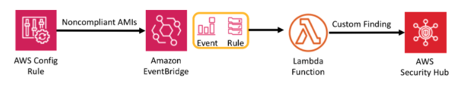

# Security Hub Briefing

## Secuirty Hub FAQ
1. General questions
[Secuirty Hub FAQ](https://aws.amazon.com/security-hub/faqs/)

2. API Guide

  [Security Hub boto3 API guide](https://boto3.amazonaws.com/v1/documentation/api/latest/reference/services/securityhub.html)

  [Security Hub cli guide](https://docs.aws.amazon.com/cli/latest/reference/securityhub/index.html#cli-aws-securityhub)

3. What is security standards and controls in AWS Security Hub
  - [Center for Internet Security CIS AWS Foundations](https://docs.amazonaws.cn/en_us/securityhub/latest/userguide/securityhub-standards-cis.html)
  - [AWS Foundational Security Best Practices](https://docs.amazonaws.cn/en_us/securityhub/latest/userguide/securityhub-standards-fsbp.html)
  - [Payment Card Industry Data Security Standard (PCI DSS)](https://docs.amazonaws.cn/en_us/securityhub/latest/userguide/securityhub-standards-pcidss.html)

4. How to support check EC2 use the approved customer AMI?
  
  You can use the AWS Config to check that running instances are using approved AMIs. You can specify a list of approved AMI by ID or provide a tag to specify the list of AMI Ids.

5. What the Workflow status of a finding?

  The workflow status is initially `NEW`. If you notified the resource owner to take action on the finding, you can set the workflow status to `NOTIFIED`. If the finding is not an issue, and does not require any action, set the workflow status to `SUPPRESSED`. After you review and remediate a finding, set the workflow status to `RESOLVED`. Customers (or SIEM, ticketing, incident management, or SOAR tools working on behalf of a customer to update findings from finding providers) can also use `BatchUpdateFindings` API to update the workflow status. 

6. Schedule for running security checks

After you enable a security standard, AWS Security Hub begins to run all checks within two hours. Most checks begin to run within 25 minutes. 

After the initial check, the schedule for each control can be either periodic or change triggered.

 - Periodic checks run automatically within 12 hours after the most recent run. You cannot change the periodicity.

 - Change-triggered checks run when the associated resource changes state which AWS Config managed check. Even if the resource does not change state, the updated at time for change-triggered checks is refreshed every 18 hours. 

7. [Finding format](https://docs.aws.amazon.com/securityhub/latest/userguide/securityhub-findings-format.html)

8. How to Create Custom Findings?

Create Custom Findings with AWS Config



Using custom product integrations to send findings to AWS Security Hub 

https://docs.amazonaws.cn/en_us/securityhub/latest/userguide/securityhub-custom-providers.html

## Cross Account Managemnt

Security Hub supports up to 1,000 member accounts per master account per Region.

If account A then enables Security Hub, users from account A do not automatically see Security Hub findings for accounts B and C in Security Hub. A Security Hub master-member relationship is also required for these accounts. To do this, first enable Security Hub in all three accounts (A, B, and C). Next, make account A the Security Hub master account and invite accounts B and C to become Security Hub member accounts. 

```bash
# 1. Adding member accounts
aws securityhub create-members --account-details '[{"AccountId": "123456789111"}, {"AccountId": "123456789222"}]'
{
    "UnprocessedAccounts": []
}

# 2. Inviting member accounts 
aws securityhub invite-members --account-ids "123456789111" "123456789222"
{
    "UnprocessedAccounts": []
}

#3. Accepting an invitation
aws securityhub list-invitations --profile member-account
aws securityhub accept-invitation --master-id 123456789012 --invitation-id 7ab938c5d52d7904ad09f9e7c20cc4eb --profile member-account

#4. OR you can Declining an invitation
aws securityhub decline-invitations --account-ids "123456789012" --profile member-account

## Enable securityhub on member account
aws securityhub enable-security-hub \
    --enable-default-standards --profile member-account
```

[AWS Security Hub Multiaccount Scripts](https://github.com/awslabs/aws-securityhub-multiaccount-scripts)

These scripts automate the process of enabling and disabling AWS Security Hub simultaneously across a group of AWS accounts that are in your control. (Note, that you can have one master account and up to a 1000 member accounts).

## AWS Security Hub hands on workshop
https://security-hub-workshop.awssecworkshops.com/


