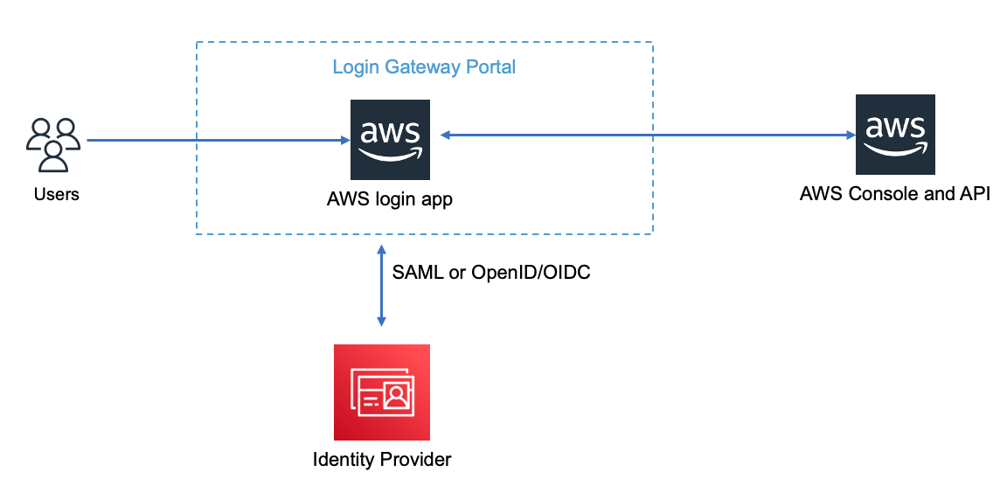

# Enabling custom identity broker access to the AWS console

Lets users who sign in to your organization's identity provider access the AWS Management Console, you can create a custom identity broker:

## Architecture and workflow



1. Users login the Login Gateway Portal
2. Login Gateway Portal Manage the Corp Role and AWS IAM Role Mapping
3. Login Gateway Portal call AWS API to create temporary security credentials as request a sign-in token (with proper Role permission)
4. Login Gateway Portal construct a URL for the console that includes the token.
5. User use the URL on the user‘s behalf to access AWS
6. User can switch Role from AWS console if user grant multiple AWS IAM Role

## The [Example using python code](scripts/customer_idp_broker.py) logic:

1. Verify that the user is authenticated by your identity provider in your broker application.

2. Call the AWS Security Token Service (AWS STS) AssumeRole to obtain temporary security credentials for the user. 

3. Call the AWS federation endpoint and supply the temporary security credentials to request a sign-in token. 

4. Construct a URL for the console that includes the token.

5. Give the URL to the user on your broker application or invoke the URL on the user's behalf.

Follow up [Enabling custom identity broker access to the AWS console official guide](https://docs.aws.amazon.com/IAM/latest/UserGuide/id_roles_providers_enable-console-custom-url.html)

[Example using python code](scripts/customer_idp_broker.py) to construct the URL. The python code need aws profile with permission
```json
{
    "Version": "2012-10-17",
    "Statement": [
        {
            "Sid": "VisualEditor0",
            "Effect": "Allow",
            "Action": [
                "sts:AssumeRole",
                "sts:AssumeRoleWithSAML",
                "sts:AssumeRoleWithWebIdentity"
            ],
            "Resource": "*"
        }
    ]
}

6. You can configure the SwitchRole
- Add below permission to the original Role `SSO-ROLE-NAME` grant by AWS STS. The policy allow Role `SSO-ROLE-NAME` switch to Role `TARGET_SWITCH_ROLE_NAME`
```json
{
    "Effect": "Allow",
    "Action": "sts:AssumeRole",
    "Resource": "arn:aws-cn:iam::ACCOUNT-ID-WITHOUT-HYPHENS:role/TARGET_SWITCH_ROLE_NAME"
}
```

- Add the Policy to Trusted entities of Role `TARGET_SWITCH_ROLE_NAME`. The policy trust Role `SSO-ROLE-NAME` Swith to Role `TARGET_SWITCH_ROLE_NAME`
```json
   {
      "Effect": "Allow",
      "Principal": {
        "AWS": "arn:aws-cn:iam::ACCOUNT-ID-WITHOUT-HYPHENS:role/SSO-ROLE-NAME"
      },
      "Action": "sts:AssumeRole"
    }
```

# Reference
[How do I assume an IAM role](https://aws.amazon.com/premiumsupport/knowledge-center/iam-assume-role-cli/)