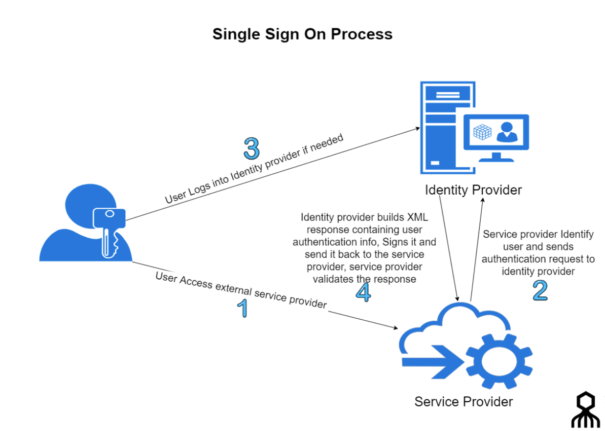

# Summary the Single-Sign-On cases

SSO Concept

There are 3 times of Single-Sign-On cases
1. Identity Provider directly configure the Single-Sign-On with AWS console
2. There is gateway portal (custom identity broker) in enterprise to do Single-Sign-On. 
- finish the Authentication with Identity Provider
- finsih the Authorization by mapping IAM Role with user identity. 
- Use the sts-token to construct the login url
3. Grant the Identity Provider user permission to use the AWS API/CLI

# 1. Identity Provider directly configure the Single-Sign-On with AWS console
- Windows Active Directory and ADFS with SAML2.0 example: [Enabling Federation to AWS console using Windows Active Directory, ADFS, and SAML 2.0](Using-ADFS-SSO.md)
    - [MFA support the ADFS](https://docs.microsoft.com/en-us/windows-server/identity/ad-fs/operations/configure-additional-authentication-methods-for-ad-fs)
- Auth0 with SAML2.0 example: [Using IAM federation and Switch role to implement the Single Sign On multiple AWS Accounts](https://aws.amazon.com/cn/blogs/china/enable-single-sign-on-sso-and-aws-multi-account-management-for-enterprise-users-with-aws-federation-authentication/)
- OpenID example: [Okta-OpenID-AWS-in-the-Browser](Okta-OpenID-AWS-in-the-Browser.md)

# 2. Gateway portal (custom identity broker) to do Single-Sign-On
- [Enabling custom identity broker access to the AWS console](Customer_Idp_Broker_access_aws_console.md)

# 3. Grant the Identity Provider user permission to use the AWS API/CLI
- [Grant my Active Directory users access to the API or AWS CLI with AD FS](https://aws.amazon.com/cn/premiumsupport/knowledge-center/adfs-grant-ad-access-api-cli/)
   - [PowerShell for AD FS using IWA (PowerShell 2.0)](https://aws.amazon.com/cn/premiumsupport/knowledge-center/adfs-grant-ad-access-api-cli/)
   - [Python for AD FS using IWA (default for AD FS 2.0)](https://aws.amazon.com/blogs/security/how-to-implement-federated-api-and-cli-access-using-saml-2-0-and-ad-fs/)
   - [Python for AD FS using form-based authentication (default for AD FS 3.0 and 4.0)](https://aws.amazon.com/blogs/security/how-to-implement-a-general-solution-for-federated-apicli-access-using-saml-2-0/)
- [Using temporary credentials with AWS resources](../Using-temporary-credentials-with-AWS-resources.md)