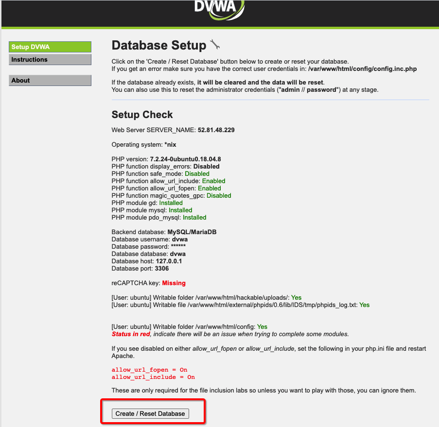
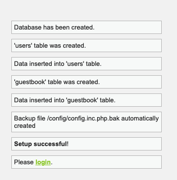
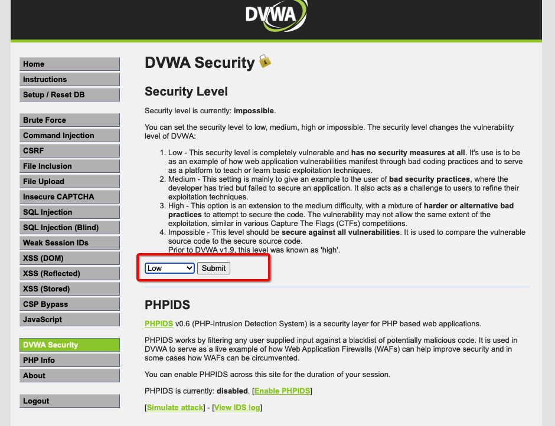
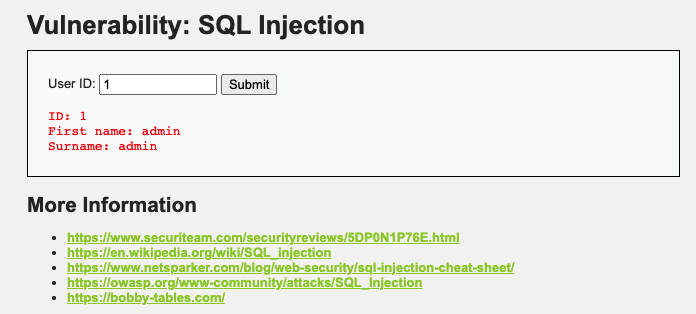
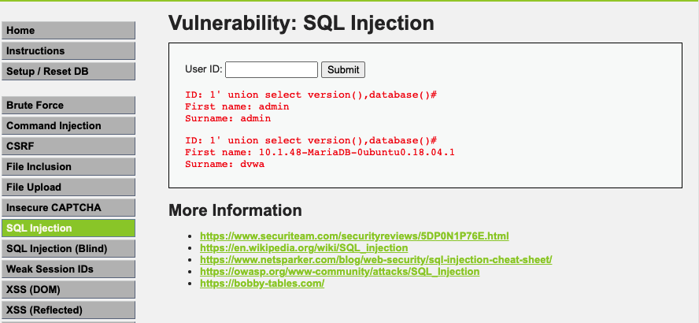

# WAF simulation protection use the Damn Vulnerable Web Application (DVWA)

Damn Vulnerable Web Application (DVWA) is a PHP/MySQL web application that is damn vulnerable. Its main goal is to be an aid for security professionals to test their skills and tools in a legal environment, help web developers better understand the processes of securing web applications and to aid both students & teachers to learn about web application security in a controlled class room environment.

1. Launch the Ubuntu 18.04 LTS EC2 instance.
- Security Group 80/443/22

2. Install Dependencies required for DVWA-lab
```bash
sudo apt-get -y install apache2 mariadb-server php php-mysqli php-gd libapache2-mod-php
```

3. Download the source 
```bash
git clone https://github.com/digininja/DVWA.git
sudo rsync -avP ./DVWA/ /var/www/html/

ls /var/www/html/

rm -r /var/www/html/index.html

cp /var/www/html/config/config.inc.php.dist /var/www/html/config/config.inc.php
```

4. Database Setup
```bash
sudo bash

mysql -u root -p

mysql> create database dvwa;
Query OK, 1 row affected (0.00 sec)

mysql> create user dvwa@localhost identified by 'p@ssw0rd';
Query OK, 0 rows affected (0.01 sec)

mysql> grant all on dvwa.* to dvwa@localhost;
Query OK, 0 rows affected (0.01 sec)

mysql> flush privileges;
Query OK, 0 rows affected (0.00 sec)
```

The database configuration can be found in `./config/config.inc.php`

The variables are set to the following by default:

```
vim /var/www/html/config/config.inc.php

$_DVWA[ 'db_user' ] = 'dvwa';
$_DVWA[ 'db_password' ] = 'p@ssw0rd';
$_DVWA[ 'db_database' ] = 'dvwa';
```

5. Configure PHP
```bash
php -v

vim /etc/php/7.2/apache2/php.ini

    allow_url_include = On 
    allow_url_fopen = On 
    safe_mode = Off 
    magic_quotes_gpc = Off  
    display_errors = Off
```

6. File folder permission needs to be writeable by the web service 
```bash
/var/www/html/hackable/uploads/
/var/www/html/external/phpids/0.6/lib/IDS/tmp/phpids_log.txt
sudo chown -R ubuntu:ubuntu /var/www/html/
sudo chmod 777 /var/www/html/config
sudo chmod 666 /var/www/html/external/phpids/0.6/lib/IDS/tmp/phpids_log.txt
sudo chmod 777 /var/www/html/hackable/uploads/
```

7. reCAPTCHA key (Optional)
 - Visit https://www.google.com/recaptcha/about/
 - Used for the 'Insecure CAPTCHA' module
 - You'll need to generate your own keys at: https://www.google.com/recaptcha/admin

```bash
vim /var/www/html/config/config.inc.php
$_DVWA[ 'recaptcha_public_key' ]  = '';
$_DVWA[ 'recaptcha_private_key' ] = '';
```

6. restart apache
```bash
sudo systemctl restart apache2
```

7. Setup and login
 - Setup: http://[server_ip_address]/setup.php
 
 

 - login: http://[server_ip_address]/login.php

    ```bash
    Default Credentials
        Default username = admin
        Default password = password
    ```

8. Setup the ALB in front of EC2
 - Create the ALB and setupt the ALB security group only allow 80 and 443 port
 - Change the EC2 security group only allow 80 and 443 port from ALB security group

9. Testing the SQL Ingestion protection
 - http://[server_ip_address]/login.php
 - Change the DVWA Security level to `low`



 - query the userID by input `1`



 - input the SQL Ingestion sample: `1' union select version(),database()#` or `1 ' union select user_id,password from dvwa.users where user='admin'#`
 
  We can see the attack result



 - Associated Web ACL which includes `AWS-AWSManagedRulesSQLiRuleSet` with ALB
 - Re-enter the SQL Ingestion sample:
 - Page return the `403 Forbidden`

# Additional test
1. SQL Injection – Dhakkan setup
```bash
git clone http://github.com/Rinkish/Sqli_Edited_Version
cd Sqli_Edited_Version/
ls
sudo rsync -avP ./sqlilabs/ /var/www/html/sqli/

cd /var/www/html/sqli/
cd sql-connections/
vim db-creds.inc

$dbuser = 'dvwa';
$dbpass = 'p@ssw0rd';
```
2. vist http://[server_ip_address]/sqli
click on Setup/reset 

3. OWASP Mutillidae II setup
```bash
git clone https://github.com/webpwnized/mutillidae

sudo rsync -avP ./mutillidae/ /var/www/html/

cd /var/www/html/mutillidae/includes

ls
vim database-config.inc
# Change the dbuser and db password
```

# Reference
[Web Application Pentest Lab Setup on AWS](https://www.hackingarticles.in/web-application-pentest-lab-setup-on-aws/)

[How to Install and Configure DVWA Lab on Ubuntu 18.04 server](https://kifarunix.com/how-to-setup-damn-vulnerable-web-app-lab-on-ubuntu-18-04-server/)