# Amazon FSx for Windows File Server Workshop

## Setup environment

The workshop content is based on https://github.com/aws-samples/amazon-fsx-workshop

For global region, you can directly Launch it from [github](https://github.com/aws-samples/amazon-fsx-workshop) 

For China region, use the [CloudFormation Template](scripts/fsx-windows-od-workshop-cn.yaml) to manually deploy.


## FSx file system Console Overview

Examine the Summary section of the FSx file system attributes

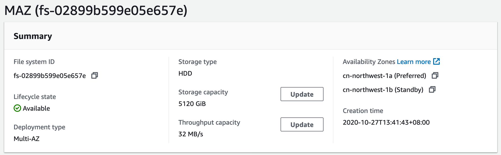

Network & security of the FSx file system attributes

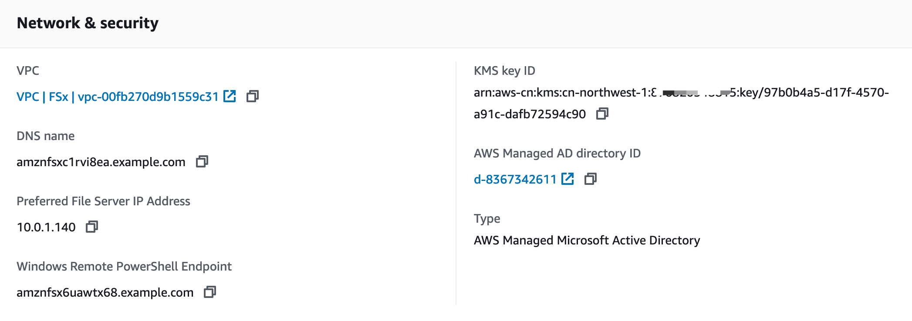

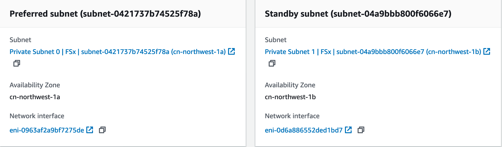

Security group setting

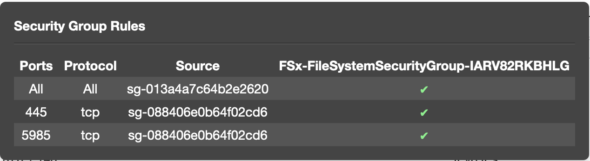


Amazon FSx for Windows File Server performs routine software patching for the Microsoft Windows Server software it manages. The maintenance window is your opportunity to control what day and time of the week this software patching occurs. Patching occurs infrequently, typically once every several weeks. Patching should require only a fraction of your 30-minute maintenance window. During these few minutes of time, your Single-AZ file system is temporarily unavailable, and Multi-AZ file systems automatically fail over and fail back.


## Working on file share
1. Map network driver

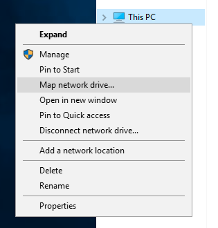

The folder format: `//DNS-name-FSx-file-system/share`

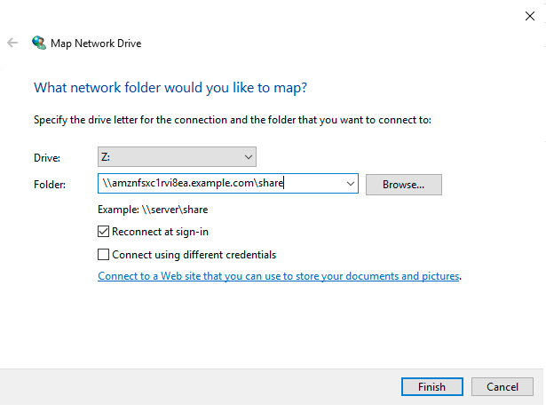

2. Create new file under file share

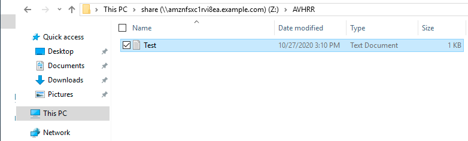

3. Create new file shares

On windows instance, from Start -> Type `fsmgmt.msc`

From the Shared Folders window, select Action >> Connect to another computer…​.

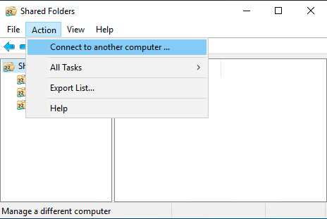

Create A Shared Folder Wizard

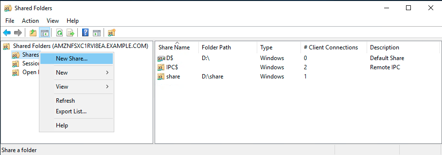

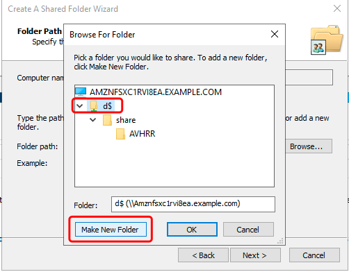

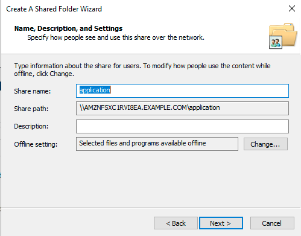

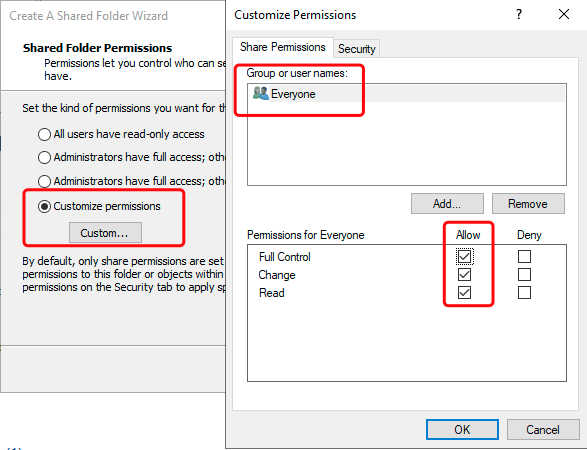

4. Windows Remote PowerShell Endpoint

Run the updated script in the Windows PowerShell window. Replace the windows_remote_powershell_endpoint with your FSx file system `powershell_endpoint` DNS name

```bash
$WindowsRemotePowerShellEndpoint = "amznfsx6uawtx68.example.com" #  "windows_remote_powershell_endpoint"
enter-pssession -ComputerName ${WindowsRemotePowerShellEndpoint} -ConfigurationName FsxRemoteAdmin

Get-Command
```

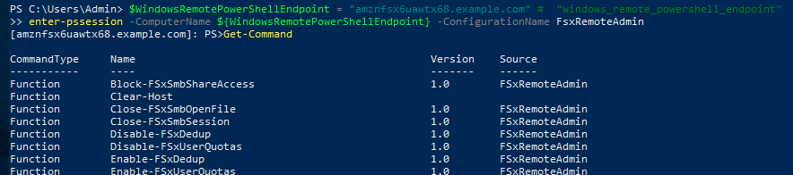

```bash
[amznfsx6uawtx68.example.com]: PS>Get-FSxSmbShare

Name        ScopeName       Path           Description
----        ---------       ----           -----------
application AMZNFSXC1RVI8EA D:\application
D$          AMZNFSXC1RVI8EA D:\            Default Share
data        AMZNFSXC1RVI8EA D:\data
IPC$        *                              Remote IPC
share       AMZNFSXC1RVI8EA D:\share

[amznfsx6uawtx68.example.com]: PS>Get-FSxSmbSession

SessionId     ClientComputerName ClientUserName NumOpens
---------     ------------------ -------------- --------
4415226380297 10.0.0.8           example\Admin  0

[amznfsx6uawtx68.example.com]: PS>Get-FSxSmbServerConfiguration

EncryptData RejectUnencryptedAccess
----------- -----------------------
       True                   False

Get-FSxSmbShareAccess (when prompted, enter these share names one at a time: application, data, share; press enter between each one and again at the end)

[amznfsx6uawtx68.example.com]: PS>Get-FSxSmbShareAccess

cmdlet Get-FSxSmbShareAccess at command pipeline position 1
Supply values for the following parameters:
Name[0]: application
Name[1]: data
Name[2]: share
Name[3]:

Name        ScopeName       AccountName AccessControlType AccessRight
----        ---------       ----------- ----------------- -----------
data        AMZNFSXC1RVI8EA Everyone    Allow             Full
share       AMZNFSXC1RVI8EA Everyone    Allow             Full
application AMZNFSXC1RVI8EA Everyone    Allow             Full
```

## Test Performance

Using `DiskSpd` to do performace tests

1. Run the script below in the PowerShell to create a 100 GB sparse file.
```
$random = $(Get-Random)
fsutil file createnew Z:\${env:computername}-$random.dat 100000000000

File Z:\EC2AMAZ-07IMTRS-596612077.dat is created
```

2. Read test
```
C:\Tools\DiskSpd-2.0.21a\amd64\DiskSpd.exe -d120 -w0 -r -t1 -o32 -b64K -Su -L Z:\${env:computername}-$random.dat

Results for timespan 1:
*******************************************************************************

actual test time:       120.02s
thread count:           1
proc count:             2

CPU |  Usage |  User  |  Kernel |  Idle
-------------------------------------------
   0|  92.74%|   3.66%|   89.08%|   7.26%
   1|   1.29%|   0.48%|    0.81%|  98.71%
-------------------------------------------
avg.|  47.01%|   2.07%|   44.94%|  52.99%

Total IO
thread |       bytes     |     I/Os     |    MiB/s   |  I/O per s |  AvgLat  | LatStdDev |  file
-----------------------------------------------------------------------------------------------------
     0 |     71644479488 |      1093208 |     569.31 |    9108.89 |    3.510 |     1.806 | Z:\EC2AMAZ-07IMTRS-596612077.dat (93GiB)
-----------------------------------------------------------------------------------------------------
total:       71644479488 |      1093208 |     569.31 |    9108.89 |    3.510 |     1.806

Read IO
thread |       bytes     |     I/Os     |    MiB/s   |  I/O per s |  AvgLat  | LatStdDev |  file
-----------------------------------------------------------------------------------------------------
     0 |     71644479488 |      1093208 |     569.31 |    9108.89 |    3.510 |     1.806 | Z:\EC2AMAZ-07IMTRS-596612077.dat (93GiB)
-----------------------------------------------------------------------------------------------------
total:       71644479488 |      1093208 |     569.31 |    9108.89 |    3.510 |     1.806

Write IO
thread |       bytes     |     I/Os     |    MiB/s   |  I/O per s |  AvgLat  | LatStdDev |  file
-----------------------------------------------------------------------------------------------------
     0 |               0 |            0 |       0.00 |       0.00 |    0.000 |       N/A | Z:\EC2AMAZ-07IMTRS-596612077.dat (93GiB)
-----------------------------------------------------------------------------------------------------
total:                 0 |            0 |       0.00 |       0.00 |    0.000 |       N/A


total:
  %-ile |  Read (ms) | Write (ms) | Total (ms)
----------------------------------------------
    min |      0.445 |        N/A |      0.445
   25th |      2.787 |        N/A |      2.787
   50th |      3.372 |        N/A |      3.372
   75th |      4.028 |        N/A |      4.028
   90th |      4.740 |        N/A |      4.740
   95th |      5.251 |        N/A |      5.251
   99th |      6.549 |        N/A |      6.549
3-nines |     12.163 |        N/A |     12.163
4-nines |    104.633 |        N/A |    104.633
5-nines |    135.448 |        N/A |    135.448
6-nines |    137.379 |        N/A |    137.379
7-nines |    137.847 |        N/A |    137.847
8-nines |    137.847 |        N/A |    137.847
9-nines |    137.847 |        N/A |    137.847
    max |    137.847 |        N/A |    137.847

```

**Parameters**:

```
-b<size>[K|M|G]  Block size in bytes or KiB, MiB, or GiB (default = 64K).

-o<count>  Number of outstanding I/O requests per-target per-thread. (1 = synchronous I/O, unless more than one thread is specified with by using -F.) (default = 2)

-r<size>[K|M|G]  Random I/O aligned to the specified number of <alignment> bytes or KiB, MiB, GiB, or blocks. Overrides -s (default stride = block size).

-s<size>[K|M|G]  Sequential stride size, offset between subsequent I/O operations in bytes or KiB, MiB, GiB, or blocks. Ignored if -r is specified (default access = sequential, default stride = block size).

-t<count>  Number of threads per target. Conflicts with -F, which specifies the total number of threads.

-Su  Disable software caching.
```

More testing

```
C:\Tools\DiskSpd-2.0.21a\amd64\DiskSpd.exe -d120 -w0 -r -t8 -o32 -b1M -Su -L Z:\${env:computername}-$random.dat

Results for timespan 1:
*******************************************************************************

actual test time:       120.00s
thread count:           8
proc count:             2

CPU |  Usage |  User  |  Kernel |  Idle
-------------------------------------------
   0|  74.91%|   0.18%|   74.73%|  25.09%
   1|  17.20%|   0.31%|   16.89%|  82.80%
-------------------------------------------
avg.|  46.05%|   0.25%|   45.81%|  53.95%

Total IO
thread |       bytes     |     I/Os     |    MiB/s   |  I/O per s |  AvgLat  | LatStdDev |  file
-----------------------------------------------------------------------------------------------------
     0 |      8325693440 |         7940 |      66.17 |      66.17 |  481.657 |   696.925 | Z:\EC2AMAZ-07IMTRS-596612077.dat (93GiB)
     1 |      8492417024 |         8099 |      67.49 |      67.49 |  471.919 |   692.439 | Z:\EC2AMAZ-07IMTRS-596612077.dat (93GiB)
     2 |      8337227776 |         7951 |      66.26 |      66.26 |  481.048 |   697.435 | Z:\EC2AMAZ-07IMTRS-596612077.dat (93GiB)
     3 |      8585740288 |         8188 |      68.23 |      68.23 |  467.160 |   688.631 | Z:\EC2AMAZ-07IMTRS-596612077.dat (93GiB)
     4 |      8376025088 |         7988 |      66.57 |      66.57 |  479.316 |   694.942 | Z:\EC2AMAZ-07IMTRS-596612077.dat (93GiB)
     5 |      8294236160 |         7910 |      65.92 |      65.92 |  483.063 |   698.421 | Z:\EC2AMAZ-07IMTRS-596612077.dat (93GiB)
     6 |      8453619712 |         8062 |      67.18 |      67.18 |  473.769 |   691.402 | Z:\EC2AMAZ-07IMTRS-596612077.dat (93GiB)
     7 |      8336179200 |         7950 |      66.25 |      66.25 |  480.799 |   696.913 | Z:\EC2AMAZ-07IMTRS-596612077.dat (93GiB)
-----------------------------------------------------------------------------------------------------
total:       67201138688 |        64088 |     534.07 |     534.07 |  477.282 |   694.631

Read IO
thread |       bytes     |     I/Os     |    MiB/s   |  I/O per s |  AvgLat  | LatStdDev |  file
-----------------------------------------------------------------------------------------------------
     0 |      8325693440 |         7940 |      66.17 |      66.17 |  481.657 |   696.925 | Z:\EC2AMAZ-07IMTRS-596612077.dat (93GiB)
     1 |      8492417024 |         8099 |      67.49 |      67.49 |  471.919 |   692.439 | Z:\EC2AMAZ-07IMTRS-596612077.dat (93GiB)
     2 |      8337227776 |         7951 |      66.26 |      66.26 |  481.048 |   697.435 | Z:\EC2AMAZ-07IMTRS-596612077.dat (93GiB)
     3 |      8585740288 |         8188 |      68.23 |      68.23 |  467.160 |   688.631 | Z:\EC2AMAZ-07IMTRS-596612077.dat (93GiB)
     4 |      8376025088 |         7988 |      66.57 |      66.57 |  479.316 |   694.942 | Z:\EC2AMAZ-07IMTRS-596612077.dat (93GiB)
     5 |      8294236160 |         7910 |      65.92 |      65.92 |  483.063 |   698.421 | Z:\EC2AMAZ-07IMTRS-596612077.dat (93GiB)
     6 |      8453619712 |         8062 |      67.18 |      67.18 |  473.769 |   691.402 | Z:\EC2AMAZ-07IMTRS-596612077.dat (93GiB)
     7 |      8336179200 |         7950 |      66.25 |      66.25 |  480.799 |   696.913 | Z:\EC2AMAZ-07IMTRS-596612077.dat (93GiB)
-----------------------------------------------------------------------------------------------------
total:       67201138688 |        64088 |     534.07 |     534.07 |  477.282 |   694.631

Write IO
thread |       bytes     |     I/Os     |    MiB/s   |  I/O per s |  AvgLat  | LatStdDev |  file
-----------------------------------------------------------------------------------------------------
     0 |               0 |            0 |       0.00 |       0.00 |    0.000 |       N/A | Z:\EC2AMAZ-07IMTRS-596612077.dat (93GiB)
     1 |               0 |            0 |       0.00 |       0.00 |    0.000 |       N/A | Z:\EC2AMAZ-07IMTRS-596612077.dat (93GiB)
     2 |               0 |            0 |       0.00 |       0.00 |    0.000 |       N/A | Z:\EC2AMAZ-07IMTRS-596612077.dat (93GiB)
     3 |               0 |            0 |       0.00 |       0.00 |    0.000 |       N/A | Z:\EC2AMAZ-07IMTRS-596612077.dat (93GiB)
     4 |               0 |            0 |       0.00 |       0.00 |    0.000 |       N/A | Z:\EC2AMAZ-07IMTRS-596612077.dat (93GiB)
     5 |               0 |            0 |       0.00 |       0.00 |    0.000 |       N/A | Z:\EC2AMAZ-07IMTRS-596612077.dat (93GiB)
     6 |               0 |            0 |       0.00 |       0.00 |    0.000 |       N/A | Z:\EC2AMAZ-07IMTRS-596612077.dat (93GiB)
     7 |               0 |            0 |       0.00 |       0.00 |    0.000 |       N/A | Z:\EC2AMAZ-07IMTRS-596612077.dat (93GiB)
-----------------------------------------------------------------------------------------------------
total:                 0 |            0 |       0.00 |       0.00 |    0.000 |       N/A


total:
  %-ile |  Read (ms) | Write (ms) | Total (ms)
----------------------------------------------
    min |      9.201 |        N/A |      9.201
   25th |     52.350 |        N/A |     52.350
   50th |     93.252 |        N/A |     93.252
   75th |    372.770 |        N/A |    372.770
   90th |   1764.097 |        N/A |   1764.097
   95th |   1832.003 |        N/A |   1832.003
   99th |   1954.918 |        N/A |   1954.918
3-nines |   2030.987 |        N/A |   2030.987
4-nines |   2049.324 |        N/A |   2049.324
5-nines |   2052.425 |        N/A |   2052.425
6-nines |   2052.425 |        N/A |   2052.425
7-nines |   2052.425 |        N/A |   2052.425
8-nines |   2052.425 |        N/A |   2052.425
9-nines |   2052.425 |        N/A |   2052.425
    max |   2052.425 |        N/A |   2052.425
```

3. DiskSpd Write tests
```
$random = $(Get-Random)
C:\Tools\DiskSpd-2.0.21a\amd64\DiskSpd.exe -d120 -c2G -s64K -w100 -t1 -o32 -b64K -Sh -L Z:\${env:computername}-$random.dat

Results for timespan 1:
*******************************************************************************

actual test time:       120.01s
thread count:           1
proc count:             2

CPU |  Usage |  User  |  Kernel |  Idle
-------------------------------------------
   0|  21.61%|   1.38%|   20.23%|  78.39%
   1|   0.98%|   0.34%|    0.64%|  99.02%
-------------------------------------------
avg.|  11.30%|   0.86%|   10.44%|  88.70%

Total IO
thread |       bytes     |     I/Os     |    MiB/s   |  I/O per s |  AvgLat  | LatStdDev |  file
-----------------------------------------------------------------------------------------------------
     0 |     31540838400 |       481275 |     250.64 |    4010.21 |    7.979 |     7.115 | Z:\EC2AMAZ-07IMTRS-1258690812.dat (2048MiB)
-----------------------------------------------------------------------------------------------------
total:       31540838400 |       481275 |     250.64 |    4010.21 |    7.979 |     7.115

Read IO
thread |       bytes     |     I/Os     |    MiB/s   |  I/O per s |  AvgLat  | LatStdDev |  file
-----------------------------------------------------------------------------------------------------
     0 |               0 |            0 |       0.00 |       0.00 |    0.000 |       N/A | Z:\EC2AMAZ-07IMTRS-1258690812.dat (2048MiB)
-----------------------------------------------------------------------------------------------------
total:                 0 |            0 |       0.00 |       0.00 |    0.000 |       N/A

Write IO
thread |       bytes     |     I/Os     |    MiB/s   |  I/O per s |  AvgLat  | LatStdDev |  file
-----------------------------------------------------------------------------------------------------
     0 |     31540838400 |       481275 |     250.64 |    4010.21 |    7.979 |     7.115 | Z:\EC2AMAZ-07IMTRS-1258690812.dat (2048MiB)
-----------------------------------------------------------------------------------------------------
total:       31540838400 |       481275 |     250.64 |    4010.21 |    7.979 |     7.115


total:
  %-ile |  Read (ms) | Write (ms) | Total (ms)
----------------------------------------------
    min |        N/A |      2.133 |      2.133
   25th |        N/A |      6.507 |      6.507
   50th |        N/A |      7.048 |      7.048
   75th |        N/A |      8.035 |      8.035
   90th |        N/A |     10.669 |     10.669
   95th |        N/A |     13.333 |     13.333
   99th |        N/A |     18.742 |     18.742
3-nines |        N/A |     88.892 |     88.892
4-nines |        N/A |    322.582 |    322.582
5-nines |        N/A |    492.848 |    492.848
6-nines |        N/A |    524.693 |    524.693
7-nines |        N/A |    524.693 |    524.693
8-nines |        N/A |    524.693 |    524.693
9-nines |        N/A |    524.693 |    524.693
    max |        N/A |    524.693 |    524.693
```

**Parameters**:

```
-d<seconds>  Duration in seconds.

-b<size>[K|M|G]  Block size in bytes or KiB, MiB, or GiB (default = 64K).

-c<size>[K|M|G]  Create files of the specified size. Size can be stated in bytes or KiBs, MiBs, GiBs, or blocks.

-r<size>[K|M|G]  Random I/O aligned to the specified number of <alignment> bytes or KiB, MiB, GiB, or blocks. Overrides -s.

-s<size>[K|M|G]  Sequential stride size, offset between subsequent I/O operations in bytes or KiB, MiB, GiB, or blocks. Ignored if -r is specified (default access = sequential, default stride = block size).

-o<count>  Number of outstanding I/O requests per-target per-thread. (1 = synchronous I/O, unless more than one thread is specified with by using -F.) (default = 2)

-t<count>  Number of threads per target. Conflicts with -F, which specifies the total number of threads.

-Sh  Disables both software caching and hardware write caching.

```

More tests:

```
$random = $(Get-Random)
C:\Tools\DiskSpd-2.0.21a\amd64\DiskSpd.exe -d120 -c2G -s1M -w100 -t8 -o32 -b1M -Sh -L Z:\${env:computername}-$random.dat

Results for timespan 1:
*******************************************************************************

actual test time:       120.01s
thread count:           8
proc count:             2

CPU |  Usage |  User  |  Kernel |  Idle
-------------------------------------------
   0|  17.81%|   0.09%|   17.72%|  82.19%
   1|  11.89%|   0.08%|   11.81%|  88.11%
-------------------------------------------
avg.|  14.85%|   0.08%|   14.77%|  85.15%

Total IO
thread |       bytes     |     I/Os     |    MiB/s   |  I/O per s |  AvgLat  | LatStdDev |  file
-----------------------------------------------------------------------------------------------------
     0 |      3893362688 |         3713 |      30.94 |      30.94 | 1027.982 |   711.797 | Z:\EC2AMAZ-07IMTRS-809513927.dat (2048MiB)
     1 |      3545235456 |         3381 |      28.17 |      28.17 | 1131.111 |   789.632 | Z:\EC2AMAZ-07IMTRS-809513927.dat (2048MiB)
     2 |      3609198592 |         3442 |      28.68 |      28.68 | 1109.752 |   772.783 | Z:\EC2AMAZ-07IMTRS-809513927.dat (2048MiB)
     3 |      3679453184 |         3509 |      29.24 |      29.24 | 1090.488 |   756.794 | Z:\EC2AMAZ-07IMTRS-809513927.dat (2048MiB)
     4 |      3747610624 |         3574 |      29.78 |      29.78 | 1070.091 |   744.109 | Z:\EC2AMAZ-07IMTRS-809513927.dat (2048MiB)
     5 |      3796893696 |         3621 |      30.17 |      30.17 | 1056.351 |   733.446 | Z:\EC2AMAZ-07IMTRS-809513927.dat (2048MiB)
     6 |      3484418048 |         3323 |      27.69 |      27.69 | 1151.288 |   812.562 | Z:\EC2AMAZ-07IMTRS-809513927.dat (2048MiB)
     7 |      3835691008 |         3658 |      30.48 |      30.48 | 1045.949 |   722.482 | Z:\EC2AMAZ-07IMTRS-809513927.dat (2048MiB)
-----------------------------------------------------------------------------------------------------
total:       29591863296 |        28221 |     235.15 |     235.15 | 1083.903 |   756.021

Read IO
thread |       bytes     |     I/Os     |    MiB/s   |  I/O per s |  AvgLat  | LatStdDev |  file
-----------------------------------------------------------------------------------------------------
     0 |               0 |            0 |       0.00 |       0.00 |    0.000 |       N/A | Z:\EC2AMAZ-07IMTRS-809513927.dat (2048MiB)
     1 |               0 |            0 |       0.00 |       0.00 |    0.000 |       N/A | Z:\EC2AMAZ-07IMTRS-809513927.dat (2048MiB)
     2 |               0 |            0 |       0.00 |       0.00 |    0.000 |       N/A | Z:\EC2AMAZ-07IMTRS-809513927.dat (2048MiB)
     3 |               0 |            0 |       0.00 |       0.00 |    0.000 |       N/A | Z:\EC2AMAZ-07IMTRS-809513927.dat (2048MiB)
     4 |               0 |            0 |       0.00 |       0.00 |    0.000 |       N/A | Z:\EC2AMAZ-07IMTRS-809513927.dat (2048MiB)
     5 |               0 |            0 |       0.00 |       0.00 |    0.000 |       N/A | Z:\EC2AMAZ-07IMTRS-809513927.dat (2048MiB)
     6 |               0 |            0 |       0.00 |       0.00 |    0.000 |       N/A | Z:\EC2AMAZ-07IMTRS-809513927.dat (2048MiB)
     7 |               0 |            0 |       0.00 |       0.00 |    0.000 |       N/A | Z:\EC2AMAZ-07IMTRS-809513927.dat (2048MiB)
-----------------------------------------------------------------------------------------------------
total:                 0 |            0 |       0.00 |       0.00 |    0.000 |       N/A

Write IO
thread |       bytes     |     I/Os     |    MiB/s   |  I/O per s |  AvgLat  | LatStdDev |  file
-----------------------------------------------------------------------------------------------------
     0 |      3893362688 |         3713 |      30.94 |      30.94 | 1027.982 |   711.797 | Z:\EC2AMAZ-07IMTRS-809513927.dat (2048MiB)
     1 |      3545235456 |         3381 |      28.17 |      28.17 | 1131.111 |   789.632 | Z:\EC2AMAZ-07IMTRS-809513927.dat (2048MiB)
     2 |      3609198592 |         3442 |      28.68 |      28.68 | 1109.752 |   772.783 | Z:\EC2AMAZ-07IMTRS-809513927.dat (2048MiB)
     3 |      3679453184 |         3509 |      29.24 |      29.24 | 1090.488 |   756.794 | Z:\EC2AMAZ-07IMTRS-809513927.dat (2048MiB)
     4 |      3747610624 |         3574 |      29.78 |      29.78 | 1070.091 |   744.109 | Z:\EC2AMAZ-07IMTRS-809513927.dat (2048MiB)
     5 |      3796893696 |         3621 |      30.17 |      30.17 | 1056.351 |   733.446 | Z:\EC2AMAZ-07IMTRS-809513927.dat (2048MiB)
     6 |      3484418048 |         3323 |      27.69 |      27.69 | 1151.288 |   812.562 | Z:\EC2AMAZ-07IMTRS-809513927.dat (2048MiB)
     7 |      3835691008 |         3658 |      30.48 |      30.48 | 1045.949 |   722.482 | Z:\EC2AMAZ-07IMTRS-809513927.dat (2048MiB)
-----------------------------------------------------------------------------------------------------
total:       29591863296 |        28221 |     235.15 |     235.15 | 1083.903 |   756.021


total:
  %-ile |  Read (ms) | Write (ms) | Total (ms)
----------------------------------------------
    min |        N/A |      9.530 |      9.530
   25th |        N/A |    448.957 |    448.957
   50th |        N/A |    989.514 |    989.514
   75th |        N/A |   1776.601 |   1776.601
   90th |        N/A |   2184.468 |   2184.468
   95th |        N/A |   2242.659 |   2242.659
   99th |        N/A |   2383.052 |   2383.052
3-nines |        N/A |   2635.294 |   2635.294
4-nines |        N/A |   3098.379 |   3098.379
5-nines |        N/A |   3250.056 |   3250.056
6-nines |        N/A |   3250.056 |   3250.056
7-nines |        N/A |   3250.056 |   3250.056
8-nines |        N/A |   3250.056 |   3250.056
9-nines |        N/A |   3250.056 |   3250.056
    max |        N/A |   3250.056 |   3250.056
```

## Enable data deduplication
1. Setup the Windows Remote PowerShell Endpoint
```
$WindowsRemotePowerShellEndpoint = "amznfsx6uawtx68.example.com" # "windows_remote_powershell_endpoint"
enter-pssession -ComputerName ${WindowsRemotePowerShellEndpoint} -ConfigurationName FsxRemoteAdmin
```

2. Check the FSxDedup command list
```
[amznfsx6uawtx68.example.com]: PS>Get-Command *-FSxDedup*

CommandType     Name                                               Version    Source
-----------     ----                                               -------    ------
Function        Disable-FSxDedup                                   1.0        FSxRemoteAdmin
Function        Enable-FSxDedup                                    1.0        FSxRemoteAdmin
Function        Get-FSxDedupConfiguration                          1.0        FSxRemoteAdmin
Function        Get-FSxDedupJob                                    1.0        FSxRemoteAdmin
Function        Get-FSxDedupMetadata                               1.0        FSxRemoteAdmin
Function        Get-FSxDedupSchedule                               1.0        FSxRemoteAdmin
Function        Get-FSxDedupStatus                                 1.0        FSxRemoteAdmin
Function        Measure-FSxDedupFileMetadata                       1.0        FSxRemoteAdmin
Function        New-FSxDedupSchedule                               1.0        FSxRemoteAdmin
Function        Remove-FSxDedupSchedule                            1.0        FSxRemoteAdmin
Function        Set-FSxDedupConfiguration                          1.0        FSxRemoteAdmin
Function        Set-FSxDedupSchedule                               1.0        FSxRemoteAdmin
Function        Stop-FSxDedupJob                                   1.0        FSxRemoteAdmin
Function        Update-FSxDedupStatus                              1.0        FSxRemoteAdmin
```

3. Enable data depduplication for the entire FSx file system.
```
[amznfsx6uawtx68.example.com]: PS>Enable-FSxDedup


ObjectId                 : \\?\Volume{ab0a4a86-5df2-4db8-b37c-ba5d2151436c}\
ChunkRedundancyThreshold : 100
DataAccessEnabled        : True
Enabled                  : True
ExcludeFileType          :
ExcludeFileTypeDefault   : {edb, jrs}
ExcludeFolder            :
InputOutputScale         : 0
MinimumFileAgeDays       : 3
MinimumFileSize          : 32768
NoCompress               : False
NoCompressionFileType    : {asf, mov, wma, wmv...}
OptimizeInUseFiles       : False
OptimizePartialFiles     : False
SavedSpace               : 0
UsageType                : Default
Verify                   : False
Volume                   : D:
VolumeId                 : \\?\Volume{ab0a4a86-5df2-4db8-b37c-ba5d2151436c}\
```

4. Create new data deduplication optimization schedule
```
New-FSxDedupSchedule
Name: DailyOptimization
Type: Optimization

Set-FSxDedupSchedule -Name DailyOptimization -Start 6:13am
```

4. Examine your data deduplication environment
```
[amznfsx6uawtx68.example.com]: PS>Get-FSxDedupConfiguration


ObjectId                 : \\?\Volume{ab0a4a86-5df2-4db8-b37c-ba5d2151436c}\
ChunkRedundancyThreshold : 100
DataAccessEnabled        : True
Enabled                  : True
ExcludeFileType          :
ExcludeFileTypeDefault   : {edb, jrs}
ExcludeFolder            :
InputOutputScale         : 0
MinimumFileAgeDays       : 3
MinimumFileSize          : 32768
NoCompress               : False
NoCompressionFileType    : {asf, mov, wma, wmv...}
OptimizeInUseFiles       : False
OptimizePartialFiles     : False
SavedSpace               : 0
UsageType                : Default
Verify                   : False
Volume                   : D:
VolumeId                 : \\?\Volume{ab0a4a86-5df2-4db8-b37c-ba5d2151436c}\

[amznfsx6uawtx68.example.com]: PS>Get-FSxDedupStatus


ObjectId                           : \\?\Volume{ab0a4a86-5df2-4db8-b37c-ba5d2151436c}\
InPolicyFilesCount                 : 0
InPolicyFilesSize                  : 0
LastGarbageCollectionResult        :
LastGarbageCollectionResultMessage :
LastGarbageCollectionTime          :
LastOptimizationResult             : 0
LastOptimizationResultMessage      : The operation completed successfully.
LastOptimizationTime               : 10/28/2020 6:13:10 AM
LastScrubbingResult                :
LastScrubbingResultMessage         :
LastScrubbingTime                  :
OptimizedFilesCount                : 0
OptimizedFilesSavingsRate          : 0
OptimizedFilesSize                 : 0
SavedSpace                         : 0
Volume                             : D:
VolumeId                           : \\?\Volume{ab0a4a86-5df2-4db8-b37c-ba5d2151436c}\

[amznfsx6uawtx68.example.com]: PS>Get-FSxDedupMetadata


Volume                         : D:
VolumeId                       : \\?\Volume{ab0a4a86-5df2-4db8-b37c-ba5d2151436c}\
StoreId                        : {FCFD8BBC-3C14-48CF-A017-51DA25637302}
DataChunkCount                 : 0
DataContainerCount             : 0
DataChunkAverageSize           : 0 B
DataChunkMedianSize            : 0 B
DataStoreUncompactedFreespace  : 0 B
StreamMapChunkCount            : 0
StreamMapContainerCount        : 0
StreamMapAverageDataChunkCount :
StreamMapMedianDataChunkCount  :
StreamMapMaxDataChunkCount     :
HotspotChunkCount              : 0
HotspotContainerCount          : 0
HotspotMedianReferenceCount    :
CorruptionLogEntryCount        : 0
TotalChunkStoreSize            : 156 B


[amznfsx6uawtx68.example.com]: PS>Get-FSxDedupSchedule

Enabled    Type               StartTime              Days               Name
-------    ----               ---------              ----               ----
True       Optimization                                                 BackgroundOptimization
True       Optimization       6:13 AM                {Sunday, Monday... DailyOptimization
True       GarbageCollection  2:45 AM                Saturday           WeeklyGarbageCollection
True       Scrubbing          3:45 AM                Saturday           WeeklyScrubbing

Measure-FSxDedupFileMetadata -path "D:\share"
```

## Enable shadow copies

1. Setup the Windows Remote PowerShell Endpoint
```
$WindowsRemotePowerShellEndpoint = "amznfsx6uawtx68.example.com" # "windows_remote_powershell_endpoint"
enter-pssession -ComputerName ${WindowsRemotePowerShellEndpoint} -ConfigurationName FsxRemoteAdmin
```

2. Browser the shadow command
```
[amznfsx6uawtx68.example.com]: PS>Get-Command *-FSxShadow*

CommandType     Name                                               Version    Source
-----------     ----                                               -------    ------
Function        Get-FSxShadowCopies                                1.0        FSxRemoteAdmin
Function        Get-FSxShadowCopySchedule                          1.0        FSxRemoteAdmin
Function        Get-FSxShadowStorage                               1.0        FSxRemoteAdmin
Function        New-FSxShadowCopy                                  1.0        FSxRemoteAdmin
Function        Remove-FSxShadowCopies                             1.0        FSxRemoteAdmin
Function        Remove-FSxShadowCopySchedule                       1.0        FSxRemoteAdmin
Function        Remove-FSxShadowStorage                            1.0        FSxRemoteAdmin
Function        Set-FSxShadowCopySchedule                          1.0        FSxRemoteAdmin
Function        Set-FSxShadowStorage                               1.0        FSxRemoteAdmin
```

3. Set shadow copy storage for the entire FSx file system

The default shadow copy storage setting lets shadow copies consume a maximum of 10 percent of your file system. The default schedule automatically takes shadow copies every Monday, Tuesday, Wednesday, Thursday, and Friday, at 7:00 AM and 12:00 PM UTC.

```
[amznfsx6uawtx68.example.com]: PS>Set-FsxShadowStorage -Default
FSx Shadow Storage Configuration

AllocatedSpace UsedSpace     MaxSpace
-------------- ---------     --------
             0         0 549755813888


[amznfsx6uawtx68.example.com]: PS>Set-FsxShadowCopySchedule -Default

Confirm
Are you sure you want to perform this action?
Performing the operation "Confirm-Change" on target "Set-FSxShadowCopySchedule".
[Y] Yes  [A] Yes to All  [N] No  [L] No to All  [?] Help (default is "Y"): Y
FSx Shadow Copy Schedule

Start Time                Days of Week                             WeeksInterval
----------                ------------                             -------------
2020-10-28T07:00:00+00:00 Monday,Tuesday,Wednesday,Thursday,Friday             1
2020-10-28T12:00:00+00:00 Monday,Tuesday,Wednesday,Thursday,Friday             1

Get-FSxShadowCopies
Get-FSxShadowCopySchedule
Get-FSxShadowStorage
```

3. Modify shadow copy storage
```
[amznfsx6uawtx68.example.com]: PS>Get-FSxShadowStorage
FSx Shadow Storage Configuration

AllocatedSpace UsedSpace     MaxSpace
-------------- ---------     --------
             0         0 549755813888


[amznfsx6uawtx68.example.com]: PS>Set-FSxShadowStorage -maxsize "20%"
FSx Shadow Storage Configuration

AllocatedSpace UsedSpace      MaxSpace
-------------- ---------      --------
             0         0 1099511627776
```

4. Create a new shadow copy
```
[amznfsx6uawtx68.example.com]: PS>New-FSxShadowCopy
Shadow Copy {7E2C4EAD-4DAD-4CFD-A423-C11937098479} taken successfully.
```

5. Restore the file
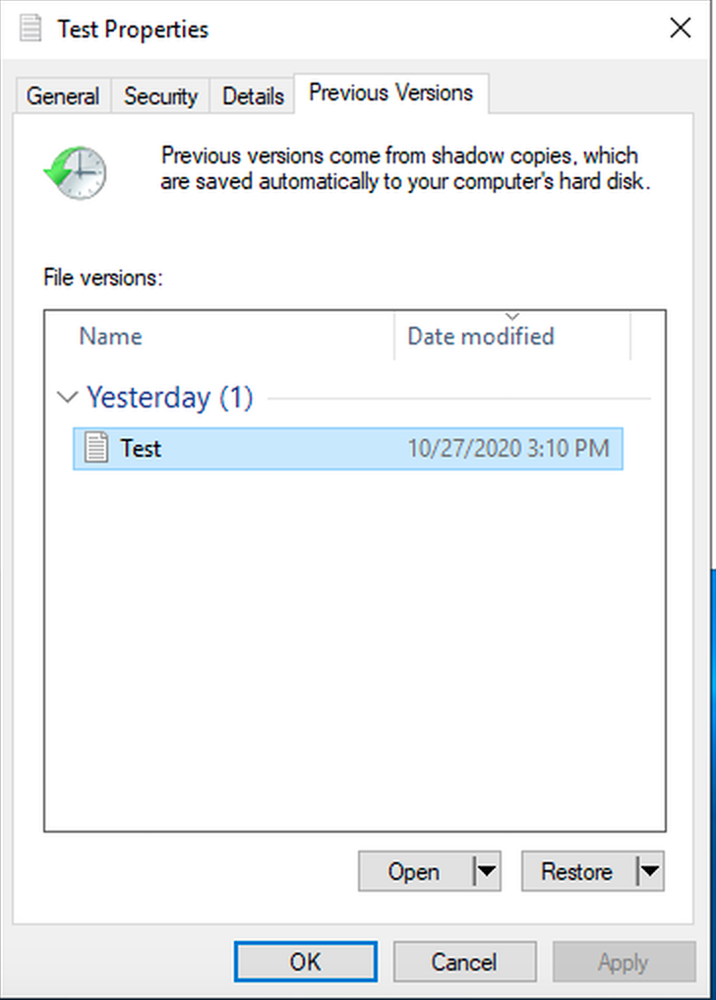

## Enable Enforcement of In-transit Encryption
1. Review the PowerShell function commands for the SMB server configuration
```
[amznfsx6uawtx68.example.com]: PS>Get-Command *-FSxSmbServerConfiguration*

CommandType     Name                                               Version    Source
-----------     ----                                               -------    ------
Function        Get-FSxSmbServerConfiguration                      1.0        FSxRemoteAdmin
Function        Set-FSxSmbServerConfiguration                      1.0        FSxRemoteAdmin


[amznfsx6uawtx68.example.com]: PS>Get-FSxSmbServerConfiguration

EncryptData RejectUnencryptedAccess
----------- -----------------------
       True                   False
```

2. Enable enforcement of in-transit encryption
```
[amznfsx6uawtx68.example.com]: PS>Set-FSxSmbServerConfiguration -RejectUnencryptedAccess $True

Confirm
Are you sure you want to perform this action?
Performing the operation "Confirm-Change" on target "Set-FSxSMBServerConfiguration".
[Y] Yes  [A] Yes to All  [N] No  [L] No to All  [?] Help (default is "Y"): Y


[amznfsx6uawtx68.example.com]: PS>Get-FSxSmbServerConfiguration

EncryptData RejectUnencryptedAccess
----------- -----------------------
       True                    True
```

## Scale throughput capacity and Scale storage capacity

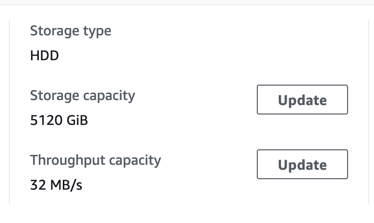

## Cleanup
1. Delete CloudFormation stack 
