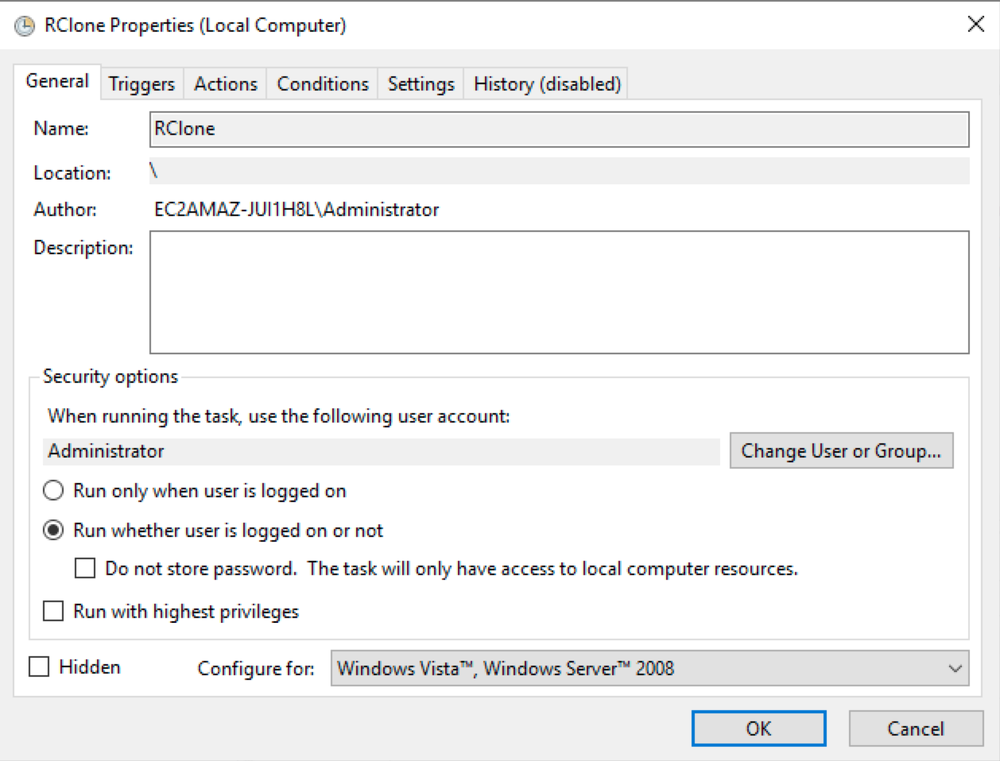
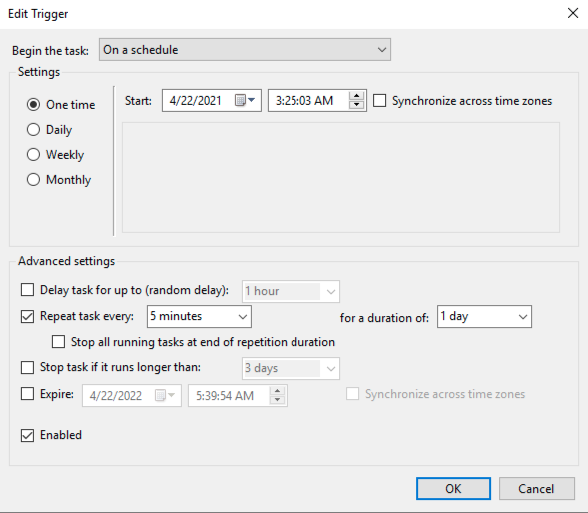
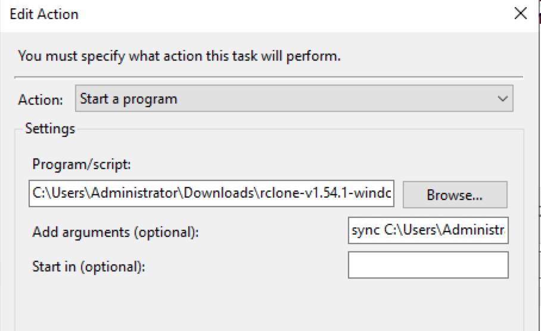
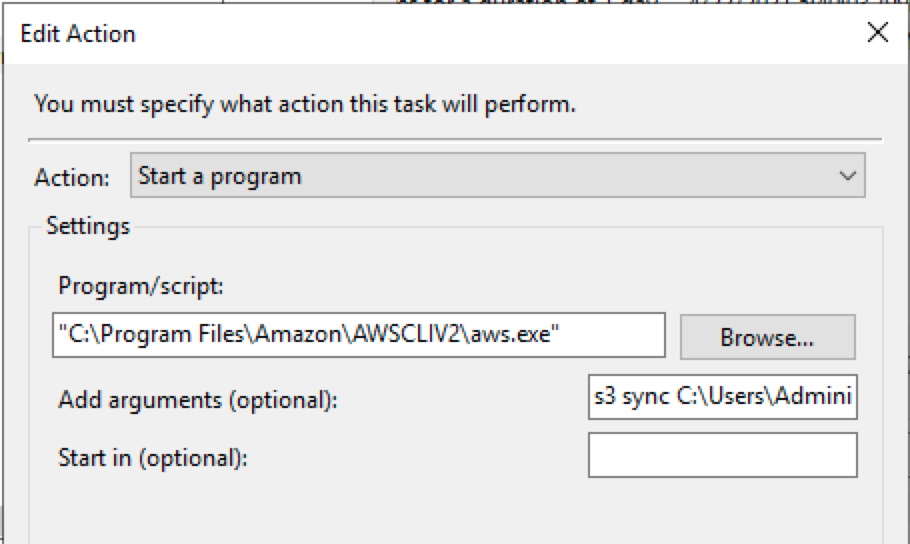

# RClone Quickstart

[Rclone](https://rclone.org) is a command line program to manage files on cloud storage. Rclone has powerful cloud equivalents to the unix commands rsync, cp, mv, mount, ls, ncdu, tree, rm, and cat. Rclone mounts any local, cloud or virtual filesystem as a disk on Windows, macOS, linux and FreeBSD, and also serves these over SFTP, HTTP, WebDAV, FTP and DLNA. Rclone is widely used on Linux, Windows and Mac. 

Rclone helps you:

- Backup (and encrypt) files to cloud storage
- Restore (and decrypt) files from cloud storage
- Mirror cloud data to other cloud services or locally
- Migrate data to cloud, or between cloud storage vendors
- Mount multiple, encrypted, cached or diverse cloud storage as a disk
- Analyse and account for data held on cloud storage using lsf, ljson, size, ncdu
- Union file systems together to present multiple local and/or cloud file systems as one

## Quickstart
Follow the guide in https://rclone.org/install/
- [Download](https://rclone.org/downloads/) the relevant binary.
- Extract the rclone or rclone.exe binary from the archive
- Run rclone config to setup.

1. Install
- To install rclone on Linux/macOS/BSD systems:
```bash
curl https://rclone.org/install.sh | sudo bash
```
- Install on Windows
```
rclone.exe
```
- Install with docker
```bash
$ docker pull rclone/rclone:latest
# config on host at ~/.config/rclone/rclone.conf
# data on host at ~/data
docker run --rm \
    --volume ~/.config/rclone:/config/rclone \
    --volume ~/data:/data:shared \
    --user $(id -u):$(id -g) \
    rclone/rclone \
    listremotes
```

2. Configure
RClone S3 guide: https://rclone.org/s3/
S3 endpoint: https://docs.aws.amazon.com/general/latest/gr/s3.html

- Option 1: Interactive
```bash
rclone config

n) New remote
name> global-us-east-1
Storage> s3
provider> AWS
env_auth> 1
access_key_id> XXX
secret_access_key> YYY
region> us-east-1
endpoint> s3.us-east-1.amazonaws.com
location_constraint> us-east-1
acl> bucket-owner-full-control
server_side_encryption > 1
sse_kms_key_id > 1
storage_class> 1
advanced config > n
y) Yes this is OK
```
- Option 2: use a named profile:
  - Profile files are standard files used by AWS CLI tools
  - By default it will use the profile in your home directory (e.g. ~/.aws/credentials on unix based systems):
  ```yaml
  AWS_SHARED_CREDENTIALS_FILE = ~/.aws/credentials
  AWS_PROFILE = firehose_delivery
  ```


- Option 3: Edit .config/rclone/rclone.conf in your home directory
```yaml
[global_account_id]
type = s3
provider = AWS
env_auth = false
access_key_id = aws_access_key_id
secret_access_key = aws_secret_access_key
region = us-east-1
location_constraint = us-east-1
acl = bucket-owner-full-control
server_side_encryption = aws:kms (optional)
sse_kms_key_id = kms_arn (optional)
[china_account_id]
type = s3
provider = AWS
env_auth = false
access_key_id = aws_access_key_id
secret_access_key = aws_secret_access_key
region = cn-north-1
endpoint = s3.cn-north-1.amazonaws.com.cn
location_constraint = cn-north-1
server_side_encryption = aws:kms (optional)
sse_kms_key_id = kms_arn (optional)
```

3. For linux, enable the BBR to improve the tranfer perfomrance

Check details how to enable BBR: https://aws.amazon.com/amazon-linux-ami/2017.09-release-notes/

```bash
lsmod | grep bbr
if [ $? != 0 ]
then
    modprobe tcp_bbr
    echo "tcp_bbr" >> /etc/modules-load.d/modules.conf
fi
echo "net.core.default_qdisc=fq" >> /etc/sysctl.conf
echo "net.ipv4.tcp_congestion_control=bbr" >> /etc/sysctl.conf
sysctl -p /etc/sysctl.conf
```

4. Sync data between local file to S3
- Linux
```bash
# Copy
ls /home/ec2-user/rclone_copy
2008.csv.bz2
rclone copy /home/ec2-user/rclone_copy china-cn-north-1://serverless-hands-on/rclone_copy/

# Sync
cp go1.13.linux-amd64.tar.gz mysql-connector-java-5.1.47.zip rclone_copy/
rclone sync -i /home/ec2-user/rclone_copy china-cn-north-1://serverless-hands-on/rclone_copy/ --max-age 24h #Only sync last_modify_time yonger than 24h and -i is interactive, without -i will running backend
Transferred:   	  119.075M / 119.075 MBytes, 100%, 1.484 MBytes/s, ETA 0s
Checks:                 1 / 1, 100%
Transferred:            2 / 2, 100%
Elapsed time:      1m24.3s
```
- Windows
```bash
rclone copy -i C:\Users\Administrator\Downloads\rclone_copy china-cn-north-1://serverless-hands-on/rclone_copy/windows/
rclone: copy "dbeaver-ce-21.0.1-x86_64-setup.rar"?
y) Yes, this is OK (default)
n) No, skip this
s) Skip all copy operations with no more questions
!) Do all copy operations with no more questions
q) Exit rclone now.
y/n/s/!/q>

rclone sync C:\Users\Administrator\Downloads\rclone_copy china-cn-north-1://serverless-hands-on/rclone_copy/windows/
```

5. Sync data between China region to Global region S3 bucket
- Linux
```bash
rclone sync china-cn-north-1://serverless-hands-on/rclone_copy/ global-us-east-1://ray-cross-region-sync-us-east-1/beijing-crr/rclone_copy/
```

6. SFTP
```bash
# Configure the remote_sftp
rclone config 
# Copy or Sync
rclone sync -i /home/local/directory remote_sftp:directory
rclone copy --max-age 1h sftp:server s3:bucket
```

# Make the rclone automatically execution
```bash
# create the rclone-cron
nano rclone-cron.sh

# Edit the rclone-cron.sh with below code
#!/bin/bash
if pidof -o %PPID -x “rclone-cron.sh”; then
exit 1
fi
rclone sync …
exit

# Put the script in crontab running every 15 mins
chmod a+x rclone-cron.sh
crontab -e
0/15 * * * * rclone-cron.sh >/dev/null 2>&1
```

- Windows Schedule Task
```bash
rclone sync C:\Users\Administrator\Downloads\rclone_copy china-cn-north-1://serverless-hands-on/rclone_copy/windows/
```







```bash
"C:\Program Files\Amazon\AWSCLI\aws.exe" s3 sync "C:\my_local_folder" s3://my_bucket

"C:\Program Files\Amazon\AWSCLIV2\aws.exe"  s3 sync C:\Users\Administrator\Downloads\rclone_copy s3://serverless-hands-on/rclone_copy/windows_s3cli/ --region cn-northwest-1 --profile firehose_delivery
```

- PowerShell
```bash
echo "Start TIme: $(Get-Date)" >> test.log
"C:\Program Files\Amazon\AWSCLI\aws.exe" s3 sync "C:\my_local_folder" s3://my_bucket
echo "End TIme: $(Get-Date)" >> test.log
```




# Reference
[RClone S3](https://rclone.org/s3/)
